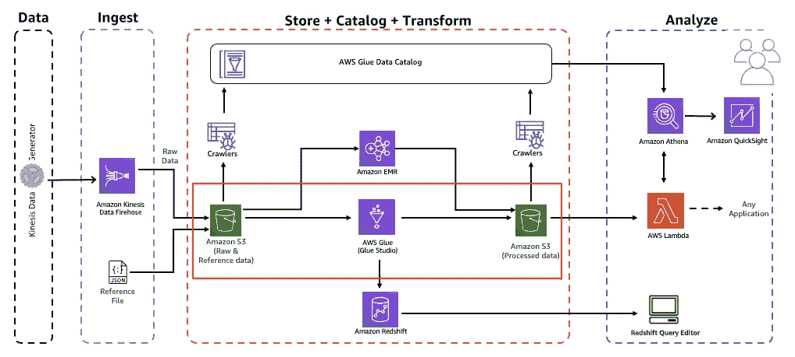
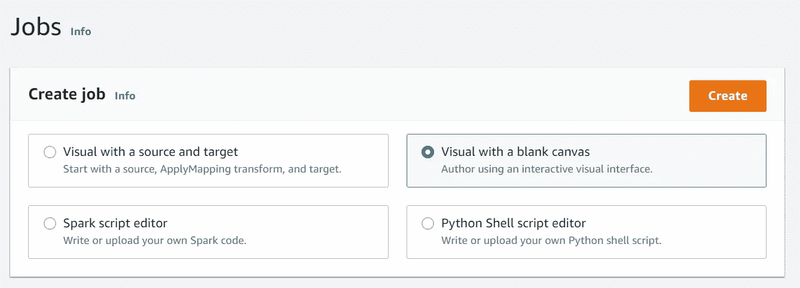
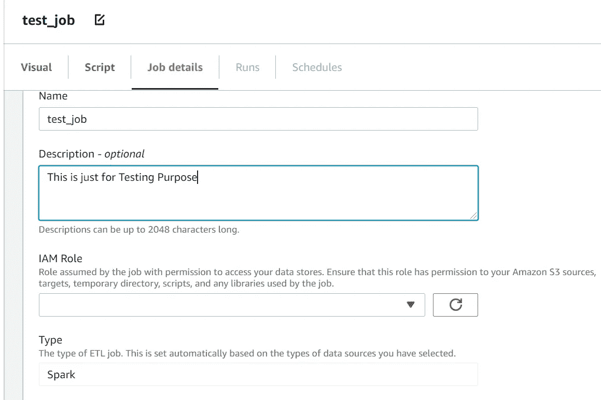
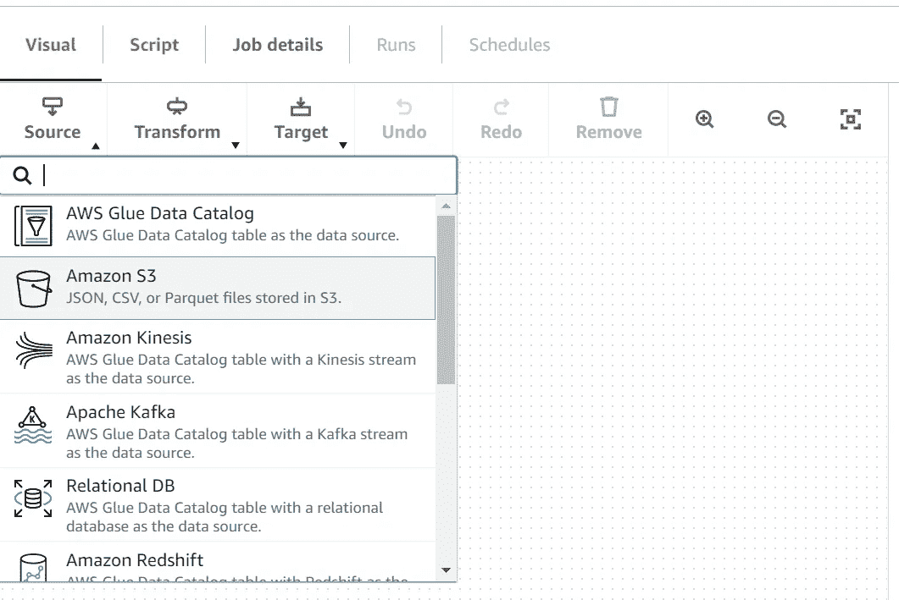
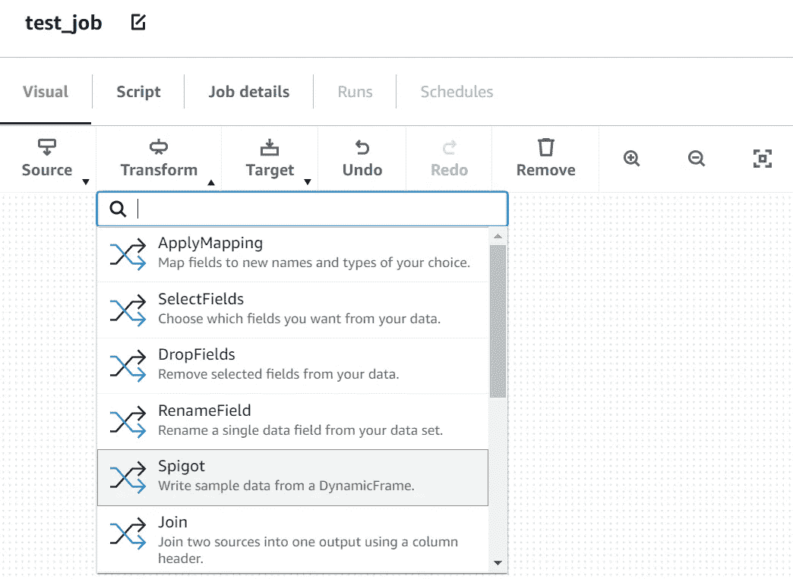
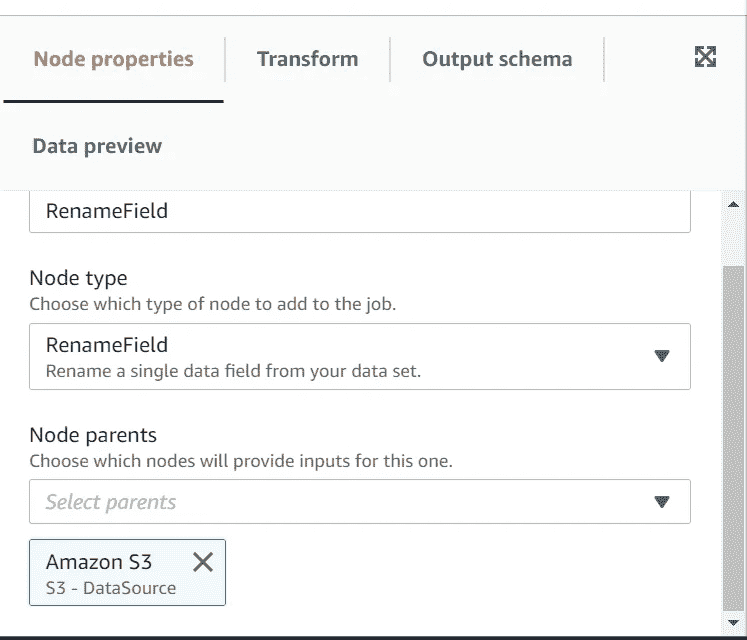
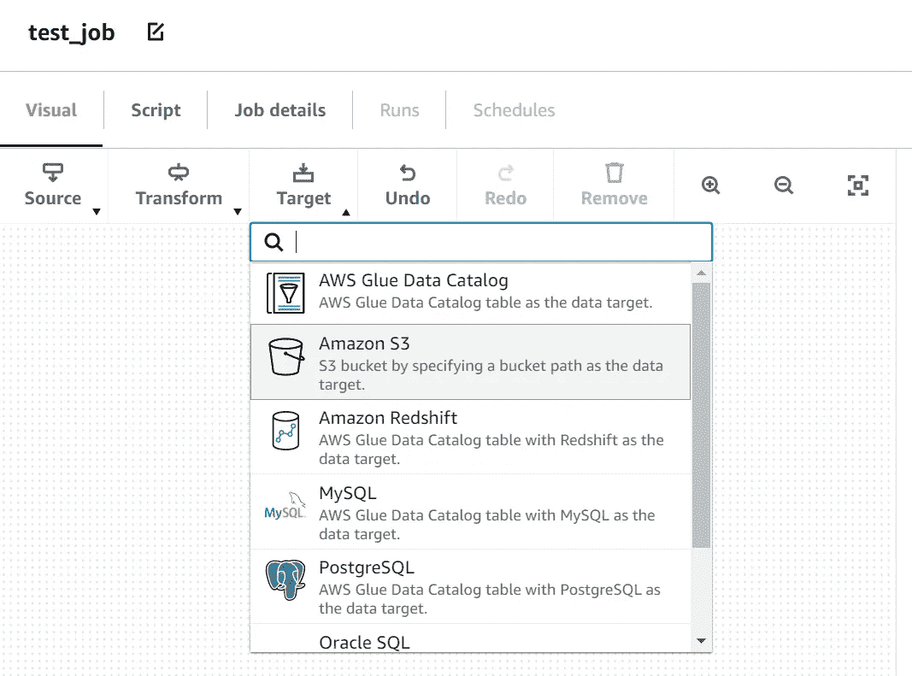
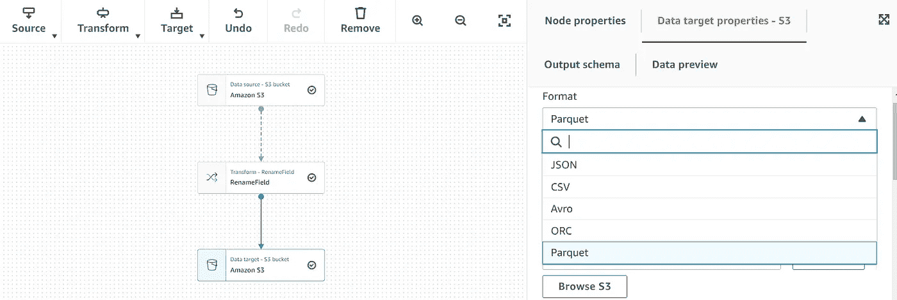

# 关于 AWS Glue Data Studio，您只需知道

> 原文：<https://medium.com/geekculture/all-you-need-to-know-about-aws-glue-data-studio-b09ccb66935c?source=collection_archive---------13----------------------->

[*Source: AWS Blog*](https://intro-to-analytics-on-aws.workshop.aws/en/lab-guide/transform_glue_studio.html)

# **AWS 胶水简介**

AWS Glue 是一种**无服务器数据集成**服务，可以轻松发现、准备和组合用于分析、机器学习和应用程序开发的数据。AWS Glue 提供了数据集成所需的所有功能，因此您可以在几分钟内开始分析数据并投入使用，而不是几个月。

[***AWS Glue***](https://aws.amazon.com/glue/?whats-new-cards.sort-by=item.additionalFields.postDateTime&whats-new-cards.sort-order=desc) 同时提供可视化和基于代码的接口，使数据集成更加容易。用户可以使用 AWS Glue 数据目录轻松查找和访问数据。数据工程师和 ETL(提取、转换和加载)开发人员只需在 **AWS Glue Studio** 中点击几下鼠标，就可以可视化地创建、运行和监控 ETL 工作流。

# **AWS Glue Data Studio 简介**

AWS Glue Studio 是一个易于使用的**图形界面**，它加速了在 [*AWS Glue*](https://aws.amazon.com/glue) 中创作、运行和监控提取、转换和加载(ETL)作业的过程。可视化界面让那些不知道 Apache Spark 的人可以在没有编码经验的情况下**设计工作，并为那些知道的人加速这个过程。**

AWS Glue Studio 旨在帮助您轻松创建 ETL 作业。在图形界面中设计一个作业后，它会为您生成 Apache Spark 代码，将用户从编码的挑战中抽象出来。当作业准备就绪时，您可以运行它并使用集成的 UI 监控作业状态。

[**AWS 胶水数据工作室的特性**](https://docs.aws.amazon.com/glue/latest/ug/what-is-glue-studio.html)

1.  可视化作业编辑器
2.  作业脚本作业编辑器
3.  工作绩效仪表板
4.  支持数据集分区

# **插图**

**步骤 1:** 从下面的
选项中选择一个选项来创建一个作业。在本文中，我们将继续“用空白画布可视化”

**第二步:**点击后会出现一个新的空白页，您可以在“**工作详细信息**”**部分填写必要的详细信息。例如:作业名称、描述、要使用的 IAM 角色以及所有粘合作业参数都可以在这里进行配置**

****

**Job Details**

****步骤 3:** 在可视部分，有 3 个主要的子部分**源、变换和目标。
步骤 3.1:** 在**源部分**，你将能够找到不同的源，你可以使用它们来创建胶合作业，例如 S3、红移、关系数据库、Kinesis、Postgres 等等**

****

**Source**

****步骤 3.2:** 在**转换部分**中，有直接可用的标准转换，如拖放字段、重命名字段、应用映射、选择字段等。
用户还可以使用“加入”功能、拆分字段、填充缺失的列，以及使用**控制台(UI)** 上的可用选项。
除此之外，用户还可以使用 Spark SQL 或通过选择适当的可用选项(如自定义转换或 Spark SQL)编写代码来转换数据。**

****

**Transform 1**

**一旦你选择了上面的任何一个选项，一个新的属性字段将会出现在旁边，在这里你可以检查所选择的节点(选项)的属性，甚至可以从预览标签中预览数据。**

****

**Transform 2**

****步骤 3.3:** 应用相关转换后，最后一步是将细化或转换后的数据转储到相关目的地。
由于 Glue Studio 为 Target 提供了多个类似的源选项，他们也提供了多个选项，如亚马逊 S3、红移、RDS、Postgres 等等。**

****

**Target 1**

**每当您根据您的用例选择上述任何一个节点时，都会有另一个属性选项卡出现在旁边。
对于给定的示例，我们继续选择亚马逊 S3 作为我们的目标位置。在这里，用户还可以选择他们需要转储数据的格式。**

****

**Target 2**

****步骤 4:** 选择目标后，下一步是保存作业，您将看到“成功创建的作业”。通过单击“运行”启动此作业。等待几秒钟，您应该会看到您的 ETL 作业运行状态“成功”。
AWS Glue Studio 最棒的部分是，人们可以看到 Glue Studio 生成的 Pyspark 代码，如果需要的话，可以将这些代码用于其他目的。**

****第五步:** AWS Glue Studio 提供了一个作业监控仪表板，提供关于您的作业的全面信息。运行时，您可以获得作业统计信息，并查看有关作业和作业状态的详细信息**

****结论:
ETL** 是任何项目的核心部分，尤其是在我们说“数据是新的石油”的今天。因此，为了减少开发工作量，减少繁重的编码，并提供可访问的可管理的无服务器基础设施，AWS 已经在 AWS Glue 中提供了这个功能，称为 **AWS GLUE STUDIO** 。**

**在本文中，我已经尽了最大努力来适应 AWS Glue Data Studio 的所有功能和特性。我希望这能对你的项目有所帮助——如果你发现有什么值得一提的地方被遗漏了，请在下面的评论中提出来。**

****参考文献****

1.  **【https://aws.amazon.com/glue/? whats-new-cards . sort-by = item . additional fields . post datetime&whats-new-cards . sort-order = desc**
2.  **[https://AWS . Amazon . com/about-AWS/whats-new/2020/09/announding-AWS-glue-studio/](https://aws.amazon.com/about-aws/whats-new/2020/09/announcing-aws-glue-studio/)**
3.  **[https://AWS . Amazon . com/blogs/big-data/making-ETL-easy-with-AWS-glue-studio/](https://aws.amazon.com/blogs/big-data/making-etl-easier-with-aws-glue-studio/)**
4.  **[https://docs . AWS . Amazon . com/glue/latest/ug/what-is-glue-studio . html](https://docs.aws.amazon.com/glue/latest/ug/what-is-glue-studio.html)**
5.  **[https://www.youtube.com/watch?v=KkN8lQ-jr58](https://www.youtube.com/watch?v=KkN8lQ-jr58)**
6.  **[https://intro-to-analytics-on-AWS . workshop . AWS/en/lab-guide/transform _ glue _ studio . html](https://intro-to-analytics-on-aws.workshop.aws/en/lab-guide/transform_glue_studio.html)**
7.  **[https://towards data science . com/AWS-glue-studio-no-spark-skills-no-problem-b 3204 ed 98 aa 4](https://towardsdatascience.com/aws-glue-studio-no-spark-skills-no-problem-b3204ed98aa4)**
8.  **[https://medium . com/cloudzone/ETL-workflow-guide with-AWS-glue-S3-database-and-Athena-df 55 a 7 f 4363 b](/cloudzone/etl-workflow-guidewith-aws-glue-s3-database-and-athena-df55a7f4363b)**
9.  **[https://docs . AWS . Amazon . com/glue/latest/ug/monitoring-chapter . html](https://docs.aws.amazon.com/glue/latest/ug/monitoring-chapter.html)**