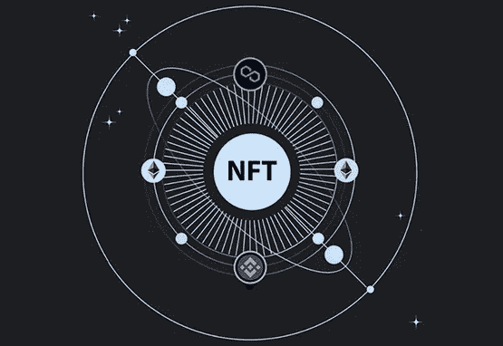

# 所有你需要知道的关于跨链 NFT 市场

> 原文：<https://medium.com/geekculture/all-you-need-to-know-about-cross-chain-nft-marketplace-fa42baa1948?source=collection_archive---------7----------------------->

cross chain

NFT 已经扩展到整个数字世界，只是因为它独特的管理数字资产的方式，这些成为虚拟世界的一个关键因素，通过创造和销售虚拟世界。由于他们拥有数字资产的独特方式，它吸引了更多的创作者和收藏家进入市场。但是 NFT 市场并没有止步于此，它通过创建一个跨链进入下一个层次，让 NFT 市场具有跨链兼容性将会为你的市场带来广泛的受众和收藏。现在，让我们更深入地了解一下 NFT 跨链市场。

# 什么是跨链 NFT 市场？

跨链 NFT 是在 NFT 铸币厂和 NFT 交易所通过各种区块链网络进行交易的情况下开发的，像 opensea 这样的交易所也适用于 NFT 交易所和 NFT 铸币厂通过以太坊、Polygon 和 Solana 区块链进行交易的跨链功能。

跨链是 NFT 用户的热门话题，NFT 平台的跨链兼容性将吸引更多的 NFT 创作者，这将导致你的平台上有大量的 NFT 收藏，这将吸引更多的用户。这有可能通过启动你自己的[跨链 NFT 市场](https://maticz.com/cross-chain-nft-marketplace-development)来实现。

# 交叉链的目的

正如我之前所说，它帮助创作者和收藏者通过两个不同的区块链网络进行 NFT 铸造和 NFT 交易，这为用户提供了各种各样的收藏来买卖他们的 NFT。

# 跨链 NFT 市场是如何运作的？

跨链桥在 NFT 市场实施，将 NFT 市场带到下一个层次。交叉链概念开始吸引更多用户进入 NFTs，交叉链功能帮助交易商在智能合约的帮助下，在两个不同的区块链上交易他们的 NFT，当用户需要他们的 NFT 时，可以很容易地将其撤销，从而将其带回他们以前的网络。这个概念有助于 NFT 世界的重大变化。[跨链 NFT 市场开发](https://maticz.com/cross-chain-nft-marketplace-development)可以提升你的 NFT 平台。

# 他们提供的好处

以下是一些额外的好处，为您的业务，帮助跨链 NFT 发展。

## 广泛的收藏

交叉链功能为您提供不同区块链生态系统下不同创作者的广泛收藏

## 所有权

不可替代令牌的所有权将是牢不可破的，不可能打破所有权

## 智能合同

跨链 NFT 市场是一个完整的智能合同审计平台，这意味着在经历一系列测试过程后，所有的漏洞都可以被删除

## 高投资回报率

接受来自不同领域的各种资产的平台会因为更活跃的用户而给你带来高投资回报。

## 安全性

任何建立在区块链之上的东西都提供了高端的安全性，因此任何人都不可能窃取你的数字资产。

# 你为什么需要跨链 NFT 市场发展服务？

通过使您的市场平台能够跨多个区块链运行，从而确保互操作性，您可以增加您的用户群，而不考虑他们使用的网络。因为有人会一直活跃在任何一个区块链网络中，跨链 NFT 市场更容易获得流动性。通过选择明智的[跨链 NFT 市场发展服务](https://maticz.com/cross-chain-nft-marketplace-development)，这将使你的商业帝国更上一层楼。

# 跨连锁 NFT 市场开发

NFT 市场的发展需要大量的工作流程和测试过程，以带来最好的 NFT 平台。这里采用相同的过程，但此外，为每个区块链网络引入多个区块链和编码智能合约。然后跨链 NFT 市场才能启动，这需要大量的技术支持。

Maticz 可以成为您可靠的技术合作伙伴，我们是一个顶级的，[跨链 NFT 市场发展公司](https://maticz.com/cross-chain-nft-marketplace-development)。您可以从我们的专家团队获得有价值的服务，我们是一家拥有高素质专业人员的完整的区块链发展公司。我们的专家在各种区块链网络方面经验丰富，如以太坊、币安智能链、Polygon、Solana 和其他更具趋势的区块链网络。

# 包扎

让我总结一下这篇文章，大多数企业家都明智地投资于他们的跨链 NFT 平台，因为近年来 NFT 的惊人增长，这将是数字资产的未来。那你为什么还在等待这是一个合适的时机来启动你的跨链 NFT 市场，在密码领域建立你的商业帝国。