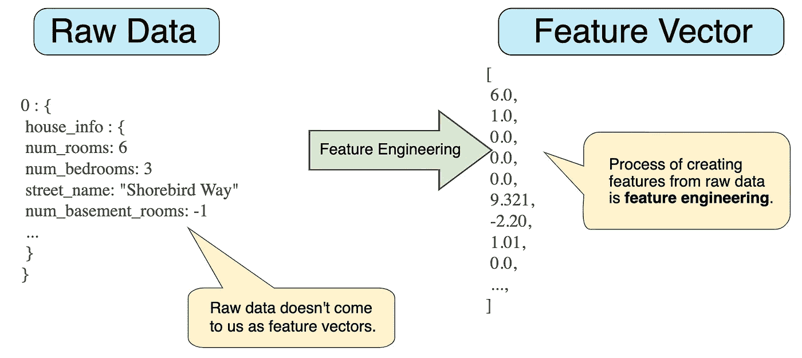

# 关于特征工程你需要知道的

> 原文：<https://medium.com/geekculture/all-you-need-to-know-about-feature-engineering-ml-interview-questions-part-1-3342f8d47382?source=collection_archive---------33----------------------->

# 1.1 数据标准化

**1.1.1 为什么我们需要数据规范化？**

*   由于原始数据的值的范围变化很大，因此在一些机器学习算法中，如果不进行归一化，目标函数将无法正常工作。例如，许多分类器通过欧几里德距离计算两点之间的距离。**如果其中一个特征有** …