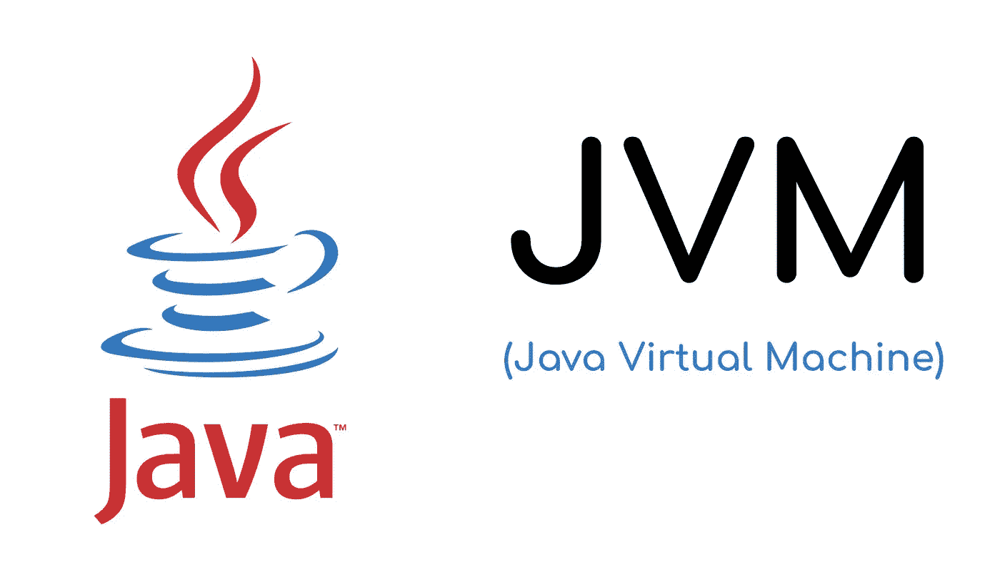

# 关于 JVM 缓存管理和垃圾收集(使用命令)Pt，您需要知道的全部内容。2/2

> 原文：<https://medium.com/geekculture/all-you-need-to-know-about-jvm-cache-management-and-garbage-collection-with-commands-pt-2-2-e7e4aa87b5a0?source=collection_archive---------11----------------------->

# JVM 垃圾收集机制

JVM 有一些机制来处理垃圾收集。

## 复制