# 关于 iOS 的托管应用配置，您需要了解的所有信息

> 原文：<https://medium.com/geekculture/all-you-need-to-know-about-managed-app-configuration-for-ios-3212562d94d5?source=collection_archive---------7----------------------->

我为 iOS 企业应用开发者写了这篇博文，因为我发现很难找到关于托管应用配置的整体解释。大多数文章可能会涉及 Swift 中的实现部分，仅此而已。我的目标是给你一个完整的画面，包括以下方面

*   关于创建和共享托管应用配置规范的提示，
*   关于托管应用配置如何部署的见解，以及
*   如何在不访问企业 MDM 解决方案的情况下测试托管应用配置。

# 大局

托管应用程序配置，通常简称为 AppConfig，当与移动设备管理(MDM)解决方案配合使用时，允许 iOS 应用程序开发人员自定义应用程序。AppConfig 允许 MDM 解决方案将数据远程交付到受管设备，然后应用程序可以使用这些数据来自定义用户体验或应用程序行为。

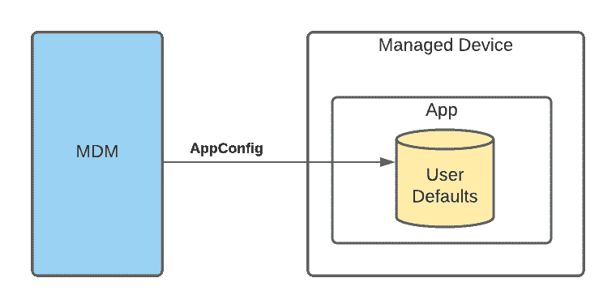

**关键要点**:生产性使用需要移动设备管理(MDM)解决方案！

# 用例

UI 配置是一个潜在的用例，因为企业组织通常喜欢重塑应用的品牌，以匹配他们自己组织的品牌。作为应用程序开发人员，您可以定义一种方式来允许组织指定颜色、文本或其他可能符合其需求的 UI 元素。MDM 管理员可以代表组织将这些设置应用于被管理的设备。

另一个用例是，您的应用程序可能需要连接到组织拥有的服务器租户。MDM server 可以通过 App Config 提供这些信息，而不是提示用户自己输入信息，从而使最终用户看不到设置过程。

# 谁在做什么？

有三个基本步骤:

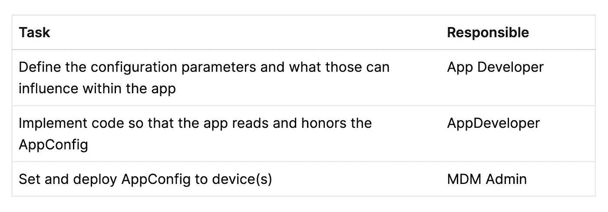

# AppConfig 如何发送到设备

移动设备管理解决方案可以使用以下两个 MDM 命令之一向设备发送应用配置:

*   [安装 App](https://developer.apple.com/documentation/devicemanagement/installapplicationcommand/command?changes=latest_minor&language=objc) 或者
*   [配置设置](https://developer.apple.com/documentation/devicemanagement/settingscommand/command/settings/applicationconfiguration?changes=latest_minor&language=objc)(例如应用程序已经安装)

发送到设备的数据是 XML 属性列表。示例:

```
<dict>
  <key>BlogURL</key>
  <string>[https://blog.eidinger.info](https://blog.eidinger.info)</string>
</dict>
```

# 如何在 iOS 应用程序中访问 AppConfig

作为 iOS 应用开发者，您可以在设备上通过 Swift 中的`User Defaults`访问信息。字典用键`com.apple.configuration.managed`存储。

```
UserDefaults.standard.object(forKey: "com.apple.configuration.managed") as? [String: Any?]
```

**重要提示**:用户默认值未加密存储在设备上。因此，不要建议包含敏感信息(如密码或私钥)。

*注*:苹果其他平台也支持托管应用配置，即 macOS 和 tvOS。

# 创建 AppConfig 规范

由您来定义哪些键/值信息对您的应用程序有意义。但是，MDM 管理员如何知道必须指定哪些键/值信息以及以何种格式指定呢？你可以分享一个例子。但是有更好的方法。

[AppConfig 社区](https://www.appconfig.org/)定义了一个[标准](https://storage.googleapis.com/appconfig-media/appconfig-content/uploads/2017/01/ManagedAppConfig.pdf)，关于应用开发者如何描述他们的托管应用配置属性列表的预期格式。

我使用 [AppConfig Spec Creator](https://beta.appconfig.jamfresearch.com/spec-creator) 工具为上面提到的 plist 示例创建了一个规范。

```
<?xml version="1.0"?>
<managedAppConfiguration>
  <version>1</version>
  <bundleId>us.eidinger.ManagedAppConfigurationReader</bundleId>
  <dict>
    <string keyName="blogURL"></string>
  </dict>
  <presentation defaultLocale="en-US">
    <field keyName="blogURL" type="input">
      <label>
        <language value="en-US">Blog URL</language>
      </label>
      <description>
        <language value="en-US">URL representing a cool online blog</language>
      </description>
    </field>
  </presentation>
</managedAppConfiguration>
```

这种规范(遵循标准)的优势在于，MDM 解决方案可以解释配置，并在设置托管应用配置值时使用智能表单编辑器来指导 MDM 管理员。

根据 MDM 解决方案的特定用户界面，管理员

*   获取智能表单编辑器(基于您的规范)
*   获取简单的窗体编辑器
*   或者必须手动创建/上传 plist (XML)。

# 通过 MDM 获得特定于设备的信息，否则无法获得

大多数 MDM 解决方案都提供了使用变量的选项。然后，MDM 管理员可以指定一个变量，在部署应用程序时，该变量将替换为特定于设备的值(而不是在将与所有设备共享的配置中设置一个固定值)。

例如，设备的:

*   迈德
*   模型
*   电话号码
*   序列号

出于隐私目的，苹果限制了应用程序在 iOS 设备上可以访问的数据范围。通过访问这些信息，您可以定义没有 MDM 和 App Config 可能无法实现的工作流。

# 示例应用程序

我编写了一个简单的基于 SwiftUI 的 iOS 应用程序，从其托管应用程序配置中读取任何可能的基于字符串的值。

[](https://github.com/MarcoEidinger/ManagedAppConfigurationReader) [## GitHub-MarcoEidinger/ManagedAppConfigurationReader:简单的 SwiftUI 项目，展示如何…

### 这个简单的 SwiftUI 项目展示了如何从 UserDefaults 读取 iOS 管理的应用程序配置

github.com](https://github.com/MarcoEidinger/ManagedAppConfigurationReader) 

在模拟器或常规设备上运行应用程序将不会显示任何值。

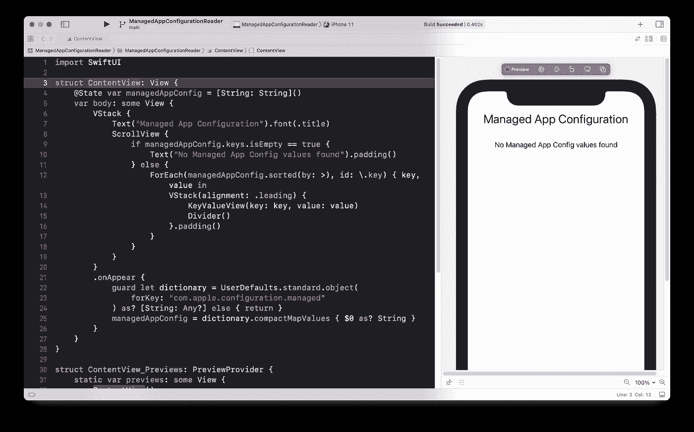

您可以通过使用工具`xcrun simctl`设置`UserDefaults`来模拟托管应用配置的存在，如以下 Youtube 视频所示。

但是我想测试 E2E 场景，并了解更多关于 MDM 管理的知识。我确实无法访问我公司的 MDM，所以我不得不寻找替代方案。幸运的是我找到了 [SimpleMDM](https://simplemdm.com/) 。

# 如何用 SimpleMDM 测试 AppConfig

SimpleMDM 是熟悉移动设备管理的良好起点。它有一个简单的用户界面，并提供 30 天的免费试用期。SimpleMDM 提供了每月的、可负担的每月每设备订阅，如果我需要超过该时间范围的服务。

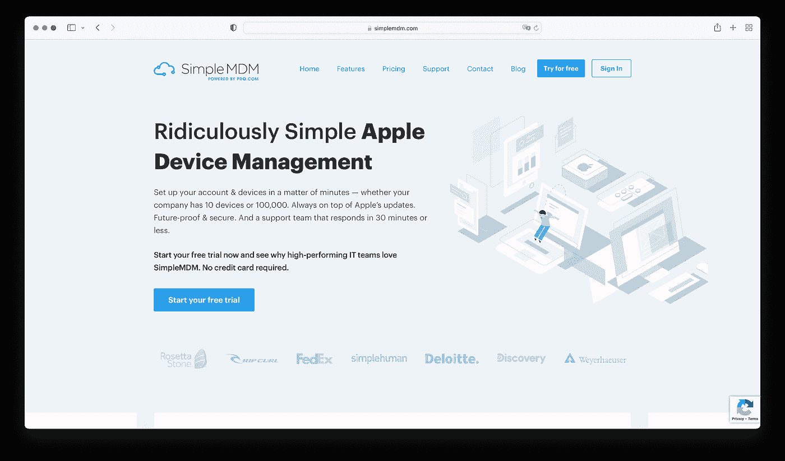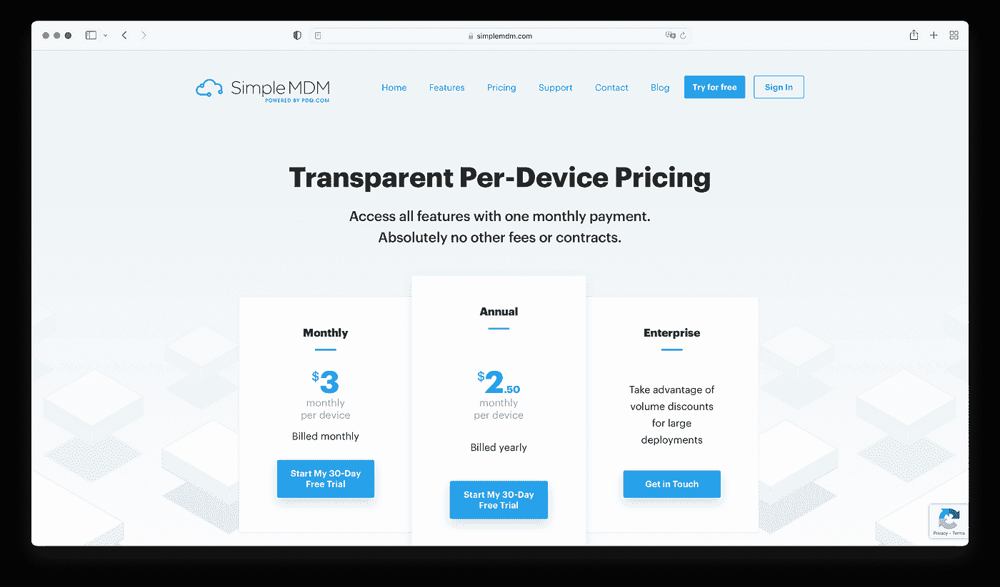

您可以使用不同的 MDM 解决方案，但是我发现测试的简单性和价格方面非常好。最初，我想用 Jamf 进行测试。但他们的基本产品线 Jamf Now (Plus)允许免费管理多达 3 台设备，无法部署托管应用配置。这项功能从 Jamf Pro 开始提供，它有 14 天的试用期，然后需要为至少 50 台设备购买许可证:(

# 注册

注册很简单。

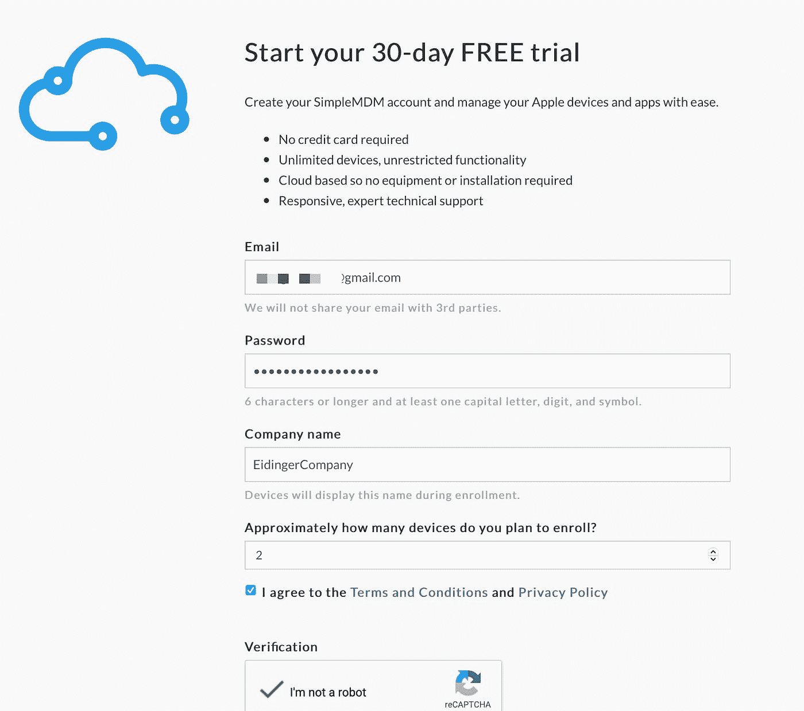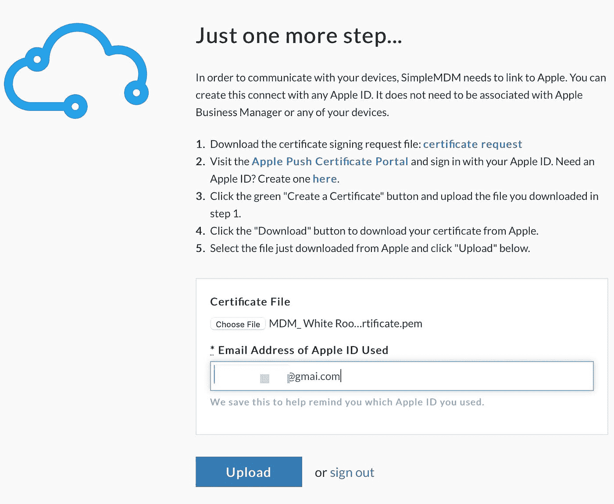

创建了 Apple 推送证书(如下图所示)并上传后，注册过程就完成了。

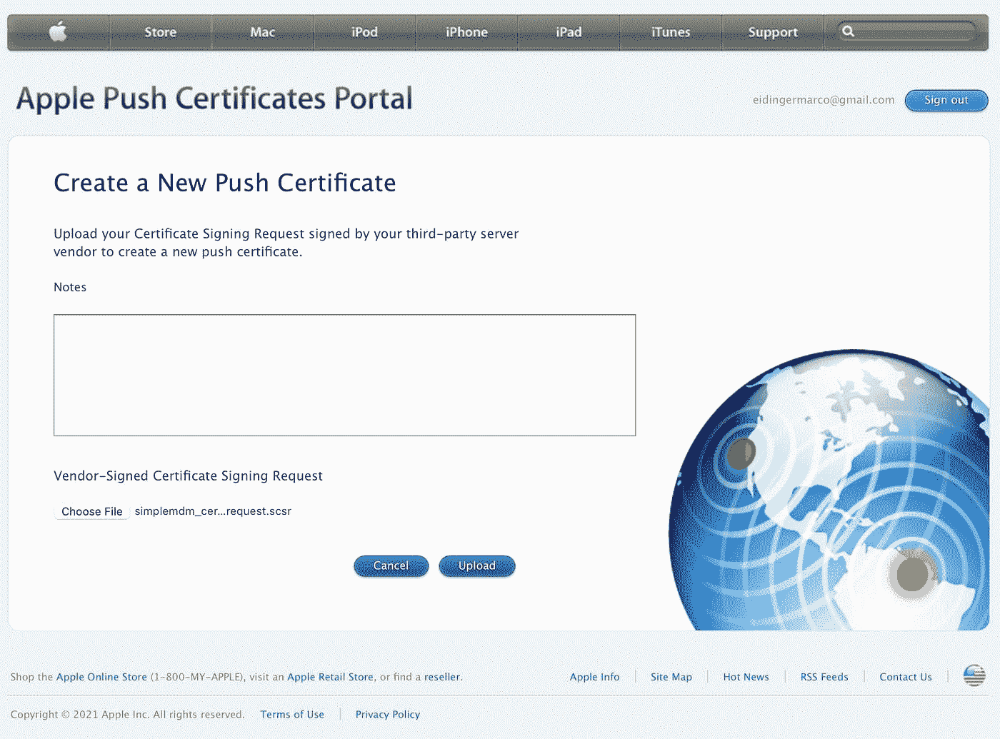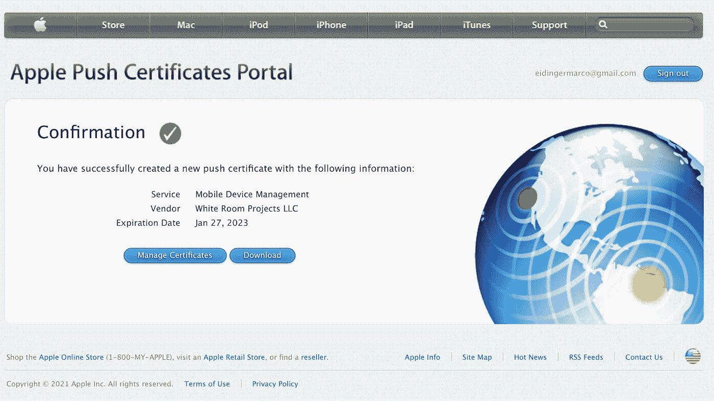

当我第一次登录 SimpleMDM 时，出现了一个引导式的 onboarding 帮助。

# 配置

第一步是注册您的设备。(我必须注册我妻子的 iPhone SE，因为我只有一部已经注册了另一个 MDM 的工作 iPhone)


然后将应用的二进制文件上传到 MDM。

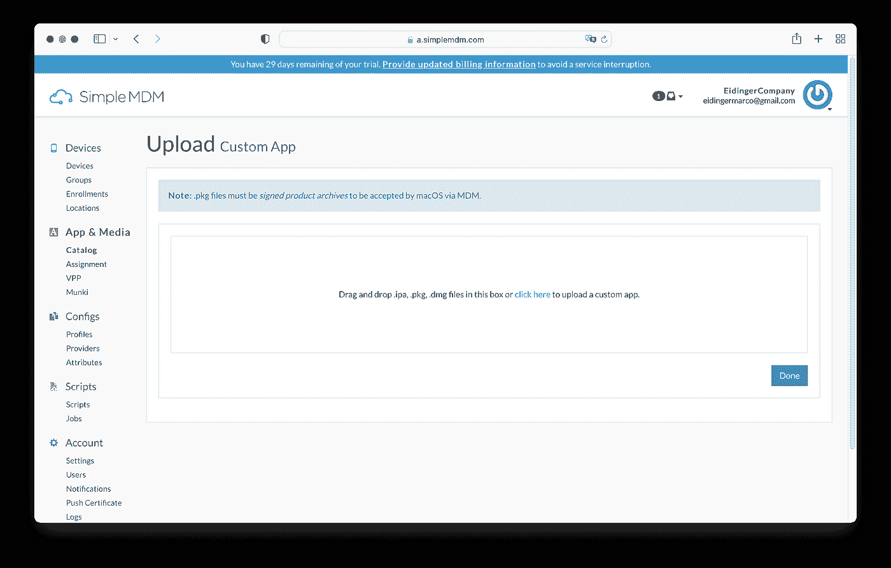

然后，您可以为应用程序定义托管应用程序配置值。

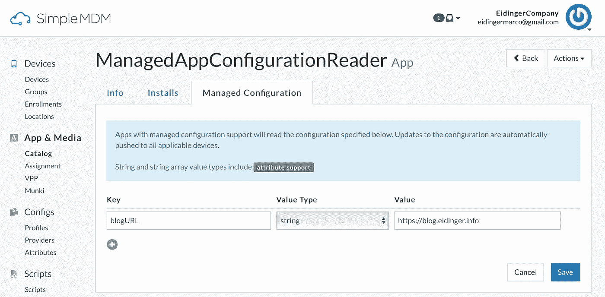

最后，将应用程序分配给一组(设备)或单个设备，并将应用程序推送到设备。托管 AppConfig 也将被推送。

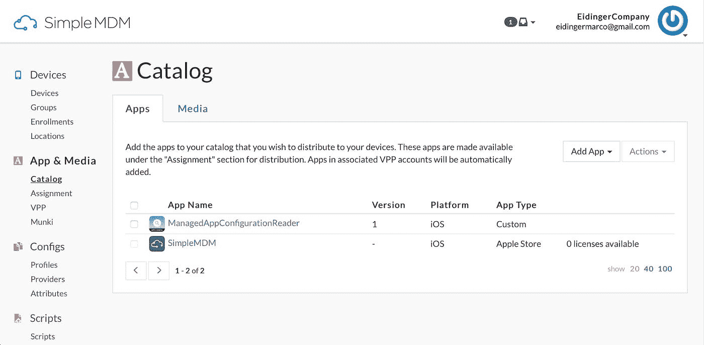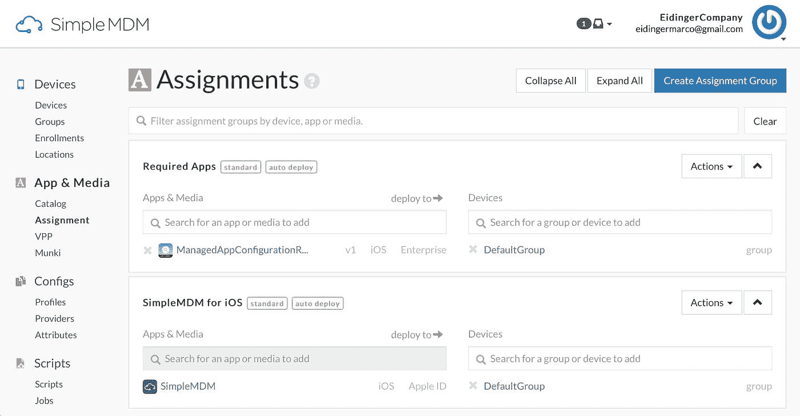

我发现做这些步骤非常直观。

# 测试

一旦用户批准应用程序安装

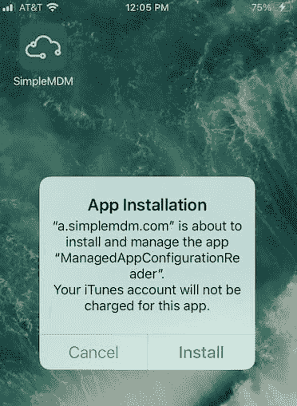

用户打开新的应用程序

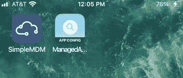

然后应用程序将显示托管的 AppConfig。

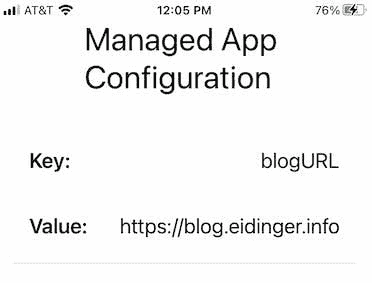

*最初发布于*[*https://blog . eidinger . info*](https://blog.eidinger.info/all-you-need-to-know-about-managed-app-configuration)*。*