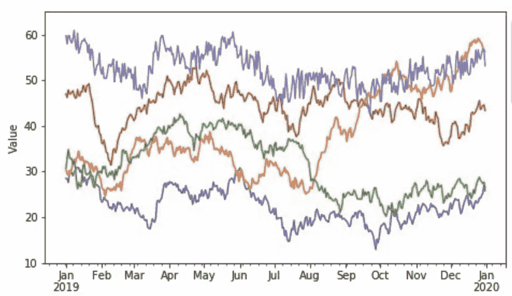

# 关于时间序列你需要知道的一切(1)

> 原文：<https://medium.com/geekculture/all-you-need-to-know-about-time-series-1-cae6cdfc52ea?source=collection_archive---------15----------------------->

时间序列与其他数据有何不同？那是因为它包含了一个变量 ***时间*** 。尽管它是一个连续的有序变量。因此，我们需要在某个点锚定我们自己，我们可以称这个锚为 0(表示现在)，然后我们可以用 *T+1，T+2…* 来表示未来，用 *T-1，T-2 …* 来表示过去。为了建立一个模型并有准确的预测，我们通常希望有 50 或…