# 通过 CORS 融合 Angular 和 Spring 云架构

> 原文：<https://medium.com/geekculture/amalgamate-angular-with-spring-cloud-architecture-through-cors-7f13b5fdb98f?source=collection_archive---------10----------------------->

## 春云网飞和微服务

## 支持跨来源资源共享，以便通过客户端负载平衡器进行扩展和管理

Angular + CORS + Spring Cloud Architecture + Microservices

# 范围

写这篇文章是为了帮助*初学者*和*中级*学习者理解在一个单独的服务器上运行的 Angular 应用( ***单页应用*** )如何与部署在另一个服务器上的微服务通信。阐述了如何在客户端启用 CORS ( ***)跨源资源共享*** )，利用 Spring Cloud 网飞组件进行路由、客户端负载均衡、服务发现、调用微服务，使 Angular 应用与 Spring Boot 栈进行通信。
*上面的动画图显示了架构和动作序列，本文将借助专门为本文编写的代码详细解释。要在您的系统中尝试，这里有* **链接到**[**GitHub**](https://github.com/ganesh-nag/Integrate-Spring-Cloud-Netflix-Zuul)***来一瞥微服务及其支持构件。***

# **先决条件**

*****设计运行本项目的最低软件要求*** *a .安装 Visual Studio 代码——设计 Angular 应用。
b .安装****Node . js****，其中还包含****NPM****(节点包管理器)。
c. Spring Boot 用* ***春云网飞*** *依赖于 POM.xml.
d .你选择的 Eclipse 口味导入上面 GitHub 中给出的 Spring Boot 项目链接。***

# **背景，一瞥**

****

**Setting context**

**a.Angular 应用程序运行在 Live Development Server(Web-Pack Dev Server)的端口 4200 上。
b. Forex 微服务运行在 Spring Boot 嵌入式 tomcat 服务器上，端口 8000。
c .货币转换微服务运行在 Spring Boot 嵌入式 tomcat 服务器上，端口 8100。
d. ZUUL API 网关运行在 Spring Boot 嵌入式 tomcat 服务器上，端口 8765。
e. Eureka 发现服务运行在 Spring Boot 嵌入式 tomcat 服务器上，端口 8761。**

*****从以上几点，我们理解如下:*****

# *****业务需求*****

**1.外汇微服务将提供源货币和目标货币的转换倍数。**

**2.货币转换微服务将从外汇服务获得转换倍数作为对其请求的响应，然后将数量乘以转换倍数以提供转换值。**

**3.Angular 客户端应用程序将提供要转换的数量以及要应用转换倍数的源货币和目标货币。
***例如:***欧元对印度卢比，或者*美元对印度卢比*，或者*澳元对印度卢比*。**

# *****技术:CORS，春云网飞*****

**4.启用 ***CORS(跨源资源共享)*** 使部署在 Live Development server 中的 Angular 客户端应用与 Spring Boot 嵌入式 Tomcat 服务器进行通信。这是通过 Angular 客户端应用中的***proxy . config . JSON***完成的。这更具可扩展性和可管理性。**

**5.*启用****ZUUL****反向代理*。这是一个 spring boot 项目，充当从 Angular 客户端应用程序接收请求的 API 网关。然后通过配置文件中配置的***zuul . routes . path***将请求路由到货币兑换服务。为了找到货币兑换服务的服务实例，ZUUL 将使用 ***Ribbon 路由过滤器*** 。带状路由过滤器将使用 ***带状*** ， ***客户端负载平衡器*** 从 ***尤里卡*** 或通过配置文件中给定的 ***服务器列表*** 发现服务。Ribbon 集成了客户端 HTTP 模块，即 ***Feign*** ，以及*负载均衡* ***Rest 模板*** 。

6。*启用* ***尤里卡*** *服务器*。这是一个 spring boot 项目，它将通过 ***服务名引用微服务实例。*******服务名*** *在配置文件中配置为****spring . application . Name****，如下图所示。* ***例如:*** *下面的屏幕截图显示了一个微服务在 Eureka 注册，配置文件中包含以下内容。****

***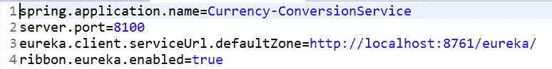***

***Currency Conversion Service — application.properties***

******类似地*** ，ZUUL API gateway 要发现 Eureka 中的货币兑换服务实例，其项目中必须有以下配置。***

***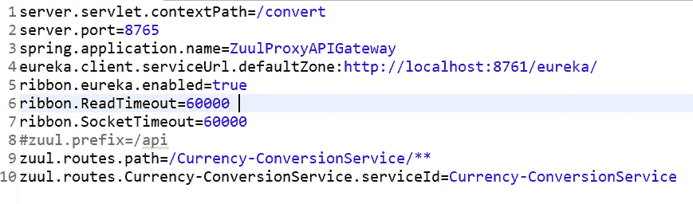***

***ZUUL API Gateway — application.properties***

******总而言之*** ，一个来自 Angular 客户端的请求应用程序用 ***请求*** 包含***源币*** ， ***数量*** 会得到追加到***ZUUL . routes . path***中如上图所示屏幕截图用 ***/。******

***7. ***Angular*** *和****CORS*** 下图显示了 CORS 配置的哪个 ***桥*** *Angular 客户端应用*与运行在 Spring boot 嵌入式 tomcat 服务器上的 ***ZUUL API 网关*** 进行通信。***

***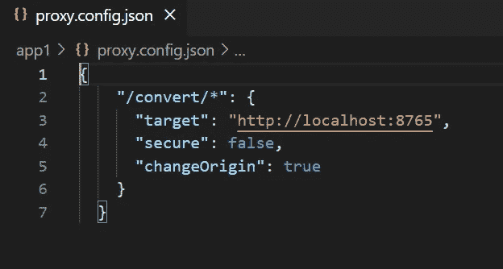***

# ***让我们端到端地运行应用程序***

## ***启动尤里卡服务器***

***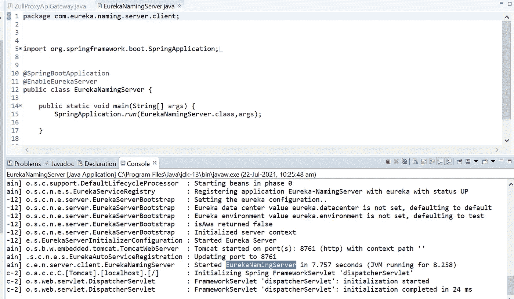***

***Eureka Server listening in port 8761***

## ***启动 ZUUL API 网关***

***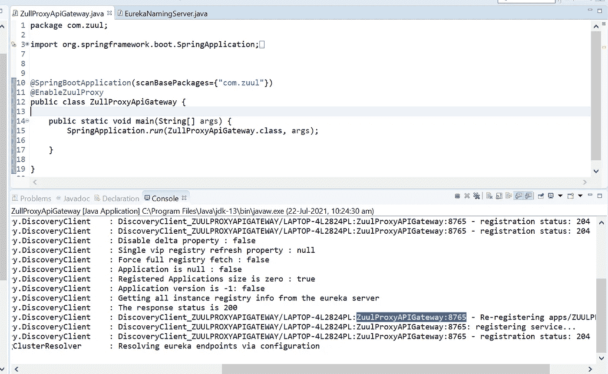***

***ZUUL API Gateway listening in port 8765***

## ***启动货币兑换微服务***

***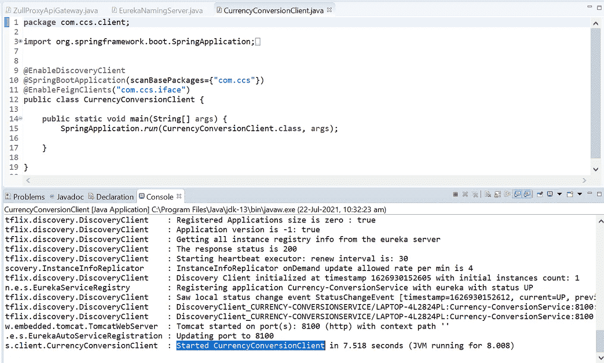***

***Currency Conversion microservice listening in port 8100***

## ***启动外汇微服务***

***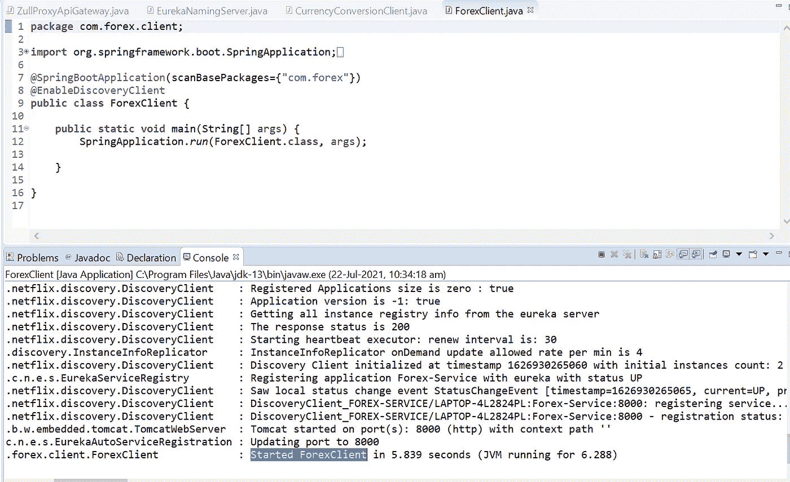***

***Forex microservice listening in port 8000***

## ***在 Live Development Server 中启动角度应用程序***

******Visual Studio 代码，集成开发环境******

***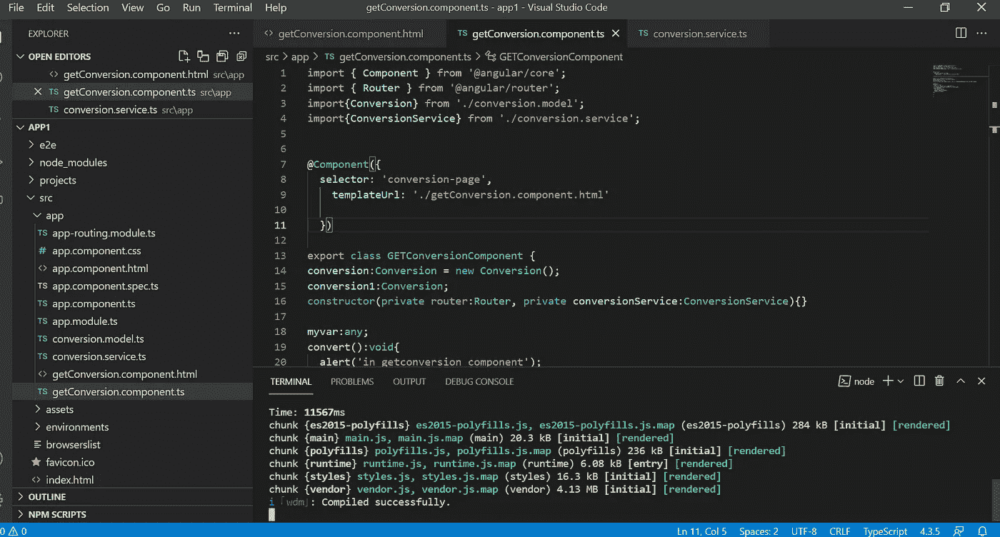***

***Angular Application in live development server listening in port 4200***

****点浏览器到****localhost:4200******

***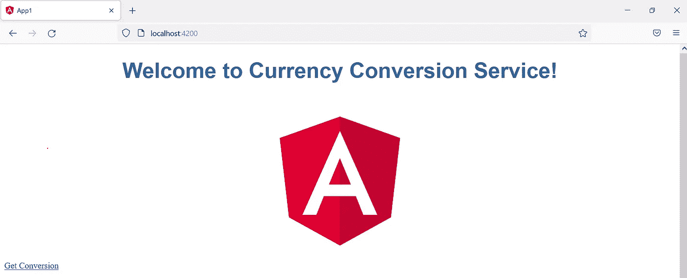***

***Currency Conversion Application***

****点击* ***得到换算，*** *并输入* ***源币、目标币和数量。*** *然后点击* ***转换*** *如下图截图*所示***

***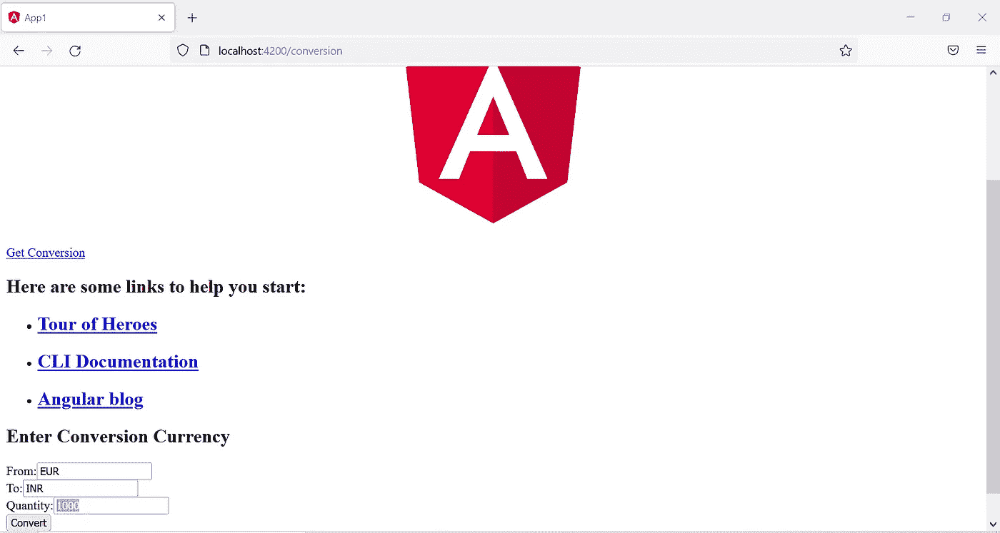***

***Source, Target, Quantity***

## ***货币兑换和外汇微服务的响应***

***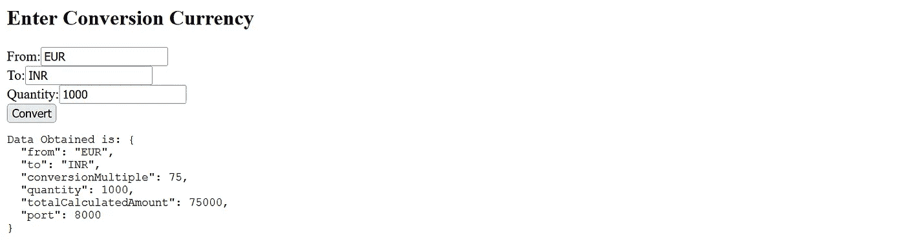***

***Response from Currency Conversion and Forex microservices***

***如果您看到上面的响应，那么 ***外汇服务*** 已经提供了 ***【欧元到印度卢比】*** 的转换倍数，即 ***印度卢比 75*** ， ***货币转换服务*** 已经根据 ***数量*** 计算出 ***金额印度卢比 75000* ，即
*从上面的截图输出中，我们可以看到这个请求是由****Forex Service****实例运行在* ***端口 8000*** *上。现在让我们通过创建更多的外汇服务实例来测试***，并用* ***尤里卡*** *注册**** **并查看输出。*****

# ****功能区运行，客户端负载平衡器****

****客户端负载平衡器提供了关于应用程序本身如何选择它想要使用服务名进行通信的实例的见解，以便从 Eureka discoverer 中发现。
下图显示了 ***外汇服务*** 的**新实例**已经在 ***端口 8001*** 和 ***注册*** 在 ***尤里卡*** 中启动。
由于有两个 Forex 服务实例正在运行， ***Ribbon*** 客户端负载均衡器将选择任意一个带有服务名(***Forex-Service***)的实例。****

****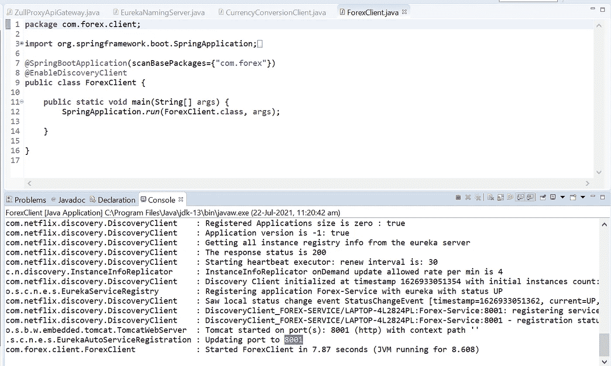****

****Forex microservice listening in port 8100****

# ****尤里卡仪表板****

****下面的截图显示，外汇服务的 ***2 个实例*** ，货币兑换服务的 ***1 个实例*** ，ZUUL API Gateway 的 ***1 个实例*** 。****

****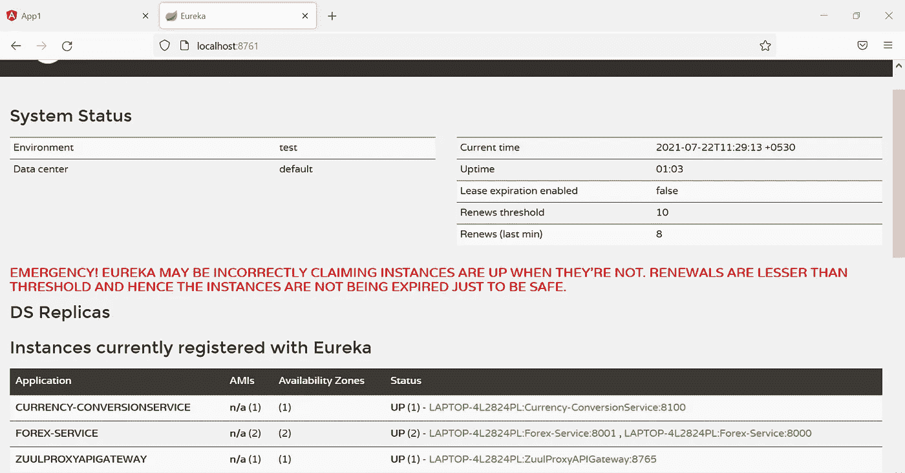****

****Eureka Dashboard****

## ****让我们尝试一个新的请求，看看 Ribbon 客户端负载平衡器是如何工作的****

****下面的屏幕截图显示，带有****数量为 2000*** 的新请求已经向我们提供了运行在 ***端口 8001*** 的 ***外汇服务*** 的响应。
*确定****功能区*** *客户端负载均衡器工作正常！！！******

****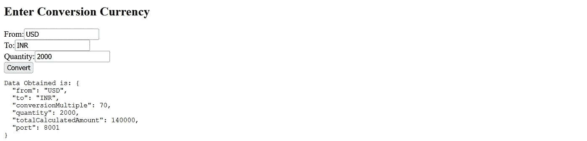****

****Forex Service in port 8001 has served the request****

# ****结论****

****本文通过一个简单的业务需求展示了 CORS 和 Spring Cloud 网飞堆栈组件的优势。客户端负载平衡器和 CORS 是本文中的亮点，它们提供了关于客户端的 Ribbon 如何发现来自 Eureka 的实例以及 Cross Origin 如何分别桥接 Live development server 和 Spring boot embedded tomcat server 之间的通信的见解。****

*******发表于 2021 年 7 月 22 日*******

> ******其他中等文章，*作者*加内什·纳加林加姆******
> 
> ****[使用 JAPA 访问者模式探索语法树和补救代码气味](/geekculture/quest-syntax-tree-and-remedy-code-smell-using-japa-visitor-patterns-f023a89842cf)****
> 
> ****[异步 WebSocket 消息中间件和微服务](/nerd-for-tech/asynchronous-websocket-messaging-middleware-and-microservices-1a50a8f14e4b)****
> 
> ****[多代理洞察 Apache Kafka 集群架构](/geekculture/multi-broker-insights-into-apache-kafka-cluster-architecture-617b0abfc53e)****
> 
> ****[*远程队列定义:IBM MQ v9.2*](https://ganeshblog.medium.com/remote-queue-definition-ibm-mq-v9-2-c3ec4f568dab?source=user_profile---------5----------------------------)****
> 
> ****[*Kubernetes Pods&Docker Containers:在 Windows 10 Home*](https://ganeshblog.medium.com/kubernetes-pods-docker-containers-spin-vm-using-virtual-box-in-windows-10-home-d3be783ff087?source=user_profile---------0----------------------------) 中使用虚拟盒子旋转虚拟机****
> 
> ****[*联合 OKTA IdP + WSO2 API Manager 作为 Spring boot 微服务集成的网关*](https://ganeshblog.medium.com/federate-okta-idp-wso2-api-manager-as-gateway-to-spring-boot-microservices-integration-ba567567e81?source=user_profile---------1----------------------------)****
> 
> ****[*将 IBM 业务流程管理器与混合 MobileFirst 应用集成*](https://ganeshblog.medium.com/integrate-ibm-business-process-manager-with-hybrid-mobilefirst-application-5aed20841bf3?source=user_profile---------2----------------------------)****
> 
> ****[*Kerberos V5:Windows 10 Home 中使用 Apache directory studio 的 SSO 认证*](https://ganeshblog.medium.com/kerberos-v5-sso-authentication-in-windows-10-home-using-apache-directory-studio-fb0151899185?source=user_profile---------3----------------------------)****
> 
> ****[*整合服务提供商(sp)与 OKTA 身份提供商(IdP)*](https://ganeshblog.medium.com/integrate-service-providers-sps-with-okta-identity-provider-idp-ce64a4e262ae?source=user_profile---------4----------------------------)****
> 
> ****[*将 IBM WebSphere Service Registry and Repository 与 IBM Process Server*](https://ganeshblog.medium.com/integrate-ibm-websphere-service-registry-and-repository-with-ibm-process-server-f97eeb0e2ea?source=user_profile---------6----------------------------) 集成****