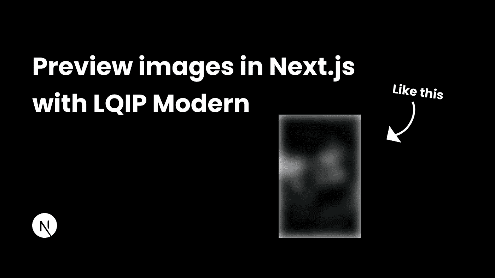
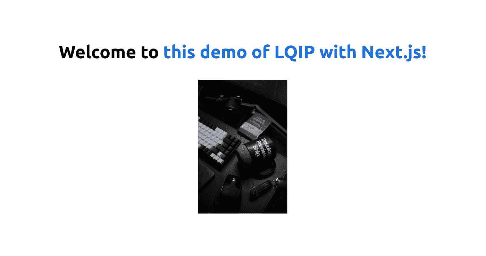
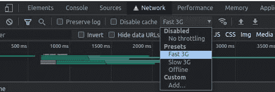
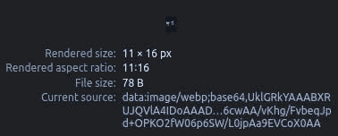
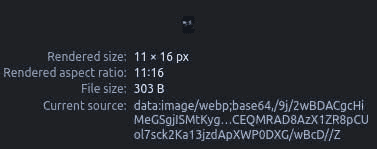

# 使用 Next.js 和 LQIP Modern 预览惊人的图像

> 原文：<https://medium.com/geekculture/amazing-preview-images-with-next-js-and-lqip-modern-d846ab69cda8?source=collection_archive---------8----------------------->



加载图像需要很长时间，并且可能会对 UX 产生破坏性影响。今天我们将学习用一个名为`[lqip-modern](https://www.npmjs.com/package/lqip-modern)`的库来创建预览图像。

# 什么是 LQIP？

**LQIP** 简单的代表**L**ow**Q**quality**I**mage**P**lace holders。它们具有极小的文件大小，并且在实际图像仍在加载时充当实际图像的占位符。这些极小的文件大小是通过模糊图像、将其调整为较小的大小或降低 JPEGs 的质量来获得的。

# 和睦相处

所有现代浏览器都支持 WebP。此外，只有在使用 macOS 11 (Big Sur)或更高版本的情况下，macOS 上的 Safari 才支持 WebP。[来源](https://caniuse.com/?search=webp)

如果目标是 100%兼容，我们也可以使用 JPEG LQIPs(它们几乎是 WebP 图像大小的 2-3 倍)。

现在让我们看看如何在 Next.js 中使用`lqip-modern`

# 通过 Next.js 使用 LQIP Modern

Next.js 有一个内置的 [next/image](https://nextjs.org/docs/api-reference/next/image) 组件，可以在不使用外部库的情况下为本地文件提供预览图像，但不能为远程图像提供预览图像。

现在，我们的方法也有一个限制，即预览图像是在构建时创建的。这意味着，如果外部图像改变，那么预览图像将不会改变。

但是，如果从 CMS 获取图像，这种方法将特别有用。如果图像曾经被更新，则可以触发构建，这将创建新的预览图像。更好的方法是使用[按需增量静态再生](https://nextjs.org/docs/basic-features/data-fetching/incremental-static-regeneration#on-demand-revalidation-beta)或常规增量静态再生，但是，这超出了本文的范围。你可以阅读[我的关于用 Directus](https://blog.anishde.dev/making-a-blog-with-directus-mdx-and-nextjs-on-demand-isr) 实现按需增量静态再生的博文，了解更多信息。

在本例中，我们将了解如何为 Unsplash 中的图像创建预览图像。在本教程中，我将使用[这个威塞尔马克杯和一些电脑外围设备的惊人图片](https://images.unsplash.com/photo-1642083139428-9ee5fa423c46)。但是，你可以选择任何你喜欢的图片。

首先，让我们创建一个新的 Next.js 应用程序

```
npx create-next-app next-lqip-demo
# OR
yarn create next-app next-lqip-demo
```

创建完成后，在您喜欢的代码编辑器中打开项目。

现在，打开`pages/index.js`文件，用下面的代码替换它

另外，用下面的代码替换`next.config.js`中的代码

我们使用`next/image`组件来显示我们来自 Unsplash 的图像。由于图像来自远程 URL，我们还必须在`next.config.js`中添加域。

现在运行`npm run dev`或`yarn dev`启动开发服务器，然后访问 [localhost:3000](http://localhost:3000/) 。你将会看到带有图片的页面标题-



当您第一次访问该页面时，您可能已经注意到图像加载只花了一秒钟的时间。根据您的互联网连接，速度可能快也可能慢。如果你有一个快速的互联网连接，打开开发工具，并转到网络标签。在这里你可以调节你的网络连接来模拟一个缓慢的加载时间-



# 使用 LQIP 优化我们的远程映像

首先，让我们安装`lqip-modern`，和`[sharp](https://www.npmjs.com/package/sharp)`。夏普是一个很棒的软件包，有助于图像转换，被`lqip-modern`使用

```
npm install --save lqip-modern sharp
# OR
yarn add lqip-modern sharp
```

现在，用以下代码替换`pages/index.js`中的代码

在`getStaticProps`中，我们首先获取图像并将其转换到[缓冲区](https://nodejs.org/api/buffer.html#buffer)。然后我们给`lqip-modern`我们的缓冲区，它返回给我们一个名为`previewImage`的对象，它包含一个缓冲区和一些元数据。在元数据中，有一个名为`dataURIBase64`的字段，它是我们预览图像的 base64 URL。我们通过 props 将它传递给客户端应用程序。

在客户端，我们向我们的`Image`组件添加了一个新的`placeholder="blur"`参数，它将显示一个模糊占位符。因为这是一个远程图像，我们需要传入`blurDataURL`参数。我们传入了之前从元数据中获得的预览图像的 base64 URL。

现在，如果您重新加载页面，当图像正在加载时，您应该会看到预览图像。

对于那些好奇的人来说，这是`lqip-modern`给我们创造的形象-



它很小，只有 11 x16(`next/image`组件使其填充原始图像的宽度和高度)并且只有 78 个字节！

# 使用 JPEG 而不是 WebP

如果你想支持所有的浏览器，你可以在制作预览图像的时候添加`outputFormat`选项来得到一个 JPEG 的预览图像，就像这样-

JPEG 图像与我们的 WebP 图像尺寸相同，但大小明显更大，为 303 字节



请注意，这些文件大小会因您使用的图像而异。在某些情况下，JPEG 和 WebP 之间的文件大小差异可以达到两倍。

# 结论

好吧，就这样！让我们回顾一下我们在本教程中所做的-

*   了解 LQIP 图像
*   创建了一个 Next.js 应用程序并添加了一个来自 Unsplash 的图像
*   使用`lqip-modern`创建预览图像
*   查看了我们如何获得 JPEG 预览图像

希望你喜欢这个教程！如果你觉得有用，请分享:)

# 重要链接

*   [LQIP Modern](https://www.npmjs.com/package/lqip-modern)
*   [代码为](https://github.com/AnishDe12020/next-lqip-demo)的 GitHub 库
*   [部署示例](https://next-lqip-demo.vercel.app/)

*原发布于*[*https://blog . anishde . dev*](https://blog.anishde.dev/amazing-preview-images-with-nextjs-and-lqip-modern)*。*