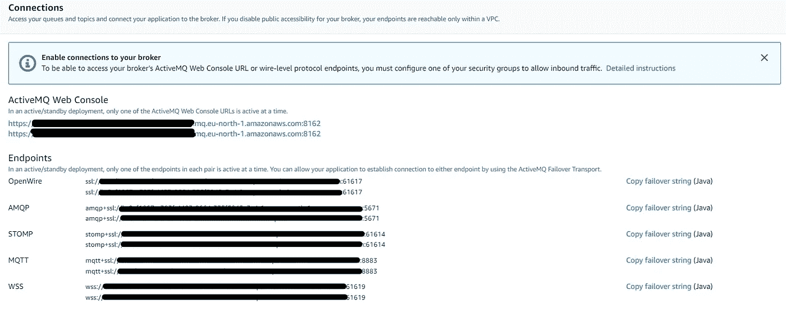

# 带 Java 的 Amazon MQ

> 原文：<https://medium.com/geekculture/amazon-mq-with-java-9004cdd066a6?source=collection_archive---------8----------------------->

在本文中，我将带您完成创建 Amazon MQ 的步骤，并将这个队列与我的 java 客户机连接起来。Amazon MQ 所做的是，将消息从一个服务传递到另一个服务。

Photo by [József Koller](https://unsplash.com/@onetdev?utm_source=medium&utm_medium=referral) on [Unsplash](https://unsplash.com?utm_source=medium&utm_medium=referral)

# 我的要求

我的要求很简单。我们有几个基于微服务的应用程序，部署在 Kubernetes 集群中。这些应用程序需要相互通信。假设我有两个微服务，其中一个用于通知发送服务(服务 A)。要向相关的合作伙伴发送通知，服务 A 应该联系第二个服务(服务 B ),从数据库中获取相关的合作伙伴详细信息。因此，服务 A 只发送通知，而合作伙伴细节的获取由服务 b 完成。

有一个问题是，当服务 A 总是调用服务 B 从 DB 获取合作伙伴时，它会产生更高的延迟，并且服务 B 上的负载会非常高。解决方案是添加一个缓存层，在第一次获取合作伙伴之后，服务 A 在其中保存合作伙伴的详细信息。这产生了另一个问题，当一个已经获取的伙伴从服务 B 端被更新时，服务 A 不知道这个变化，并且可能产生一些错误的通知发送。

为了解决这个问题，下一个建议是建立一个队列，一旦服务 B 的合作伙伴发生变化，服务 B 可以发布一个事件，然后服务 A 可以订阅该队列，当出现新事件时，它可以使与该合作伙伴相关的缓存失效。

希望你清楚我要从这个实现中解决的问题。

*PS:本文不赘述缓存实现。*

# 创建一个亚马逊 MQ

1.  登录 AWS 控制台，搜索 Amazon MQ。
2.  点击“创建经纪人”按钮。->选择 Apache ActiveMQ ->单击下一步
3.  选择主动/备用代理作为部署模式，并选择持久性优化作为存储类型->单击下一步
4.  为您的代理提供一个名称，然后选择简单身份验证和授权作为访问方法。(提供合适的用户名和密码)
5.  从附加设置中，为队列选择相关的 VPC 和子网，或新建。对于安全组，您也可以创建一个新的 SG，或者使用现有的 SG。
6.  将公共可访问性设置为“是”

创建代理需要一些时间，然后我们可以检查创建的代理。

# 将 Amazon MQ 连接到 Java 程序

## 出版者

## 订户

发布者和订阅者的 Maven 依赖关系。

确保从 Amazon MQ 控制台复制正确的 URL。你可以在连接下找到它。

要访问 ActiveMQ web 控制台，您可以使用本页中给出的两个 URL 之一。当您进入 web 控制台时，您可以找到每个主题的消息计数。

希望本文能指导您将 Java 应用程序与 Amazon MQ 连接起来。下一集见。😀