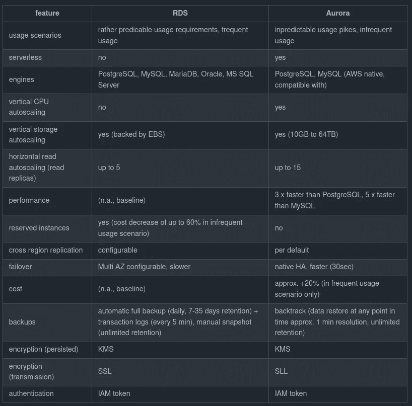

# 亚马逊关系数据库服务

> 原文：<https://medium.com/geekculture/amazon-relational-database-services-72d98074f2ad?source=collection_archive---------15----------------------->

## …简而言之

[Comparison table of Amazon RDS and Amazon Aurora key characteristics.](https://gist.github.com/fkromer/6100657fe7f2c6cd5f917291e3add01f)

> 在我们的数据驱动世界中，关系数据库无处不在:在 web 开发、数据工程中，以及通常在每个必须存储表格数据的系统中。

我**总结了夏羽·马瑞克[终极 AWS 认证](https://www.udemy.com/course/aws-certified-developer-associate-dva-c01/)的几个关键要点**…