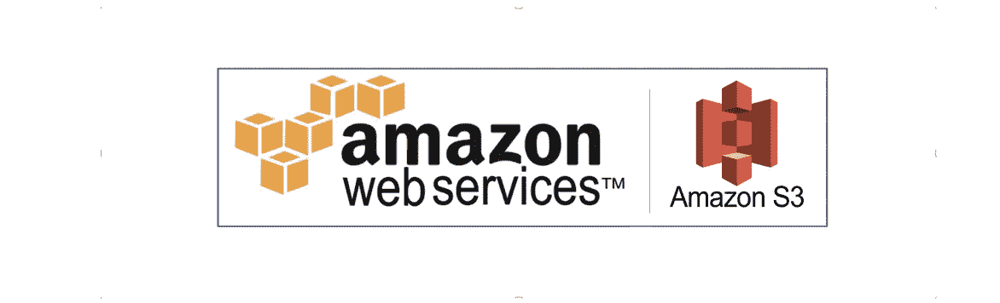

# AWS S3 基础— AWS 解决方案架构师助理课程

> 原文：<https://medium.com/geekculture/amazon-s3-aws-solutions-architect-da19e7eb21dc?source=collection_archive---------17----------------------->

## 第 7 章:AWS 解决方案架构师助理认证的 S3 基础知识

亚马逊简单存储服务(亚马逊 S3)是一种**对象存储服务**，提供行业领先的可扩展性、数据可用性、安全性和性能。让我们开始吧！

AWS S3 Chapter.