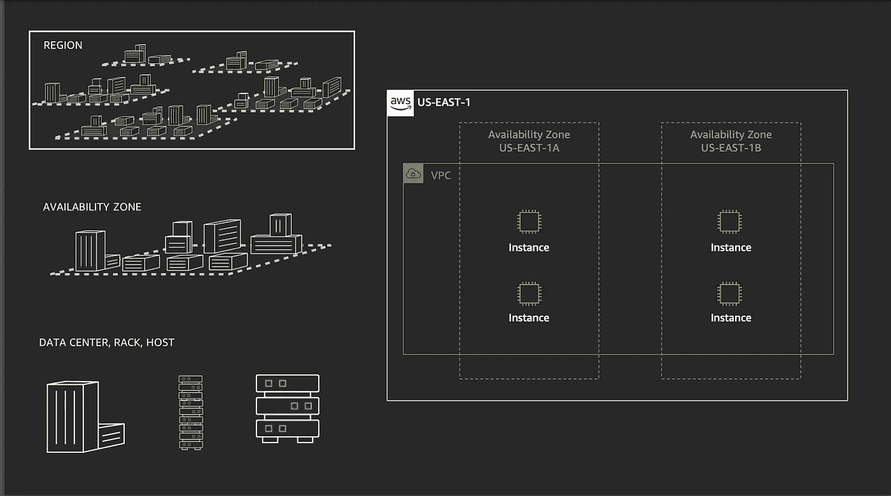
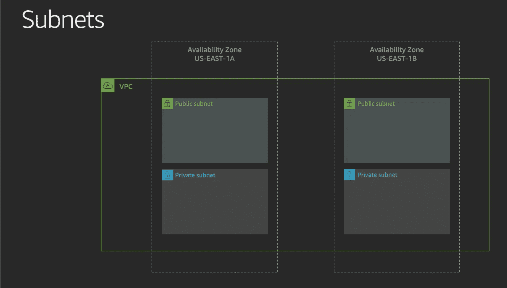
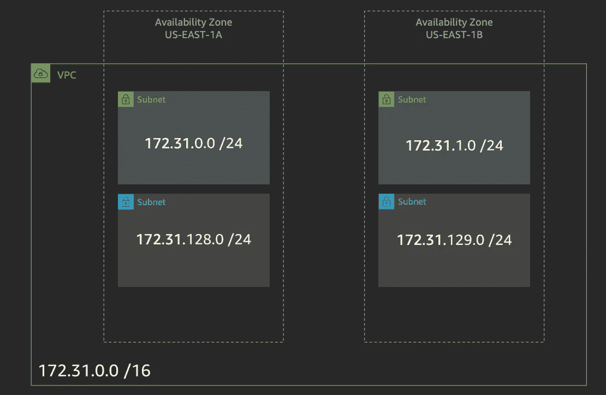
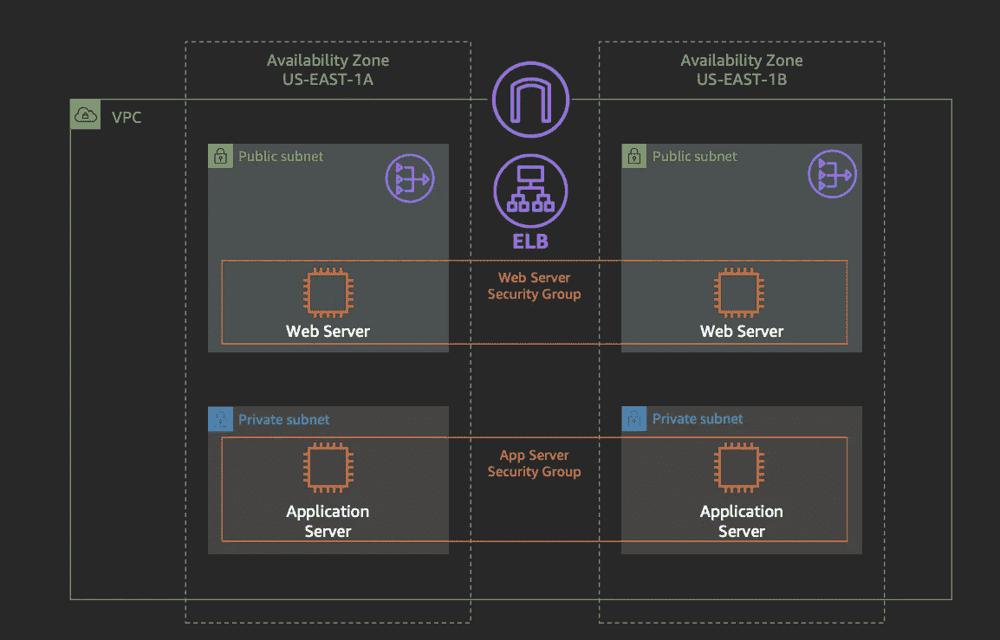
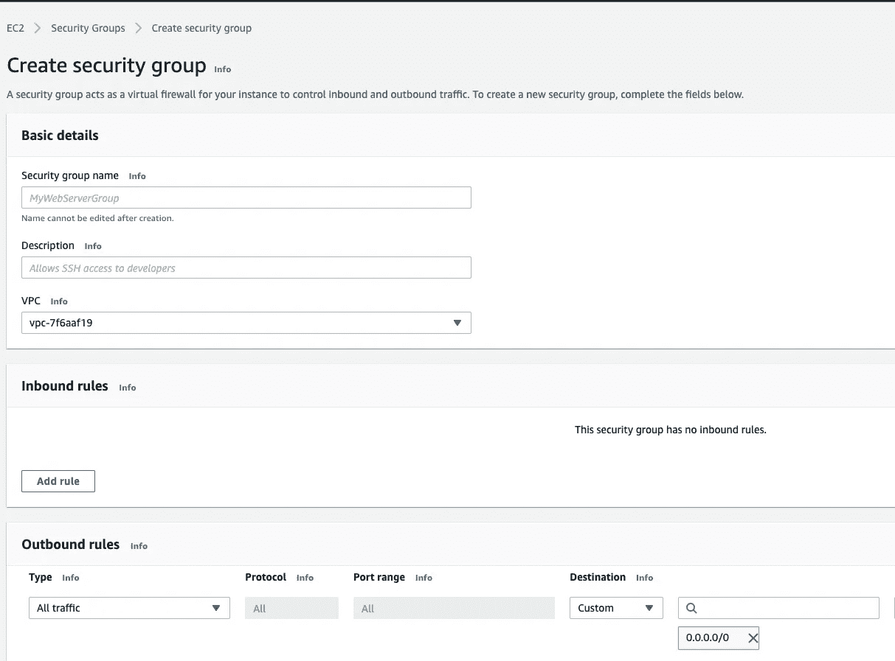
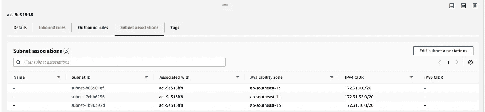
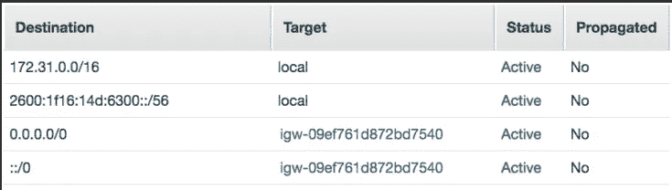
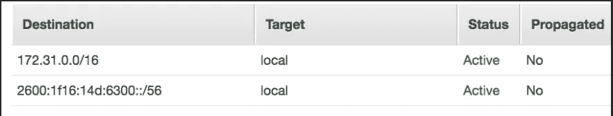
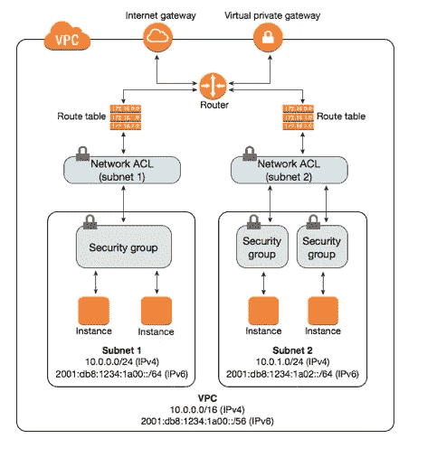
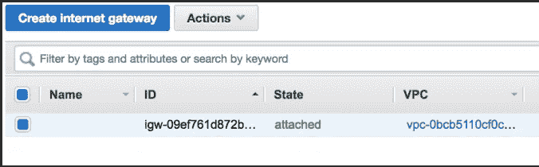

# 亚马逊虚拟私有云(VPC)

> 原文：<https://medium.com/geekculture/amazon-virtual-private-cloud-vpc-a096402d5d58?source=collection_archive---------69----------------------->

# 介绍

亚马逊 VPC(亚马逊虚拟私有云)用于将 AWS 资源启动到虚拟网络中。亚马逊 VPC 内部的各种组件定义了流量、安全性、路由配置等。

# 区域和可用性区域

高层次的 AWS 全球基础设施按区域分布。区域是世界上的一个物理位置，如爱尔兰、伦敦、新加坡等。每个区域进一步由可用性区域(AZ)组成。可用性区域(AZ)只不过是离散的数据中心。例如，如果新加坡是一个地区，那么在该地区内，AWS 可能有 3 个不同的数据中心，分别位于新加坡的东部、西部和南部，它们相互隔离。因此，如果一个数据中心停电或发生意外火灾，另一个数据中心将继续运行，不会造成任何中断。

# 亚马逊虚拟私有云

定义了区域和可用性区域后，下图有助于将 VPC 纳入全球基础架构。亚马逊 VPC 是一个虚拟网络，跨越一个地区的多个可用性区域。

Amazon VPC — Overview

亚马逊 VPC 是在区域级别定义的，它跨越多个可用性区域。因此，当必须在 VPC 内创建实例时，可以选择在该区域内的任何可用性区域中托管它们。实例是具有 IP 地址的物理服务器，物理上位于数据中心(可用性区域)内。

为了形象化它，想象将您的笔记本电脑(实例)放在您的办公场所中的位置 A(可用性区域 A)。第二天，您将访问位于办公室位置 B(可用性区域-B)的另一个分支机构，您必须继续工作。您无法实际访问放置在位置 A 的实例。但是，如果您在位置 A 的笔记本电脑(实例)中的数据可以复制到位置 B 的另一台笔记本电脑，那么您就可以继续工作。您通常不关心物理位置，只要我们能够像您在 a 使用笔记本电脑(实例)一样执行相同的功能。

虽然可用性区域可能看起来是多余的，但通常大多数真实世界的应用程序都托管在多个可用性区域中，以便在发生中断时具有弹性。因此，当我们定义虚拟网络(VPC)时，它可以选择跨同一区域内的多个可用性区域。

# CIDR 街区

要创建 VPC，我们需要定义 [CIDR 数据块 IP](https://www.pradheepa.com/posts/networking-cidr) 范围。这定义了 VPC 可以拥有的实例数量。同样，由于这是在 VPC 级别配置的，因此 IP 地址可以跨越多个 AZ。

让我们考虑默认的 VPC 的`IP CIDR Block`，也就是`172.31.0.0/16`。`/16`意味着前 16 位(172.31 段)必须保持不变，因此前两个 IP 段不能取任何其他值。这为我们提供了将最后两个 IP 段更改为(0-255)之间任何值的空间。因此默认 VPC 可以接受 65536 个 IP 地址。

# 子网

我们可以在 AZ 级别进一步划分 IP 地址(子网)。让我们考虑一下两个 az`172.31.0.0/24`和`172.31.1.0/24`的 CIDR 值。这可能意味着 IP 地址的范围被分组为`(172.31.0.0 - 172.31.0.255)`、`(172.31.1.0 - 172.31.1.255)`，每个有 256 个 IP 地址。现在，我将这两个 IP 范围分配给两个不同的可用性区域。第一个 AZ 将范围作为`(172.31.0.0 - 172.31.0.255)`，第二个作为`(172.31.1.0 - 172.31.1.255)`。让我们只考虑一个可用性区域，因为另一个将是一个精确的副本。

Subnets in a VPC

我可以将整个 256 系列作为一个逻辑组使用，也可以进一步将它们分成多个组。这些逻辑组称为子网(子网络)。为了说明，让我们考虑 AZ 中的两个子网，那么子网的 CIDR 范围可以是`172.31.0.0/24`和`172.31.128.0/24`，每个子网有 128 个 IP 地址。

Subnets and their IP range

# 安全组

下图显示，在一个可用性分区中，我们创建了两个子网(私有和公共)，一个子网允许互联网访问，另一个不允许。必须定义流量配置，使其成为公共和私有的。

Security Groups in a VPC

安全组用于控制入站和出站流量。在 VPC 中,`Security Groups`在实例级起作用。下面是创建安全组的向导。我们需要定义允许的入站流量和出站流量，并将其与该安全组所属的 VPC 相关联。

Create Security Group Wizard

## 摘要

*   在实例级别采取行动。
*   安全组规则使我们能够根据协议和端口号过滤流量。
*   规则是有状态的。例如，如果端口 443 被启用用于入站，那么无论出站规则如何，443 也被启用用于出站。
*   没有否认规则。只允许。
*   除非添加了允许流量的规则，否则与安全组相关联的实例不能相互通信。

# NACL(网络访问控制列表)

它类似于定义 VPC 内部网络访问的安全组，但它在子网级别运行。如果我们要定义跨子网的通用流量规则，我们在 NACL 定义。以下是在默认 VPC 中创建的默认 NACL 的配置。在这里，我们可以在第三个选项卡中看到子网关联。

Default NACL

此向导显示这些是所有允许的入站和出站规则，并且这些是与此 NACL 规则相关联的子网。这与安全组不同，在安全组中，我们只定义入站和出站规则。我们不必在创建安全组时定义与它相关联的实例。安全组仅在实例创建向导中与实例相关联。但是对于 NACL，它必须定义与之相关的子网。

## NACL 摘要

*   在子网级别运行。
*   必须明确定义入站和出站规则。例如，在 NACL，端口 80 允许入站规则并不意味着端口 80 出站规则，如安全组。如果没有定义，它将被自动拒绝。
*   我们可以定义允许和拒绝的规则。

# 路由表

路由表就像 VPC 中子网的流量控制器，包含哪些数据包去往何处的规则。它更像是子网内可能发生的所有可能路由的目录。我经常把路由表和 NACL 混淆，因为它们都与子网相关联。

公共子网的示例路由表如下所示。如果 VPC 被设置为具有地址空间`172.16.0.0/16`，那么被定义为`172.16.0.0/16`的`local`路由允许在 VPC 内创建的所有资源相互通信，而无需任何额外的配置。下一个配置是 VPC 内部的 IPv6 配置，用于相互通信。创建一个配置`0.0.0.0/0`并将目标连接到互联网网关(这是在路由表中配置它之前创建的)使连接到该路由表的任何子网成为公共的，因为它可以访问互联网。

Public Route Table (Internet Gateway attached)

Private Route Table (No Internet Gateway and only local route)

## 摘要

*   每个子网只能有一个路由表。
*   路由表可以在子网间共享。
*   基于该路由表的子网的所有路由。
*   NACL 和安全组旨在保护在 VPC 创建向导的`SECURITY`部分找到的实例，而不是主要用于路由。
*   如果我们看下图，我们可以看到任何流量的第一个接触点是连接到子网的路由表，然后是 NACL 和安全组。

Route Table Information Arch

# 互联网网关

顾名思义，这是公众上网的门户。如果我们托管一个 web 应用程序，web 服务器通常是面向公众的，并且可以通过互联网访问。为了实现这一点，我们应该首先创建一个 Internet 网关，并在路由表中定义路由。这允许进出实例的 internet 流量。

Internet Gateway

# 网络地址转换(NAT)网关

NAT 网关是一种网络地址转换(NAT)服务。可以使用 NAT 网关，以便私有子网中的实例可以连接到 VPC 外部的服务，但外部服务无法启动与这些实例的连接。例如，为了在实例上进行补丁安全更新，它可能必须连接到 internet，但不一定需要允许入站访问。

NAT 网关有两种类型，公有和私有。顾名思义，公共网关将连接到互联网(单向)，私有网关用于连接其他 VPC。公共 NAT 网关在公共子网中创建，并将与弹性 IP 地址相关联。

# 你能回答以下问题吗？

1.  没有路由表，子网还能存在吗？
2.  NACL 和路由表有什么区别？
3.  什么是 CIDR 数据块 IP 范围？
4.  如果路由表与子网相关联，为什么它会作为 VPC 配置的一部分显示在 VPC 控制台中？
5.  一个 VPC 可以有多少个路由表？
6.  什么是 VPC 的主路由表，您能编辑主路由表吗？
7.  是否可以创建另一个路由表并将其作为主路由表？

# 参考

1.  [https://D1 . AWS static . com/events/reinvent/2019/REPEAT _ 2 _ AWS _ networking _ fundamentals _ net 201-R2 . pdf](https://d1.awsstatic.com/events/reinvent/2019/REPEAT_2_AWS_networking_fundamentals_NET201-R2.pdf)