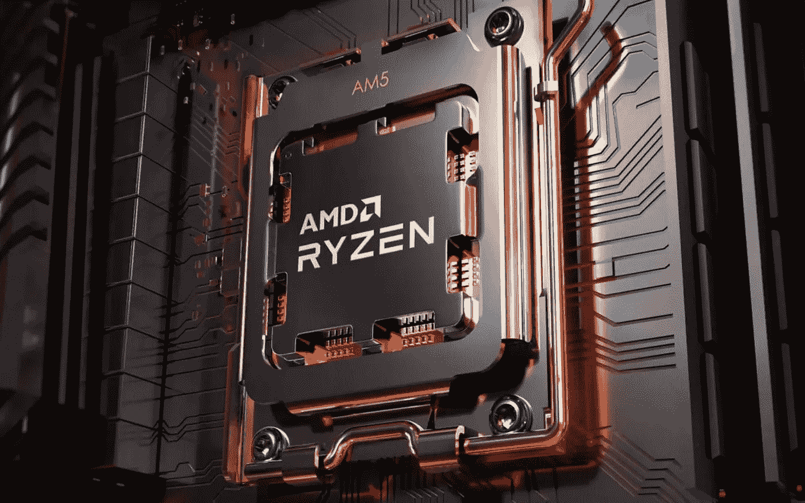

# AMD 准备用锐龙 7000 系列再次掀起波澜

> 原文：<https://medium.com/geekculture/amd-ready-to-make-waves-again-with-the-ryzen-7000-line-970ddccbb691?source=collection_archive---------19----------------------->

## 该公司的下一代台式机处理器亮相——这是他们承诺提供的东西

It’s been a long time coming, but the next wave of Ryzen desktop PC processors looks like it was worth the wait. We’ll find out in a few months’ time. (Image: AMD)

谣言和信息泄露已经在网上流传了一段时间，但它最终是官方的，坦率地说，相当令人兴奋:AMD 公司已经推出了新一代的台式计算机处理器…