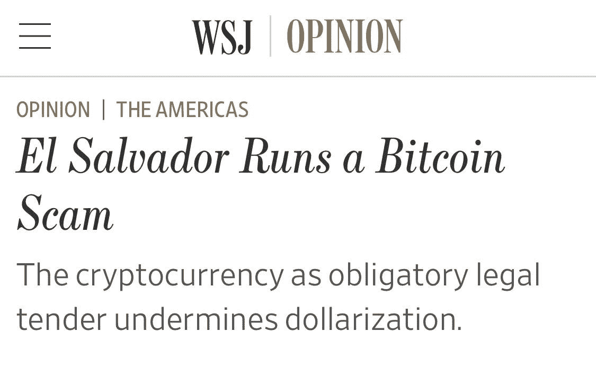

# 美国经营着一个菲亚特骗局

> 原文：<https://medium.com/geekculture/america-runs-a-fiat-scam-9d021182b467?source=collection_archive---------5----------------------->

## 美元霸权如何破坏世界自由并向穷人征税

所表达的观点纯属个人观点。我只是一个卑微的德根。

El Salvador Runs a Bitcoin Scam — WSJ — 13/09/2021 Source: [https://www.wsj.com/articles/el-salvadors-bitcoin-scam-dollar-crypto-currency-monetary-policy-11631470517](https://www.wsj.com/articles/el-salvadors-bitcoin-scam-dollar-crypto-currency-monetary-policy-11631470517)

有意思…

《华尔街日报》的玛丽·阿纳斯塔西娅·奥格雷迪(Mary Anastasia O'Grady)需要称萨尔瓦多为骗局吗，因为他们想要一种“垄断资金”的替代品？