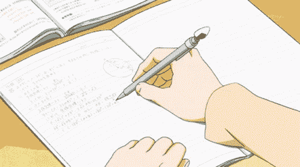
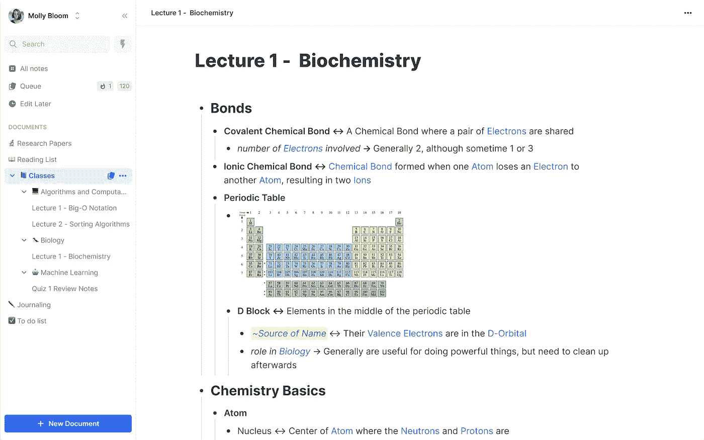

# 通过智能笔记提高工作效率

> 原文：<https://medium.com/geekculture/amplifying-productivity-by-taking-smart-notes-8574d4026e44?source=collection_archive---------2----------------------->

在学习新东西的时候，有太多的内容需要掌握，以至于大部分信息都丢失了，或者我们以后都记不起来了。这可能会降低我们的生产力和创造力。我偶然看到了一本名为《如何做智能笔记》的书，作者是 sonke Ahrens,书中讲述了一种特殊的笔记系统，它不仅可以让你有条不紊地收集信息，还可以将新信息与之前学到的概念联系起来。它们之间的这些联系使我们能够扩展我们的知识和生产力。

这种笔记系统被称为 zettelksten 方法，由德国社会学家 Niklas Luhmann 创立，他写了 70 多本书和近 400 篇学术文章，发表在各种主题上，包括法律、经济、政治、艺术、宗教、生态、大众媒体和爱情。

对于 zettelksten，您需要 **4 个组件**:

*   一个捕捉你所有快速想法、笔记和想法的空间。
*   一个[知识管理系统](#e59e)收集你阅读书籍和文章时的亮点，收集笔记。
*   具有唯一标识符的便笺(Zettel ),该标识符允许您在将来引用此便笺、正文(即您要捕获的内容)以及引用，以记录内容的来源。通过使用其唯一标识符连接这些便笺，您可以编织一个思想网，这将有助于您基于知识的活动。
*   一个把所有信息放在一起的空间。

**作为通用指南**

*   你应该总是从你吸收的信息中创造一些东西。你应该总是给信息添加上下文和意义，使其成为知识。即使你没有立即使用产生的知识，只要你用相关性填充材料，你就在正确的轨道上。
*   为了避免[收藏家的谬误](https://observer.com/2017/05/the-collectors-fallacy-why-we-gather-things-we-dont-need/)，记得努力接触新东西，以便真正理解它。给网站做书签或者只是阅读和注释书籍是不够的。
*   使用 zettelksten 时，我们需要遵守[原子性原则](https://zettelkasten.de/posts/create-zettel-from-reading-notes/)。这意味着每个 Zettel 只包含一个知识单元，而且只有一个。

所有这些听起来都很棒，但我想找出一种方法，以我喜欢的方式将它付诸实践，这将允许我坚持这种记笔记的技术，并足够经常地使用它来获得好处。我通常在电脑上编码/工作，所以我觉得一个能让我用 zettelksten 做笔记的软件会很棒。这是我试过的。

## [黑曜石](https://obsidian.md/)

如果你在谷歌上搜索 zettelksten 笔记软件，黑曜石是排名前几位的结果之一。它有强大的功能集，易于使用，它支持插件和主题，以提高您的笔记体验。不仅如此，当你记笔记并把它们和其他笔记联系起来时，你会得到这些概念是如何相互联系的图形表示。

Example from Obsidian website

Obsidian 有 IOS 和 Android 的移动应用程序，它们非常流畅。但要在你所有的设备上同步你的笔记，你需要购买他们的黑曜石同步计划，或者你可以使用 Google Drive 或 Git 等方法来同步。如果你是一个考虑安全性的人，黑曜石有客户端加密和员工不会阅读笔记内容的政策。不仅如此，它还加密静态附件。

## [记住](https://www.remnote.com/)

RemNote 专为思考和长期知识管理而设计，具有无限的免费计划，包括链接写作和 zettelksten、将笔记转换为抽认卡、跨设备同步笔记、图表视图、间隔重复等等。RemNote 还允许您在桌面版本上选择离线模式，并支持所见即所得视图和焦点模式。谈到安全性，RemNote 支持服务器端加密和员工不会阅读笔记内容的策略。

Image from Remnote website

## [观念](https://www.notion.so/)

我使用这个概念已经有一段时间了。您可以使用这个[模板](https://www.notion.so/Zettelkasten-Notion-1d0b1f7ad21841da846566bf17b81272)在概念中实现 zettelksten。它还描述了如何使用引用框和滑动框来组织您的想法。它当然没有黑曜石或 RemNote 强大，但如果你是一个习惯于概念的人，并且也想为此目的使用概念，你可以利用这个模板。

## [Readwise](https://readwise.io/)

除了使用笔记软件之外，将它与 Readwise 之类的软件结合起来帮助我提高了记忆力。Readwise 采用了一种被称为间隔重复的科学方法。他们会在适当的时候向你发送你最喜欢的电子书和文章集锦的提醒，你可以每天通过电子邮件和应用程序重温它们。

所有这些笔记软件、工具和技术的最终想法是帮助你创造一个第二大脑，这样我们就可以提高我们的生产力，以有效的方式收集和形成想法🌸

更多资源:

*   [适合初学者的 Zettelkasten】](https://zenkit.com/en/blog/a-beginners-guide-to-the-zettelkasten-method/)
*   【Zettelkasten 入门
*   [第二个大脑](https://www.youtube.com/watch?v=OP3dA2GcAh8)