# 简化的 Anaconda 环境管理指南！

> 原文：<https://medium.com/geekculture/an-a-z-guide-on-managing-anaconda-environments-simplified-d8681b4f2161?source=collection_archive---------3----------------------->

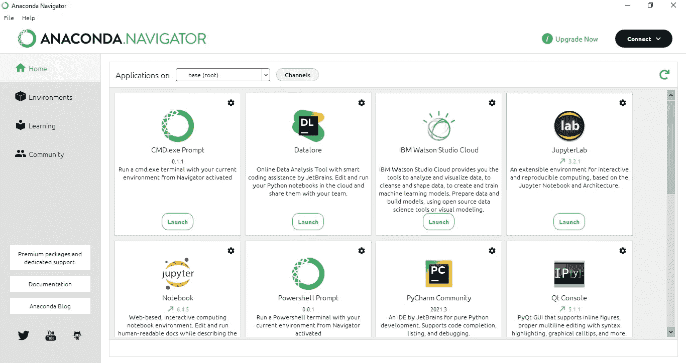

Python 新手经常不理解对这些环境的需求。在本文中，我们将介绍 Python 中虚拟环境的基础知识。

# 为什么虚拟环境在 Python 中很重要？

最简单的回答是用一个例子；

假设您使用 Python 3,6 的库和框架开发了一个 web 应用程序。几个月后，你会看到 Python 的新版本 3.7。

您继续从 3.6 升级到 3.7，您的应用程序停止工作，一旦您启动调查，您会发现升级到 3.7 后，您使用 3.6 构建的应用程序不再受支持。

通过将升级到 Python 3.7，您也升级到了 3.7 库，并使用 3.6 库来构建您的应用程序。现在问题来了，你是降级还是升级，也许只是降级某些库和模块以兼容 3.6，但是很难确定你使用了这些库和框架的哪个版本。

因此，虚拟环境对于帮助隔离项目非常重要。

# 那么什么是虚拟环境呢？

作为一个房间，无论你在房间里做什么，都不会直接影响到房间外的任何人。我们可以把房间漆成蓝色，这样不会影响房间外面的任何东西。现在让我们从虚拟环境开始。

# 康达虚拟环境

我更喜欢使用 Conda 创建虚拟环境，我将向您展示如何在 Anaconda 中管理它们并使用终端。

## 康达终端

也称为 conda 命令提示符，要访问它，请导航到搜索栏并键入 Anaconda 提示符，单击它，Conda 终端就会出现。

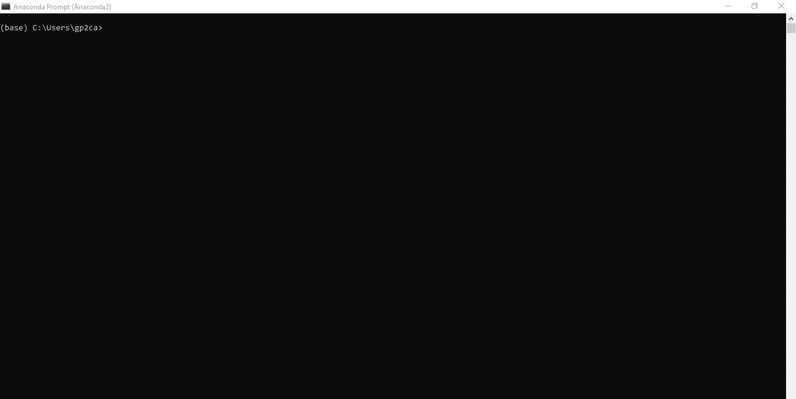

正如您在屏幕上看到的，默认虚拟环境是 base。为了便于说明，我创建了一些虚拟环境。

查看我们输入的所有虚拟环境；

```
conda env list
```

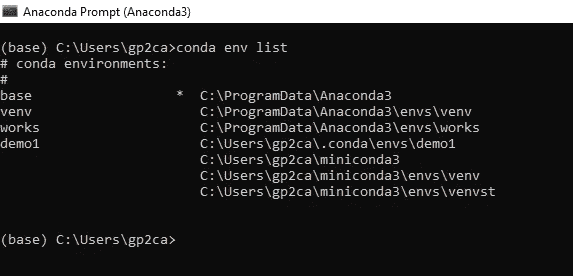

从上图中，我们有 4 个虚拟环境。星号表示我们目前正在工作的虚拟环境。现在让我们从创建一个虚拟环境开始。

## 创建虚拟环境

```
conda create -name pydemo1
conda create -n pydemo1
```

这两个命令做同样的事情，另一个名字是完整输入的，而另一个我们只是用(n)来表示名字。

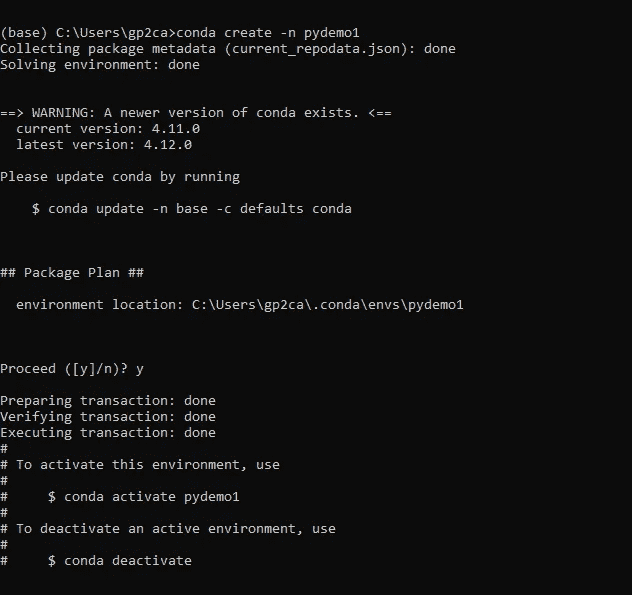

## 激活环境

然后我们只需要激活我们的环境。

```
conda activate pydemo1
```

请注意，我们不仅告诉 conda 激活，而且还指示激活哪个虚拟环境。

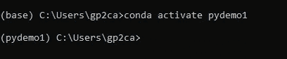

为了检查 pydemo1 是否被添加到环境列表中，以及它是否是主环境，我们再次使用 list 命令。

```
conda env list
```

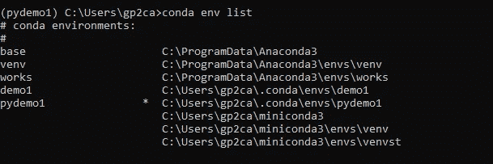

我们可以注意到，pydemo1 是我们当前的虚拟环境，标有星号。

另请注意，列出了虚拟环境的位置。如果我们想为我们的虚拟环境指定位置，会发生什么？

## 指定环境的位置

位置是我们环境居住的地方，所以我们可以通过给 conda a 目标路径来确定这一点。

```
conda create --prefix ./venv
```

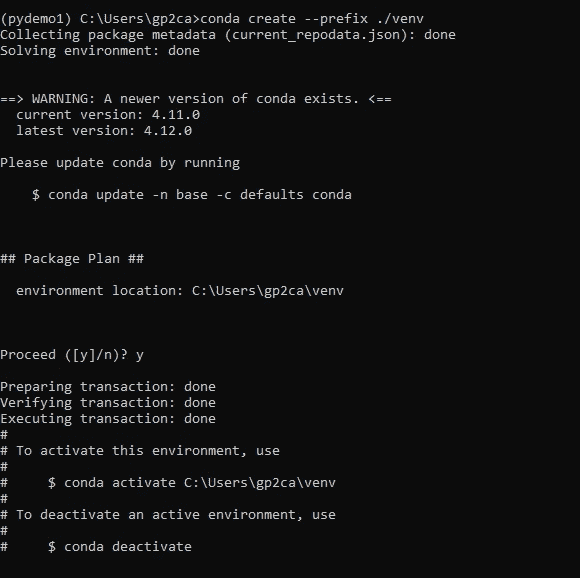

我们已经创建了一个新的虚拟环境并添加了前缀，因此我们可以指定我们的目录/位置。

我们可以简单地激活它，并列出要检查的环境。

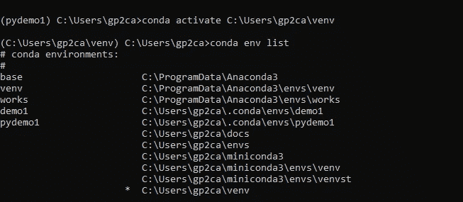

## 更新 Conda 环境

我们想为特定的虚拟环境更新 Python。我们目前使用的是 Python 3.9 版本，让我们检查并确认一下。

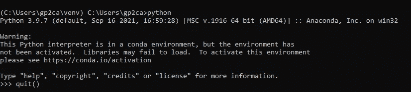

是的，我们在 3.9.7 上，我们将在附加提示符下键入命令 quit()退出；

```
quit()
```

因此，让我们使用命令更新到 Python 3.10

```
conda create -n pydemo2 python=3.10
```


从上图我们可以看到康达开始安装 Python 3.10 及其默认包。我们只需要继续检查。

首先，我们必须停用当前环境，这需要我们的路径规范，执行另一个停用命令，它涉及 pydemo1 环境。我们将遇到的下一个虚拟环境是 base，这是我们的默认虚拟环境。

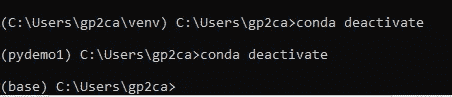

接下来，我们可以激活运行 python 3.10 的虚拟环境，称为 pydemo2

```
conda activate pydemo2
```

然后使用命令检查我们的 python 版本；

```
python
```

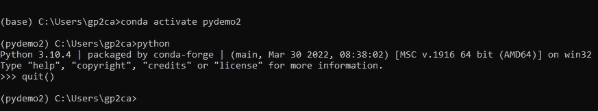

## 列出您环境中的软件包

比方说，我们想检查我的环境中有哪些包/库，我只是运行这些包/库；

```
conda list
```

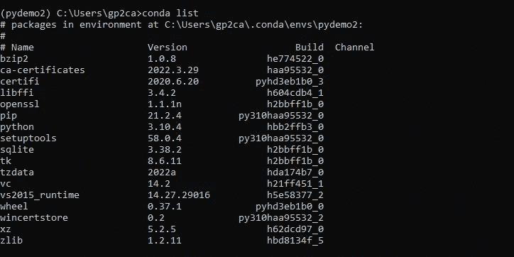

这涵盖了虚拟环境的基础知识，我将附上关于虚拟环境的深入信息的链接。

如果您确实喜欢使用图形用户界面在虚拟环境中工作，您可以简单地打开 Anaconda Navigator 并单击现有环境或创建新环境。

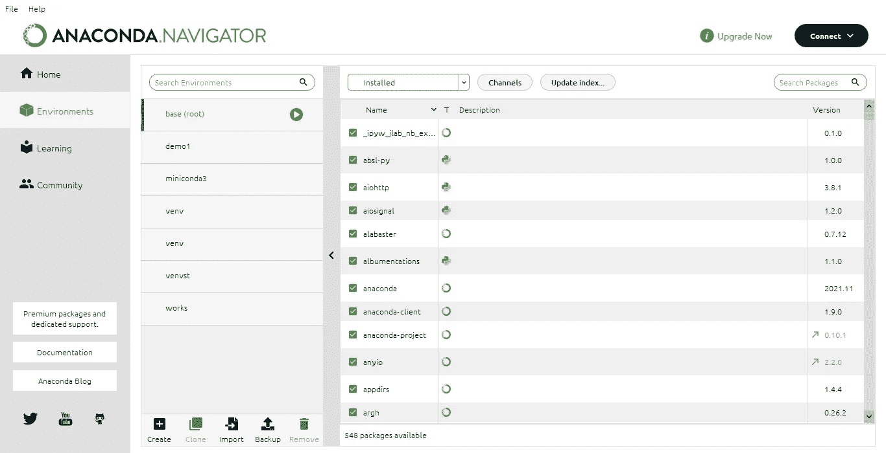

# 附加阅读

 [## 管理环境- conda 4.12.0.post32+6558801f 文档

### 使用 conda，您可以创建、导出、列出、删除和更新具有不同版本 Python 和/或的环境

docs.conda.io](https://docs.conda.io/projects/conda/en/latest/user-guide/tasks/manage-environments.html#viewing-a-list-of-the-packages-in-an-environment)