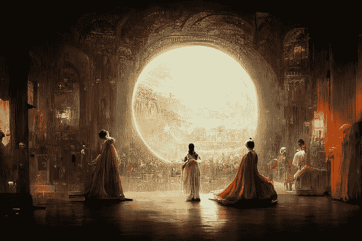

# 一幅人工智能生成的艺术作品获奖了——这对艺术家们来说意味着什么？

> 原文：<https://medium.com/geekculture/an-ai-generated-art-won-a-prize-what-does-it-mean-for-the-artists-f1af52311c22?source=collection_archive---------14----------------------->

人工智能图像生成引擎在[科罗拉多州博览会](https://coloradostatefair.com/)数字艺术竞赛中击败了**所有人**。没有规则没有被打破。一切合法。但是这对人类有什么意义呢&特别是对于创造性的工作？

> “人工智能比我们的智能小吗？”
> ——斯派克·琼斯。

Credits: Jason Allen. “Théâtre D’opéra Spatial”. Winner of the Colorado State Fair.