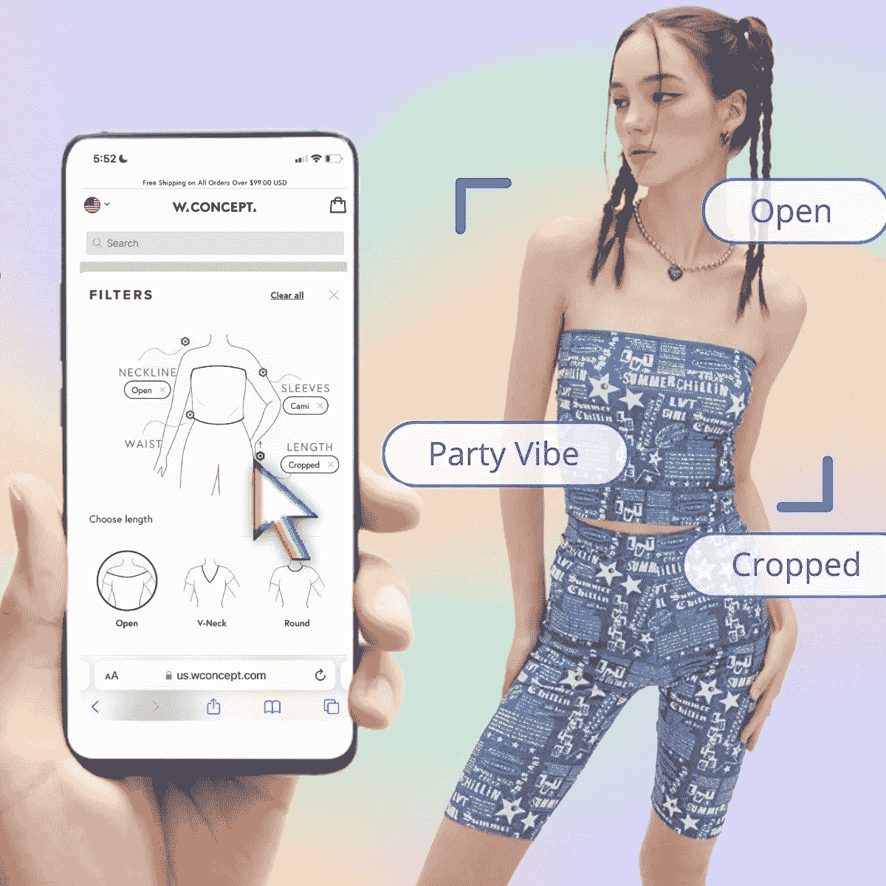
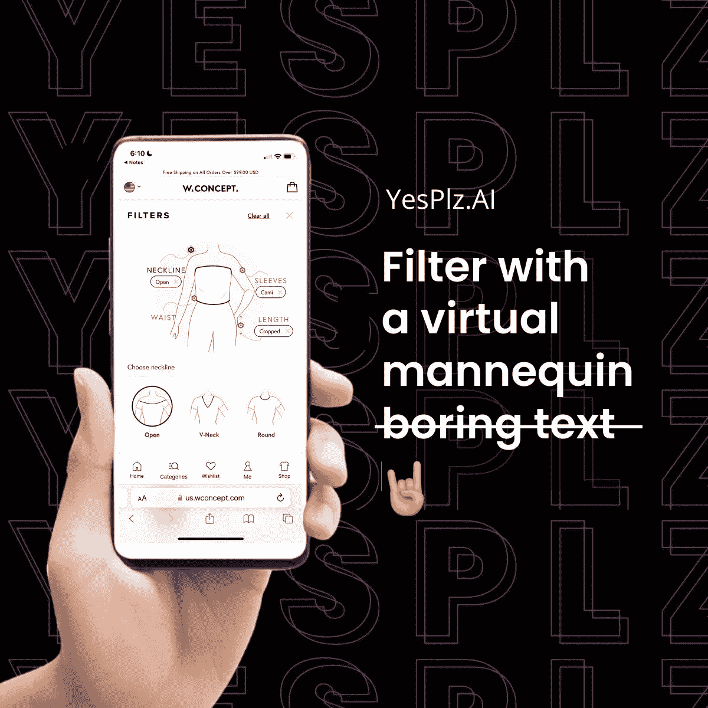
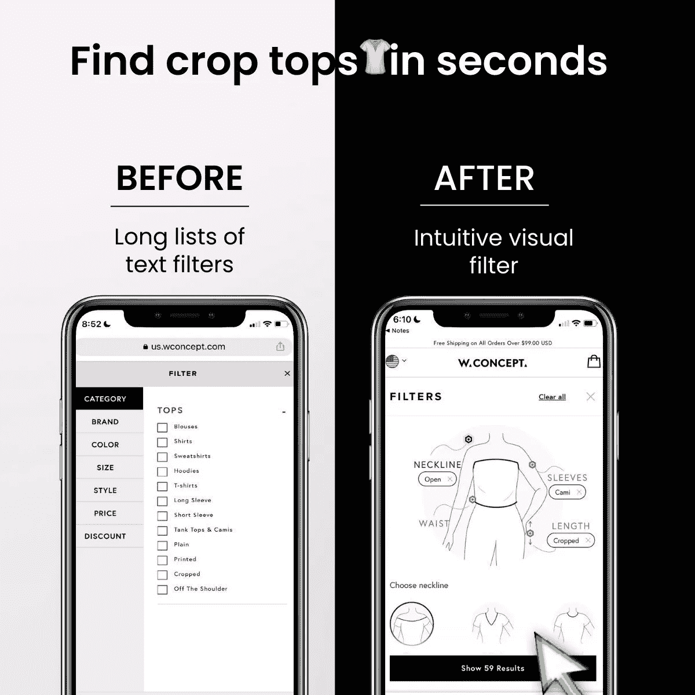
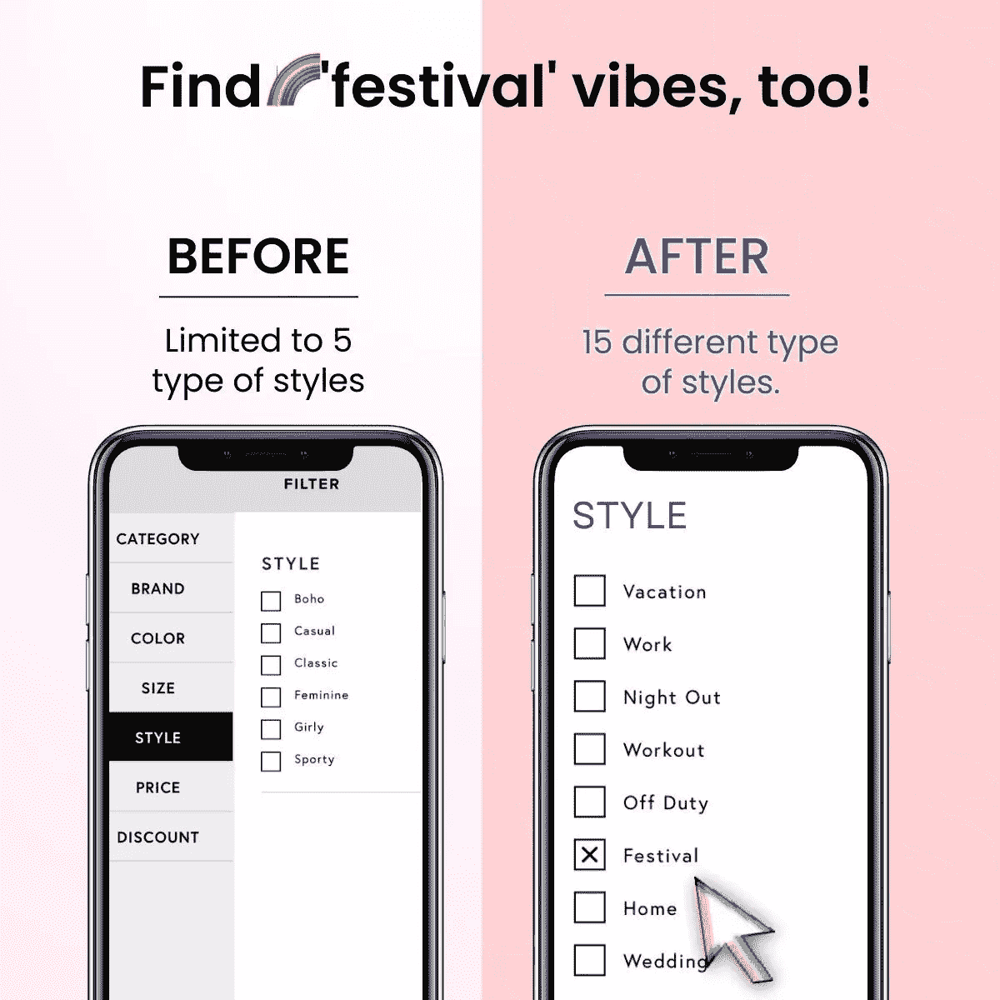
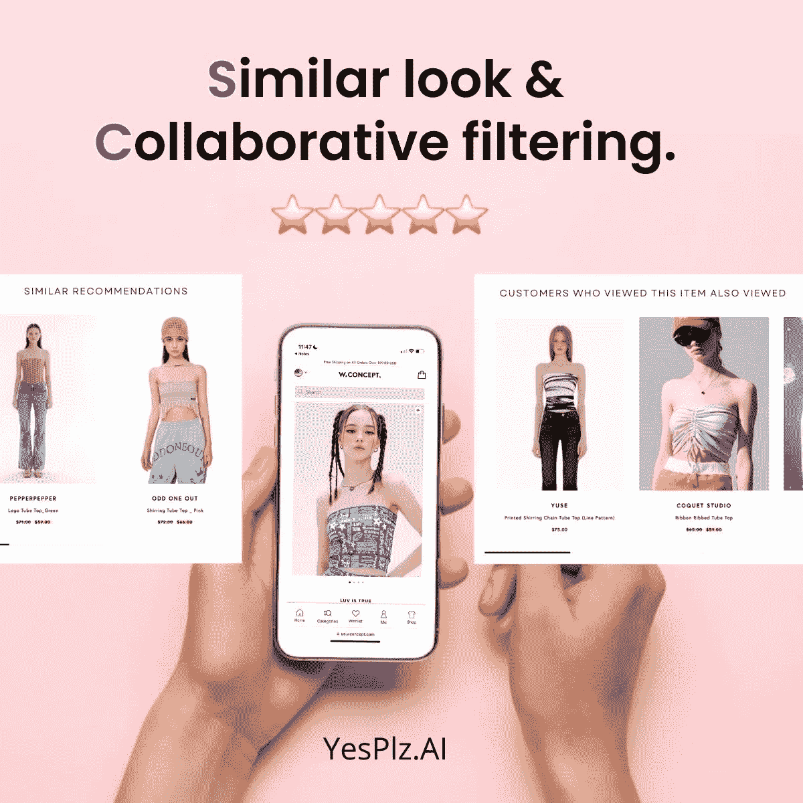
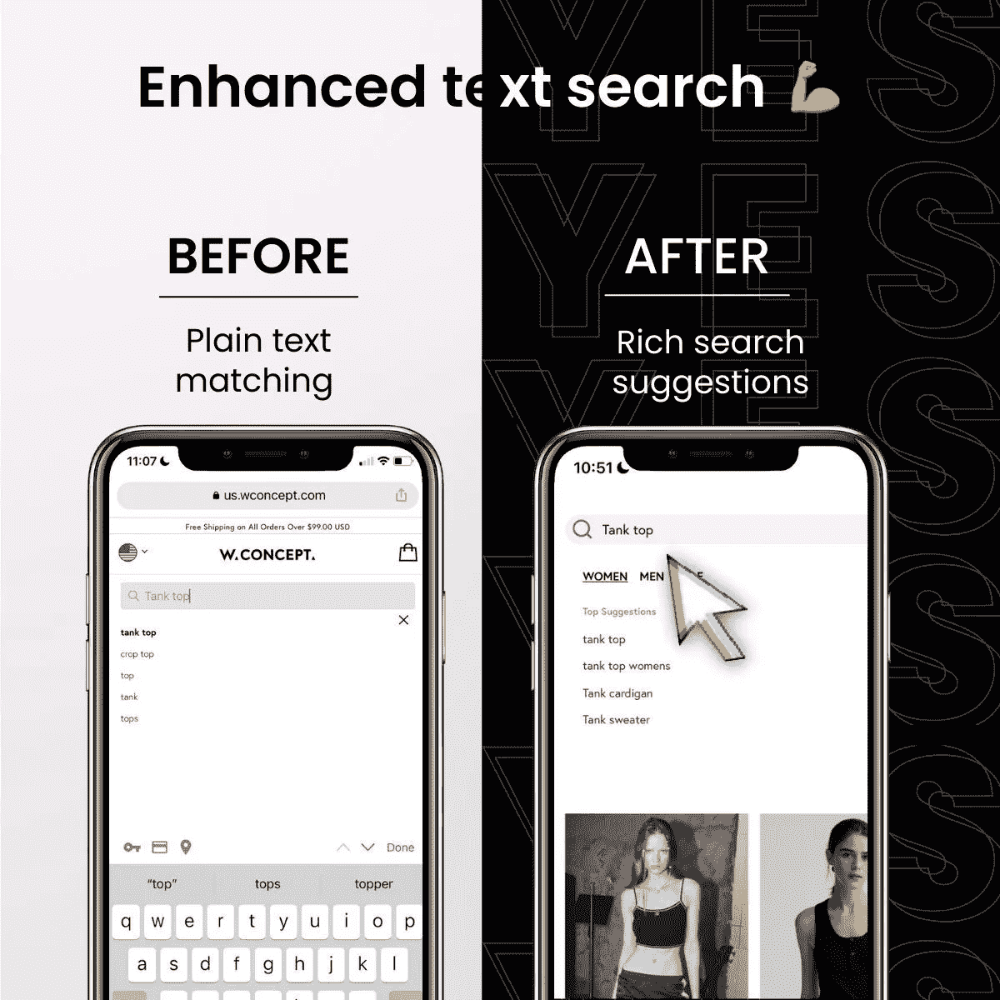
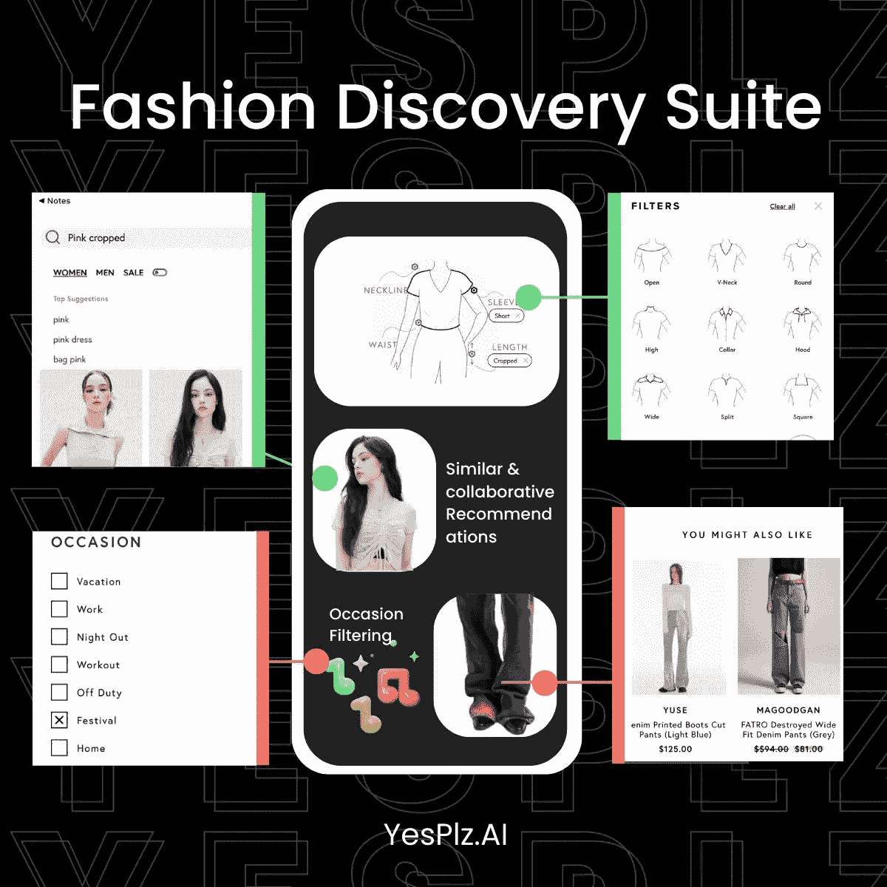

# 面向奢侈品零售商的人工智能虚拟人体模型

> 原文：<https://medium.com/geekculture/an-ai-powered-virtual-mannequin-for-luxury-retailers-d617ef4afd4b?source=collection_archive---------13----------------------->

当描述领先的奢侈品时尚在线零售商 [W Concept](https://us.wconcept.com/) 时，脑海中浮现的只是几个词:时尚前沿、当代和时尚发电站，其业务遍及美国、韩国、中国和英国

W Concept 为女性和男性提供各种类别的创新产品，包括服装、鞋子、手袋和美容产品，将自己定位为在线零售的领导者，受到全球时尚人士和影响者的喜爱。

W Concept 带着一个独特的挑战来到 YesPlz:作为一家不断增长的奢侈品时尚在线零售商，他们如何才能策划一个强大而资源丰富的搜索体验，同时仍然保持他们创新和时尚的形象——所有这些都由时尚人工智能驱动？

***增长快，变化也快***

随着 W 概念的不断成长，一些挑战开始出现。YesPlz 与 W Concept 合作，创造性地解决了这些挑战。

挑战 1: W Concept 承载了大量需要创新时尚人工智能解决方案的产品。

由于有数千种产品可供选择，W Concept 基于文本的搜索在实现视觉发现方面只能走这么远。购物者没有收到基于关键词输入的优化搜索结果，导致错过了发现新产品的机会。

而且，W Concept 的产品量之大令人难以招架:即使是最好的基于文本的搜索系统也赶不上不断涌现的新产品。

**挑战 2:有限的资源:在整个团队中，成员们都在竭尽全力满足 W Concept 在整个公司不断增长的需求。**

创新、直观的视觉发现在理论上听起来不错:但在快节奏的电子商务中工作的日常混乱可能会妨碍规划和实施。

没有时尚人工智能标签，W Concept 很难手动跟上即将推出的产品，导致资源捉襟见肘。

**挑战 3:缺乏能够为 W Concept 的独特需求创建定制、复杂解决方案的解决方案提供商。**

太慢了。不够定制。不易整合。不准确。缺乏老练。

这些只是 W Concept 开始寻找视觉探索解决方案时出现的一些问题。即使对于一些使用时尚人工智能的搜索解决方案来说，这项技术对于需要高水平搜索准确性和无缝集成到现有系统中的顶级零售商来说也不够好。

缺乏训练的时尚人工智能仍然需要代表零售商做额外的工作，比如修复贴错标签的产品。对于客户来说，这意味着他们将会看到低质量的搜索结果。

# W Concept 的 YesPlz 方法:敏捷时尚人工智能技术，具有取悦购物者的能力

YesPlz 直面挑战，同时后退一步分析整个用户旅程，以便在每一点为购物者提供相关的直观发现体验。通过深入思考 W Concept 的顾客、网站和挑战，我们策划了以下解决方案:

# 直观、准确的时尚视觉搜索:风格过滤器

风格过滤器，又名虚拟人体模型搜索，让购物者根据轮廓和偏好的产品属性快速过滤，从图案类型到牛仔裤洗涤到合身。

通过视觉搜索和时尚人工智能的结合，购物者可以收到准确、即时的搜索结果。

幕后的[时尚标签](https://yesplz.ai/resource/fashion-tagging-essential-guide-for-2022.html)节省了时间，允许快速、准确的搜索结果。

与相机搜索等其他时尚视觉搜索解决方案不同，风格过滤器是购物者想要参与的一种新的搜索方式。

**零售商完全控制功能:**

此外，W Concept 仍然控制着他们想要发布和取消发布的功能，让零售商能够随心所欲地打造他们的搜索体验。

# 根据真实购物者的反馈精心制作的场合过滤器

主题过滤器(通常被称为[场合过滤器](https://yesplz.ai/resource/fashion-tagging-for-occasion.html))是电子商务的最佳实践建议，但对于许多零售商来说实现起来很复杂。

凭借丰富的产品目录，W Concept 面临着一个复杂的挑战:他们如何提供准确的、专门针对购物者口味的场合(又称主题和氛围)过滤器？这些场合过滤器可以适用于大量产品吗？

# 强大的时尚人工智能标签+真正的购物者反馈=真正的场合过滤购物者想要的 W 概念

在此基础上，YesPlz 场合过滤器使用时尚图像标签来识别产品属性，为创建场合过滤器奠定了基础。

我们还创建了一个独特的时尚调查，以获得来自 W 概念购物者的真实反馈，从而训练人工智能，在 W 概念购物者需求和场合过滤器之间创建一个积极的反馈循环

# YesPlz 时尚 AI 对 W 概念的影响

购物者可以松一口气，因为他们现在可以控制自己的购物体验。

不再迷失在成千上万的产品中。不再需要无休止地滚动来寻找他们喜欢的产品属性。不再感到不知所措。

请继续关注结果的更多细节，并在我们更新时回来查看。

# 具有独特双重过滤系统的类似建议

类似的推荐能够取悦购物者，并留下持久的积极印象。

*yes plz 时尚 AI 推荐是如何工作的？*

我们采取两个步骤来创建准确、可靠的相似推荐:
1)将关键设计属性与产品相匹配
2)再次根据氛围和场合匹配推荐

最终结果是:人工智能驱动的产品推荐能够理解购物者的口味。

通过使用独特的双重过滤系统，YesPlz fashion AI 推荐在准确性和风格方面超越了[其他类似的推荐](https://yesplz.ai/resource/battle-of-product-recommendations-for-ecommerce.html)。

*找出购物者行为背后的“原因”*

当时尚电子商务中的类似推荐没有考虑推荐背后的原因时，它们可能会失败。根据 YesPlz 的研究，购物者将轮廓视为一个关键的产品属性。但是，这还不足以创建一个强大的产品推荐。

推荐准确性的下一层:识别搜索意图和氛围。

W Concept 高度成熟的购物者需要多方面的推荐，以不断满足他们的需求。

# 协同过滤+相似推荐=解决常见推荐问题的力量

除了类似的推荐，YesPlz 还为 W Concept 建立了协作推荐——后来又将其与类似的推荐结合起来，创造了一个强大的推荐体验。

在运行了不同的协作推荐模型后，YesPlz 定制了一个非常适合 W 概念购物者体验的模型。

而且，W Concept 在决定哪种推荐系统最适合他们的需求时，不必做出任何取舍。每种产品推荐类型各有千秋，共同提升推荐产品的整体质量。

YesPlz 机器学习能力包括所有数据类型，包括图像、文本、数字——你能想到的。

**超过 1 种产品推荐类型会产生巨大影响:**

协同过滤的一个常见问题是“冷启动”问题:当用户或产品是新的时，很难使用协同过滤来进行推荐，导致隐藏的产品和错过的销售。

通过将“相似推荐”与协同过滤结合使用，我们可以:

*   使用每种产品推荐类型来提升彼此的品质
*   创建一个快速、准确的产品推荐系统，展示 W Concept 产品目录的深度，同时迎合 W Concept 购物者的口味
*   凭借强大的机器学习，W Concept 现在有能力策划直观、准确和令人愉快的购物体验。

# 时尚标签支持的世界之外的文本搜索

最后:定制的文本搜索比其他搜索工具更准确，其核心是时尚人工智能标签。

完成 W Concept 的视觉发现转型的最后一步:从头开始构建文本搜索。

神奇的公式？

*   **关键词匹配**
*   **相似搜索:**我们对数据进行了训练，以了解与搜索词相似的其他风格，从而使搜索更加准确和稳健
*   **YesPlz 时尚视觉搜索:**没有第三方厂商提供的产品数据？没问题。通过 YesPlz 时尚视觉搜索，我们仍然可以从一个产品中拉出相关信息，并用激光精确的时尚 AI 生成产品信息。

假设一个购物者正在搜索一件“吊带背心”，并在 W Concept 的搜索栏中输入这个词。

在幕后，搜索结果是基于理解吊带背心可以包括许多不同产品(并且那些产品在描述中可能不被命名为“吊带背心”)的数据而生成的。例如，有吊带的紧身胸衣怎么样？还是无袖衬衫？

购物者很少会想到与零售商的产品描述相匹配的确切关键词——但通过时尚视觉搜索，YesPlz 可以训练时尚人工智能识别图像中的产品属性，从而产生完美的搜索结果，即使购物者弄错了术语或产品没有准确标记。

# W Concept 令人难忘的使用时尚人工智能的数字化转型

现在，有了 YesPlz 的时尚人工智能套件，W 概念购物者可以:

*   找到他们想要的款式，包括廓形和剪裁
*   通过跳转到他们最喜欢的氛围或场合来快速跟踪他们的搜索
*   接收经过策划的类似产品推荐，以及协同过滤，从而实现完美的产品发现
*   做一个时尚小测验来帮助训练时尚 AI，并对他们看到的滤镜产生影响
*   轻松按文本搜索并接收丰富的搜索建议

数字化转型不仅仅是数字化，它让零售商和购物者都能够掌控产品发现体验。对于 W Concept 来说，数字化转型也意味着使用 YesPlz fashion AI 对产品属性进行精准标签，为策展的购物之旅奠定基础。

时尚人工智能作为一种数字化转型工具，有可能转变像 W Concept 这样的电子商务品牌——它快速、强大、易于集成。无论您的电子商务是寻求直观的产品发现、精准的推荐还是时尚标签， [YesPlz 都能为您的企业打造定制解决方案。](https://yesplz.ai/contact.html)

本文最初由 [YesPlz AI](http://yesplz.ai) 发布，次世代时尚搜索。