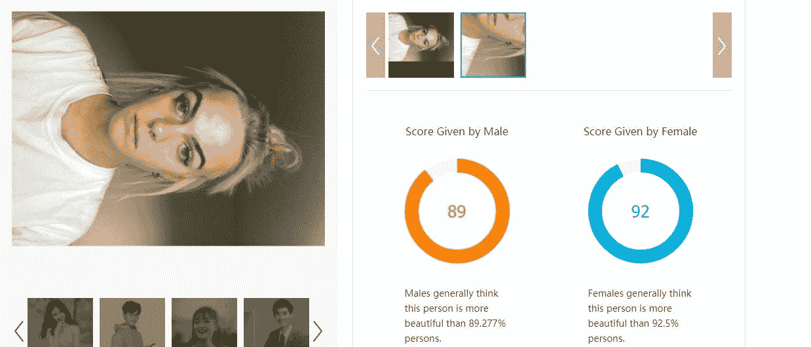
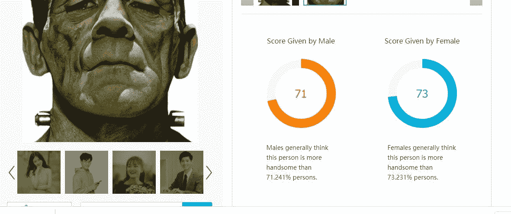

# 一个人工智能工具告诉我我很漂亮……但是它说弗兰肯斯坦也很漂亮。

> 原文：<https://medium.com/geekculture/an-ai-tool-told-me-im-pretty-but-then-it-said-frankenstein-is-too-47a671e1ff99?source=collection_archive---------4----------------------->

最近，我和我的教授一直在讨论狭义的人工智能，以及它在日常生活中的哪些地方。我们都订阅了一份[时事通讯](https://futureloop.com/convergence/)，每天向你的收件箱发送大量的例子，从无人驾驶汽车到帮助人类登上月球的技术。这些都是很明显的例子，但是狭义人工智能到处都是。时事通讯甚至是由一个叫做“虚拟彼得”的人工智能程序编写的，我的教授克雷格非常喜欢这个程序。我觉得很奇怪。

因此，当浏览更多日常的狭义人工智能的例子时，我立刻被时尚和美容相关的用途所吸引。我碰到了面部分析软件。我给克雷格发了几篇关于它的文章，主题是，“这真的很酷吗，还是我只是虚荣？?"(巧合的是，如果我决定写回忆录的话，我认为这将是我回忆录的完美名字。)幸运的是，他认为这确实很酷。所以我一直在调查。

我很快发现了 [Qoves Studio，](https://www.qoves.com/)一家使用人工智能分析人脸的公司。人们通常在整形手术前使用它。在他们的网站上，他们有一个软件可以让你上传一张你的脸的照片。然后他们的人工智能系统挑出所有的缺陷。如果缺陷足够严重，它会推荐产品或程序来修复它。

很明显，我不得不这么做。所以有一天我下班回家，擦掉我的妆，拍了一张合适的照片。我撩起头发，把相机调成自拍，就去上班了。

人工智能在评估中相当温和。对于 Qoves' AI 会建议我改变什么，我有预感和不安全感…但对我来说很容易。它告诉我，我的眼睛下面有黑眼圈，可以受益于嘴唇填充物——这两件事我之前已经充分意识到了。这给了它更多的可信度。

所以在这一点上，我投入了。关于我的脸，AI 还能告诉我什么？我想知道一切。我在“ [Face++上找到了另一个人工智能驱动的面部分析工具。人工智能程序分析你的照片，给出一个“美丽分数”，或者说你的长相在一个庞大的其他人的面部数据库中的排名。当我说巨大的时候，我是认真的。中国政府甚至将其用于面部识别和监控。](https://www.faceplusplus.com/)

我对我的“Face++”结果很满意(见上图)。这个比例比我想象的要高得多，尤其是对于这样一张不讨人喜欢的照片。根据这个人工智能，我是前 10%的吸引力。我有点怀疑，但总的来说，我松了口气。也许我的黑眼圈没有我想象的那么黑。

我让我男朋友试了一下，他得了 70%左右。我打电话给克雷格，因为我想让他试试。就连他也对我的“美貌评分”印象深刻但是他说我们需要将它与其他东西进行比较，这样我们才能真正测试它。“放一张弗兰肯斯坦的照片，看看上面写了什么，”他告诉我，已经笑了。我照做了。

你猜怎么着？弗兰肯斯坦的支持率刚刚超过 70%。

安慰完男朋友，我给克雷格打了电话。这个人工智能真的想说 7/10 的女人会给弗兰肯斯坦她们的电话号码吗？这似乎不太可能。而我男朋友的排名就和字面上的绿色怪物一样吸引人？好像。还有，最糟糕的部分，弗兰肯斯坦的《美女评分》*完全把我的合法化了。克雷格笑了又笑，说他再也没有印象了。“我是说，他的骨骼结构很好，”我辩解道。*

显然，美是主观的，人工智能只理解它接受训练的数据。但如果一家价值 40 亿美元的公司说，弗兰肯斯坦比 70%的人更有吸引力，它一直在看什么样的面孔？**这真的是想告诉我，我发现弗兰肯斯坦和我男朋友一样有魅力的可能性吗？这似乎意义重大。**

因此，虽然“Face++”估计女性认为我的吸引力比其他人高 92%,男性认为我比其他人高 89 %,但这是怎么决定的呢？

我真的认为，需要有一个具有文科背景的人参与这些算法的开发。是的，当然，整个过程的支柱是找出算法的技术程序的人。但需要有一个对等的人:一个会问这些更温和、超出范围的问题的人——因为像这样的情况表明，文科视角是至关重要的。

虽然面部分析软件无处不在，但有些是透明的，可以用谷歌快速搜索。有些提供服务(如 Qoves Studio 揭示整形手术如何让你更“有吸引力”)。据报道，它是许多个性化社交媒体算法的基础。如果是这样的话，你 Instagram feed 背后的人工智能可能会比你想象的更优先考虑科学怪人。

# **最近阅读:**

## **让我着迷的文章的简要综述……**

1.  我上面提到的时事通讯 Futureloop 是一个很好的收集所有人工智能信息的网站

2.[这篇文章](https://www.technologyreview.com/2021/03/05/1020133/ai-algorithm-rate-beauty-score-attractive-face/?truid=d5ec21c49cc3d97069dfb410ea1abf7d&utm_source=the_download&utm_medium=email&utm_campaign=the_download.unpaid.engagement&utm_term=Active%20Qualified&utm_content=03-05-2021&mc_cid=11a5e59bfd&mc_eid=696b5d9dba)对面部分析软件进行了深入报道，如果你想更深入地了解更多技术知识…

# **最后的想法:**

我认为自己是一个相当老练的垃圾电视迷，特别是那种我可以在屏幕上看到人们做出重大人生决定的真人秀。但是自从大约一年前《T4 爱情是盲目的》首播以来，我就一直没能恢复过来。

好消息:网飞刚刚发布了一个令人畏缩的五音不全的真人秀系列，在这个系列中，情侣们必须在购买他们梦想中的婚礼或梦想中的房子之间做出选择。它被称为[婚姻或抵押](https://www.youtube.com/watch?v=3N_CLZkCGXE)，它是如此的愚蠢，如此的有趣。