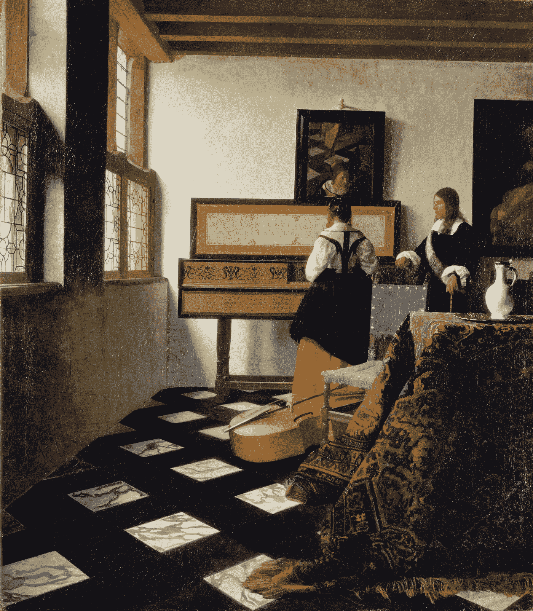
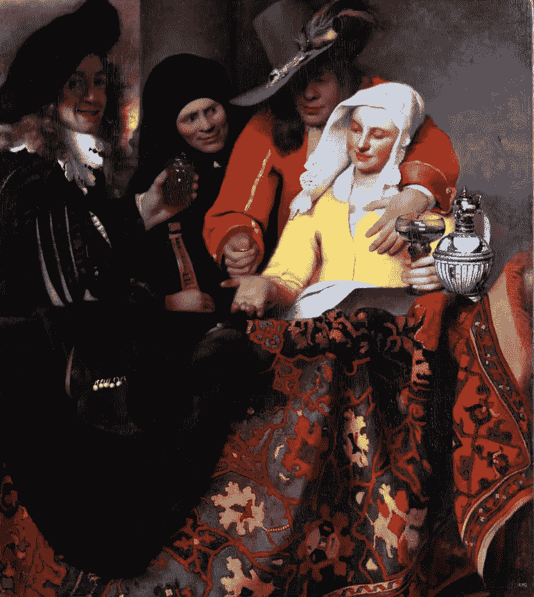
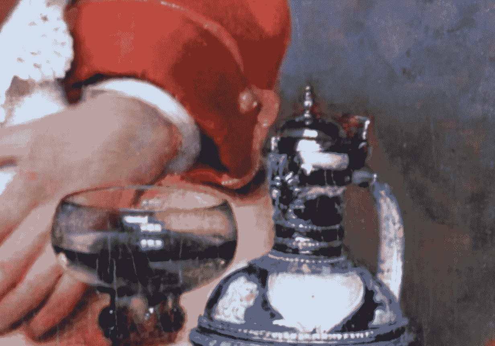
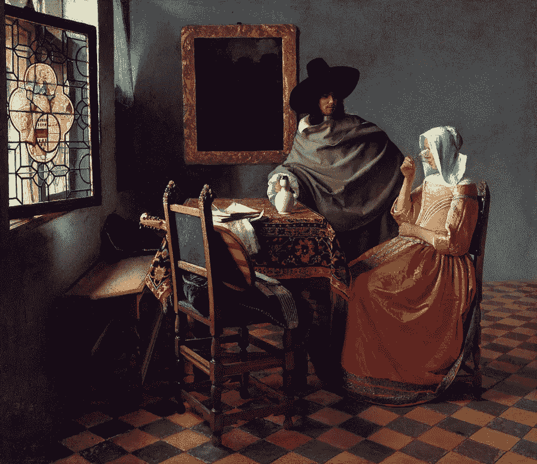
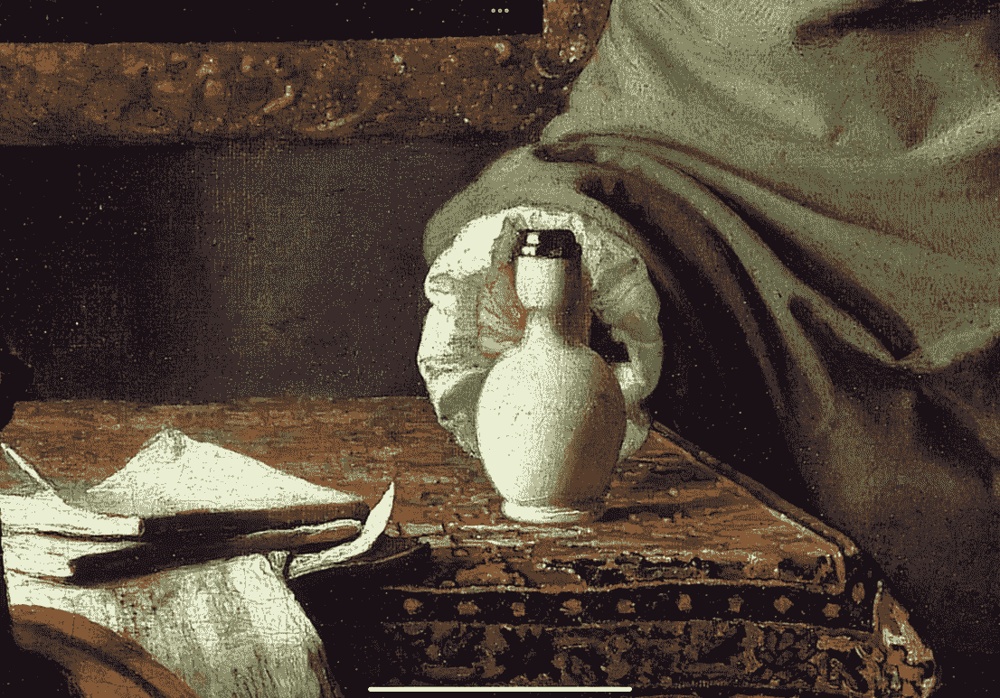
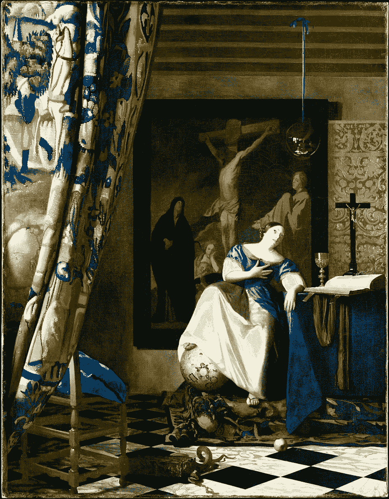
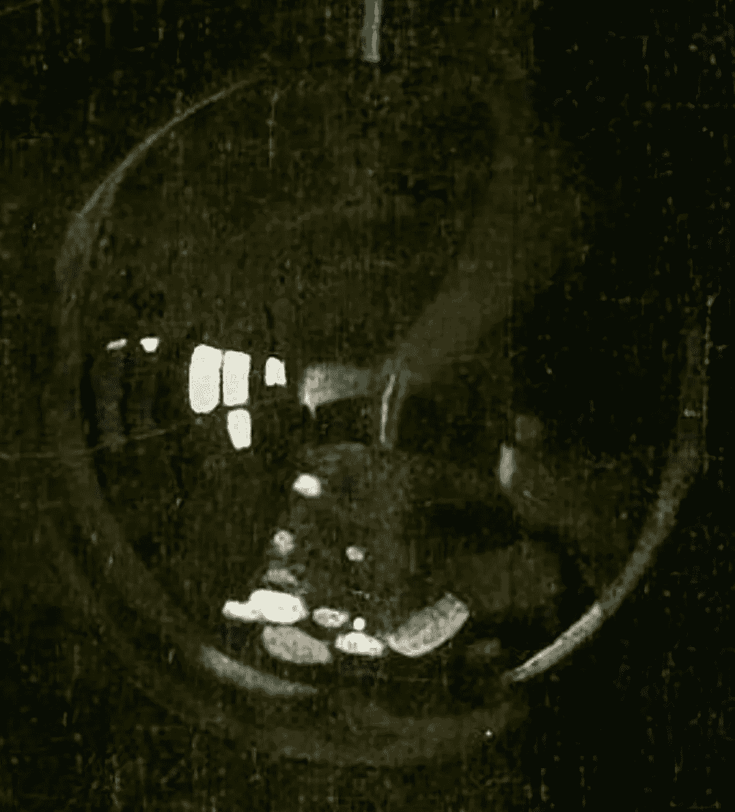

# 约翰内斯·维米尔的技术寓言

> 原文：<https://medium.com/geekculture/an-allegory-of-techology-by-johannes-vermeer-e6bda42bfb29?source=collection_archive---------13----------------------->

## 弗米尔绘画风格的再审视

最近看了电影《蒂姆的维米尔》。有一场讨论，试图了解弗米尔是否使用镜子和镜头来帮助他画出令人难以置信的写实绘画。蒂姆·詹尼森开始展示如果使用那个时期的工具，他能多好地复制弗米尔的一幅画。

这让我想到了图像中的其他标志，这些标志对于使用这种技术来说是一个致命的威胁。

Public Domain Image, The Music Lesson

我以为音乐课钢琴上方的背景里有面镜子，这让我开始思考。如果弗米尔使用镜子和镜头来绘画，那么他就接近了对场景的摄影成像。因此，如果场景中有倒影，他会准确地描绘出倒影，很可能描绘出房间中看不见的部分，包括他自己。

出于好奇，我在他为数不多的画作中寻找能反映场景的金属或镜子。有一个花瓶出现在他的许多画作中，它的顶部有一个金属片。它肯定有一些空间，但不够清晰。

Public Domain Image, The Procuress

在另一幅画中，有另一小块玻璃。两者都没有表现出足够的场景细节。

Public Domain Image, The Glass of Wine

但是接下来，有一些令人惊奇的事情。几乎像弗米尔故意把它放在那里，好像他想被抓住但没人抓住他。在另一幅名为《信仰的寓言》的画的黑点前的一个玻璃球。也许这幅画实际上是一个寓言，讲述了他的技巧。

Public Domain Image, Allegory of Faith

图像非常清晰。如果没有像镜子和镜头这样的特殊工具，很难画出如此小的物体的细节。如果您想更近距离地观察场景中的任何对象，只需走近玻璃球就会改变反射的外观，并破坏您通过肉眼准确绘制它的能力。

我怀疑，使用光线跟踪器和对房间的精确测量(这是可用的)来校正玻璃中图像的镜头失真，甚至可以发现更多。我被蒂姆的演示说服了，在画中看到这个镜头似乎就像维米尔从过去向我们伸出手，让我们知道一个他当时不太愿意透露的细节。

如果你愿意，可以在 Twitter 和 YouTube 上关注我，我会在那里发布不同机器上的浓缩咖啡视频和浓缩咖啡相关的东西。你也可以在 [LinkedIn](https://www.linkedin.com/in/robert-mckeon-aloe-01581595?source=post_page---------------------------) 上找到我。也可以关注我[中](https://towardsdatascience.com/@rmckeon/follow)和[订阅](https://rmckeon.medium.com/subscribe)。

# [我的进一步阅读](https://rmckeon.medium.com/story-collection-splash-page-e15025710347):

[浓缩咖啡系列文章](https://rmckeon.medium.com/a-collection-of-espresso-articles-de8a3abf9917?postPublishedType=repub)

[工作和学校故事集](https://rmckeon.medium.com/a-collection-of-work-and-school-stories-6b7ca5a58318?source=your_stories_page-------------------------------------)

[个人故事和关注点](https://rmckeon.medium.com/personal-stories-and-concerns-51bd8b3e63e6?source=your_stories_page-------------------------------------)

[乐高故事启动页面](https://rmckeon.medium.com/lego-story-splash-page-b91ba4f56bc7?source=your_stories_page-------------------------------------)

[摄影飞溅页](https://rmckeon.medium.com/photography-splash-page-fe93297abc06?source=your_stories_page-------------------------------------)

[使用图像处理测量咖啡研磨颗粒分布](https://link.medium.com/9Az9gAfWXdb)

[改善浓缩咖啡](https://rmckeon.medium.com/improving-espresso-splash-page-576c70e64d0d?source=your_stories_page-------------------------------------)

[断奏生活方式概述](https://rmckeon.medium.com/a-summary-of-the-staccato-lifestyle-dd1dc6d4b861?source=your_stories_page-------------------------------------)

[测量咖啡磨粒分布](https://rmckeon.medium.com/measuring-coffee-grind-distribution-d37a39ffc215?source=your_stories_page-------------------------------------)

[咖啡萃取](https://rmckeon.medium.com/coffee-extraction-splash-page-3e568df003ac?source=your_stories_page-------------------------------------)

[咖啡烘焙](https://rmckeon.medium.com/coffee-roasting-splash-page-780b0c3242ea?source=your_stories_page-------------------------------------)

[咖啡豆](https://rmckeon.medium.com/coffee-beans-splash-page-e52e1993274f?source=your_stories_page-------------------------------------)

[浓缩咖啡用纸质过滤器](https://rmckeon.medium.com/paper-filters-for-espresso-splash-page-f55fc553e98?source=your_stories_page-------------------------------------)

[浓缩咖啡篮及相关主题](https://rmckeon.medium.com/espresso-baskets-and-related-topics-splash-page-ff10f690a738?source=your_stories_page-------------------------------------)

[意式咖啡观点](https://rmckeon.medium.com/espresso-opinions-splash-page-5a89856d74da?source=your_stories_page-------------------------------------)

[透明 Portafilter 实验](https://rmckeon.medium.com/transparent-portafilter-experiments-splash-page-8fd3ae3a286d?source=your_stories_page-------------------------------------)

[杠杆机维护](https://rmckeon.medium.com/lever-machine-maintenance-splash-page-72c1e3102ff?source=your_stories_page-------------------------------------)

[咖啡评论和想法](https://rmckeon.medium.com/coffee-reviews-and-thoughts-splash-page-ca6840eb04f7?source=your_stories_page-------------------------------------)

[咖啡实验](https://rmckeon.medium.com/coffee-experiments-splash-page-671a77ba4d42?source=your_stories_page-------------------------------------)