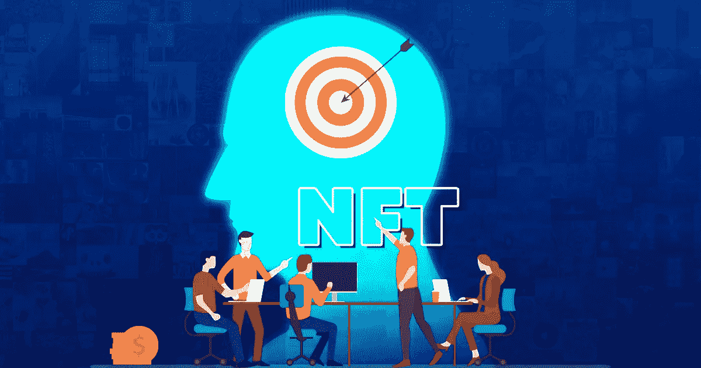

# 对 NFT 影响者营销的分析是在你的 NFT 业务中实施的最佳策略。

> 原文：<https://medium.com/geekculture/an-analysis-of-nft-influencer-marketing-is-the-best-strategy-to-implement-in-your-nft-business-40a6d3297870?source=collection_archive---------13----------------------->

不可替代代币的出现是一个特殊的证明，证明我们仍有希望拥有一个更美好的未来。NFT 是你可以用来打击资本主义的最好武器之一，因为它已经不断证明了与有技能和知识的人站在一起。例如，如果你是一个有抱负的艺术家，你可以用你的艺术技巧铸造一个 NFT，并以它的价值进行交易，而不必等待第三方。这就是你在处理不可替代的代币时获得的那种自由。它给你所有的自由和权力，让你拥有成功的职业生涯。然而，如果你不更有效地推销你的收藏品，你将无法从中获得最大的利益。现在让我们看看营销策略的重要性。

# **实施营销策略。**

即使你有非常有价值的商品，如果你不知道如何以一种吸引众多人的方式给它们打上品牌，你也不能从中获得足够的利润。简而言之，这就是营销策略的重要性。当一个人知道如何以及何时讲笑话时，即使是最蹩脚的笑话，人们也会忍俊不禁。即使是我们在 Instagram 上看到的最老套的帖子，当它与我们此刻所处的情况相关时，也会给我们很大的打击。这就是正确传递的力量。同样，在销售方面，几乎一切都取决于你的营销策略。你的营销方法越有效，你的产品的品牌价值就越高，就这么简单。

# **NFT 营销策略**

当谈到营销不可替代的代币时，你不能总是依赖人们一起使用多年的旧策略。从逻辑上来说，NFTs 出现才几年，当你使用同样的旧策略时，增加你的销售和营销你的品牌价值的机会更少。你需要不断提出和测试新的营销技术，以确保你的品牌达到它需要的高度，同时仍然增加你的产品的销售。对新策略需求的增加是你不能用试错法冒险的原因。

# **不同的营销策略**

说到产品的有效品牌推广，你可以采用不同的策略。根据你销售的产品不同，你采用的方法也不同。因此，您不能对所有产品使用相同的过程并期望相同的结果。每个产品都有自己的制胜策略，找到它们是有效营销最关键的部分。这里有一些最好的制胜策略，已经被证明能一次又一次地产生巨大的效果。

*   公关管理
*   内容营销
*   不和谐营销
*   视频创作营销
*   搜索引擎优化
*   直播带货

虽然有多种营销技巧可以使用，但最适合 NFTs 的是影响者营销。从统计数据来看，这种策略在很短的时间内获得了更多的受众，并增加了 NFT 的销量。首先，现在让我们讨论一下什么是 [NFT 影响者营销](https://bit.ly/3uXm8zJ)。

# **影响者营销——到底是什么？**

影响者营销是一种营销技巧，你利用名人和名人的影响力来赢得观众，增加你的产品或服务的品牌价值。影响者营销的最好例子是利用男孩乐队 One Direction 的成员为碳酸饮料百事可乐打品牌。当哈里·斯泰尔斯和赞恩·马里克请你喝百事可乐的时候，他们的粉丝不可能忽视它。你可能也注意到了当代伟大的足球运动员克里斯蒂亚诺·罗纳尔多(Cristiano Ronaldo)的可口可乐事件，该事件在几分钟内导致其市场崩溃。这足以证明理解世界上影响者的力量。

# **不可替代代币领域的影响者营销**

一次又一次，我们看到影响者在品牌和销售产品的过程中扮演的重要角色。由于 NFT 是数字世界的新手，所以让人们知道他们是什么以便投资他们是很重要的。当你使用 SEO 或内容营销等其他营销技术时，你只能在人们希望被接触到的时候接触到他们。然而，当你用一个有影响力的人来宣传你的服务时，你可以放心，因为你知道无论如何它都会影响到人们。例如，如果你让泰勒·斯威夫特成为你的品牌大使来销售你的产品，你可以很容易地快速而毫不费力地找到进入斯威夫特们心中的路。它让你比其他策略更快地获得人们的注意。

# **最后说，**

没有什么比从一个人最喜欢的人嘴里说出来的话更快地到达他的头脑和心灵。这个简单的心理技巧在营销中大有用武之地。如果你不相信自己的营销技巧，最好向潜在的 [NFT 影响者营销服务](https://bit.ly/3uXm8zJ)提供商寻求帮助，以促进你的业务。但是，请确保您信任潜在的解决方案提供商，以获得最佳结果。