# 一种构建在线新闻发布系统的方法

> 原文：<https://medium.com/geekculture/an-approach-to-build-an-online-news-distribution-system-acda2aa8059b?source=collection_archive---------1----------------------->


Photo by [Markus Winkler](https://unsplash.com/@markuswinkler?utm_source=unsplash&utm_medium=referral&utm_content=creditCopyText) on [Unsplash](https://unsplash.com/s/photos/news?utm_source=unsplash&utm_medium=referral&utm_content=creditCopyText)

## 怎样才能轻松提升自己的新闻阅读体验？

新闻一直是我们社会中非常重要的一部分。在过去，我们主要依靠新闻频道和报纸来获取信息和更新自己。目前，在快节奏的世界中，新闻媒体和机构已经开始使用互联网来接触读者。事实证明，这一尝试非常有帮助，因为它让书屋扩大了读者群。

在当今世界，有许多媒体渠道，因此，很容易确定，由于繁忙的生活日程，一个人不可能去所有的渠道收集新闻。此外，每个媒体渠道对每个故事的报道都不一样。一些读者喜欢比较不同的故事，从不同的角度阅读同一个故事，以获得对一个事件的全面了解。所有这些需求都可以通过一种目前越来越流行的应用程序来解决，这就是在线新闻发布应用程序。这些应用程序旨在从多个来源收集新闻，并作为提要提供给用户。在本文中，我们将研究构建这样一个应用程序的方法。

## 这个想法

这种应用程序的主要组成部分当然是新闻。我使用了印度四家最受欢迎的媒体公司作为应用程序的来源。所有的媒体都有自己的网站，我们从那里收集标题链接和故事。我们将使用[提取文本摘要](https://towardsdatascience.com/understanding-automatic-text-summarization-1-extractive-methods-8eb512b21ecc)从 3 到 5 个句子的故事中提取要点。我们会将收集到的信息与来源一起存储，即出版媒体的名称、日期、时间和故事的标题。每个按日期排序的文件将给出该特定日期的提要。

现在，我们可以从故事标题中提取另一条信息，即故事的主题。每个标题都有一些相关的信息，它可能是一个人的名字，一个国家，一个组织，或任何重要的话题，例如，新冠肺炎。名字或主题大多是故事的主题。我们将从标题中提取这些感兴趣的单词，并将它们用作相应故事的标签或标记。我们将把这些标签和标题一起保存在文件中。

不同类型的用户可以使用一个应用程序，因此，我们必须创建一个过滤或推荐机制，根据用户的兴趣定制他/她的提要。为此，我们需要创建一个登录系统，单独记录每个用户阅读的故事类型，并根据他/她的帐户向他/她推荐。我们将维护一个数据库，其中包含用户的姓名，电子邮件，电话号码(可选)和密码。这封邮件将是我们唯一的钥匙。

我们还将维护两个 JSON 文件，一个记录每个用户阅读的故事和相应的标签。在这种情况下，我们使用用户的电子邮件作为密钥。标签会不断告诉我们用户感兴趣的主题。另一个文件记录阅读故事的用户。在这个文件中，我们形成了一个唯一的密钥，格式如下:

> 出版社+$+出版日期+$+故事标题

这个惟一的键将被用作我们的 JSON 文件中的键。每个键都有阅读这个故事的用户的电子邮件。这背后的想法是，用户文件中附加到每封电子邮件的标签将允许我们进行[基于内容的推荐](https://towardsdatascience.com/introduction-to-recommender-systems-1-971bd274f421)，如果我们一起使用这两个文件，我们可以创建一个完整的用户-项目交互矩阵，该矩阵可用于创建基于协作过滤的推荐。

现在，我们可以向用户提供三种类型的新闻发布:

1.  最新饲料:每天的新鲜饲料
2.  最受欢迎的故事
3.  定制提要:可能包含最近 2-3 天未访问的提要，但将根据用户的兴趣进行调整。

值得注意的一件事是，最新的提要既没有调优，也不是最受欢迎的，但它仍然是必不可少的，以确保所有的故事都到达用户手中，并确保一点随机性，否则整个事情将过于偏颇。最新的故事将仅是当前日期的提要。我们将使用 JSON 文件来获取每个故事的流行度，该文件包含了所有访问过该故事的用户的电子邮件记录。一个故事的受欢迎程度就是这个故事的电子邮件记录的总长度。

接下来我们必须做的是，添加一个搜索选项。作为读者，我们经常想阅读某个特定的主题。该选项将帮助我们的用户使用该功能。

最后，我们需要给出一个“相似故事”选项。如果我们访问一个电子商务网站，如果我们购买一种产品，它会向我们展示类似的产品，以方便用户浏览。我们将使用类似的功能。如果用户选择阅读一个特定的故事，我们会向他/她展示类似的故事，以使他/她的体验更好。

我们已经看到了整个想法，现在，让我们进入应用部分。

## 应用

我们先来看看新闻网站是什么样子的，怎么才能轻松的刮到需要的数据。

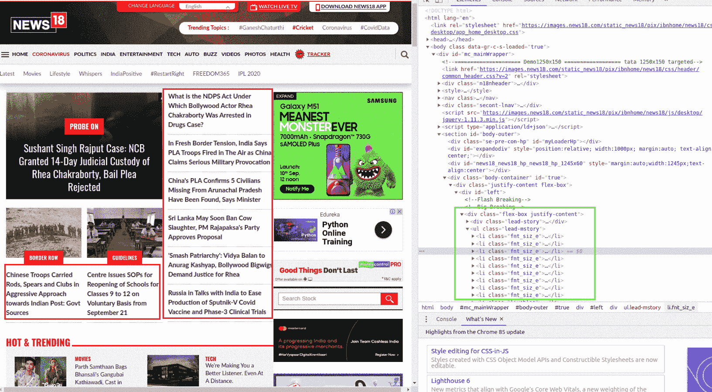

上图用红色显示了故事标题，用绿色显示了 HTML 脚本中相应的链接。我们将需要从代码中提取新闻故事链接，并转到故事中提取它们。

```
from bs4 import BeautifulSoup
import requestsdef News_18_scraper():
    URL="[https://www.news18.com/](https://www.news18.com/)"
    r=requests.get(URL)
    #print(r)
    soup = BeautifulSoup(r.content,'html5lib')  
    #print(soup)
    heads={}
    sub= soup.find('div',attrs={'class': 'lead-story'})
    #print(sub)
    rows=sub.findAll('p')
    #print(rows)
    for row in rows:

        head=row.text
        heads[head]={}
        heads[head]['Source']='News18'
        #print(head)
        #print(row.a["href"])
        heads[head]['link']=row.a["href"]

    sub= soup.find('ul',attrs={'class': 'lead-mstory'})
    rows=sub.findAll('li')
    for row in rows:
        head=row.text
        heads[head]={}
        heads[head]["Source"]='News18'
        heads[head]["link"]=row.a["href"]

    return heads
```

上面这段代码用于提取这个特定媒体机构的新闻故事的链接。

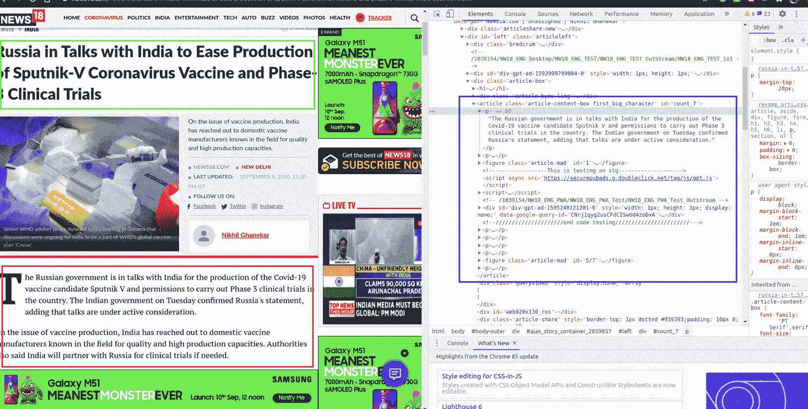

上图显示了故事网页的外观。它用绿色显示故事的标题，用红色显示故事，用蓝色显示源代码中的故事。我们需要搜集所有需要的数据。

```
def extractor_n18(news):
    for n in news.keys():
        #print(n)
        link=news[n]['link']

        r=requests.get(link)
        #print(link)

        soup = BeautifulSoup(r.content, 'html5lib')
        Briefs=[]
        #print(link)
        #print(soup)
        sub=soup.find("title")
        news[n]['Titles']=[sub.text]
        tit=sub.text
        flag=0
        try:
            flag=1
            text=""
            sub=soup.find('div',{'class':'lbcontent paragraph'})
            #print(sub)
            text+=sub.text+"\n"
            sub_2=soup.find('div',{'id':'article_body'})
            text+=sub_2.text
            summary=summarizer(text)
           #print(summary)
            #print(text)
        except:
            flag=0
            i=1

        if flag==0:
            text=""
            try:
                sub=soup.find('article',{'class':'article-content-box first_big_character'})
                rows=sub.findAll('p')
                for row in rows:
                    text+=row.text+"\n"
                summary=summarizer(text)

            except:
                summary=tit
        #print(summary)
        news[n]['gists']=summary
        date=datetime.today().strftime('%Y-%m-%d')
        time=str(datetime.now().time())

        news[n]['Date']=date
        news[n]['Time']=time

    return news
```

上面的代码可以用来为新闻机构提取故事。

我已经创建了自己的文本摘要使用网页排名算法。

```
def pagerank(text, eps=0.000001, d=0.85):
    score_mat = np.ones(len(text)) / len(text)
    delta=1
    while delta>eps:
        score_mat_new = np.ones(len(text)) * (1 - d) / len(text) + d * text.T.dot(score_mat)
        delta = abs(score_mat_new - score_mat).sum()
        score_mat = score_mat_newreturn score_mat_new
```

上面的代码展示了页面排名算法。我将在最后提供完整代码的链接。

现在，我们有四个这样的新闻来源。我们必须一个一个地搜集所有的，然后在数据库中编译。

```
import pandas as pd
def Merge(dict1, dict2, dict3, dict4): 
    res = {**dict1, **dict2, **dict3, **dict4} 
    return resdef file_creater(date):
    news_times=times_now_scraper()
    times_now=extract_news_times(news_times)
    news_rep=republic_tv_scraper()
    republic_tv=extract_news_rep(news_rep)
    news_it=india_today_scraper()
    india_today=extractor_it(news_it)
    n_18=News_18_scraper()
    News_18=extractor_n18(n_18)

    Merged=Merge(times_now,republic_tv,india_today,News_18)

    Merged_df=pd.DataFrame(Merged)
    Merged_df_final=Merged_df.transpose()
    df_final=Merged_df_final.reset_index()
    df_final_2=df_final.drop(['index'],axis=1)
    df_final_2.to_csv('feeds/Feed_'+date+'.csv',index=False)
    get_names('feeds/Feed_'+date+'.csv')

    return df_final_2
```

上面的代码一起获得所有的新闻，并为传递的日期形成一个数据 csv 文件。

get_names()函数使用 Spacy 库的命名实体识别特性从故事标题中提取名称或主题。

在完整的处理之后，我们获得一个包含每个日期的提要文件的 CSV。

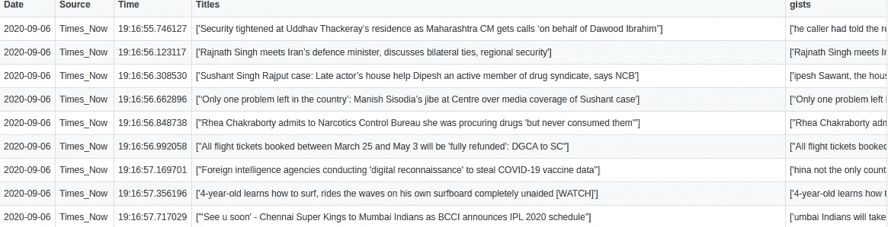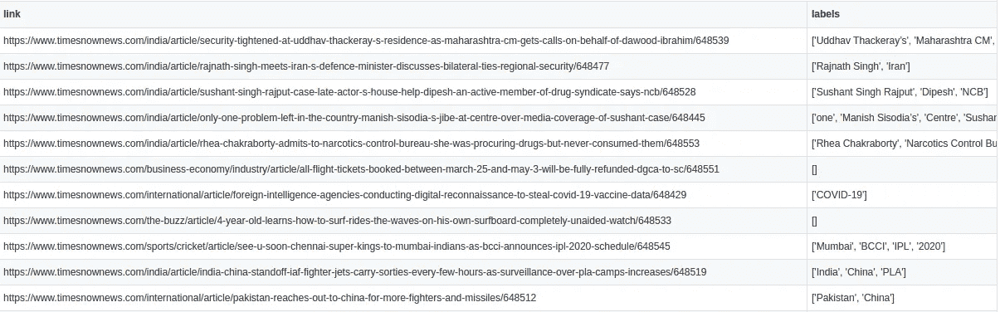

上面的图片描述了我们的新闻文件数据库的样子。

接下来，我们来看用户控制部分。它从登录和注册页面开始。

```
import pandas as pd
def signup():
    Name=input("Name:")
    Email=input("Email:")
    Phone=input("Phone:")
    Password=input("Password:")
    Con_password=input("Confirm Password:")
    if Con_password!=Password:
        print("Passwords don't match. Please Retry")
        signup()
    df=pd.read_csv('user_data.csv')
    df_2=df[df['email']==Email]
    if len(df_2)!=0:
        print("Email already exists try different email")
        signup()

    wr=open('user_data.csv','a')
    wr.write(Name+","+Email+","+Password+","+Phone+"\n")
    wr.close()    
    print("Now please log in")
def login():
    print("1 to Signup, 2 to Login")
    ch=int(input())
    if ch==1:
        signup()
    df=pd.read_csv('user_data.csv')
    Email=input("Email:")
    Pass=input("Pass:")

    df_2=df[df['email']==Email]
    #print(df_2)

    if len(df_2)==0:
        print("Email not found, try again")
        login()

    if str(df_2.iloc[0]['password'])==Pass:
        print("Welcome "+df.iloc[0]['Name'])
        surf(Email)

    else:
        print("Password Wrong, try again")
        login()
```

上面的代码片段处理登录和注册。

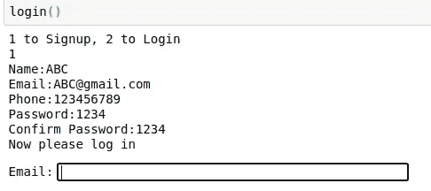

上图展示了注册部分。它有某些检查，如如果电子邮件已经存在，它告诉注册一个不同的电子邮件。

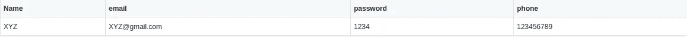

上图显示了用户数据库的结构。现在，让我们看看两个 JSON 文件结构。

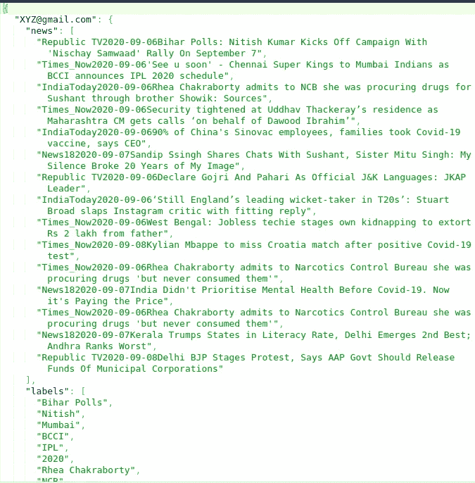

第一个文件 *user_records.json* 如上图所示。正如所讨论的，它显示，我们已经记录了新闻和相应的标签，由电子邮件 XYZ@gmail.com 的用户访问。

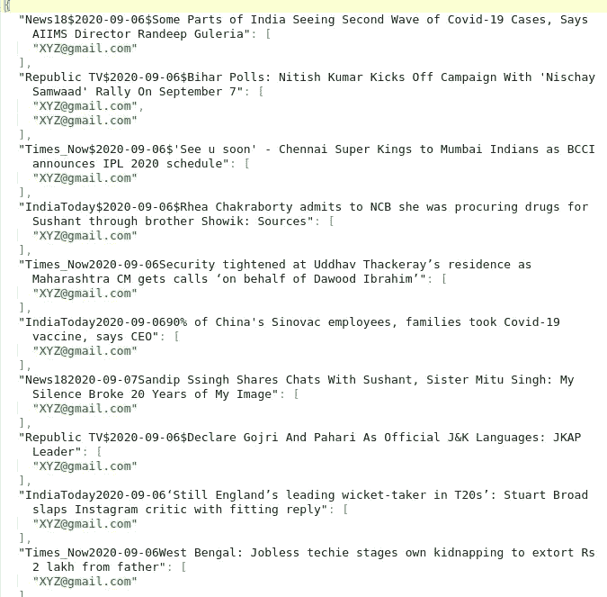

该图显示了我们的第二个文件 *stories_records.json.* 如前所述，它创建了一个键并记录了访问该故事的用户的电子邮件。游客名单的长度为我们提供了故事的受欢迎程度。

现在，让我们回到应用程序的工作上来。

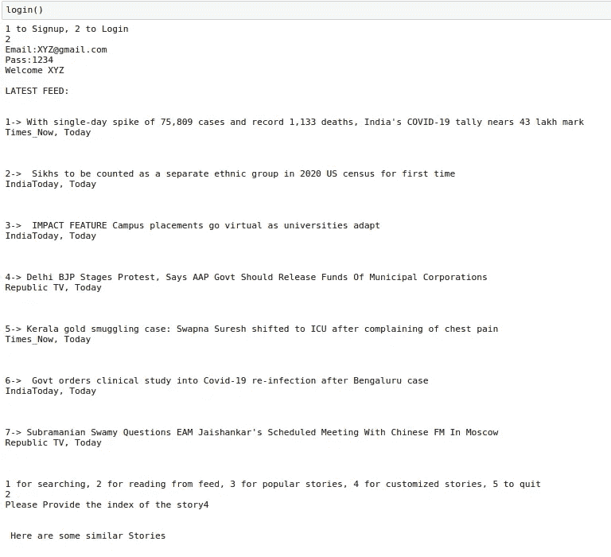

它显示了工作。我们一登录，它就用电子邮件 id 创建一个会话，并根据电子邮件 id 记录操作。它为我们提供了最新的提要，并随后提供了如下选项:

1.  搜索
2.  从提供的提要中阅读
3.  流行故事
4.  定制的故事

如果我们想从提要中读取，它会告诉我们输入索引。它启动所选的故事，并给我们一个类似的故事列表供我们选择。

对于相似的故事，我只是在经过一些预处理后，根据与所选故事标题的余弦相似性对故事标题进行了排序。需要记住的一点是，我们将只在最近连续 3 天使用订阅源，也就是说，如果用户在 4 日使用应用程序，我们的订阅源将有 2 日至 4 日的数据。这将阻止我们的应用程序显示超旧的提要，并减少计算。

```
from nltk.tokenize import sent_tokenize, word_tokenize 
def clean_sentence(sentence):
    #extracts=sent_tokenize(article)
    sentences=[]

    #print(extract)
    clean_sentence=sentence.replace("[^a-zA-Z0-9]"," ")   ## Removing special characters
    #print(clean_sentence)
    obtained=word_tokenize(clean_sentence) 
    #print(obtained)
    sentences.append(obtained)return sentence
import nltk
nltk.download('punkt')
nltk.download('stopwords')
from nltk.cluster.util import cosine_distance
def get_similarity(sent_1,sent_2,stop_words):

  sent_1=[w.lower() for w in sent_1]
  sent_2=[w.lower() for w in sent_2]total=list(set(sent_1+sent_2)) ## Removing duplicate words in total setvec_1= [0] * len(total)
  vec_2= [0] * len(total)## Count Vectorization of two sentences
  for w in sent_1:
      if w not in stop_words:
      vec_1[total.index(w)]+=1for w in sent_2:
    if w not in stop_words:
     vec_2[total.index(w)]+=1return 1-cosine_distance(vec_1,vec_2)
```

上述代码用于预处理数据并获得余弦相似度。这些代码删除任何特殊字符，将所有内容转换为小写，并且还删除了停用词。

接下来，我们移动到搜索部分。用户输入一个主题，我们将选择该主题，并再次分别获得与故事标题的余弦相似度，并按非递增顺序对它们进行排序，以获得搜索结果。我们可能使用了标签，但它们不是手动提取的，因此可能会导致性能下降。

```
def search(email,df):
    clear()
    search=input("search")
    df_temp=df
    sim=[]
    for i in range(len(df)):
        try:
            title=ast.literal_eval(df.iloc[i]['Titles'])[0]
            cleaned_1=clean_sentence(search)
            cleaned_2=clean_sentence(title)
            stop_words = stopwords.words('english')
            s=get_similarity(cleaned_1,cleaned_2,stop_words)
            if s<0.95:
                sim.append(s)
            else:
                sim.append(0)
        except:
            sim.append(0)

    df_temp['Sim']=sim
    df_temp.sort_values(by=['Sim'], inplace=True,ascending=False)
    #print(df_temp.head())
    print("\n\n Top 5 Results \n")
    for i in range(5):

            res = ast.literal_eval(df_temp.iloc[i]['Titles']) 
            print(str(i+1)+"-> "+res[0])
            print(df_temp.iloc[i]['Source']+" , "+df_temp.iloc[i]['Date'])

            print('\n\n')

    ind=int(input("Please Provide the index of the story"))
        #print(str(stories_checked.iloc[indices[ind-1]]['link']))

            #ind=int(input("Please Provide the index of the story"))
    webbrowser.open(df_temp.iloc[ind-1]['link'])
    time.sleep(3)

    try:

            file_u = open('user_records.json')
            users=json.load(file_u)if email not in users.keys():
                users[email]={}

                users[email]['news']=[df_temp[ind-1]['Source']+df_temp.iloc[ind-1]['Date']+ast.literal_eval(df_temp.iloc[ind-1]['Titles'])[0]]
                lab=[z for z in ast.literal_eval(df_temp.iloc[ind-1]['labels'])]
                users[email]['labels']=lab
            else:
                users[email]['news'].append(df_temp.iloc[ind-1]['Source']+df_temp.iloc[ind-1]['Date']+ast.literal_eval(df_temp.iloc[ind-1]['Titles'])[0])
                lab=[z for z in ast.literal_eval(df_temp.iloc[ind-1]['labels'])]
                for l in lab:
                    users[email]['labels'].append(l)

            with open("user_records.json", "w") as outfile: 
                json.dump(users, outfile)

            file_s = open('story_records.json')
            stories=json.load(file_s)
            key=df_temp.iloc[ind-1]['Source']+df_temp.iloc[ind-1]['Date']+ast.literal_eval(df_temp.iloc[ind-1]['Titles'])[0]if key not in stories.keys():stories[key]=[email]
            else:
                stories[key].append(email)with open("story_records.json", "w") as outfile: 
                json.dump(stories, outfile)
```

以上代码用于搜索。该函数接收电子邮件和我们需要搜索的新闻数据库。

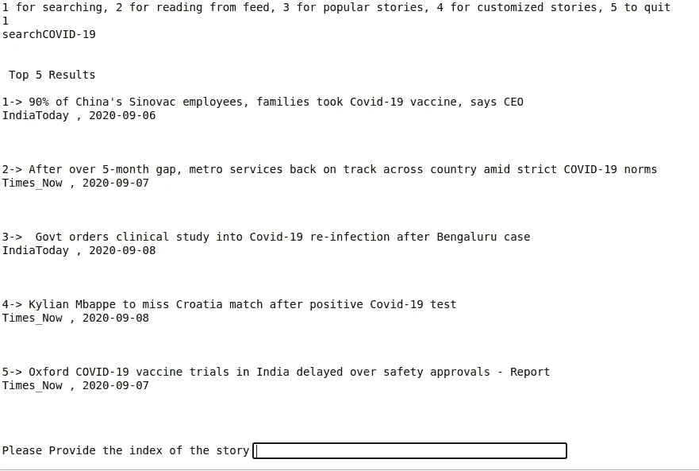

上图显示了搜索功能。如果我们搜索新冠肺炎，应用程序会给出 5 个与新冠肺炎最匹配的媒体机构和出版日期。

**基于内容的过滤**

我们不会完全使用基于内容的过滤。我们只是要用这个方法背后的想法。我们将从 JSON 文件中提取用户访问过的标签。我们将只考虑最近访问的 20 个标签，因为如果我们考虑更多，推荐将不会随着用户兴趣的改变而改变。接下来，我们将比较用户查看的标签和各个故事的标签之间的重叠，并将推荐前 10 个重叠。现在，需要注意的一点是，我们不会显示用户已经看过的故事，我们会在外部将重叠设置为 0，以防止这种情况发生。我们可以从 story_records.json 文件中获取信息。

为了检查故事标签的相似性，我们将再次使用余弦相似性。有一点要注意的是每次我们都是用计数矢量化的方法来获得相似度。

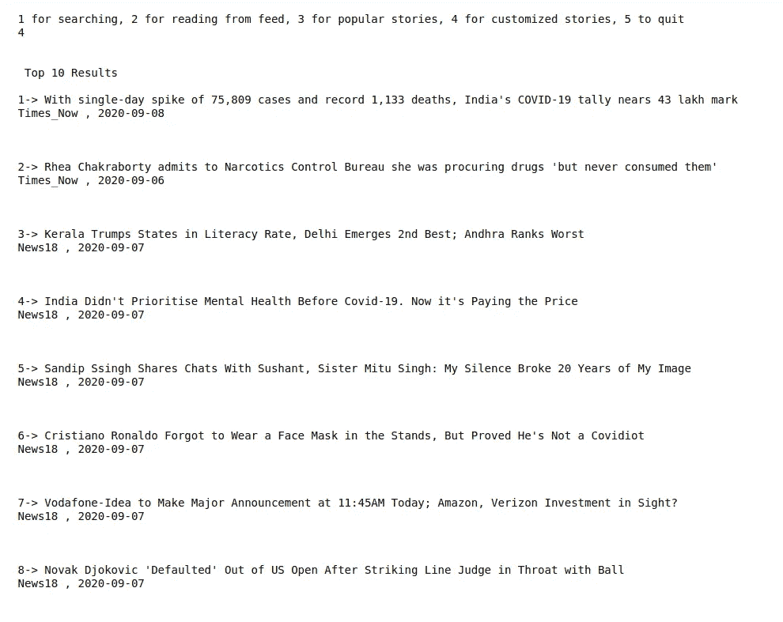

该图显示了自定义故事功能的应用。

这几乎概括了整个应用程序描述和应用程序。

## 结果

上面的视频提供了该应用程序的简短演示。

## 结论

我们已经看到了如何开发在线新闻发布应用程序。

github 链接在这里是。

希望这有所帮助。