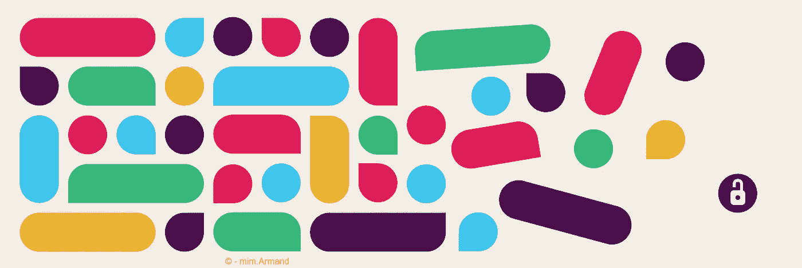

# 建筑缺乏松弛感。

> 原文：<https://medium.com/geekculture/an-architectural-lack-in-slack-620d0ec8c1c7?source=collection_archive---------17----------------------->

## 技术决策失误的一个例子。

## Slack APIs 很棒，但是即使在伟大的架构中也存在问题。

# 借口:

不要误会我！Slack 在 API 和集成架构方面有一些最棒的设计。他们的系统(大部分)非常好，有时…