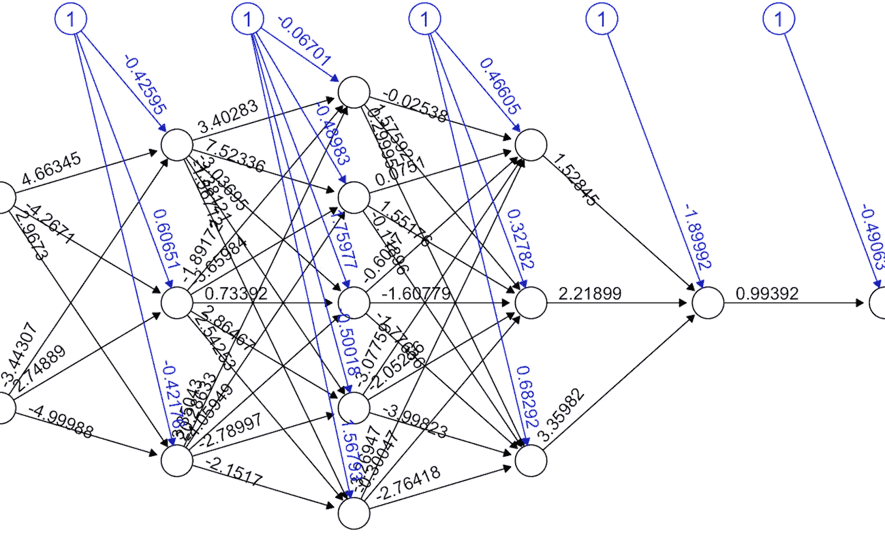
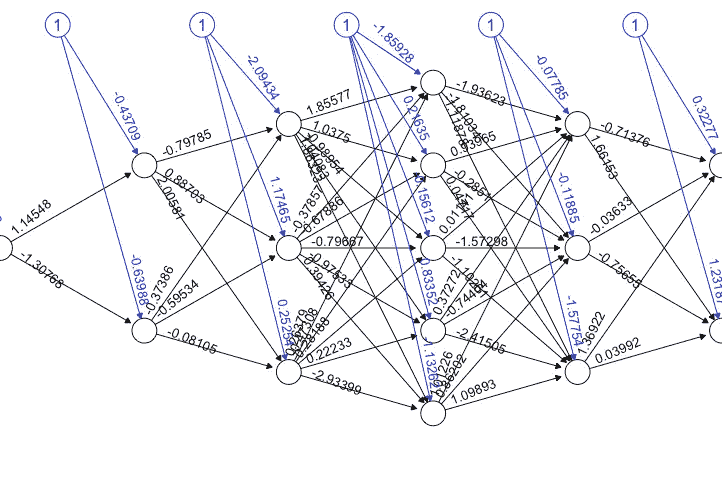
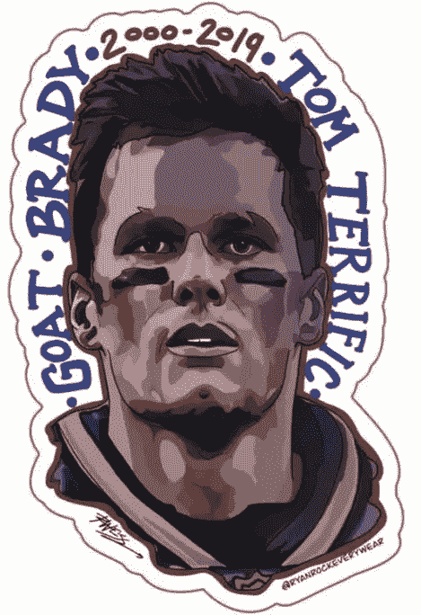

# 一种人工神经网络方法在超级碗比赛中的应用:

> 原文：<https://medium.com/geekculture/an-artificial-neural-network-approach-in-r-to-super-bowl-lv-result-d18846bae947?source=collection_archive---------18----------------------->

## 家庭因素有责任吗？或者归咎于山羊。


The GOAT or a goat?

# 介绍

超级碗 LV 可以说是今年迄今为止最伟大的体育赛事之一。坦帕湾海盗队与堪萨斯城酋长队之间的战斗被宣布为一个重大的博彩事件，几乎所有的博彩网站和专家都指出堪萨斯城酋长队以-3 的差距赢得了超级碗 LV。(如果你不熟悉博彩，这意味着酋长队预计至少会以一个净胜球获胜)

# 动机

作为一名数据科学家和 NFL 球迷(Go Bills！！！)，我已经研究了一些预测模型有一段时间了，但从来没有时间坐下来从分析的角度分析一个过去的结果。所以我决定搜索一个数据库，至少可以给我所有 NFL 比赛的结果，我也有兴趣尝试确定坦帕湾的主场因素是否确实是比赛结果的主要影响因素。幸运的是，我在 Kaggle 找到了一个非常完整的[数据集](https://www.kaggle.com/tobycrabtree/nfl-scores-and-betting-data/metadata)，它包含了我想要的所有数据，甚至更多。

# 回归神经网络

我决定，作为我的模型的主要结果，我希望有一个简单的赢家预测，以及每个团队在游戏中得分的预测。因此回归人工神经网络是显而易见的选择，因为它预测作为输入函数的输出变量。特征输入可以是数值或分类值以及数值因变量。

# 数据准备

我要做的第一件事是稍微清理一下数据库，并修改这些年来发生变化的团队名称:

```
setwd("~/Documents/My Projects/nfl_data")
nfl <- read.csv("spreadspoke_scores.csv", stringsAsFactors=F)
nfl$schedule_date<-as.Date(nfl$schedule_date, "%m/%d/%Y")
*#Copy Data*
newdata <- data.table(nfl$score_home, nfl$score_away, nfl$team_home, nfl$team_away)
*#Rename Columns*
names(newdata)[1]<-"scorehome"
names(newdata)[2]<-"scoreaway"
names(newdata)[3]<-"home"
names(newdata)[4]<-"away"
*#Rename Teams Home*
newdata$home[newdata$home == "St. Louis Cardinals"] <- "Arizona Cardinals"
newdata$home[newdata$home == "Phoenix Cardinals"] <- "Arizona Cardinals"
newdata$home[newdata$home == "Baltimore Colts"] <- "Indianapolis Colts"
newdata$home[newdata$home == "Boston Patriots"] <- "New England Patriots"
newdata$home[newdata$home == "Houston Oilers"] <- "Tennessee Titans"
newdata$home[newdata$home == "Tennessee Oilers"] <- "Tennessee Titans"
newdata$home[newdata$home == "Las Vegas Raiders"] <- "Oakland Raiders"
newdata$home[newdata$home == "Los Angeles Raiders"] <- "Oakland Raiders"
newdata$home[newdata$home == "San Diego Chargers"] <- "Los Angeles Chargers"
newdata$home[newdata$home == "St. Louis Rams"] <- "Los Angeles Rams"
newdata$home[newdata$home == "Washington Redskins"] <- "Washington Football Team"newdata$home[newdata$home == "Arizona Cardinals"] <- "Cardinals"
newdata$home[newdata$home == "Atlanta Falcons"] <- "Falcons"
newdata$home[newdata$home == "Baltimore Ravens"] <- "Ravens"
newdata$home[newdata$home == "Buffalo Bills"] <- "Bills"
newdata$home[newdata$home == "Carolina Panthers"] <- "Panthers"
newdata$home[newdata$home == "Chicago Bears"] <- "Bears"
newdata$home[newdata$home == "Cincinnati Bengals"] <- "Bengals"
newdata$home[newdata$home == "Cleveland Browns"] <- "Browns"
newdata$home[newdata$home == "Dallas Cowboys"] <- "Cowboys"
newdata$home[newdata$home == "Denver Broncos"] <- "Broncos"
newdata$home[newdata$home == "Detroit Lions"] <- "Lions"
newdata$home[newdata$home == "Green Bay Packers"] <- "Packers"
newdata$home[newdata$home == "Houston Texans"] <- "Texans"
newdata$home[newdata$home == "Indianapolis Colts"] <- "Colts"
newdata$home[newdata$home == "Jacksonville Jaguars"] <- "Jaguars"
newdata$home[newdata$home == "Kansas City Chiefs"] <- "Chiefs"
newdata$home[newdata$home == "Los Angeles Chargers"] <- "Chargers"
newdata$home[newdata$home == "Los Angeles Rams"] <- "Rams"
newdata$home[newdata$home == "Miami Dolphins"] <- "Dolphins"
newdata$home[newdata$home == "Minnesota Vikings"] <- "Vikings"
newdata$home[newdata$home == "New England Patriots"] <- "Patriots"
newdata$home[newdata$home == "New Orleans Saints"] <- "Saints"
newdata$home[newdata$home == "New York Giants"] <- "Giants"
newdata$home[newdata$home == "New York Jets"] <- "Jets"
newdata$home[newdata$home == "Oakland Raiders"] <- "Raiders"
newdata$home[newdata$home == "Philadelphia Eagles"] <- "Eagles"
newdata$home[newdata$home == "Pittsburgh Steelers"] <- "Steelers"
newdata$home[newdata$home == "San Francisco 49ers"] <- "49ers"
newdata$home[newdata$home == "Seattle Seahawks"] <- "Seahawks"
newdata$home[newdata$home == "Tampa Bay Buccaneers"] <- "Buccaneers"
newdata$home[newdata$home == "Tennessee Titans"] <- "Titans"
newdata$home[newdata$home == "Washington Football Team"] <- "Redskins"*#Rename Teams Away*
newdata$away[newdata$away == "St. Louis Cardinals"] <- "Arizona Cardinals"
newdata$away[newdata$away == "Phoenix Cardinals"] <- "Arizona Cardinals"
newdata$away[newdata$away == "Baltimore Colts"] <- "Indianapolis Colts"
newdata$away[newdata$away == "Boston Patriots"] <- "New England Patriots"
newdata$away[newdata$away == "Houston Oilers"] <- "Tennessee Titans"
newdata$away[newdata$away == "Tennessee Oilers"] <- "Tennessee Titans"
newdata$away[newdata$away == "Las Vegas Raiders"] <- "Oakland Raiders"
newdata$away[newdata$away == "Los Angeles Raiders"] <- "Oakland Raiders"
newdata$away[newdata$away == "San Diego Chargers"] <- "Los Angeles Chargers"
newdata$away[newdata$away == "St. Louis Rams"] <- "Los Angeles Rams"
newdata$away[newdata$away == "Washington Redskins"] <- "Washington 
Football Team"newdata$away[newdata$away == "Arizona Cardinals"] <- "Cardinals"
newdata$away[newdata$away == "Atlanta Falcons"] <- "Falcons"
newdata$away[newdata$away == "Baltimore Ravens"] <- "Ravens"
newdata$away[newdata$away == "Buffalo Bills"] <- "Bills"
newdata$away[newdata$away == "Carolina Panthers"] <- "Panthers"
newdata$away[newdata$away == "Chicago Bears"] <- "Bears"
newdata$away[newdata$away == "Cincinnati Bengals"] <- "Bengals"
newdata$away[newdata$away == "Cleveland Browns"] <- "Browns"
newdata$away[newdata$away == "Dallas Cowboys"] <- "Cowboys"
newdata$away[newdata$away == "Denver Broncos"] <- "Broncos"
newdata$away[newdata$away == "Detroit Lions"] <- "Lions"
newdata$away[newdata$away == "Green Bay Packers"] <- "Packers"
newdata$away[newdata$away == "Houston Texans"] <- "Texans"
newdata$away[newdata$away == "Indianapolis Colts"] <- "Colts"
newdata$away[newdata$away == "Jacksonville Jaguars"] <- "Jaguars"
newdata$away[newdata$away == "Kansas City Chiefs"] <- "Chiefs"
newdata$away[newdata$away == "Los Angeles Chargers"] <- "Chargers"
newdata$away[newdata$away == "Los Angeles Rams"] <- "Rams"
newdata$away[newdata$away == "Miami Dolphins"] <- "Dolphins"
newdata$away[newdata$away == "Minnesota Vikings"] <- "Vikings"
newdata$away[newdata$away == "New England Patriots"] <- "Patriots"
newdata$away[newdata$away == "New Orleans Saints"] <- "Saints"
newdata$away[newdata$away == "New York Giants"] <- "Giants"
newdata$away[newdata$away == "New York Jets"] <- "Jets"
newdata$away[newdata$away == "Oakland Raiders"] <- "Raiders"
newdata$away[newdata$away == "Philadelphia Eagles"] <- "Eagles"
newdata$away[newdata$away == "Pittsburgh Steelers"] <- "Steelers"
newdata$away[newdata$away == "San Francisco 49ers"] <- "49ers"
newdata$away[newdata$away == "Seattle Seahawks"] <- "Seahawks"
newdata$away[newdata$away == "Tampa Bay Buccaneers"] <- "Buccaneers"
newdata$away[newdata$away == "Tennessee Titans"] <- "Titans"
newdata$away[newdata$away == "Washington Football Team"] <- "Redskins"
```

之后，只需要将团队名称转换成因子，最后，将它们转换成名称(原文如此。)到 One hot vector，无论是主场还是客场。

```
*#Convert to Factors*
newdata$home <- as.factor(newdata$home)
newdata$away <- as.factor(newdata$away)*#Data Prep* 
*#One Hot*
nflnew <- one_hot(as.data.table(newdata))
*#Normalization - ScoreHome* 
nflnew$scorehome = nflnew$scorehome/100
*#Normalization - ScoreAway* 
nflnew$scoreaway = nflnew$scoreaway/100
*#Result Variable*
nflnew$result = (nflnew$scorehome-nflnew$scoreaway)
nflnew <- nflnew[-c(12947)]
```

还需要删除最后一行，因为那是 SBLV 行。

# 为第一个人工神经网络建模

然后是时候开始为第一个 ANN 建模了，这个 ANN 可以预测游戏的最终结果。让我们从从整个数据库创建一个训练和测试子集开始。

```
*#Train and Test Datasets*
nfl_data_train <- sample_frac(tbl = nflnew, replace = FALSE, size = 0.5)
nfl_data_test <- anti_join(nflnew, nfl_data_train)
```

模型

```
nfl_nn1 <- neuralnet(result ~ scorehome + scoreaway, data = nfl_data_train, hidden = c(3,5,3,1), err.fct = "sse",threshold = 1, 
                     act.fct = "logistic", learningrate=.05,rep = 100, linear.output = TRUE)

*#Plot ANN*
plot(nfl_nn1, rep = 'best')
```

我选择 3，5，3，因为决定使用两个输入变量(score_home 和 score_away 来预测比赛结果)，考虑到数据集的大小，这种方法被证明是最佳选择。



ANN1: Modeling the Game Outcome.

# 首次预测

所以为了预测比赛的最终结果，我不得不使用两个标准来计算两个队的平均得分，当他们在主场或客场比赛时。

```
*#Filter Superbowl Teams*
tampahome <- filter(nfl, team_home == "Tampa Bay Buccaneers")
kansasaway <- filter(nfl, team_away == "Kansas City Chiefs")
tampaaway <- filter(nfl, team_away == "Tampa Bay Buccaneers")
kansashome <- filter(nfl, team_home == "Kansas City Chiefs")
*#Create Prediction by Mean Scores Home vs Away*
a <- mean(tampahome$score_home, na.rm = TRUE)
b <- mean(kansasaway$score_away, na.rm = TRUE)
c <- mean(tampaaway$score_away, na.rm = TRUE)
d <- mean(kansashome$score_home, na.rm = TRUE)
HOMESC=c((a/100),(d/100))
AWAYSC=c((b/100),(c/100))
pred=data.frame(HOMESC,AWAYSC)
Predict=compute(nfl_nn1,pred)
Predict$net.result*100##          [,1]
## [1,] 2.499373
## [2,] 2.516295
```

为了将主场因素从等式中分离出来，我计算了两次预测结果，第一种情况:考虑到海盗队主场作战，酋长队客场作战。结果:胜利主队！坦帕湾海盗队。第二种情况:酋长回家，海盗离开。同样的结果。胜利主队队长。所以…可能我的模型显示了主场因素确实在超级碗中发挥了很大作用(因为这是历史上第一次发生)，但我需要尝试一些不同的东西。

如果我只是用正在比赛的队伍来计算比赛的最终比分呢？我们试试吧！

# 建模第二个人工神经网络

因此，首先我从原始数据集中创建了一个子集，只保留了两队之间的冲突以及双方的最终得分。经过训练和测试。这个模型稍微复杂一点，有 64 个输入，hidden=c(1，2，3，5，3，2)和两个输出 score_home，score_away。

第二种模式:



最终运行模型后，是时候计算一些预测了。为此，我创建了两个场景，两个队交换主场和客场的位置。第一种情况。海盗队(主场)，酋长队(客场)。

```
*#Home Buccaners x Away Kansas*
TEAMS=c(0,0,0,0,0,0,1,0,0,0,0,0,0,0,0,0,0,0,0,0,0,0,0,0,0,0,0,0,0,0,0,0,
        0,0,0,0,0,0,0,0,0,1,0,0,0,0,0,0,0,0,0,0,0,0,0,0,0,0,0,0,0,0,0,0)
predclash=data.frame(t(TEAMS))
Predict2=compute(nfl_nn2,predclash)
Predict2$net.result*100##         [,1]     [,2]
## [1,] 22.4899 19.73681
```

结果 22x19！坦帕湾海盗队赢得 SBLV。因此，我需要测试的最后一件事是最后一个场景:酋长队(主场)，海盗队(客场)。

```
*#Home Kansas x Away Buccaneers*
TEAMS=c(0,0,0,0,0,0,0,0,0,1,0,0,0,0,0,0,0,0,0,0,0,0,0,0,0,0,0,0,0,0,0,0,
        0,0,0,0,0,0,1,0,0,0,0,0,0,0,0,0,0,0,0,0,0,0,0,0,0,0,0,0,0,0,0,0)
predclash=data.frame(t(TEAMS))
Predict2=compute(nfl_nn2,predclash)
Predict2$net.result*100##          [,1]     [,2]
## [1,] 19.72894   22.47908
```

结果将是 19x22！坦帕湾仍然会赢，山羊仍然会得到另一枚戒指。

# 结论

我仍然不知道汤姆·布拉迪是山羊，还是新引入的(可能不会很快重复)主场因素可能会影响超级碗的最终结果，我也感谢上帝之前没有给我这个想法，因为我会在这两个模型上投入这么多钱，我仍然会为此哭泣…

# 链接

[超级碗 LV 投注赔率、最大投注额、值得关注的投注额](https://www.vsin.com/super-bowl-lv-betting-odds-biggest-wagers-notable-bets/)

[NFL 比分和投注数据](https://www.kaggle.com/tobycrabtree/nfl-scores-and-betting-data/metadata)

