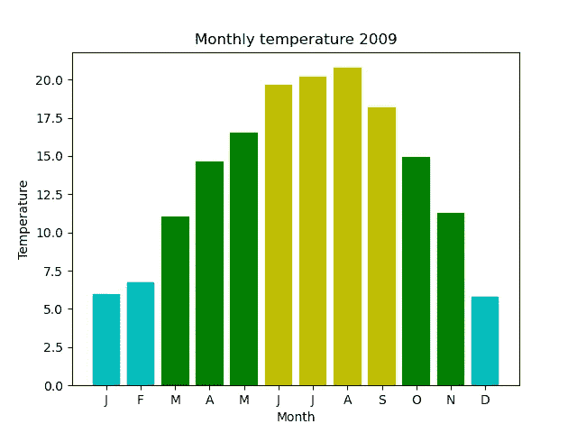

# 简单 Matplotlib 图表集

> 原文：<https://medium.com/geekculture/an-atlas-of-simple-matplotlib-charts-2f6fd32ca4cf?source=collection_archive---------5----------------------->

包括完整的源代码。

这些代码示例使用 Matplotlib 创建各种类型的图形。每个例子都是独立的。它们需要 Matplotlib 和 NumPy。

有关代码的解释，请参见 pythoninformer.com 的文章。

# 数据