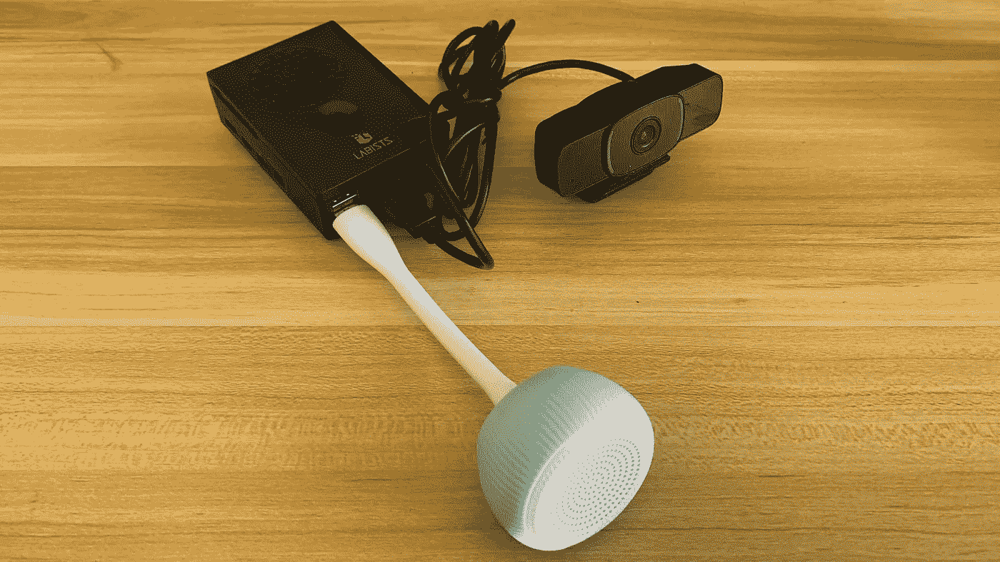

# 一种带示教机的音频垃圾分类树莓皮

> 原文：<https://medium.com/geekculture/an-audio-trash-sorting-raspberry-pi-with-teachable-machine-5cd7f9f8867a?source=collection_archive---------1----------------------->

## 一个低代码、低成本、高科技的垃圾分类顾问

Figure 1\. My audio trash-sorting Raspberry Pi. Image by author.

我们每年在全球产生 20 亿吨生活垃圾。它们给我们的环境带来了沉重的负担。为了减少最终进入垃圾填埋场和环境的垃圾，世界各地的居民都需要对他们的生活垃圾进行分类。还有垃圾分类…