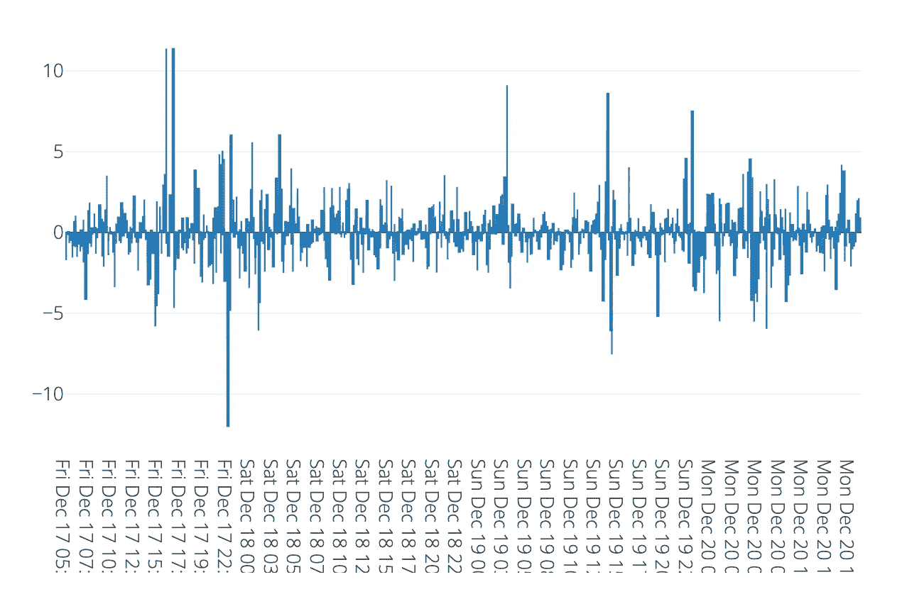
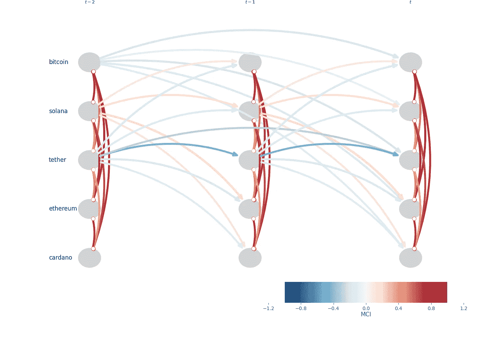
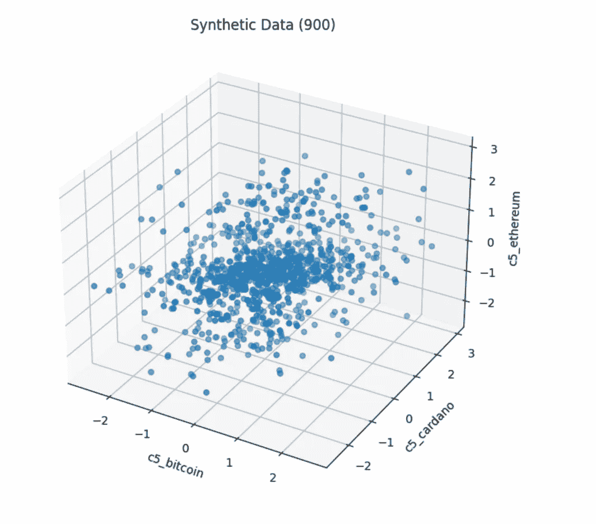
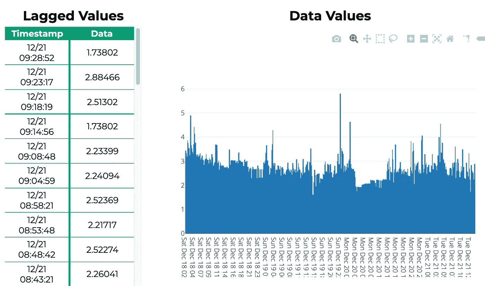
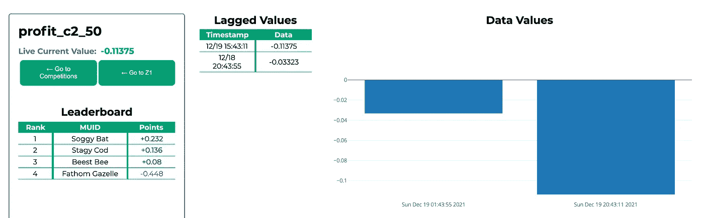

# 一篇没有立即过时的实证文章

> 原文：<https://medium.com/geekculture/an-empirical-article-that-wasnt-immediately-stale-720abfb4678f?source=collection_archive---------2----------------------->

这是很久以前写的一篇短文，试图对抗经验文献中的*繁殖危机*。写于 2021 年。它考虑了以太坊和比特币之间的投资组合分配问题。

Scaled five-minutely log price changes for Bitcoin

# 历史脚注

这里非常缺乏参考资料，因为作者发誓绝不手动修改文章。虽然当你读到这里的时候，这似乎已经司空见惯，但 T2 的繁殖危机才刚刚开始。此前，当时最紧迫的问题并不是缺乏*复制*的工作，而是研究人员无法模仿他人实证研究的历史结果。只是后来，在所谓的可复制性危机被解决之后，人们才明白，没有人真的在乎复制东西。

争论的焦点是懒惰和不耐烦(伟大程序员的三个优点中的两个)，以及在很大程度上，对他人的工作不感兴趣或怀疑工作过度(如果你想要黑客三连胜，就称之为傲慢)。考虑到原作者显然没有准备好这样做，而且很可能做不到这一点(他们最后一次被看到是在他们的 Python 环境中放火)，问为什么有人会费心去检查一个结果是否可以继续下去似乎是合理的。

然而，复制危机的真正驱动力是工具、数据和方法的激增。到 2030 年，随着物联网的成熟，有人可以使用来自 timespan *T* 的数据写一篇关于数据 *D* 的方法 *M* 的使用的经验文章(并期望任何人都会觉得有趣)的想法被认为是荒谬的——更不用说从生态角度来说是不合理的。显然，这只是招致了砍伐树木和实证文章中的数字爆炸。

第一次这样的爆发不是发生在文献中，而是发生在更好阅读的数据科学出版物《走向数据科学》*。这是一个由不满的工程师创造的组合式爱情炸弹，这些工程师厌倦了阅读由努比写的关于预测软件的不加批判的文章。在接下来的一年中，几百万篇自动生成的文章通过了该出版物不存在的编辑过滤器，完全淹没了所有其他建议。*

这不一定是件坏事——事实证明，自动生成的文章比人工生成的文章覆盖了更广泛的数据，在他们的发现中表现出更低的相关性，并且总体上更符合经验。类似的攻击接踵而至，直到最后，事情发展到了一个转折点。

只有归谬法清楚地表明，作者需要以一种不会过时或永远受限的方式传达信息。他们开始撰写文章，复制自己，更新他们的结果，并在他们到达时自动引入新的方法和数据(而不仅仅是向他们的同事展示固定的快照)。他们的文章漫游了一个充满问题的世界，并在这样做的同时改变了自己。

这篇特别的文章并不十分受欢迎，在制作上也不太先进。它早于使连续发布既方便又美观的工具，更不用说一个可用的媒体 API 了。然而，它确实吸引了一小部分读者，这些人已经厌倦了拿起 2005 年写的论文，并想知道“这仍然是真的吗？”。一些人开始怀疑为什么实证论文会存在。

# 当天比特币和以太坊投资组合

如前所述，本文从比特币和以太坊的价格开始。鉴于这些货币在 2021 年的争议性，这似乎是一个大胆的选择——然而它们的纵向存在继续令人惊讶，它们似乎注定在未来一段时间内保持其数量利益。

调查加密货币预测的技术水平，以及对两种硬币的最优投资组合的影响(如果有的话)，也是一件棘手的事情。但人们正在尝试构建一个比特币和以太坊的投资组合，并根据价格变动的分布预测，每 15 分钟对其进行一次修改。这样做是否明智，也是一个持续的问题。

这可能会被视为徒劳之举。然而，鉴于极其强大的预测方法可能到来，本文试图确定，与保持固定比例的比特币财富和其他以太坊财富相比，最小化方差或最大化感知信息比率是有助于还是阻碍。迄今为止，不同的投资组合一直以不断再平衡的投资组合为基准。

为了解决这个问题，上面提供了一个比特币五分钟价格变化的图表。现在伴随着严厉的警告，读者可能推断的任何特征可能已经被交易走了。有人建议忽略这个情节，实际上，这在当时是一篇中等文章的不幸必要性，而是点击查看比特币价格变化[这里](https://www.microprediction.org/stream_dashboard.html?stream=c2_change_in_log_bitcoin)，以及相应的以太坊价格变化[这里](https://www.microprediction.org/stream_dashboard.html?stream=c2_change_in_log_ethereum)。

# 没有过时的分布预测

第一个看似不可逾越的挑战是决定用什么方法或方法组合来预测以太坊和比特币的价格变动——同样不违反强制实施的*复制*法令。

显然，没有一种方法，甚至一套方法，可以用不褪色的墨水在这里提供。未来的读者可能会找到更好的方法。这些方法可能会提供比特币或以太坊的分布预测，以补充或取代 2021 年存在的那些方法。

甚至连一种语言或一个生态系统都无法被详细说明。简单地说，作者很想建议一些基于[排行榜](https://microprediction.github.io/timeseries-elo-ratings/html_leaderboards/univariate-k_008.html)的可能相当有效的 Python 方法。这些评级会更新。但是一个合理的反对理由是，Julia 或 R 拥有更好的工具(在过去、现在和未来的一些人看来)。读者可能已经意识到 Python 已经沦落到受 Modula 2 欢迎的程度。作者没有预料到这种下降。

因此使用了数据接口，利用了 2021 年非常流行的超文本传输协议。同样乐观的就业:一个持续的竞争框架建立在同样的基础上。其中列出了预测比特币的算法([在此](https://www.microprediction.org/stream_dashboard.html?stream=c2_change_in_log_bitcoin)，以太坊[在此](https://www.microprediction.org/stream_dashboard.html?stream=c2_change_in_log_ethereum))。不是所有的算法都是开源的。有些旁边有代码徽章，在这个[列表上](https://www.microprediction.org/leaderboard.html)也就是说，在阅读的时候，希望仍然可用。

# 比特币和以太坊的协变性

不满足于这种不断改进的预测，在 2021 年实现了以下瞬间流:

*   [二次 _ 满 _ c2 _ 以太坊 _ 以太坊](https://www.microprediction.org/stream_dashboard.html?stream=c2_quadratic_full_ethereum_ethereum)
*   [二次 _ 全额 _ c2 _ 比特币 _ 比特币](https://www.microprediction.org/stream_dashboard.html?stream=c2_quadratic_full_bitcoin_bitcoin)
*   [二次 _ 全额 _ c2 _ 比特币 _ 以太坊](https://www.microprediction.org/stream_dashboard.html?stream=c2_quadratic_full_bitcoin_ethereum)

也是日益激烈的竞争预测的主题。在那里，读者可能会看到这些加密货币的共变，以及相同的预测，其细节必须在本文中通过引用而不是通过值提供给你(再次参考主[列表](https://www.microprediction.org/leaderboard.html)上的代码徽章)。

尽管这可能无关紧要且无关紧要，但很久以前写这篇文章的时候，*可能*就是这种情况，[这个算法](https://github.com/microprediction/microprediction/blob/master/submission_examples_transition/cystose_eel.py)填补了其他人留下的一些空白——尽管它很简单。

# 部分力矩

不满足于已实现协方差的分布预测，额外的战斗已经在部分上下矩上开始——或者更准确地说，在透明地生成这些流的[代码](https://github.com/microprediction/microprediction/blob/master/stream_examples_crypto/crypto_c2.py)中说明的日志价格的修正变化的协方差。

举个例子，

*   [C2 _ 二次 _ 下级 _ 以太坊 _ 以太坊](https://www.microprediction.org/stream_dashboard.html?stream=c2_quadratic_lower_ethereum_ethereum)
*   [C2 _ quadratic _ lower _ bit coin _ bit coin](https://www.microprediction.org/stream_dashboard.html?stream=c2_quadratic_lower_bitcoin_bitcoin)
*   [C2 _ quadratic _ lower _ 比特币 _ 以太坊](https://www.microprediction.org/stream_dashboard.html?stream=c2_quadratic_lower_bitcoin_ethereum)

报告的上限和下限强调原木价格变动的协变措施。如果 [Datable Llama](https://github.com/microprediction/microprediction/blob/master/crawler_skater_examples/datable_llama.py) 在读者调查[排行榜](https://www.microprediction.org/leaderboard.html)时表现良好，那么简单指数加权平均值的叠加很可能有助于提高点估计。然而，相反的假设似乎同样合理。

类似的发现可能会也可能不会继续适用于旨在捕捉上行潜力的修正矩估计的估计——读者可以参考类似的流，如[C2 _ quadratic _ upper _ bit coin _ ether eum](https://www.microprediction.org/stream_dashboard.html?stream=c2_quadratic_upper_bitcoin_ethereum)。

# 因果关系

同样不再令人感兴趣的是，在 2021 年 12 月，比特币、以太坊和其他主要加密货币的[因果图](https://github.com/microprediction/microactors-causality/blob/main/gallery/c5_bitcoin/causality.png)中似乎出现了一些模式。(幸运的是，这些情节仍在更新中)。

例如，索拉纳价格的变化似乎可能有助于预测比特币或以太坊的价格变化——尽管这种经验性的发现似乎注定会像许多其他短暂的结果一样逐渐消失。

A causality plot for major cryptocurrencies, circa 2021, created using the Tigramite package.

# 经验预测和尾部的评估

以太坊和比特币的竞争性预测的效率是 z1 以太坊流([此处](https://www.microprediction.org/stream_dashboard.html?stream=z1~c2_ethereum~3555))和类似衍生流的主题。

尽管现在人们已经基本上忘记了这一点，但在全球金融危机后的十年里，一些关于竞争性分配预测效率的观点变得司空见惯。例如，人们经常提出*他人尾部建模中的无条件缺陷*相对容易纠正——以至于这件事可以交给最近才开始了解正态分布及其多种弊病的外行人处理。

这一观点的准确性是通过所谓 z1 流的厚尾预测器(如[这一个](https://www.microprediction.org/stream_dashboard.html?stream=z1~c2_change_in_log_bitcoin~3555))的性能(或其他)提供给读者的。具体来说，如果 z1-predictor 算法目前表现良好，那么这个重要的经验命题就是*正确的*。不然这篇论文就是*扯淡*。

# Copulas 评估

这里介绍的另一个实证结果是常规 Vine copulas 的功效，该 copulas 用于近似 Cardano、比特币和以太坊三向价格运动的市场隐含 copulas。

A model created once upon a time for reasons that might have been forgotten

也可能不是。很难说这些最终会是什么样子，因为这些都是对顶级比赛的预测，并且有理由假设这些仍然在改善。读者可以参考系动词[图库](https://github.com/microprediction/microactors-plots/blob/main/gallery)中的情节，如果运气好的话，这些情节可能自 2021 年以来一直在更新。

# 其他辅助预测

由于缺乏先见之明，在撰写本文时，作者无法描述其他人和机器使用的其他辅助预测流，以尝试推断与以太坊/比特币投资组合构建相关的东西。

毕竟，参与所述混战的任何预测算法都可以在任何时候建立“助手”流，从而从其他人那里获得被认为必要的各种预测子任务的帮助。

写这篇文章的时候，作者有一种预感，通过在[流列表](https://www.microprediction.org/browse_streams.html)中搜索名称中带有“ **c2_** 的流，可以找到其中的一些流。然而，这一点无法保证。也许这些痕迹已经被时间的沙子抹去了。

但是其他人可能已经到了。在撰写本文和您阅读本文之间，肯定有可能，并且在某种程度上可以预见，已经创建了更多没有“c2_”前缀的流。

# 预测矩和信息比率

除了观察到的时刻之外，还公布了由算法做出的集体预测的各种统计数据。例如，读者可以参考为预测 c2_rebalanced 投资组合而收到的所有提交的期望值(这里报告的是平均值和标准偏差)。

由于 Medium API(大约 2021 年)的缺点，这里没有自动生成的结论。然而，从那时起，每周都会生成一份 pdf 并提交给[通用拒绝期刊](https://www.universalrejection.org/)。

读者可以很容易地猜测一些方法与其他方法相比的功效。作者没有线索，存在于过去。然而，可以预见的是，在读者阅读本文时，z1 流可能会反映算法社区的准确性或其他方面(例如，考虑[这个流](https://www.microprediction.org/stream_dashboard.html?stream=z1~c2_rebalanced_65_std~3555)，以及嘟嘟哺乳动物是否表现良好)。如果是这样的话，应该会有更高的精度)。

该流还与投资组合的预测标准差有关，该投资组合的价值中有 65%是比特币，35%是以太坊，但它报告了社区 CDF 转换后的价值。这个概念可能会，也可能不会，在本页[中解释。](https://www.microprediction.com/blog/intro)

Some data from long ago that nobody cares about

这里的任何内容都不应被理解为投资建议，或过去的投资建议。

# 人群驱动的投资组合盈利能力

有一个类似的警告，名为 [c2_info_percent_bitcoin](https://www.microprediction.org/stream_dashboard.html?stream=c2_info_percent_bitcoin) 的流报告了比特币的持有百分比(当然是不可取的)。该百分比是通过检查各种再平衡投资组合预测的均值和标准差来确定的。

由此可能得出一个经验发现，特别是如果它被合并到另一个流中，报告这种投资组合和固定组合投资组合之间的对数回报差异。该机制不太可能与 2021 年时完全一样，但细节很可能在代码库中[找到。](https://github.com/microprediction/microprediction/blob/master/stream_examples_crypto/crypto_c2.py)

为此，读者的注意力也被吸引到流[C2 _ info _ MINUS _ rebalanced _ 80](https://www.microprediction.org/stream_dashboard.html?stream=c2_info_minus_rebalanced_55)上，该流(希望仍然如此)报告了主动投资组合和重新平衡以保持 80%的比特币持有量之间的差异。

在读而不写的时候，有许多类似的其他流报告了不同类型的方法的盈利性或其他方面，这些方法也是由许多语言中的竞争算法的相互努力所驱动的。

此外，诸如[C2 _ daily _ info _ MINUS _ rebalanced _ 55](https://www.microprediction.org/stream_dashboard.html?stream=c2_daily_info_minus_rebalanced_55)之类的流以更粗略、更纵向的方式对此进行报告。虽然这些数据是有噪声的，但这当然符合算法的利益，这些算法可以预测这些数据，让它们超越这些噪声。代号为 Soggy Bat 的算法非常短暂地利用了一些市场低效，但很快就输给了动机更好的方法。当然，读者可以参考现场结果。

时间在流逝。多年来，任何人都可以在一段时间内自由地用任何语言修改这项研究([指令](https://www.microprediction.com/get-predictions))，因为有 Python 示例([此处为](https://github.com/microprediction/microprediction))展示如何创建流，从而使这项工作变得更容易。

尝试了更多的策略。“策略”指的是设计大量相关的预测流，以影响正在进行的、不断改进的管道或图，其中节点是微竞赛(必须记住，以这种方式设计系统并不总是常见的)。

# 结论

相对于持有以太坊和比特币各占一半的投资组合，这种策略目前的表现曾经是这股[潮流](https://www.microprediction.org/stream_dashboard.html?stream=c2_daily_info_minus_rebalanced_50)的主题，现在可能依然如此。

在写这篇文章的时候，用一大堆算法来驱动一个人在比特币和以太坊的持有量是否明智还完全不清楚。例如，这种策略的两天表现是负面的——对于这个特殊的实验来说不是最好的开始。请注意流名称的变化。

Of limited historical interest, this plot shows the first two days’ returns for a dynamic portfolio of Bitcoin and Ethereum, as compared to a portfolio rebalanced at fifty percent in each.

如果在阅读的时候，[这个流](https://www.microprediction.org/stream_dashboard.html?stream=c2_daily_info_minus_rebalanced_50)中的数字总体上是正的，那么*可能*意味着工程系统会随着时间慢慢变得更好，而不需要任何人的许可来改进它们。

如果你不同意，你可以使用作者非常嫉妒的工具继续发表，并写下你严厉的、持续的反驳。你可以在 microprediction slack 中讨论这个问题，这里可能还有一个邀请。可以在 microprediction [repo](https://github.com/microprediction/microprediction/blob/master/stream_examples_crypto/README.md) 中找到所列流的摘要。