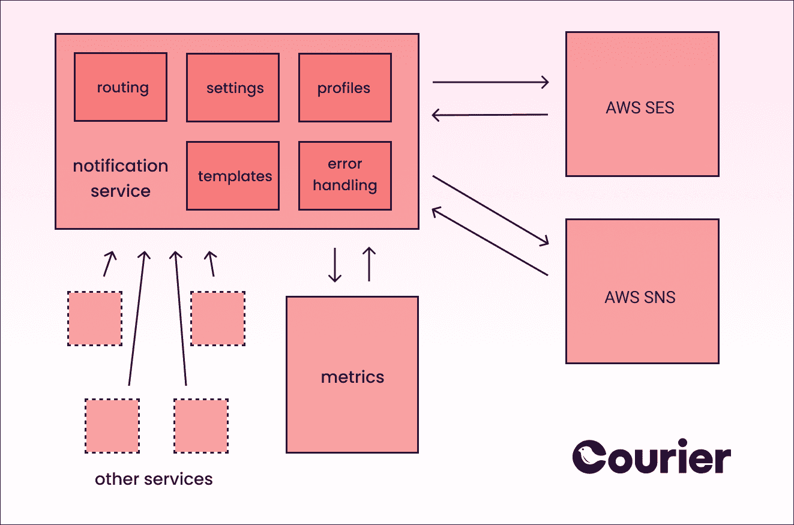
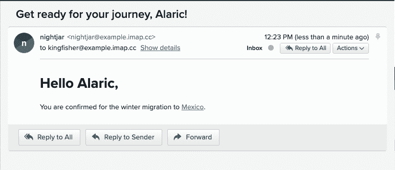

# 使用 AWS | Courier 构建您自己的通知服务的示例架构

> 原文：<https://medium.com/geekculture/an-example-architecture-for-building-your-own-notification-service-with-aws-courier-8c1aa0972f1b?source=collection_archive---------43----------------------->


如何在 AWS 堆栈中设置多通道通知在本文中，我们将介绍一个使用 AWS 构建自己的通知服务的示例体系结构，并向您展示如何在 Node.js 中实现它。

让我们开始吧！

# 为什么要构建多渠道通知？

如今，从应用程序到电子商务商店，通知是许多软件产品的核心。例如，如果没有通知，Instagram 将无法持续，因为用户可能不会仅仅为了监控活动而打开它。

当公司意识到他们无法用一种通用的方法来迎合存在于各种渠道的用户时，多渠道通知就成了一个战略问题。例如，与电子邮件相比，用户可能更喜欢旅游论坛活动的摘要，因为它非常适合异步通信。但对于需要立即关注的活动，如航班时刻表的变化，公司可能会将电子邮件通知转换为推送通知，相关人员可能会更快看到。

最终，多渠道通知会影响你的底线:根据用户需求定制通知的公司往往享有更高的用户参与度。

# 为什么要使用 AWS 服务进行多渠道通知？

如果您正在将多渠道通知构建到项目中，那么您可能会选择 AWS 服务的主要原因是您已经将 AWS 用于基础设施的其余部分。如果您已经有了 AWS 经验，那么在 AWS 中构建通知是有意义的，因为您已经熟悉了 AWS APIs，并且知道如何使用 AWS 管理控制台。

亚马逊网络服务为最终用户通知提供了两种产品: [SES](https://aws.amazon.com/ses/) 和 [SNS](https://aws.amazon.com/sns/) 。这两种服务都有一个按使用付费的定价模式，非常适合那些希望从小规模开始并随着业务增长扩大其 AWS 使用的公司。

亚马逊简单电子邮件服务(SES)是一个用于发送电子邮件和管理电子邮件列表的 API。SES 的主要 API 端点集中在[发送电子邮件](https://docs.aws.amazon.com/ses/latest/APIReference-V2/API_SendEmail.html)和[管理电子邮件联系人](https://docs.aws.amazon.com/ses/latest/APIReference-V2/API_GetContactList.html)。该服务还包括与送达率相关的更高级的端点，如管理 ses 发送电子邮件的专用 IP 地址。

Amazon 简单通知服务(SNS)是一个用于向应用程序和个人发送通知的 API。对于许多开发者来说，SNS 的关键是“人”的部分——向客户发送推送和短信的能力。SNS 的 API 端点允许你发送[条单独的](https://docs.aws.amazon.com/sns/latest/dg/sms_publish-to-phone.html)条消息，但是该服务的大部分功能是围绕 [SNS 主题](https://docs.aws.amazon.com/sns/latest/dg/sns-create-topic.html)建立的，用于随着时间的推移发送批量通知。

# 面向自动气象站的多通道通知系统架构

AWS SES 和 SNS 提供了发送通知的 API，但是告诉服务发送哪些通知以及发送给谁仍然是开发人员的工作。

这里有一个为 AWS 构建通知系统的架构示例:



在[面向服务的架构](https://en.wikipedia.org/wiki/Service-oriented_architecture)中，一个常见的模式是提取通知逻辑来创建独立的服务。在我们的示例体系结构中，通知服务包含一些核心功能:

*   模板:您发送的大多数通知都遵循标准化的格式。模板允许您一次性创建该格式，然后用用户信息替换占位符。
*   错误处理:当通知无法发送时，无论是因为无法联系到最终用户还是因为通知 API 关闭，您都可能需要尝试重新发送通知。
*   首选项:您需要存储用户对消息类别的选择，如与帐户相关的通知或营销消息。
*   用户资料:你需要存储用户的电子邮件和电话号码。
*   通知路由:这是根据事件类型、用户偏好、用户位置和其他因素决定应该发送哪个通知的核心逻辑。
*   跟踪:为了分析通知的有效性，您需要跟踪与单个通知的交互。

通知服务通常需要公开一个其他服务可以连接的 API。API 可以是同步的，通过 [HTTP REST](https://en.wikipedia.org/wiki/Representational_state_transfer) 或 [GRPC](https://grpc.io/) 端点可用，也可以是异步的，基于消息代理，如 [RabbitMQ](https://www.rabbitmq.com/) 。

除了通知服务本身的代码之外，开发人员通常需要在一个集中的指标存储中收集指标。负责通知服务的团队成员通过每小时发送的通知数量或来自不同提供者的 API 错误份额等指标来跟踪服务的状态。如果服务有一个基于队列的 API，那么队列大小也将作为一个指标发布。服务操作员可以使用这些度量来了解服务是否正常运行，或者是否有需要开发团队注意的问题。

虽然该服务连接到第三方通知发送服务(在我们的例子中是 SES 和 SNS)，但您可以在将来扩展它以支持其他提供商。

# 通知服务的示例实现

让我们用代码演示一个通知服务实现。对于这个例子，我们将使用一个名为 [Fastify](https://www.fastify.io/) 的 Node.js web 框架。这是一个针对速度优化的轻量级框架，这正是我们在内部 REST 服务中需要的。

我们将实现一个 REST API 作为通知服务的接口，但是您的实现可以有不同的结构——它可以是一个 [GRPC](https://grpc.io/) API，或者它可以使用来自 [RabbitMQ](https://www.rabbitmq.com/) 队列的消息。

如果您想继续，我们完整的示例实现可以在 GitHub 上的[通知服务库](https://github.com/chief-wizard/notification-service)中找到。

我们从克隆存储库并安装所有必需的依赖项开始:

```
$ git clone git@github.com:chief-wizard/notification-service.git 
$ cd notification-service
$ npm install
```

我们示例通知服务的逻辑包含在 [fastify/index.js 文件](https://github.com/chief-wizard/notification-service/blob/main/fastify/index.js)中。

现在，我们将定义一个电子邮件模板。我们将使用 AWS SES 的内置模板功能，但是您也可以使用像 [mustache.js](https://github.com/janl/mustache.js) 这样的库或者构建您自己的模板系统。我们的模板映射包含 SES [在其 API 中需要](https://docs.aws.amazon.com/sdk-for-javascript/v2/developer-guide/ses-examples-creating-template.html)的字段:

```
*// fastify/index.js
* **const** paramsForTemplateCreation = {
   Template: {
     TemplateName: 'MigrationConfirmation',
     HtmlPart: "<h1>Hello {{name}},</h1><p>You are confirmed for the winter migration to <a href='https://en.wikipedia.org/wiki/{{location}}'>{{location}}</a>.</p>",
     SubjectPart: 'Get ready for your journey, {{name}}!',
     TextPart: "Dear {{name}},\r\nYou are confirmed for the winter migration to <a href='https://en.wikipedia.org/wiki/{{location}}'>{{location}}</a>"
  }
}
```

我们需要在 AWS 上创建这个模板，所以我们将添加一个使用 AWS SDK 创建模板的函数:

```
**async** **function** createTemplate (params) {
   **try** {
     **const** data = **await** sesClient.send(**new** CreateTemplateCommand(params))
     console.log('Success', data)
   }
 **catch** (err) {
     console.log('Error', err.stack)
   }
 }
```

如果我们试图创建一个系统中已经存在的模板，我们会得到一个错误，所以我们将 createTemplate()函数包装在一个 try/catch 块中。在这个块中，我们将尝试获取具有相关名称的模板，如果失败，我们将在 AWS 中创建它:

```
**async** **function** createTemplateIfNotExists (params) {
   **try** {
    **const** queryParams = { TemplateName: params.Template.TemplateName }
    **const** templateExists = **await** sesClient.send(**new** GetTemplateCommand(queryParams))
   } **catch** (err) {
     createTemplate(params)
   }
 }
```

目前，我们不会向简单的模板系统添加许多其他特性。

接下来，让我们来处理通知发送。因为我们使用 AWS SES 模板，所以使用 SES [sendTemplatedEmail 端点](https://docs.aws.amazon.com/AWSJavaScriptSDK/latest/AWS/SES.html#sendTemplatedEmail-property)是有意义的:

```
**async** **function** sendTemplatedEmail (params) {
   **try** {
     **const** data = **await** sesClient.send(**new** SendTemplatedEmailCommand(params))
     console.log('Success.', data)
     **return** data *// For unit tests
*   } **catch** (err) {
     console.log('Error', err.stack)
   }
 }
```

在这个函数中，我们将简单地将收到的参数传递给 sendTemplatedEmail API 端点。让我们还创建一组占位符参数，以便在需要时可以轻松调用 sendTemplatedEmail 函数:

```
**const** paramsForTemplatedEmail = {
   Destination: {
    ToAddresses: [
       'kingfisher@example.imap.cc'
     ]
 },
   Source: 'nightjar@example.imap.cc',
   Template: 'MigrationConfirmation',
   TemplateData: '{ "name":"Alaric", "location": "Mexico" }' */* required */*,
   ReplyToAddresses: []
 }
```

现在是时候定义我们的服务将用来发送通知的 API 路由了。我们通过使用 [Fastify 的 URL 简写](https://www.fastify.io/docs/latest/Routes/#url-building)来定义主路由/notify:

```
**const** app = fastify({ logger: true })
  app.post('/notify', **async** (req, res) => {
   **const** { userId, event, params } = req.body   **switch** (event) {
     **case** 'migration-confirmed':
       sendTemplatedEmail(paramsForTemplatedEmail)
       res.send('migration-confirmed email sent')
       **break
**     **default**:
       res.send('event not configured')
   }
 })
```

这里，我们定义了 POST /notify 端点。一旦应用程序收到对/notify URL 的请求，它将从请求体中解析出以下元素:

*   userId:内部用户标识符。
*   事件:需要用户通知的事件类型。
*   params:用于构建通知内容的任何附加参数。

根据事件值，我们需要决定发送哪个通知。有些产品会有[复杂的通知路由逻辑](https://www.reddit.com/r/ProductManagement/comments/gaqijn/slack_notification_flowchart/)，但是我们将从一个单一的 switch 语句开始。如果添加许多事件，长的 switch 语句将变得不可维护，因此这一部分最终应该拆分成多个函数。

我们现在只定义了迁移确认，当该事件发生时，我们希望发送电子邮件通知。对服务的其他调用，如 AWS SNS，将放在处理迁移确认事件的语句中。

除了上面的/notify 端点，我们还可以根据需要创建其他端点。例如，下面是您的通知服务将需要的几个端点(我们将把实现留给您):

```
app.post('/subscriber', **async** (req, res) => {
   **const** { userId, email, phoneNum } = req.body
   *// handle new subscribers
*   res.send('handling of new subscribers not yet implemented') })app.delete('/subscriber/:userId', **async** (req, res) => {
   **const** userId = req.params.userId
   *// unsubscribe user identified by userId from all emails
*   res.send('handling of unsubscribes not yet implemented') })app.put('/subscriber/:userId/preferences', **async** (req, res) => {
   **const** { preferences } = req.body
   *// handle subscription preferences
*   res.send('handling of preferences not yet implemented')
 })
```

最后，我们告诉 Fastify 后端监听端口 3000:

```
**const** server = app.listen(3000, () => console.log('🚀 Server ready at: [http://localhost:3000'))](http://localhost:3000')))
```

让我们启动应用程序并试用一下:

```
$ npm run dev
[nodemon] starting `node fastify/index.js`
{"level":30,"time":1628785943753,"pid":16999,"hostname":"notification-service","msg":"Server listening at http://127.0.0.1:3000"}
🚀 Server ready at: [http://localhost:3000](http://localhost:3000)
```

现在我们将尝试向/notify 端点发出一个 POST 请求。为此，我们将使用 [cURL](https://curl.se/) ，但是您也可以使用类似 [Postman](https://www.postman.com/) 的应用程序:

```
$ curl -X POST \
    -H 'Content-Type: application/json' \
    -H 'Accept: application/json' \
    -d '{"userId": 123, "event": "migration-confirmed"}' \
    localhost:3000/notify
```

在呼叫终端后不久，我们可以看到通知电子邮件进入了我们的收件箱:



*我们测试收件箱中的电子邮件通知。*

干得好！我们现在有了一个 AWS 通知服务。

# AWS 通知解决方案的局限性

在进入 AWS 支持的通知服务的设计和实现阶段之前，请考虑以下对 AWS 服务的限制。

# AWS 服务是“原始的”

可以把 SES 和 SNS 看作是 API 非常类似于底层通知协议的服务。这两种服务都要求您实现大多数不是通知发送核心的功能。

例如，如果您想发送附件，SES 会要求您手动编写[多部分消息](https://gist.github.com/tylermakin/d820f65eb3c9dd98d58721c7fb1939a8)。它没有提供自动处理附件的无缝 API——您需要在 SES API 之上自己实现它。

联系管理是 SES 需要额外工作的另一个领域。如果您选择 SES 管理的列表，您需要为每个电子邮件列表建立添加和删除订户的逻辑。

SNS 在开发者可用性方面也有限制。例如，无法传递的通知最终会进入死信队列，您需要监控它的重试次数。

# 错误检查是费力的

AWS“不成熟”的另一个方面是错误检查。例如，您需要检查电子邮件退回或未送达的推送通知，并亲自管理它们。

正如我们上面提到的，任何无法发送的 SNS 通知都将在[死信队列](https://docs.aws.amazon.com/sns/latest/dg/sns-dead-letter-queues.html)中结束。这个队列是一个[亚马逊简单队列服务(SQS)](https://aws.amazon.com/sqs/) 队列，您需要实现功能来监听这个通道上的消息。

当您在此队列中收到“未成功通知”消息时，您需要决定是再次尝试通知(并相应地在通知服务中安排)，还是通过替代通知方法(不同的渠道或提供商)发送通知。您还需要跟踪哪些推送目标和电子邮件地址一直没有响应，因此需要从未来的通知列表中删除。

您可以使用 SNS 和 SES 构建错误处理功能，因为每个错误案例的必要细节都可以在这两个服务的 API 上获得。但是您也需要自己实现错误处理。

# 您需要构建一个模板引擎

虽然您可以使用 mustache.js 等工具轻松实现简单的电子邮件和通知模板，但复杂的模板，如复杂的 HTML 电子邮件，则是另一回事。

您需要测试您的模板，以确保它们在所有支持的设备和客户端上都能正常工作。电子邮件格式很难得到正确的，所以我们建议预算额外的时间来开发和测试您的模板。

# Courier 如何改善基于 AWS 的客户的通知体验

[Courier](https://www.courier.com/) 是一个用于多渠道通知的 API，我们的很多客户都使用 AWS。我们为客户提供了使用 AWS 服务进行通知的机会，而不必在 AWS 服务本身的基础上构建所有附加功能。

以下是使用 Courier 发送电子邮件和短信通知的方式:

```
**import** { CourierClient } **from** "@trycourier/courier";**const** courier = CourierClient({ authorizationToken: "<AUTH_TOKEN>" }); *// get from the Courier UI
*  *// Example: send a message supporting email & SMS***const** { messageId } = **await** courier.send({
   eventId: "<EVENT_ID>", *// get from the Courier UI
*   recipientId: "<RECIPIENT_ID>", *// usually your system's User ID
*   profile: {     email: "kingfisher@example.imap.cc",
   phone_number: "555-228-3890"
   },
   data: {} *// optional variables for merging into templates
* });
```

Courier 在后端处理与 AWS 的所有通信，并提供许多额外的优势来减少您的实施工作:

*   通知设计器:我们提供了一个用于设计通知模板的 web 界面，允许用户创建和编辑通知模板，而无需重新部署任何代码。这减少了将新通知添加到产品中所需的工程工作。
*   自动处理取消订阅和错误:Courier 处理通知首选项，并为取消订阅的用户自动调整通知流程。没有必要监控 SQS 的死信队列。
*   多提供商:接下来，您可能想要从 SNS 和 SES 切换，或者添加一个额外的提供商来发送国际短信。Courier 与 [20 多个提供商](https://www.courier.com/providers)集成，都使用相同的 API。

# 结论

在本文中，我们介绍了我们建议的通知服务架构，用于与 AWS SES 和 SNS 集成。

使用 Courier 在 AWS 服务中编排通知很容易。

我们提供每月最多 10，000 次通知的免费计划，并且我们不需要您的信用卡就可以开始。

[今天就免费报名吧！](https://app.courier.com/signup)

*原载于*[*https://www.courier.com*](https://www.courier.com/blog/multi-channel-notifications-aws)*。*