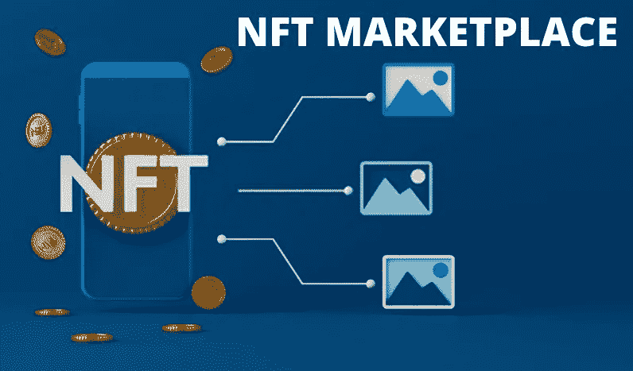

# 一个数字创作者的专属市场在船上:NFT 艺术市场发展

> 原文：<https://medium.com/geekculture/an-exclusive-marketplace-for-the-digital-creators-is-on-board-nft-art-marketplace-development-2f9f61136a0?source=collection_archive---------17----------------------->

有什么比 NFT 艺术市场的发展更有效？

NFT 艺术市场的发展正在通过将**数字艺术转化为代币**而产生影响。专业的 [**NFT 艺术市场开发团队**](https://bit.ly/3w8Y26h) 优先考虑用户体验、外部特征、多层安全等等。然而，一家领先的 NFT 艺术市场开发公司欢呼着为**艺术家**、**作者**、**歌手**、**电影制片人**以及其他**创意专业人士**开发一个壮观的平台。

NFT Marketplace

**你可以在这里找到一些关于 NFT 艺术家市场的信息:**

NFT 艺术家市场是一个专门的空间，艺术家可以在这里以更高的价格展示他们的作品和艺术品。NFT 艺术市场将世界各地的艺术家聚集在一起，在一个屋檐下实现他们的梦想。艺术家们在网站上创建了一个社区，内容创作者可以在这里分享关于设计技术和当前高质量内容的想法。NFT 艺术市场的主要目标是通过一个名为 NFT 的单一实体来汇集创造力和 T21 的专业知识。

艺术市场有什么好处？

*   入伍变得更加容易。
*   现在有大量的数字收藏可供交易。
*   你的资产在世界各地都有。
*   可以使用常规统计数据进行分析。
*   高度可互操作
*   交易有时间限制。
*   确立贸易价格
*   多货币兼容性
*   多语言模式的无障碍沟通。

**NFT 数字艺术市场令人兴奋的特点**

NFT 艺术平台提供高品质的艺术和文物展示，通过一系列独特的功能使其区别于竞争对手。

下面是其中的一个列表

*   创作者的平台偏好
*   安全 [**区块链平台**](https://medium.datadriveninvestor.com/the-evolution-of-blockchain-technology-and-its-applications-with-time-66d79b533d37)
*   各种各样的艺术收藏品
*   艺术分组变得简单而有效
*   艺术家社区的平台
*   艺术 NFT 代币的持有者受到管理。
*   通过平台使用利用流动性

> 与领先的 NFT 市场开发公司一起开始您的NFT 艺术市场开发。