# 三州地区疾病预防控制中心新冠肺炎数据的探索性数据分析

> 原文：<https://medium.com/geekculture/an-exploratory-data-analysis-eda-on-covid-19-in-the-tri-state-area-11de42185af7?source=collection_archive---------1----------------------->


免责声明:这个 EDA 研究的是每个州的新冠肺炎病例和死亡总数，而不是人均病例和死亡数。其主要目的是观察病例和死亡随时间变化的总体趋势。

# **冠状病毒危机**

除了总统选举，新冠肺炎无疑是 2020 年最具决定性的事件。这种新型冠状病毒是全球范围内前所未有的疫情，它对世界的持续影响不仅为未来几年奠定了基础，还可能决定整个十年的命运。如果这种疾病没有被彻底消除，许多旨在阻止病毒传播的临时措施可能会成为社会的永久固定资产，而一些受 COVID 影响最严重的地区可能永远也不会恢复正常，如人口密集的大都市地区，需要广泛的社会变革以防止传染。

# **介绍调查情况**

作为一个生活在这样一个城市蔓延区——纽约、新泽西和康涅狄格三州区域——的人，我很好奇冠状病毒是如何随着时间的推移在这个地区发展的。通过进行这一探索性分析，我想回答几个主要问题:

*   该地区第一个出现 COVID 病例的州是哪个州？
*   同一地区的国家是否有类似的疾病发展？
*   我可以通过检测数据随时间的剧烈变化来绘制重大事件的图表吗？
*   通过分析这些信息，我会做出什么意想不到的推论吗？

我认为开始回答这些问题的最好地方是疾病控制和预防中心(CDC)的网站。监测冠状病毒已经成为这个联邦卫生机构的主要目标，他们有完美的数据集供我分析。

https://data . CDC . gov/Case-Surveillance/United States-America-Cases-and-Deaths-by-State-o/9mfq-cb36[1]

我想在把它下载到 Jupyter 笔记本电脑之前先看一眼，所以我点击“查看数据”来查看详细数据的电子表格。

[https://data . CDC . gov/Case-Surveillance/美国-新冠肺炎-各州的病例和死亡人数-o/9mfq-cb36/data](https://data.cdc.gov/Case-Surveillance/United-States-COVID-19-Cases-and-Deaths-by-State-o/9mfq-cb36/data) [2]

我已经注意到数据的一些问题，在绘制之前我需要解决这些问题——日期顺序不对，几列有空行，其他列有非数字数据，一些数字是负数。我还看到下面列出的行数:惊人的 22，740！这是一个庞大的数据集，很可能需要大量清理。

# **下载数据**

在通过 CDC 的 JSON API 将数据集导入 Jupyter 笔记本之前，我想先导入几个外部 Python 库——用于数据分析的 Pandas 和用于数据可视化的 Matplotlib。

```
import pandas as pdimport matplotlib.pyplot as plt
```

在导入数据之前要提到的另一个重要注意事项是，从 JSON 文件中读取的字段数量有一个自动限制。Pandas 默认只读取 1，000 行，但是这个数据集中有将近 23，000 行—所以我们把它设置为 25，000 行(为了安全起见)。

```
df = pd.read_json("https://data.cdc.gov/resource/9mfq-cb36.json?$limit=25000")
```

# **查看信息**

现在我们已经导入了数据帧，让我们使用一些函数来检查它。

**info()** 函数获取关于数据帧的重要信息，比如它拥有的行的范围、所有列的计数、列的数据类型以及每个列中包含的非空值的数量。

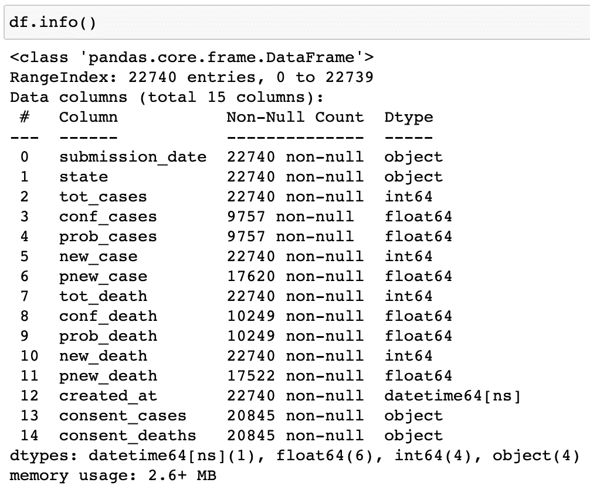

虽然有些列只包含非空值(该列中的所有 22，740 个条目都填充了数据)，但许多列的非空值要少得多(许多行是空白的)。因为空值会扰乱我们的数据分析，所以我们需要尽快解决这些问题。

另一个有用的函数是 **describe()** ，它计算关于数据帧的一系列统计数据。

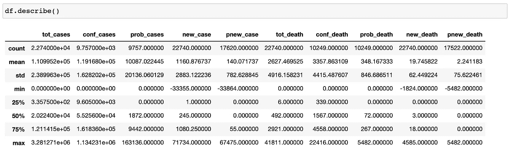

# **清洁柱子**

让我们更清楚地了解我们的数据框架，这样我们就可以检查列并开始清理它们。

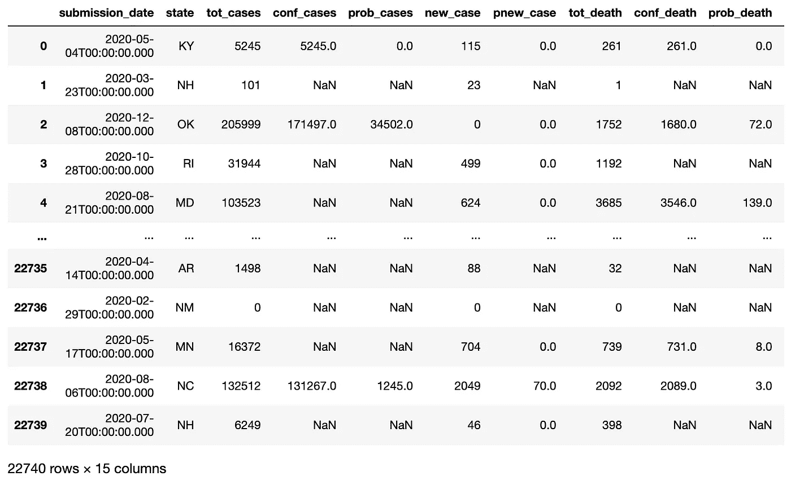

我看到的第一个障碍是，“conf_cases”、“prob_cases”、“pnew_case”、“conf_death”、“prob_death”、“pnew_death”、“consent _ cases”和“consent _ deaths”都包含大量的空值，由“NaN”标识(不是数字)。

这意味着什么？根据疾病预防控制中心的网站，这些栏中的大部分表示“确认”和“可能”的病例和死亡数。显然，虽然许多新冠肺炎疑似病例被报告是因为它们符合该疾病的标准，但并不是每个病例都被官方确认为由 COVID 引起的，一些可能的病例报告被完全撤回…

> “……如果进一步的公共卫生调查确定该人很可能没有感染新冠肺炎病毒。”

COVID 案例的这种偶尔收回也是前面提到的负数的原因。这并不是使可靠的新冠肺炎计数这一艰巨任务复杂化的唯一因素。CDC 自己承认，由于其网站上列举的各种原因，他们无法提供完全准确的 COVID 数据，其中一个原因是他们只汇总了各州和地区自己报告的数据。数据的准确性取决于辖区自己的报告。然而，这不应该否定数据的价值。虽然病例和死亡的确切数字可能难以辨别，但这些数字作为接近的估计是有价值的。

也就是说，应该删除该数据集中的“可能”和“已确认”列，因为具有不一致值的数据会妨碍正确的分析。出于同样的原因，可以删除“同意 _ 病例”和“同意 _ 死亡”列，虽然“创建 _ 时间”列似乎表明每个病例实际上是何时被接纳到数据集中的，但是创建日期总是比原始提交日期晚至少一天，有时更长。我只对最初的报告感兴趣，因为这些日期更接近于人们感染冠状病毒的时间。数据集中有两个日期也是多余的。

```
to_drop = ['conf_cases','prob_cases','pnew_case','conf_death',
'prob_death','pnew_death','created_at', 'consent_cases','consent_deaths',]df.drop(to_drop, inplace=True, axis=1)
```

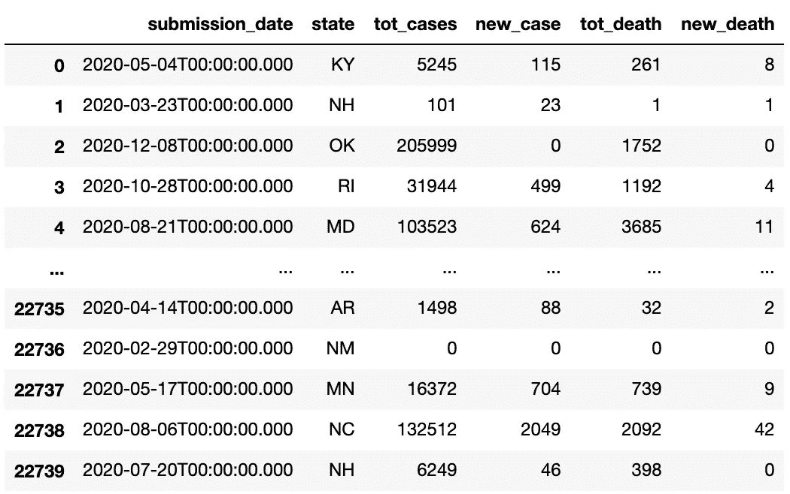

只剩下几个字段——“提交日期”、“州”、“总病例数”、“新病例数”、“总死亡数”和“新死亡数”。现在我们离干净的数据集又近了一步——但是“submission_date”这一列仍然给我们带来了一些问题。外来的数字，缺乏时间顺序，以及不美观的名字都是我们必须解决的问题。在此期间，让我们也更改其他列的名称，使它们更美观。

```
df = df.rename(columns={'submission_date': 'Date'})df['Date']=pd.to_datetime(df['Date'])df = df.sort_values(by=['Date'])df = df.rename(columns={'state':'State'})df = df.rename(columns={'tot_death':'Total_Deaths', 'new_death':'New_Deaths'})df = df.rename(columns={'tot_cases':'Total_Cases', 'new_case':'New_Cases'})
```

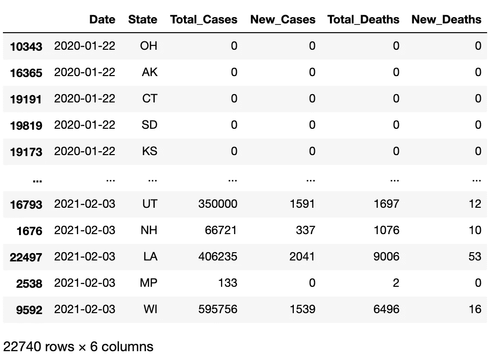

最后，出现了一组干净、命名整齐、有序的数据。剩下要做的最后一件事是过滤掉不在三州区域的州。让我们专门为纽约、新泽西和康涅狄格制作一个新的数据框架。

```
dfTRI = df[(df[“State"].str.contains('NY|NJ|CT', na=False))]
```

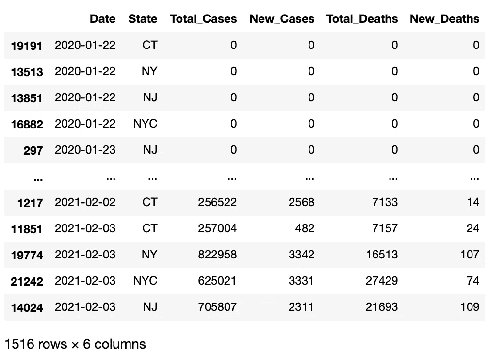

需要指出的一个有趣的细节是，纽约市被列为自己的州，而纽约州的报告不包括该市的数据。根据 CDC 的数据，目前有 60 个公共卫生管辖区报告了新冠肺炎病例，包括 50 个州和主要城市，如华盛顿州、DC 和纽约市，以及美国本土以外的地区。因为纽约市是单独列出的，所以该 EDA 将其数据作为自己的区域，与康涅狄格州、新泽西州和纽约州并列。

现在我们的数据集已经组织好了，我们可以禁用显示的最大行数，并在单个窗口中查看整个数据帧。

```
pd.set_option('display.max_rows', None)
```

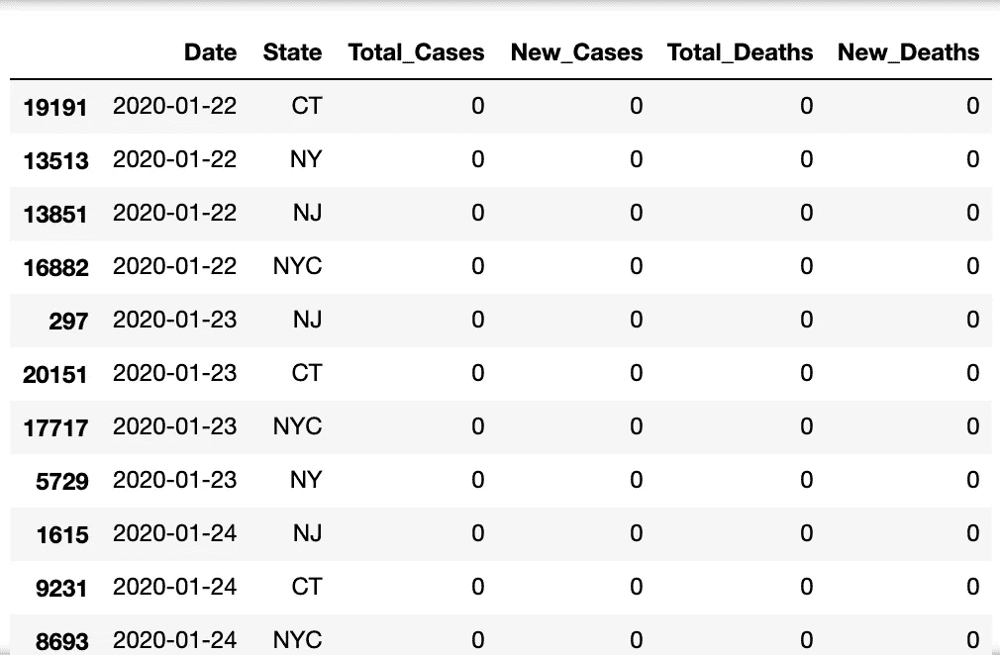

我们注意到的下一件事是，连续几天没有一例柯维德病例——事实上，三州地区的首例新冠肺炎病例直到 3 月 2 日才被列出，这是数据集开始记录后的近三个月。这里我们不需要整季都是零，所以我们只显示事例总数大于零的行。

```
dfTRI = dfTRI[dfTRI.Total_Cases > 0]
```

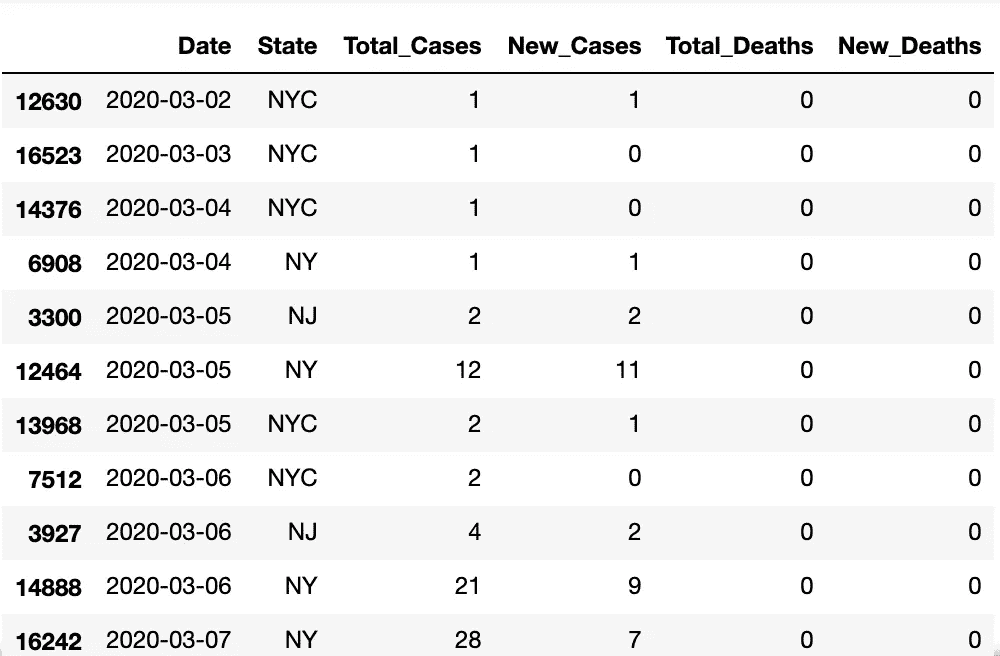

# **疫情地块**

现在我们可以很容易地确定该地区最早报告的新冠肺炎病例:

*   纽约市:3 月 2 日
*   纽约州:3 月 4 日
*   新泽西:3 月 5 日
*   康涅狄格州:3 月 8 日

让我们创建另一个 dataframe，它排除除了包含“NY”的州名之外的所有内容，并使用 Matplotlib 绘制我们的第一个图——纽约市和纽约州的总 COVID 案例的比较。

```
dfNY = dfTRI[(dfTRI['State'].str.contains('NY', na=False))]
ax = plt.gca()dfNY.groupby('State').plot(kind='line', x='Date', y='Total_Cases', ax=ax)plt.title("Total Covid Cases in New York City VS New York State")
ax.legend(['NY','NYC']
```

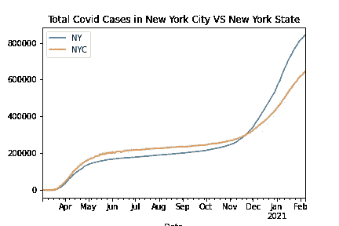

尽管它们被分成两个独立的数据集，但纽约的两个数据集在 COVID 病例总数随时间的增长方面显示出相当相似的趋势。

这些地区的人口不尽相同，但在同一范围内-2019 年约有 833 万人[3]，纽约市占纽约州总人口的近一半，同年约有 1950 万人居住[4]，11 大约有 100 万人不在纽约市。由于人口较少而总病例数较高，在疫情的最初几个月，纽约市的新冠肺炎总病例数似乎比纽约州更糟糕。然而，两个纽约在 11 月底开始在中间相遇，随着时间的推移，纽约州的病例总数超过了其城市对手。不幸的是，没有 2020 年人口的精确测量，很难说过去几个月纽约的人均病例总数是否真的超过了纽约市。不过，显而易见的是，在假期开始前后，某些因素导致了病例数趋势的逆转。

从秋天到冬天的季节变化可能是这两个地方病例数量上升的一个主要因素，因为人们忽视了社会距离，以便与朋友和家人共度假期，而他们在上半年可能会避免这样做。病例数量上升的另一个因素可能是冬季较冷的天气迫使更多的活动从室外转移到室内，那里缺乏距离空间和空气流通，导致病毒传播的环境更好。

但是是什么导致纽约州的案件总数超过了纽约市呢？我们有什么合理的推测吗？我的第一个想法是，也许这个城市在宵禁、商业关闭和人群聚集方面保持着更严格的地方法律，这导致了比该州其他地方更多的案件发生。也许该州更多农村地区的人们也比人口更密集的大都市地区的人们更不倾向于遵循政府的命令。值得重复的是，虽然我最初的想法听起来像是随意交谈中的合理想法，但这两种说法最终都是毫无根据的假设，没有引用人均病例的实际来源。

接下来，让我们分析整个三州地区的病例总数。

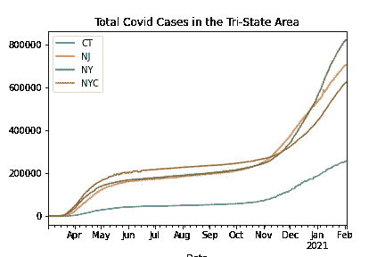

该图显示，康涅狄格州的病例远少于纽约州和新泽西州，这两个州的病例数趋势相似得多。这两个不同地区之间的通勤者是否要对跨州线的传播负责？还是人口只是一个更大的因素？新泽西州的人口为 888 万，与纽约州和纽约市的人口相当，而康涅狄格州的人口要少得多，只有 350 万。[6]鉴于这一信息，减少新冠肺炎病例总数是有道理的。

# 新泽西的数字

现在我们已经简要地并排比较了每个地区的总案例，让我们通过创建一组更加个性化的数据框架并在表中绘制每一列来更详细地分析一个州(新泽西州)。

```
dfNYS = dfNY[~dfNY.State.str.contains('NYC')]
dfNYC = dfNY[(dfNY['State'].str.contains('NYC', na=False))]
dfNJ = dfTRI[(dfTRI['State'].str.contains('NJ', na=False))]
dfCT = dfTRI[(dfTRI['State'].str.contains('CT', na=False))ax = plt.gca()
dfNJ.plot(kind='line', x='Date', y='Total_Cases', color='blue', ax=ax)
dfNJ.plot(kind='line', x='Date', y='New_Cases', color='green', ax=ax)
dfNJ.plot(kind='line', x='Date', y='Total_Deaths', color='black', ax=ax)
dfNJ.plot(kind='line', x='Date', y='New_Deaths', color='red', ax=ax)
plt.title('Covid Stats in New Jersey')
```

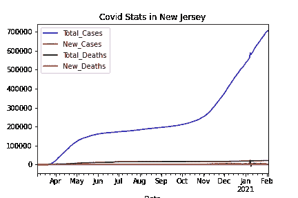

这张图最有趣的地方在于，包括死亡总数在内，总病例数远远超过了其他所有列。这似乎肯定支持冠状病毒相对于其感染率而言具有相当高的生存概率的说法——尽管这一说法并不意味着淡化新冠肺炎造成的死亡人数，无论死亡率如何，这都是一个巨大的悲剧。与其他测量相比，其他区域在总病例数方面显示出相同的趋势，这些数字与新病例/总死亡数/新死亡数之间的巨大差异使得这些列难以分析。

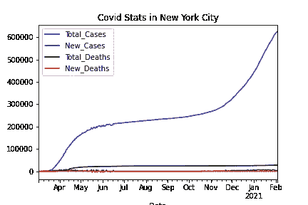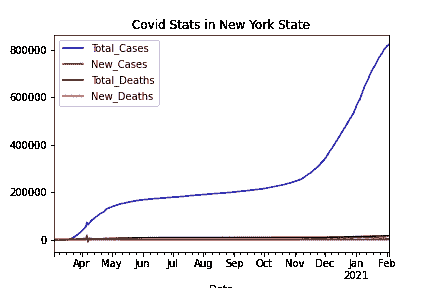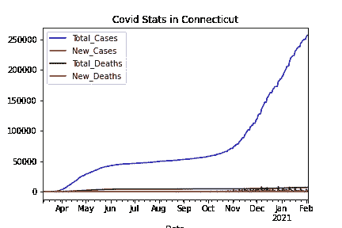

# 比较案例

让我们通过排除每个地区的总案例来创建另一系列图表。这些图表很有趣，因为它们表明，虽然各州之间每条线的大致形状有些相似，但细节是关键——每个州的新增病例/总死亡人数/新增死亡人数的比率都是独特的。

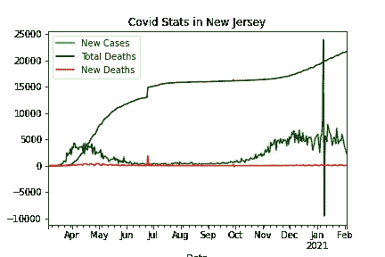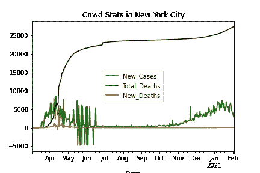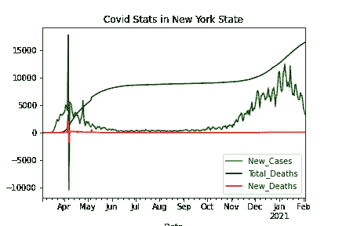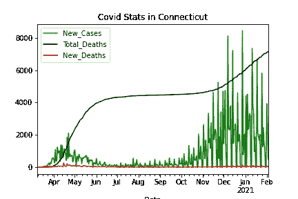

每个地区都经历了新病例的激增，并在 4 月达到高峰，导致总死亡人数在疫情首次开始在全国蔓延时稳步上升。在很大程度上，这一数字在接下来的几个月里开始下降，从 7 月到 10 月，新病例和死亡人数的增长几乎完全停止。我认为可以肯定地说，这种放缓可能是由于隔离、社会距离措施以及可以在户外安全进行的活动的增加等综合因素造成的。然而，从 11 月开始，新的 COVID 病例和死亡人数开始再次以指数速度上升，在今年 1 月达到另一个顶点，并导致总死亡人数再次上升，并继续上升。

然而，相似之处也就到此为止了——这些图显示了难以解释的主要差异。例如，在每张图表中，新病例数与总死亡数的确切比例差异很大。康涅狄格州的情节与众不同的一点是，新病例的急剧增加超过了冬季经历的死亡总数，而同一季节纽约州的新病例数仅低于死亡总数。纽约市和新泽西州的新增病例与新增死亡的比率最低——除了新泽西州在 2021 年初经历了意外的新增病例激增，随后急剧下降至近-10，000。这种波动的原因是什么？

情节中另一个让我暂停的特殊点是纽约州新 COVID 病例的激增和撤回，这一次是在 4 月初。要么是大量的人收到了阳性检测结果，几天后又被立即收回，要么是我的数据中存在一些重大错误。

第三种想法——也许这些州的 COVID 监控计算机系统因新病例数而超载，以至于出现了与病毒测试结果的有效性无关的不可避免的错误，在检测到错误后，负数被释放出来以解决错误。

让我们从其他统计数据中分离出新的 COVID 案例，并比较这些状态。

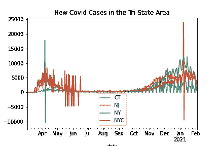

最后一个有问题的系列报道出现在纽约市 5 月中旬至 7 月中旬的新冠肺炎新病例中。这种不稳定的模式特别令人困惑，因为它与新病例中任何预期的季节性高峰或撤回无关，不像纽约州和新泽西州出现的情况。我可以初步提出的唯一解释是，随着更多的人在天气变暖时离开他们的房子，更多的人开始担心他们暴露在外面的冠状病毒中，因此报告了更多的虚假病例。然而，我也不能肯定地做出这样的断言。如果这种发展是根本原因，那为什么只发生在纽约？如果没有外部来源的解释，我的分析是不确定的。

# **死亡数据**

我们对数据集的最终分析集中于该地区的总死亡人数和新增死亡人数。

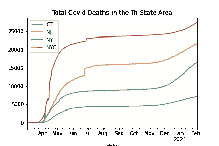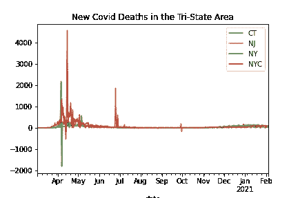

这两个图表中最显著的特点是纽约市的总死亡人数和新死亡人数都高于其周边各州，即使其他地区的人口数量相当。该市的总死亡人数超过 25，000 人，4 月份新死亡人数激增，单日最高死亡人数超过 4，000 人。

4 月初，纽约州也遭受了严重的生命损失，尽管新增死亡人数仅达到 2000 人左右——此后不久，新增死亡人数也大幅下降。我们如何解释新增死亡人数如此急剧的逆转？这是否表明在疫情发展早期对 COVID 症状的误解？也许人们高估了它的死亡率。因为新冠肺炎与其他疾病有如此多的共同症状，很容易将无关的死亡误认为是 COVID 引起的。然而，正如我前面提到的，死亡人数的急剧下降也可能是系统超载的结果。

纽约市和新泽西州都显示，6 月底新增死亡人数再次大幅上升，新泽西州新增死亡人数几乎是纽约市新增死亡人数的三倍。新死亡人数的突然增加是否与学校的结束以及学生和教师暑假的开始有关？同样值得注意的是，就在 10 月份之前，出现了一次小的上涨和回落，对此我很难解释。

在康涅狄格州，与三州地区的其他地区相比，新增死亡人数如此之低，以至于很难在图表上看到。我们应该再绘制一对数据集，以便更仔细地观察康涅狄格州的新增死亡人数(该地区最低)，并将其与纽约市的新增死亡人数(最高)进行比较。这两个地区的实际死亡人数会有很大不同，但是我们可以通过比较一段时间内新死亡人数的趋势来获得一些见解。

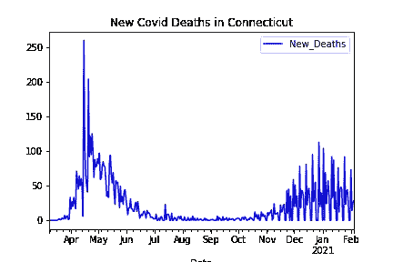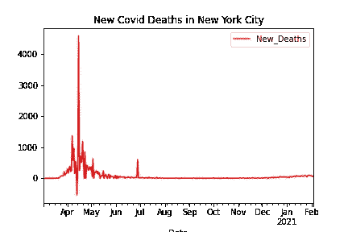

虽然纽约市 4 月份的新增死亡人数非常高，但今年晚些时候的新增死亡人数却完全没有。另一方面，康涅狄格的新增死亡人数总体较低，但该州在 1 月份经历了第二波大的死亡浪潮，其规模几乎与第一波一样大。

原因可能是什么？可能是因为新冠肺炎病毒在康涅狄格州造成的死亡风险似乎更小，那里的人们没有采取足够的预防措施来防止它的传播，当第二波病毒在 2021 年初到来时，少数最终死于它的人毫无准备。与此同时，我想象纽约人在 4 月份遭受如此多的损失后，会非常认真地对待冠状病毒，也许他们在防止第二波死亡方面做得更好，因为他们已经知道风险。

尽管如此，这只是我个人的猜测——在没有外部确认的情况下，我无法确切知道原因是什么。

# **冠状病毒结论**

除了冠状病毒本身的长期发展之外，这个位于三州地区的新冠肺炎 EDA 还教会了我很多关于如何从大型数据集提取信息的知识。我也对我居住的地区有了一些了解。然而，我也带着更多的问题来结束这个项目——比如，从这个有更多背景的分析中可以获得什么进一步的启示，比如新闻故事或人均数据？或者说，我们如何利用这些信息来阻止更多像 COVID 这样的疾病的传播？

我在分析这些数据时遇到的一个主要限制是我对 Pandas 和 Matplotlib 不够熟悉。如果我有更多使用这些库的经验，那么我将能够创建更多的图来以有趣的方式显示我的数据，并对现有数据进行新的计算来揭示新的见解。

不管在这个项目之前我的局限性是什么，我知道的比我开始的时候多。这是对 web 挖掘世界的一个很好的介绍。

# 参考

[1][https://data . CDC . gov/Case-Surveillance/美国-新冠肺炎-各州的病例和死亡人数-o/9mfq-cb36](https://data.cdc.gov/Case-Surveillance/United-States-COVID-19-Cases-and-Deaths-by-State-o/9mfq-cb36)

[2][https://data . CDC . gov/Case-Surveillance/美国-新冠肺炎-各州的病例和死亡人数-o/9mfq-cb36/data](https://data.cdc.gov/Case-Surveillance/United-States-COVID-19-Cases-and-Deaths-by-State-o/9mfq-cb36/data)

[3][https://www1 . NYC . gov/assets/planning/download/pdf/planning-level/NYC-population/new-population/current-population-estimattes . pdf](https://www1.nyc.gov/assets/planning/download/pdf/planning-level/nyc-population/new-population/current-populatiion-estimattes.pdf)

[https://data.census.gov/cedsci/table?[4]q = New % 20 York % 20 state % 20 population&tid = pepop 2019。pep annres&hide preview = false](https://data.census.gov/cedsci/table?q=New%20York%20state%20population&tid=PEPPOP2019.PEPANNRES&hidePreview=false)

[https://data.census.gov/cedsci/table?[5]q = New % 20 jersey % 20 state % 20 population % 202019&tid = pepop 2019。pep annres&hide preview = false](https://data.census.gov/cedsci/table?q=New%20Jersey%20state%20population%202019&tid=PEPPOP2019.PEPANNRES&hidePreview=false)

[6][https://portal . CT . gov/-/media/Departments-and-agency/DPH/人口/城镇-流行/流行 _ 城镇 2019pdf.pdf](https://portal.ct.gov/-/media/Departments-and-Agencies/DPH/Population/Town-Pop/pop_towns2019pdf.pdf)