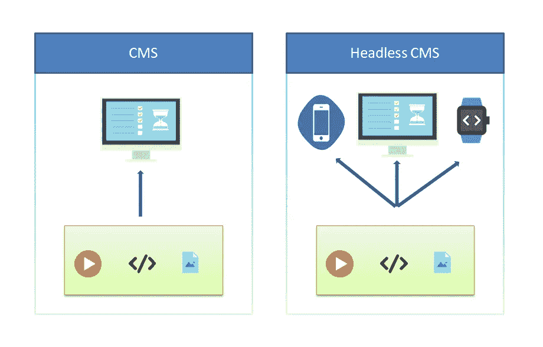

# 令人大开眼界的内容丰富的无头 CMS

> 原文：<https://medium.com/geekculture/an-eye-opener-to-contentful-headless-cms-9bd8b6712619?source=collection_archive---------21----------------------->

内容与其他合作医疗的比较研究

> 无头 CMS 是任何类型的后端内容管理系统，其中内容存储库“主体”与表示层“头部”分离或分离

我不应该浪费更多的时间来解释传统 CMS 和 Headless CMS 之间的区别，但下面的图形表示可以传达你需要理解的所有内容。

