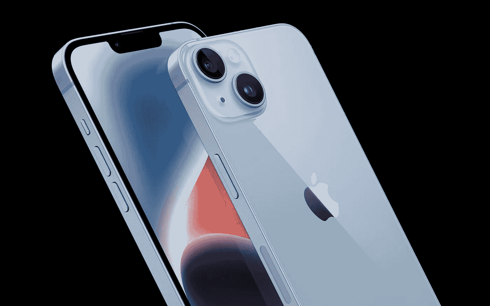

# 对于 2022 年的 iPhones 来说，这是令人印象深刻的进步，也是令人失望的倒退

> 原文：<https://medium.com/geekculture/an-impressive-step-forward-a-disappointing-step-back-for-2022-iphones-ba13c0dead87?source=collection_archive---------6----------------------->

## 苹果打破了其标志性的智能手机系列，更新了手表和 AirPods Pro 系列，现在可以连接卫星了

The iPhone 14 models are based on last year’s A15 processor, but they do not cost more than their predecessors while offering some improvements here and there. Make of that what you will. (Image: Apple)

这并不意外，但却非常重要，因为它可能会给世界上最成功的智能手机品牌——苹果的 iPhone——带来变化