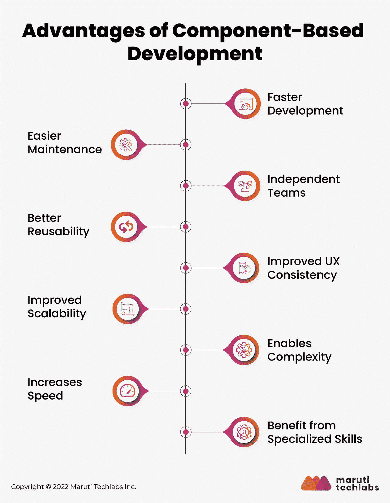

# 基于组件的架构的优势

> 原文：<https://medium.com/geekculture/an-in-depth-guide-to-component-based-architecture-d023f02f4147?source=collection_archive---------9----------------------->

基于组件的架构可以帮助您交付优化的应用，以响应您的应用不断变化的市场需求。最好的部分是，你不需要雇用昂贵的应用专家来做这件事！

如今，高性能前端应用都是关于定制的、内聚的体验——幸运的是，该技术可以提供这种体验。使用基于组件的开发，组织可以轻松利用这些性能和特性优势。

用 Marko Lehtimaki 的话说:

> “与其从头开始构建每个应用程序，并要求整个专家和开发人员团队同步工作，不如将工作分成更小的部分。”

基于组件的架构已经成为寻求扩展其前端开发操作的公司的首选策略。这种观念的转变允许公司利用通过跨多种产品和页面模板简化和扩展 CSS 而获得的效率。

在本文中，您将更好地理解基于组件的开发、其功能、文档、工具、最佳实践等等。所以，事不宜迟，我们开始吧！

# 什么是软件工程中基于组件的开发？

基于组件的开发是一种专注于设计和开发可重用组件的软件开发方法。例如，考虑带有标题、搜索栏、内容体等元素的网页。当考虑基于组件的架构时，所有这些都是相互独立的，称为组件。

基于组件的架构最近在组织中流行起来，如 *PayPal、Spotify 和优步，*利用它来改进和标准化他们的前端开发。由于这个原因，越来越多的企业正在寻求从他们的整体架构转换到基于组件的开发策略。

以下是将整体架构转换为基于组件的策略时要考虑的一些方法:

*   可重用和共享库的组件
*   使用生产者/消费者模型
*   按前端和后端划分

# 基于组件开发的优势

基于组件的开发带来了许多好处，不仅仅是在软件应用程序中有可重用的代码位。潜在的好处不胜枚举，但以下是一些重要的好处:

# 1.更快的发展

基于组件的方法可以帮助团队开发高质量的软件，比那些不使用这种方法的团队快 60%。通过从随时可访问的可重用库中创建组件，团队不需要从零开始使用他们的软件。他们可以直接从这个库中选择，而不用担心非功能性需求，如安全性、可用性或性能。

# 2.更容易维护

基于组件的架构的一个重要优势是每个组件都是独立的和可重用的。它有助于将前端整体分解成更小、更易管理的组件，使任何升级或修改都变得轻而易举。您需要一次更新相关组件，而不是每次都修改代码。稍后，当发布新的更新或者必须运行测试时，将它添加到适当的基于组件的模型中。维奥拉。就这么简单。

# 3.独立团队

跨职能的组件团队将设计语言系统视为一个单一的事实来源，并在没有外部帮助或干涉的情况下创建组件。在这种情况下，组件是独立的，但不影响系统。这将导致形成自治团队，因为他们有更多的自由、灵活性和责任来决定如何保持他们的项目顺利进行。

# 4.更好的可重用性

可重用性有很多好处，包括为业务应用程序编写更少的代码。在处理基于组件的框架时，开发人员不必重复注册相同的代码行，而是可以专注于核心功能。然后，他们可以将这些相同的组件应用到其他可能满足不同需求或在各种平台上实现的应用程序中。

例如，考虑一个为应用程序提供身份验证功能的组件。在构建组件时，设计人员已经设计好了组件，因此在使用该组件构建的任何应用程序中，唯一会改变的就是实际的授权逻辑。组件本身将保持不变，而不管它在什么应用中使用。

# 5.提高 UX 一致性

如果你采用一种无人监督的前端开发方法，你就有可能给你的消费者提供不一致和不清晰的体验。但是，使用基于组件的体系结构，您将自动引导设计文档中创建的所有组件使用一致的 UI。

# 6.改进的可扩展性

如果一个产品是新的，人们正在注册，系统可能需要为增长(和可伸缩性)做好准备。基于组件的开发允许专门构建的元素像拼图一样一起工作。

基于组件的架构将 web 应用程序的模块化优势扩展到了项目的前端。这允许您和您的团队跟上需求，同时保留一段易于阅读和维护的代码。

为了更好地理解基于组件的开发、它的功能、文档、工具和最佳实践，请阅读完整的*基于组件的架构指南* [这里](https://marutitech.com/guide-to-component-based-architecture/?utm_source=medium_Content_Promotion&utm_medium=referral&utm_campaign=guide-to-component-based-architecture)。