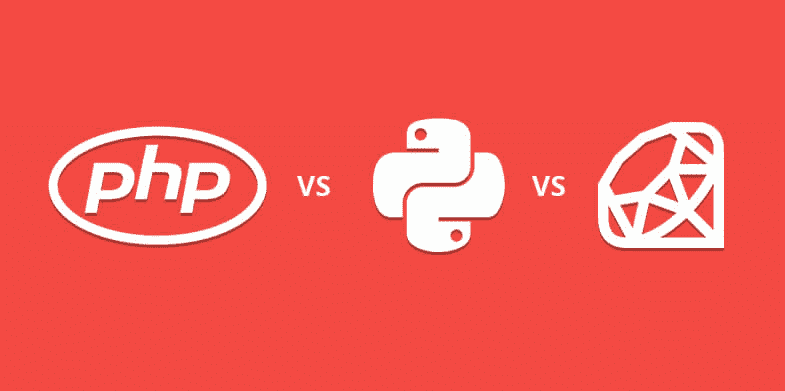
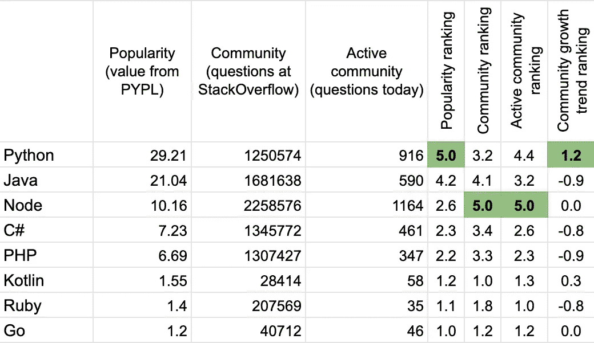
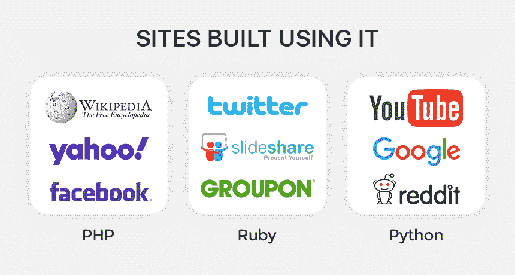
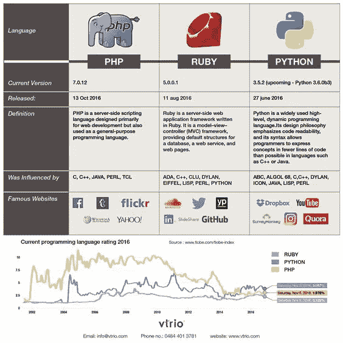
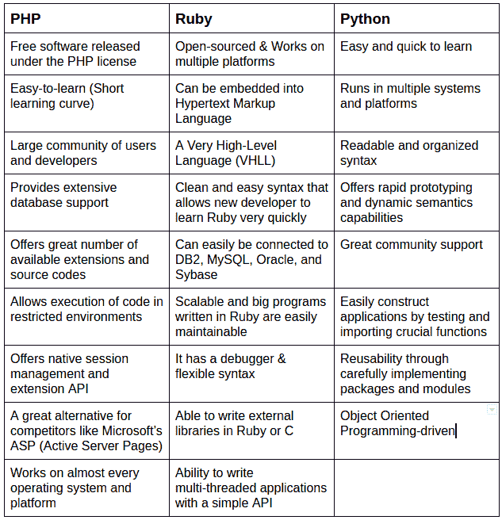

# 对 PHP、Python 和 Ruby 的深入研究

> 原文：<https://medium.com/geekculture/an-in-depth-investigation-into-php-vs-python-vs-ruby-e8bb66bc64b8?source=collection_archive---------7----------------------->

## 深入比较 2021 年的重磅炸弹技术，以实现网络发展目标。找到所有隐现问题的答案。

## 2021 年 web app 开发最好的编程技术是什么？这是 web 程序员、学生和公司中争论最多的问题之一

PHP Vs Python Vs Rub

[图像来源](https://codecondo.com/the-battle-of-web-programming-languages/)

无论你是一个初学 web 开发的人，还是一个创业者，选择合适的技术是你首先要考虑的。虽然技术选择在开发人员的生活中扮演着重要的角色，但对于企业来说，整个 web 开发和维护都依赖于它。

因此，参考当前的趋势和未来的需求来创造一门完美的语言是至关重要的。目前，web 开发的三种编程语言是开发者和企业的主要兴趣点:PHP VS Python VS Ruby。

当然，如果你必须从 PHP、Python 和 Ruby 中选择一个来发展你的职业生涯或应用程序开发，你会觉得自己站在一条三岔路上，没有什么在终点等待。因此，为了减轻您的困扰，在本文中，我将对 PHP、Python 和 Ruby 进行深入的比较。所以，在这篇文章结束之前，请继续关注我。

# PHP VS Python VS Ruby:市场使用情况

如果我只谈论这些技术的流行程度，我不得不说 PHP 已经赢得了这场战斗。世界上每个人都知道 PHP 是一种编程语言。

不过，看这些数字也可以帮助我们了解确切的市场构成。所以让我们看一看。

根据一项调查，84%的 Python 用户将 Python 作为他们的主要编程语言，而 16%的用户将它作为第二语言。79%的受访者明确表示他们将英语作为主要语言，21%的受访者将英语作为第二语言。2017 年 Python 基金会进行了一项调查，结论是 Python 作为主要语言增加了 5%。与此同时，Python 于 1991 年发布。而且谷歌的搜索引擎和 YouTube 都是用 Python 开发的。

# PHP VS Python VS Ruby:目的

PHP VS Python VS Ruby

[图片来源](https://mxx.news/backend-language-to-learn-in-2020-comparing-community-job-market-cloud-support-and-performance/)

如果我们考虑 PHP 的使用，其第 7 版只有 48.2%的网站使用。目前，它已被全球超过 79.0%的网站采用。与此同时，PHP 于 1995 年发布。

Ruby on Rails 是另一种流行的语言，发布于 1995 年，全世界有 1，532，730 个网站。Twitter 和 Hulu 是 Ruby on Rails 的最大用户之一。

从这些统计数据来看，很明显，每种语言都有自己的市场定位。不过，PHP 是网站使用量巨大的赢家。

# 服务器端编程语言（Professional Hypertext Preprocessor 的缩写）

PHP 是预处理器超文本，一种服务器端编程语言，广泛用于企业开发可伸缩的、动态的、健壮的网站和 web 应用程序。这种多用途编程语言是由拉斯马斯·勒德尔夫在 1994 年开发的，可以在所有重要的操作系统上使用。

总之，它被用来为不同类型的网站和 web 应用程序开发快速、安全和动态的网页。你会发现市场上的 PHP 开发公司在为你的企业创建可扩展的网站和 web 应用程序方面很有帮助。 ***所以，*** [***如果你想为你的业务安全轻松地建立一个可扩展的网站，请雇佣 PHP 开发人员***](https://www.valuecoders.com/hire-developers/hire-php-developers) ***。***

# 计算机编程语言

Python 是 Guido van Rosum 在 1991 年开发的最受欢迎的编程语言之一。开发它主要是为了关注代码的可读性，它的语法允许开发人员用几行代码编写那些长代码。凭借其显著的特性，Python 支持数据分析和数据可视化。Python 是一种高效的语言，用于开发许多优秀的、可扩展的网站和 web 应用。

PHP VS Python VS Ruby

[图像来源](https://www.arkasoftwares.com/blog/php-vs-python-vs-ruby-which-is-better/)

# 轨道上的红宝石

Ruby on Rails 是在标志性的 Ruby 上开发的健壮的服务器端 web 应用程序框架。Ruby development services on Rails 主要是大型和小型企业开发创造性和交互式 web 应用程序的首选。

这个 web 应用框架为 ROR 开发人员提供了他们编写的各种代码的结构。众所周知，ROR 可以简化重复性的任务，使它们更容易完成。如果你想开发一个高度可扩展的 web 应用程序，这里有一些关于雇佣 Ruby on Rails 开发人员的建议，他们可以为你的企业开发强大的交互式网站和 web 应用程序。

# PHP VS Python VS Ruby:可用性

在选择要使用的语言时，可用性是一个要考虑的关键因素。假设服务器和用户之间的 web 接口之间存在连接，那么一种有用的语言对于开发强大、强大、高性能的应用程序是非常重要的。

PHP 是一种文档非常丰富的语言，具有非常经典的方法，尽管 Python 遵循非常严格的缩进准则，但具有最容易阅读代码的能力。

根据大多数程序员的说法，Ruby 代码非常强大，具有很多使用能力，这可能是因为它至少是基于惊奇的原则，这使得它对客户来说不那么令人困惑。

# PHP VS Python VS Ruby:性能

确定责任、可伸缩性、安全性、速度等。任何编程语言或框架的演示。如果我们谈论可伸缩性，那么在这一节中有 Python 规则。由于语法简单，可以构建高度可扩展的复杂网站和 web 应用程序。你可以[从](https://www.valuecoders.com/hire-developers/hire-python-developers)[最好的网络开发公司](https://www.valuecoders.com/web-application-development)雇佣 Python 开发人员，他们在为你的企业创建健壮的、高度可扩展的网站和应用程序方面经验丰富。

但是，如果考虑到 Ruby 的速度，Ruby 和 PHP 都在 Python 之上，因为 Python 代码是在线执行的。这使得执行过程缓慢。此外，使用 Python 开发的网站和 web 应用程序需要大量的空间。

在安全性方面，用 PHP 开发的网站和 web 应用不如用 Python 和 Ruby on Rails 开发的安全。

如果你正在寻找内存优化以加快执行速度的网站，你可以聘请 PHP 开发人员或 ROR app 开发人员。但是，如果您正在寻找可伸缩性，Python 是最好的选择。

# PHP VS Python VS Ruby:易学性

如果说一个高度可扩展的，适合开发高效网站和应用的应用。那么，PHP 确实是不可否认的赢家。最近[离岸 PHP 应用程序开发服务](https://www.valuecoders.com/php-development-services-company)非常受欢迎，因为它允许使用服务器端脚本语言轻松开发交互式界面。

看到它的优势，很明显它非常有能力为商业用途开发可伸缩的和高效的软件解决方案。

接下来让我们谈谈学习 Python 基础知识；这是三种语言中另一种最容易学的语言。它简单的语法是它容易的原因。对于开发人员来说，用 Python 来记忆和编写代码是很容易的。而使用 Python 创建的网站或 web 应用程序与其他相比需要编写的代码更少。

虽然 Ruby on Rails 的学习对于初学者来说可能很难，对于初出茅庐的 ROR 开发人员来说，从头创建一个应用程序可能也很困难。

PHP VS Python VS Ruby

[图像来源](https://www.pinterest.com/pin/847943436060643753/)

# PHP VS Python VS Ruby:工作机会

无论是 Python VS Ruby，还是 Ruby VS PHP，在工作机会数量和支付体系上都有着巨大的差异。如果我们以招聘信息为基础进行分析，编程语言有其自身的重要性。

在这些编程语言中，Python 开发人员的需求量很大，有 11%的编程语言职位空缺。在那之后，PHP 占据了第二的位置，这使得它成为了另一种拥有大量招聘信息的流行编程语言。

虽然 Ruby on Rails 以 4%的职位发布率位居第三，但相比之下，Ruby on Rails 开发人员的工资比 Python 和 PHP 开发人员高，但他们必须面对激烈的竞争。

# PHP VS Python VS Ruby:开发

持续开发和更新对于确保编程语言适应当前趋势、具有相关性以及解决开发人员面临的一些问题以确保开发非常重要。

新版本具有更多进化功能，以适应快速变化的数字世界。很难说这三种语言中哪一种更新得最快，但是根据我得到的研究和评论，PHP 和 Python 的开发和更新速度似乎比 Ruby on Rails 快得多。

在支持方面，我们还考虑了同行支持、合作开发人员和程序员。因此，一个新的功能开始发挥作用，即很容易找到论坛来解决问题。PHP 与 Ruby-on-Rails 和 Python 之间最常讨论的是哪种编程语言？据资料显示，Python 具有广泛的讨论覆盖面。这对于增加支持非常有帮助，这在 web 开发中非常重要。

# 选哪个？

很难判断应该选择哪一种，每种编程语言都有一套独特的优点和缺点，我们可以在下面的展示中看到。

图片来源:habr

这完全取决于项目的类型和所需的功能。所以，如果你的项目是一个简单的网站开发，不需要处理太多的数据，那么 PHP 是最好的选择。但是如果您的应用程序要求您每秒处理一大群活跃用户和海量数据，那么您必须使用 Python 或 Ruby on Rails。

# 包扎

从上面可以清楚地看到，每种编程语言都有自己的优势，您只需要决定哪种语言最适合您的项目。虽然 PHP 在 swift 网站开发方面值得信赖，但 Ruby on Rails 和 python 在创建复杂的解决方案方面值得信赖。所以，无论你 [**雇佣 Python 开发者**](https://www.valuecoders.com/hire-developers/hire-python-developers)**[**RoR 开发者**](https://www.valuecoders.com/hire-developers/hire-ror-developers) ，还是一个 [**专用 PHP app 开发者**](https://www.valuecoders.com/hire-developers/hire-php-developers) ，你的应用都必须无缝流畅。所以，明智地选择吧。**