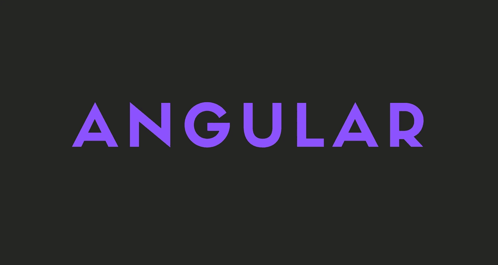

# 角度的深入审查

> 原文：<https://medium.com/geekculture/an-in-depth-review-of-angular-97d0962996e5?source=collection_archive---------16----------------------->

什么是有角的，为什么它很重要？

在这个故事中，你会学到很多关于 Angular 的知识，以及在哪里使用它。我将谈论 Angular 的特性、优点和缺点等等。

## 注意

如果你想看 React，Angular 和 Vue 的对比，一定要看看我关于它的故事。

 [## 2021 年最佳前端 JavaScript 框架对比

### 哪个 JavaScript 框架最适合你？

javascript.plainenglish.io](https://javascript.plainenglish.io/best-frontend-javascript-framework-96ecef9791fa) 

开始吧！

# 什么是有角？

Angular 是一个用 TypeScript 编写的开源 JavaScript 框架。Google 维护它，它的主要目的是开发单页应用程序。

作为一个框架，Angular 具有明显的优势，同时也为开发人员提供了一个标准的工作结构。它使用户能够以可维护的方式创建大型应用程序。

Angular 有一个陡峭的学习曲线，通常在构建大型应用程序时使用。

# 角度特征

## 1.文档对象模型

Angular 使用常规 DOM。假设在同一个 HTML 页面上进行了十次更新。Angular 将更新 HTML 标签的整个树结构，而不是更新已经更新的标签。

## 2.以打字打的文件

TypeScript 为 JavaScript 定义了一组类型，帮助用户编写更容易理解的 JavaScript 代码。所有的 TypeScript 代码都可以用 JavaScript 编译，并且可以在任何平台上顺利运行。

## 3.数据绑定

数据绑定是使用户能够通过 web 浏览器操作网页元素的过程。它采用动态 HTML，不需要复杂的脚本或编程。数据绑定用于包含交互式组件的网页，如计算器、教程、论坛和游戏。当页面包含大量数据时，它还支持更好的网页增量显示。

角度使用双向绑定。模型状态反映了在相应的 UI 元素中所做的任何更改。相反，UI 状态反映了模型状态的任何变化。这个特性使框架能够通过控制器将 DOM 连接到模型数据。

## 4.RxJS

如果没有 RxJS，您就不可能使用 Angular，RxJS 是一个反应式编程库，旨在处理带有多个事件的异步数据。它基本上允许工程师建立多个数据交换通道，以减轻资源消耗。

## 5.测试

Angular 使用 Jasmine 测试框架。Jasmine 框架提供了多种功能来编写不同种类的测试用例。Karma 是测试的任务运行器，它使用一个配置文件来设置启动、报告和测试框架。

# 棱角分明的建筑

Angular 是一个成熟的模型-视图-控制器(MVC)框架。它为如何构建应用程序提供了清晰的指导，并在提供真正的 DOM 的同时提供了双向数据流。

## 1.模块

Angular 应用程序有一个名为 AppModule 的根模块，它提供启动应用程序的引导机制。

## 2.成分

应用程序中的每个组件都定义了一个保存应用程序逻辑和数据的类。组件通常定义用户界面的一部分。

## 3.模板

Angular 模板将 Angular 标记与 HTML 结合起来，以便在显示 HTML 元素之前对其进行修改。有两种类型的数据绑定:

1.  事件绑定:让您的应用程序通过更新应用程序数据来响应目标环境中的用户输入。
2.  属性绑定:使用户能够将从应用程序数据计算出的值插入到 HTML 中。

## 4.[计]元数据

元数据告诉 Angular 如何处理一个类。它用于修饰类，以便它可以配置类的预期行为。

## 5.服务

当您的数据或逻辑与视图无关，但必须跨组件共享时，就会创建一个服务类。

## 6.依赖注入

这个特性让您的组件类保持简洁高效。它不从服务器获取数据，不验证用户输入，也不直接记录到控制台。相反，它将这些任务委托给服务。

# 角度 Cons

## 1.表演

动态应用程序并不总是表现得那么好。复杂的水疗中心可能会因其尺寸而滞后且不方便使用。Angular 的性能提升了不少。但仍不完美。

## **2。陡峭的学习曲线**

Angular 是一个成熟的框架，肯定需要更多的时间来学习。这也是为什么不是所有人都真的喜欢棱角分明。

# 最后的想法

我个人很爱 Angular，用的也很多。我绝对推荐学习它，或者至少尝试一下。

我希望这个故事能帮助你，让你对苗条有新的认识。

## 仅此而已。感谢您阅读这个故事！

如果你喜欢这个故事，一定要让我们在评论中知道，并随时问我你想问的任何问题。

在 Twitter 上关注我:

 [## re _ ally 边缘

twitter.com](https://twitter.com/Re_allyedge) 

在 Patreon 上支持我:

 [## 阿里木阿尔斯兰卡亚是创造编程故事和教程。帕特里翁

### 今天就成为阿里木阿尔斯兰卡亚的赞助人:在世界上最大的…

www.patreon.com](https://www.patreon.com/allyedge)