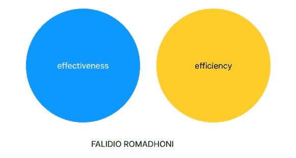

# 企业家和职业生涯的不可思议公式

> 原文：<https://medium.com/geekculture/an-incredible-formula-for-entrepreneurs-career-51dfd27b4327?source=collection_archive---------15----------------------->

## #被管理培训生解雇后

作为一名工业工程师，我从雅加达大学毕业后，决定追求一个能让我成长和发展的职业。好消息是，我在毕业前收到了一份聘书，应聘[古农世吾集团的管理培训生。](https://www.gunungsewu.com/jobs/lead)

Picture by [Gunung Sewu Youth](https://www.facebook.com/GunungSewuYouth/photos/a.997395000368557/1501462003295185/?__cft__[0]=AZWyKtjq1dPEIAFiCIUxpQPYaibjimgFNGGQ5DcS6A12Hr07g2tdl91ftInOaXHzLu-vANYJMCyWTvls9ARDGkH2dEh9gO19bVZGgyudNrUfWuFT4zYAm12NXclgZgT5JfGAcYvm_M33KC_iqluB8zPGR6PKDhJogoRi1u7H93OUKvdo9xiszMUtjP-6owV-3eBOdXcdWAZVQdb2kfqMoi6D93H-BdH_yY74ZbYZYXCgrlZ-I9IxVJuZlygK2tF9QMM&__tn__=EH-y-R)

2018 年，我被 GSK 聘为管理培训生，尽管在 4000 多名申请人中只有 17 人被选中。当时，我感到很自卑，因为我的校园来自[大学，而大多数被录取的学生来自 ITB、UI、UGM 和 Prasetya Mulia，这些都是印度尼西亚的世界级大学。](http://Universitas Muhammadiyah Jakarta,)

一段时间后，一个坚持有效性和效率的项目被分配，如果它不坚持这些指标，它被终止。我和其他几个管理培训生一起被解雇了。

> 有趣的事实:我被裁员了，这是我在工作的第一个世界里的第一次失败。

# 如果你不使用有效性和效率，你将违反因果律

1.  作为一名雇员:以我为例，我在第一份工作被解雇后就失业了。
2.  作为一名企业主，你可能正在经历一段激烈的市场排斥期，不确定把公司放在哪里，或者处理偏离目标的支出。
3.  作为自由职业者，一个人的自我意识较低，无法拥抱机会，刻板，达不到雇主的首要要求。

# 有效性和效率的定义

Picture by [Antoni Shkraba](https://www.pexels.com/@shkrabaanthony/) via [Pexels](http://Antoni Shkraba)

1.  有效性是产生预期结果的能力或产生预期产出的能力。当某事被认为是有效的，它意味着它有一个预期的或期望的结果或产生一个深刻的，生动的印象。
2.  效率是以很少或没有浪费、努力或精力来实现最终目标的能力。高效意味着，你可以通过尽可能最好地利用你所拥有的资源来实现你的目标。简单来说；如果没有浪费，所有的过程都得到优化，那么事情就是高效的。

# 商业和专业领域的有效性和效率公式

Created by [me](https://www.figma.com/file/wTPaQUnxIMPAPnTQV1ARXo/Untitled?node-id=0%3A1) (the Author)

不管是什么职业，有效性和效率的公式必须尽快使用，以在达到预期目标和持续获得最佳结果之间取得平衡。
需要注意的是，有效性和效率必须以同样的方式结合起来，不能向任何一个方向倾斜，例如:

> **效力>效率或效力<效率。有效性=效率**

每个分量都必须相等，这是其应用的一个小例子:

1.  作为一名员工，你应该在一个固定的时间框架内，比如八小时，每天生产更多的产品，同时尽量减少标签、通知和其他干扰，以提高效率，避免浪费时间。
2.  作为一名精力充沛的企业家，不仅能带来额外的收入或销售额，还能专注于降低成本，如分销成本、管理费用和促销活动的有效性。
3.  作为一名自由职业者，你应该跟上工具和社区的现代创新，这样你就可以快速持续地推进你的工作。