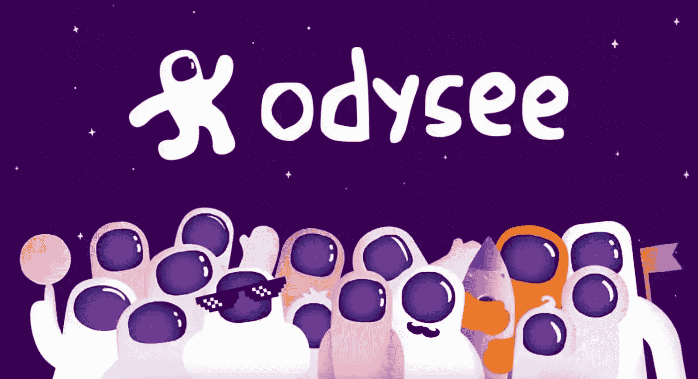

# 一个独立的、基于区块链的 YouTube 竞争对手？

> 原文：<https://medium.com/geekculture/an-independent-blockchain-based-youtube-competitor-b36ba89e6a73?source=collection_archive---------10----------------------->

## Odysee 能和谷歌旗下的视频分享巨头竞争吗？

Source: [Odysee](https://odysee.com)

dysee 是一个新的视频分享网站，旨在重获互联网的独立和自由。它是由[图书馆](https://lbry.com/)(读作“图书馆”)区块链协议背后的团队创建的。自 2020 年 12 月正式上线以来，该网站的用户群急剧增长，其中…