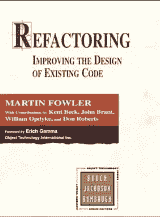
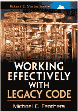
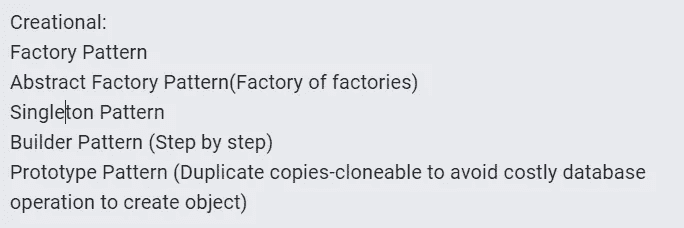
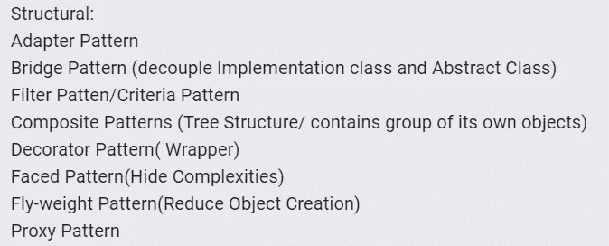
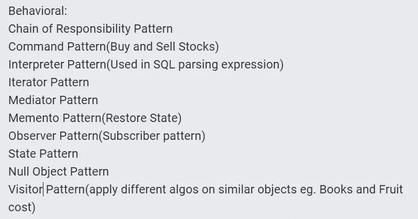

# 一个见多识广的程序员。

> 原文：<https://medium.com/geekculture/an-informed-programmer-19caedfc1620?source=collection_archive---------11----------------------->

H ello 世界。我希望你一切都好。这篇文章不是技术性的，而是更倾向于阅读的乐趣。想法是要刺激你的想法，这样你就可以提前做出有意义的决定。以下是一些与现实生活中的例子的类比，这将有助于你思考编程。

Image only for representation purpose

# 今天的代码

你有没有幻想过闭着眼睛上路。一条你不知道的路。有些人可以试试运气，并设法承担风险，但许多人不能。虽然走路和搬运自己是我们每天的活动，但我们已经习惯了，并且练习了数百次。当我们向前迈出一步时，我们确信。但是当我们试图在浅水中行走时，我们试图找到一个稳定的表面，然后才能站稳。

这与编写我们的代码非常相似。只有在你头脑中清楚需求的情况下，你才能编码。即使最小的单位也必须非常清晰，人们必须能够观想它。如果你能把它形象化，并且没有发现遗留问题，那么编码是一个很好的开始。

你必须只为那些现在已经清晰的需求编码。任何不明确的要求都必须经过利益相关者的集体讨论。记住，如果需求很难解释，这表明它没有被清楚地定义。一种方法是将需求分成子需求，识别并解决模糊部分。

# 软件是一个不断改进的肖像

你见过一个艺术家正在画一幅活的肖像吗？他/她是否设法立刻创造出最终产出？不，这个过程是基于一种以系统的方式反复进行以达到预期目标的技术。

这和软件开发是一样的，编程是一门艺术，你需要像艺术家一样思考。复杂的问题只有分解成更小的问题，然后攻克每一个，才能解决。

每个软件开发都是从通过创建抽象、创建接口、思考数据及其结构来勾画一个最基本的结构开始的。一旦完成，下一次迭代包括通过编写实现来实现这些抽象，越来越深入到实现中，并为尽可能小的单元编码。将它们连接在一起并进行测试等等。

像草图一样重复是软件开发的旅程，为此，一个人需要掌握****重构的艺术*** 。*

*重构仅仅意味着在不改变代码行为的情况下组织和重新组织代码。这些可以是任何类似于**提取一个方法**如果代码重复不止一次，或者提取因为一些代码行专门只做一件事，**通过简单地画出意义或者将它们与现实世界的实体联系起来来识别依赖性**(就像自行车依赖于轮胎，反之亦然)并且仍然保留自行车或轮胎的行为等等。*

*我会推荐**读一本关于重构的书**。这里有几本书，你可以先看。
1。重构:改进现有代码的设计——马丁·福勒*

**

*2:有效地使用遗留代码——Michael c . Feathers*

**

# *试验用接线*

*随着软件的发展，大量的事情将随之发生。测试将帮助你跟踪你的软件行为。软件是解决特定人类问题的各种**假想规则**的结果。随着时间的推移，将很难记住他们所有人。我们可能想要添加功能，并检查软件的其余部分是否如预期的那样运行。这可能是一个重复的任务，可能每天都会发生，所以我们需要一些措施来处理它。测试就是这些措施。计算机可以每天或每隔几个小时对我们的软件不断重复和运行测试用例，而不会像人类那样筋疲力尽。*

*一般来说，在我们上学期间，很少强调编写单元测试，我们大多数人只从理论上了解单元测试。像单元测试是一种额外的工作，为什么我们要管理两个代码库？如果我们在写代码时出错，那么如何保证这些所谓的“测试代码”没有错误呢？这是我最喜欢的一个“我们已经写了完美的工作代码，为什么我们还需要测试？”。所有这些观念都制造了障碍，使得理解考试的重要性变得更加困难。*

*让我承认，我们也经历了所有这些不情愿的想法。如果你在职业生涯中很晚才开始学习测试，一个特殊的经历是，即使你读了文章，读了书，你也会有点理解作者试图让你理解的东西，但仍然在某种程度上最初没有意义。概念听起来非常明显，但它仍然不会“点击”。获得“内心的平静”是非常相似的。我们学到的其他一切都是知识，但这一部分是智慧。*

> *那么，我们应该做些什么来汲取这种智慧呢？这个问题的答案也是明智的。迈出信仰的一大步。向你的测试投降*

*你将不得不忘记你是一个完美的程序员。写一个测试，给你测试的类一些输入，并期待一些输出。这甚至应该发生在你在这门课上写任何东西之前。测试将会失败。然后只写通过那个测试的代码，刚好够通过测试。把下一个行为留给即将到来的下一次测试。不要想超出这个类的范围，继续写测试并通过测试，直到达到所述类的期望行为。不要在其他课之间跳来跳去。可能有这样的情况，比如说这个类需要与其他类协作，但是这些类并不存在。我们仍然可以通过使用 ***嘲弄和伪造*** 的技术来继续编写测试并通过当前类的测试。*

*你可以在网上学到这些东西，几乎每种编程平台都有很多测试和模拟库。*

*对于 Java，您可以查看 Junit4、Junit5 和 Mockito。同样，科特林举了一些科特斯特，莫克*

# *不要重新发明*

*自 1960 年以来，编程和程序员一直在发展。他们遇到了各种各样的障碍，并解决了其中的大部分。就像生活中的真正问题一样，每个问题都没有唯一的解决方案，类似地，在剧本、书籍、发表的论文中也有这种解决方案的分类。我们必须从这些文件中学习，这将使我们快速前进，我们将能够从他们的错误、他们的发现和他们的解决方案中学习。*

*开始的一个方法是学习编程模式。有 3 类编程模式。*

> *创造性
> 结构性
> 行为性*

**

*Creational Pattern*

**

*Structural Patterns*

**

*Behavioural Patterns*

*通过示例详细检查所有这些内容，做一个快速参考笔记，以便您可以在任何时间点重新访问。*

*此外，还要学习架构模式，比如 MVC、MVVM、MVP、MVI 等等。描述这些模式超出了本文的范围，因为我已经向您保证这不会是技术性的。*

*说到这里，请理解架构模式的意图。采用这些模式是为了使开发人员之间的交流更加容易。简而言之，它或多或少地定义了什么代码将去哪里，以及如果您正在寻找什么，应该如何导航到它。当在团队中工作时，它将你从繁重的返工中拯救出来。*

*了解一些类似干(不要重复自己)和坚实的原则的哲学。意图获得智慧，就像学习考试一样。所有这些将有助于您编写解耦的和可重用的代码。一旦你抓住了这些东西，你就不再是那个人了。你解决问题的方法会不同。你对什么是不重要的理解将会彻底改变，最终将你从过度工程中拯救出来。您将理解框架代码和业务逻辑之间的区别，这种区别将允许您推迟或延迟一些决定，直到软件开发的后期。*

*所有这些东西将使你享受软件工程。就像浓缩咖啡一样，你需要一段时间才能喜欢上它。它值得。*

# *培养同理心*

*正如我们所知道的，寻找一个问题的解决方案是很理想的，如果这个问题已经被别人解决了，这可以让你避免重复同样的问题。这意味着我们是一起的，是社区为你的工作做出了贡献，是你迟早会为社区做出贡献。所以要感同身受。这是一个程序员在事业和生活上进步的最重要的齿轮。*

*因为我们每次都在转变中，类似地，每个人都在他们各自的领域中。重要的是，你要求并欣赏每个人。不要犹豫说谢谢，即使你认为这只是一种形式。尊重每个人的时间和努力。如果你在跨职能团队中工作，并有幸拥有 QA(质量保证工程师)，即使他们为你记录错误，也是在帮助你，试图将你和公司从严重的问题中解救出来。*

*理解反馈的一个快速方法是尝试理解他们的角色。进行友好的讨论，并尝试找出他们面临的日常挑战以及他们的工作限制。*

*最终你的同理心会让你身边有一些卑微的朋友。因此，良好的工作文化。*

> *最后，我想请你总是有用的。成为推动者。我们的存在必须总是有益于我们周围的人。*

*一定要让我知道你的想法。如果你认为这篇文章还有改进的空间，我们可以在这里提供。*