# 链表介绍

> 原文：<https://medium.com/geekculture/an-intro-to-linked-lists-d6e0ad4778a1?source=collection_archive---------27----------------------->

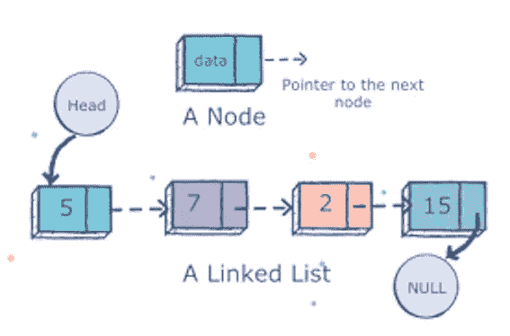

Linked list src: [educative.io](https://www.educative.io/edpresso/what-is-a-linked-list)

随着我在全栈教育中的进步，数据结构总是作为一个庞大的、势不可挡的主题出现。所以我在这里，在公共场合学习，把我的发现写在纸上。这是一个初学者对使用链表的快速介绍。

我们将触及什么是链表的基础知识，并使用 Javascript 展示一些导航和操作这种数据结构类型的基本方法。

# 那么，什么是链表呢？

有几种类型，但是本文将只讨论单向链表。简单地说，链表是一种存储项目集合的方式。

它是由节点组成的线性、动态的数据结构。在单链表中，每个节点引用行中的下一个节点，形成一个链，或者说***链表*** 。

相当罗嗦…还是有点感觉我们在用一个词自己的定义，嗯？ 我们来分解一下。

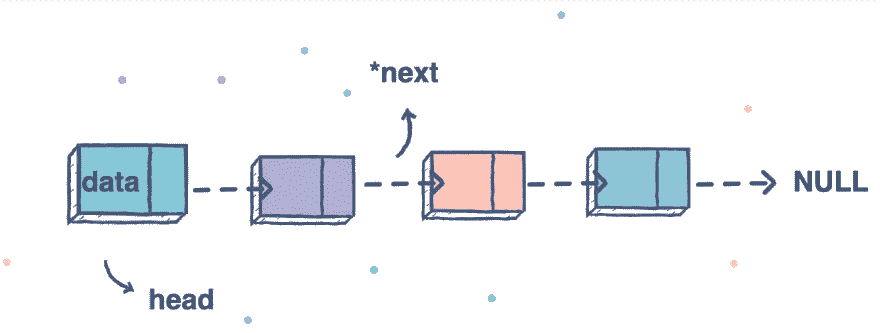

Linked list src: [educative.io](https://www.educative.io/edpresso/what-is-a-linked-list)

**线性**

与树(一种非线性数据结构)相比，这一点变得更加明显，在树中，一个父节点可以有多个子节点。单链表中的每个元素只引用下一个元素。

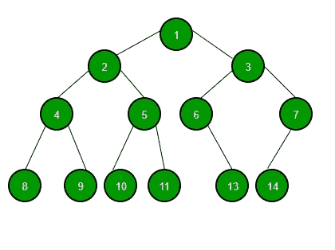

Tree Data structure for non-linear reference

**动态**

你可能会想，为什么我需要链表，我已经有数组了。然而，数组作为固定的块存储在内存中。想象一个盒子，它被分成大小相等的几个部分，每个部分都有一个索引值。

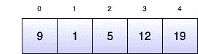

Array example

一个链表可以被想象成许多独立的盒子，每个盒子通过一个*指针*链接到下一个盒子。一个链表可以根据你的数据需求动态地增长和收缩，这使得它更加灵活。当您添加盒子时，内存被分配来存储新的节点值和指针。

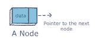

A linked list node

**每个链表**都有一个**头&尾，**相当自明。

*   **头:**列表中的第一个节点。
*   **Tail** :列表中的最后一个节点。*尾部的指针指向* ***空，*** *表示是最后一个元素。*

# **用 Javascript 构建链表**

像 JS 中的大多数数据结构一样，我们将利用类。在这种情况下，一个类用于构建每个节点，一个类用于列表自身。

# 节点类

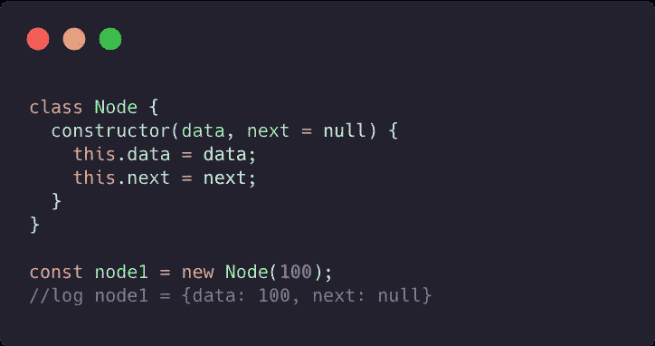

Node class

节点类有两个属性:Data 和 Next。

*   **数据:**被存储的数据，一般为任意类型。
*   **下一个:**对行中下一个节点的引用。如果它的下一个节点不引用另一个节点，它默认为 null，表示它是尾部。

# 列表类

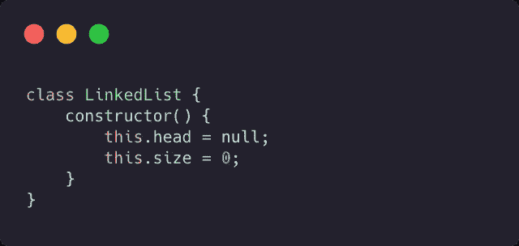

List class

列表自身一般有两个属性

*   **Head:** 引用第一行节点
*   **大小:**引用当前列表中的节点数

这也是我们存放用来操作列表的方法的地方。

# 方法

有很多方法可以操作链表。我们将在这里讨论几个基本问题。

# **在列表的开头添加一个节点**

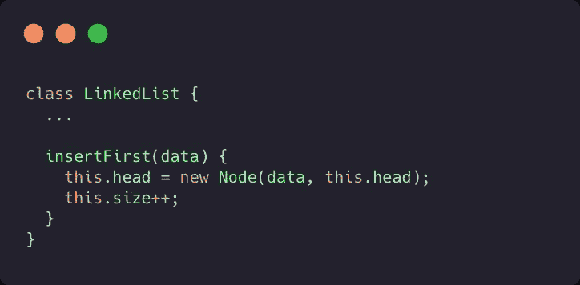

insertFirst Method

这个片段假设你的列表是*而不是*空的。它将新节点指定为 LinkedList 的当前节点。添加的节点 ***下一个*** 然后引用插入之前的头节点，有效地将其删除。然后增加尺寸计数器！

如果将第一个节点添加到空列表中，该节点的 ***NEXT*** 将为空。因为它是唯一的元素，所以它同时是链表的头和尾。

# 将节点添加到列表的末尾

这个变得有点复杂，我们必须考虑我们的第一个边缘情况，*如果列表当前是空的。*

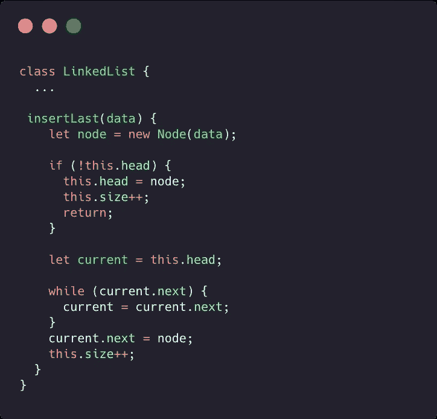

insertLast method

要将一个节点添加到链表的末尾，我们需要遍历链表的末尾，并将尾节点的 ***NEXT*** 引用更改为新节点。循环遍历您的节点，直到 current.next === null，然后将那个 ***NEXT*** 属性设置为您的新节点。

当我们的链表被初始化时，它是空的，它的 head 属性被设置为 null。我们的 if 语句评估边缘情况。

# 向指定索引添加节点

现在来看一个更复杂的问题。

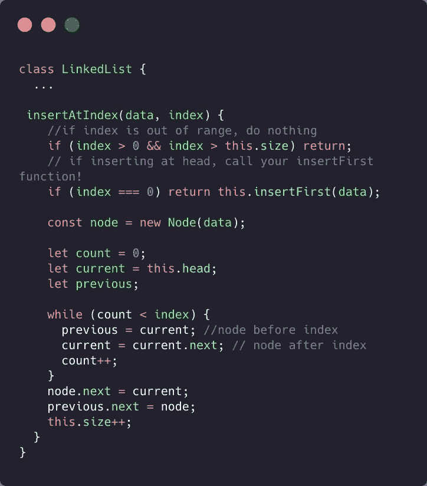

insertAtIndex method

如你所见，这一次要考虑更多的因素。让我们从顶部的两个边界条件句开始。

第一个是检查给定的索引是否在我们的列表的实际长度内。如果它大于我们列表的大小，我们不想做任何事情(如果你愿意，你可以添加一个日志)。

**第二个**检查索引是否为 0，即列表的第一个元素。如果是这样，让我们在数据上调用已经创建的 insertFirst()方法。这将添加一个新的第一个节点。

现在来看我们函数的核心部分。

*   我们需要循环遍历我们的列表，但是我们想在索引之前停止，为此我们需要迭代器变量 ***count。*** 每次循环它都要递增，并与传入的索引进行比较。
*   我们从列表的开头开始，所以 current 是用我们的头节点定义的。我们还初始化了一个 previous 变量，它将在插入之前保存节点。
*   在循环结束时， **current** 将引用我们期望索引处的节点，而 **previous** 将引用之前的节点。所以我们想设置我们的新节点 ***下一个*** 来引用当前**变量中的节点，我们的**上一个**节点 ***下一个*** 来引用新节点。**

# 从指定索引中删除节点

非常类似于 insertAtIndex，但是这一次我们想要在指定的索引处提取节点。

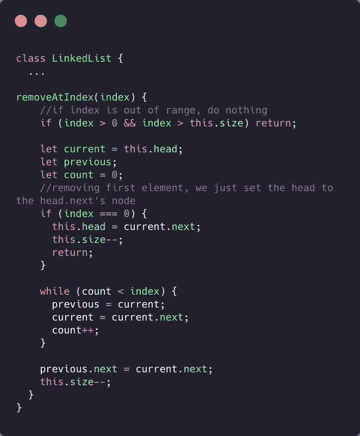

removeAtIndex

为此，我们设置**上一个**节点 ***下一个*** 引用目标节点 ***下一个*** 引用。有效地从列表中移除目标索引处的节点。

类似的边缘情况再次出现，一个检查索引在我们的列表中是否有效，另一个检查我们是否删除了头节点。

我们再次循环，直到我们的计数刚好低于索引输入。这使得**当前的**变量引用目标索引处的节点。剩下要做的就是从链表中取出所有对目标节点的引用。

将**前**节点 ***下*** 设置为引用**当前**节点 ***下一步，*** 有效地移除目标索引中节点的所有踪迹。

# **打印出你的链表数据**

我们今天要尝试的最后一个方法是打印出链表中每个节点的数据。这比上两个稍微简单一点。

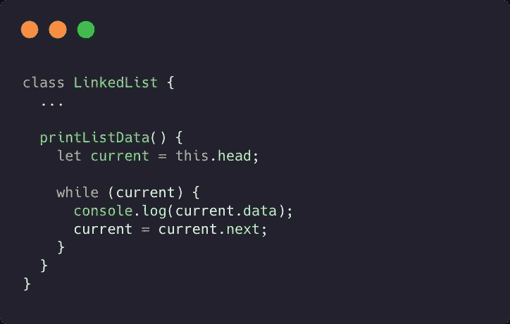

这个方法将从头到尾遍历我们的链表，并记录每个节点的数据属性。

*   **当前**变量允许我们向下遍历列表。在每个循环结束时，我们将它更改为下一个节点，这样我们就可以访问它的数据。
*   while 循环继续，直到**电流**不再真实。

记住 tails ***NEXT*** 属性指向 null，所以一旦 **current** 设置为 null，循环就中断了。

**让我们看看我们所有的劳动成果，记录在下面一段漂亮的代码里**

```
const list = **new** LinkedList;list.insertFirst(10);
list.insertFirst(20);
list.insertAtIndex(1000, 1);
list.insertAtIndex(40, 2);
list.removeAtIndex(3);
list.insertLast('hey');list.printListData();// 20
// 1000
// 40
// hey
```

每次我们调用 insertFirst 都会将新的节点设置到头部，这意味着上一个节点被替换。在这种情况下，带有 data: 10 的节点被向下移动到索引 3，然后被我们的 removeAtIndex(3)删除。

# 当然还有更多要学的

那就是我们要停下来的地方。使用和操作链表还有很多其他方法。您可以根据数据值删除一个节点，或者打印出给定索引处的节点数据，这完全取决于您想要解决的问题。希望这给你一个开始的地方！

Im 绝不是链表或数据结构方面的专家，这些方法也不是解决任何给定问题的唯一方法。所以，自己尝试一下，让代码成为你的！如果你有一个漂亮的方法让这些解决方案更优雅，我很想听听。

> 参考资料
> [链表数据结构| Traversy Media](https://www.youtube.com/watch?v=ZBdE8DElQQU)
> [链表数据结构| Bradley Mark](/swlh/the-linked-list-data-structure-bb95b009129)
> [用 Javascript 构建链表| Satish Naikawadi](https://satishnaikawadi.me/posts/build-a-linked-list-in-javascript)
> 代码片段美自[碳自](https://carbon.now.sh/)