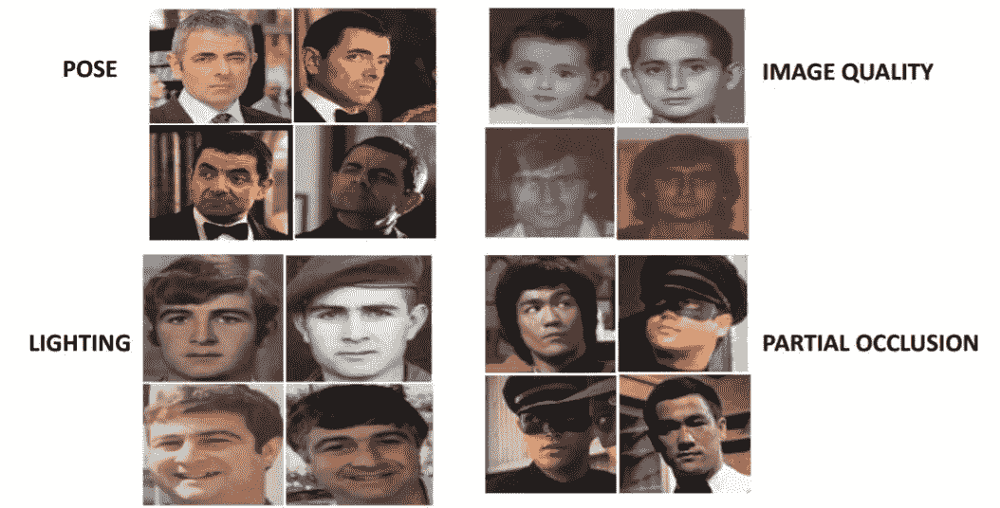
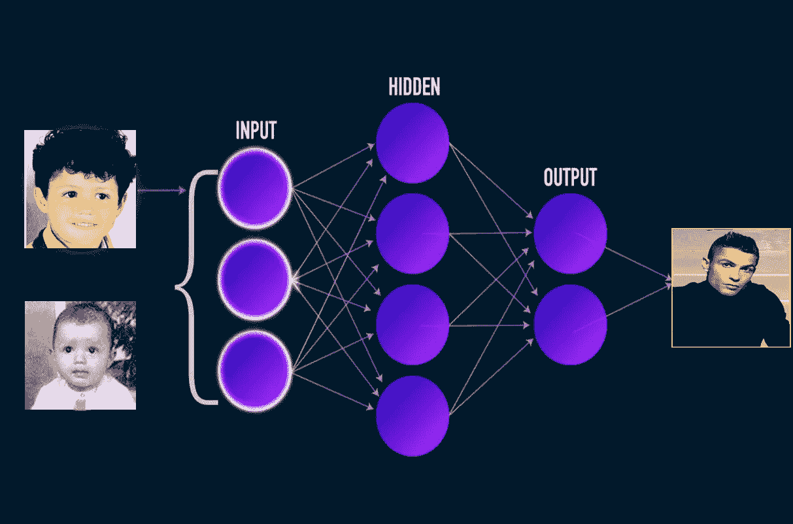

# 年龄不变人脸识别导论

> 原文：<https://medium.com/geekculture/an-introduction-to-age-invariant-face-recognition-404e8d44ab48?source=collection_archive---------24----------------------->

大家好，欢迎来到我的第一篇媒体文章。本文将讨论最流行和最具挑战性的计算机视觉应用之一:年龄不变人脸识别(AIFR)。

由于这是一个需要讨论的大话题，并且这篇文章不足以完成所有的事情，我想仅仅介绍一下 AIFR，它的挑战，动机，以及它的各种应用。

但在此之前，我只是简单定义一下什么是人脸识别。它是通过人脸来识别或验证一个人的身份，它有两种类型。

(I)人脸识别:是对人脸图像进行分类的分类问题

(ii)人脸验证:确定给定的两幅人脸图像是否属于同一身份。现在回到 AIFR 的定义。就像他们说的，一张图胜过千言万语。

Figure 1\. Example showing pictures of Cristiano Ronaldo at different age

你现在应该已经猜对了这位著名的足球运动员，是的，所有这些照片都是关于足球运动员克里斯蒂亚诺罗纳尔多的。这概括了什么是年龄不变人脸识别，它简单地意味着当一个人的脸经历了几次变化时，识别整个 different 年龄的人脸。

人脸是一个复杂的物体，随着年龄的增长，模拟它经历的各种变化几乎是不可能的。在 different 各年龄组中，由于一个人的形状和质地的变化导致的类内变化多于类间变化。听起来很困惑对吧！以下数字可能会消除你的疑虑。

Figure 2\. Example depicting More Intraclass Variation than the Interclass Variation

是的，与第二对照片相比，第一对照片看起来像同一个人，尽管它来自不同的人，这意味着比类间差异更多的组内差异或差异。

除此之外，人脸识别还面临着许多挑战，例如人的不同姿势、输入数据的图像质量、图像的闪电条件以及部分或完全遮挡。

Figure 3 Challenges of Face Recognition

AIFR 提供了广泛的应用，用于实际的日常生活场景，这为我写这篇博客的动机定下了基调。

# **动机和应用**

问题的动机来自于无数现实生活中的应用。下面列出了 AIFR 在现实世界中的一些著名应用。

**生物特征**:利用一个或多个与众不同的生物特征来唯一识别一个人。独特的特征包括指纹、视网膜和虹膜图案。此外，在衰老过程中提高面部识别能力也提高了模型的鲁棒性。在此期间，一张脸可能会发生重大变化。这是一个人的脸将与很久以前拍摄的图像进行比较的例子。

取证: AIFR 也许在取证中找到了最大的用处。执法机构通常需要通过将嫌疑人的面部与多年前拍摄的面部照片进行比较来识别和确定通缉犯。可能会有法医专家要求改变罪犯面部年龄的情况。因此，这需要一个在老化情况下的健壮的人脸识别模型。

**医学:**通过发现一个人不适当的早衰来诊断疾病。早期发现疾病比以后发现疾病更有助于 effectively 的治疗。

由于这些应用的敏感性，必须开发鲁棒且准确的算法来识别不同年龄的人脸。

# **临近**

有两种方法可以解决这个问题。

其中之一是生成方法，我们试图构建 2D 或 3D 模型来补偿由老化过程引起的年龄变化。这种方法需要假设几个参数，并需要准确的年龄标签来解决这个问题。由于对精确老化过程建模的复杂性，这种方法变得非常昂贵，并且根本不适合真实世界的应用。

另一种方法是鉴别方法，其中该方法旨在模拟合适的特征表示和 efficient 匹配框架。这种方法的问题是特征仍然由年龄信息组成，因此不适用于 AIFR。

**基于深度学习的 AIFR:** 最近，由于巨大的数据可用性、计算能力等，深度学习(DL)在解决这个问题上获得了动力。与传统的常规方法相比，从给定的输入数据中学习和表示隐藏特征的能力和强度使得深度学习模型成功地获得了更好的结果。

Figure 4\. Deep Learning Neural Network

# 结论和要点

本文简要讨论了人脸识别、年龄不变人脸识别、它的各种挑战、这个问题背后的动机以及它的各种实际应用。写和分享这篇文章真是太棒了。我希望你也喜欢读它。在我的下一篇文章中，我将讨论解决这个问题的各种数据集和深度学习算法。在那之前保持安全并继续学习:)