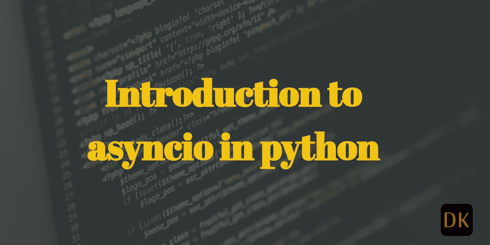

# python 中的 asyncio 简介

> 原文：<https://medium.com/geekculture/an-introduction-to-asyncio-in-python-5d3e19a02263?source=collection_archive---------1----------------------->

## 你好 asyncio 世界！



image source: [https://dock2learn.com/tech/asyncio-in-python/](https://dock2learn.com/tech/asyncio-in-python/)

# 简介:

Asyncio 是`python`中`concurrent programming`的工具，比螺纹和`multi-processing`重量更轻。这基于执行一组任务的事件循环，重要的是，这些任务可以自由选择何时将`yield`控制返回到事件循环。

# asyncio 的目标用户:

`asyncio`图书馆是针对这两者的

1.  最终用户开发人员
2.  框架开发人员

我们属于第一类，在这一类中，我们构建将被某些用户使用的应用程序。例如，应用程序可以是`fastapi`应用程序。

框架开发人员是用 python 编写库的人，这些库将被像我们这样的最终用户应用程序开发人员使用。

# 你好 asyncio 世界！

编写程序的步骤如下

1.  创建一个事件循环。
2.  调用属于协同例程的异步/等待函数。
3.  创建一个在循环中运行的任务。
4.  等待任务完成。
5.  关闭循环。

现在，让我们开始我们的第一个 asyncio 程序。

```
import asyncio, time

async def hello_world():
    print(time.ctime())
    await asyncio.sleep(1.0)
    print(time.ctime())

asyncio.run(hello_world())
```

输出:

```
Tue Feb 8 09:31:51 2022 
Tue Feb 8 09:31:52 2022
```

现在，我们引入了两个新的关键词`async`和`await`。任何用`async def`声明的 python 函数都称为`coroutine`函数。

`await`关键字总是接受一个为`awaitable.`的参数

1.  协同程序(作为异步定义的结果而执行的函数)。
2.  任何实现特殊方法`__await__`的对象。

嗯，我们讨论了编写`asyncio`程序的几个步骤。然而，hello world 程序与它们不太匹配。让我们一层层剥开。在`asyncio.run()`的引擎盖下到底发生了什么。

# 在 asyncio.run()的引擎盖下:

为了理解`asyncio.run()`到底是做什么的，让我们在不使用`run()`方法的情况下重写 hello world asyncio 程序。

[https://media.giphy.com/media/du8jrWgg9A9XdoIRJ7/giphy.gif](https://media.giphy.com/media/du8jrWgg9A9XdoIRJ7/giphy.gif)

```
import asyncio, time

async def hello_world():
    print(time.ctime())
    await asyncio.sleep(1.0)
    print(time.ctime())

loop = asyncio.get_event_loop()
task = loop.create_task(hello_world())
loop.run_until_complete(task)
loop.close()
```

输出:

```
Tue Feb 8 09:31:51 2022 
Tue Feb 8 09:31:52 2022
```

这个程序和第一个完全一样，除了它更全面一些。我们不使用 run()方法来执行协程。相反，我们创建一个`event loop`并作为`event loop`的一部分运行任务。

```
loop = asyncio.get_event_loop()
```

这一步得到一个`event loop`。为什么我们需要一个？答案很简单。`Coroutines`不能像普通 python 函数一样直接调用它们来执行。他们需要一个事件循环来运行。这就是我们如何得到一个☝️。在协程之外的任何地方调用`get_event_loop()`总是给出相同的实例。

```
task = loop.create_task(hello_world())
```

要执行一个协程，必须创建一个`task`。没有这个，`coroutine`永远不会被执行。`create_task`调度协程在事件循环上运行。这将返回一个任务对象。可以使用`task.result()`提取返回值，其中 task 是任务对象。

```
loop.run_until_complete(task)
```

这是一个阻塞调用，将一直运行到协程完成。`asyncio.run()`内部调用这个方法，类似的阻塞主线程。

```
loop.close()
```

这是最后一步，应该对停止的循环调用 close()。闭环无法恢复。asyncio.run()为每次运行创建一个事件循环，并负责关闭。

# 总结:

我希望这篇文章能够帮助您逐步进入 python asyncio 的世界。

这只是对 asyncio 编程的介绍。我将在以后的文章中更多地讨论事件循环，使用上下文管理器和 asyncio 等。任何 asyncio 程序都应该遵循上述步骤，这样就很容易更好地理解 asyncio 库。

话虽如此，asyncio.run()是我们在日常编程中最常用的。这些步骤是为了理解内部发生了什么。

# 警告:

1.  `asyncio`不会让你的程序更快。*想得开！它只是避免了线程必须做的上下文切换和竞争条件。*
2.  `asyncio`不除去 GIL。它只是不需要处理它，因为它是单线程的。
3.  `asyncio`完全消除所有竞态条件。*嗯！不是真的*。它可以避免多线程程序可能引入的竞争情况，例如同一进程内的共享内存访问。主要的优点是我们确切地知道在哪里有控制转移，因为关键字`await`使得调试更容易。

*原载于 2022 年 2 月 8 日*[*https://dock2learn.com*](https://dock2learn.com/tech/asyncio-in-python/)*。*