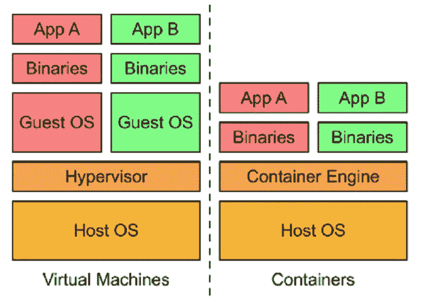

# 集装箱和集装箱化介绍

> 原文：<https://medium.com/geekculture/an-introduction-to-container-and-containerization-b6ac6010354?source=collection_archive---------3----------------------->

## 有了容器，你就不再有在笔记本电脑上工作但在生产环境中不工作的代码了。

在讨论容器的含义以及容器化如何改进现代应用程序部署之前。部署应用程序的默认方式是在它自己的物理计算机上。要设置一个，你会发现一些；

物理空间，

权力，

冷却，

网络连接，

安装操作系统，

任何软件依赖性，以及

应用程序本身。

如果您需要更高的处理能力、冗余、安全性或可扩展性，您会怎么做？

嗯，你必须增加更多的电脑。每台计算机只有一个用途是很常见的。例如数据库、web 服务器或内容交付。

正如您可能想象的那样，这种做法浪费了资源，并且花费了大量时间来部署、维护和扩展。它也不太便于携带。应用程序是为特定的操作系统构建的，有时甚至是为特定的硬件构建的。

虚拟化的曙光已经到来。虚拟化有助于在同一台物理计算机上运行许多虚拟服务器和操作系统。虚拟机管理程序是一个软件层，它打破了操作系统与其底层硬件的依赖关系，并允许多个虚拟机共享同一硬件。KVM 是一种众所周知的虚拟机管理程序。

如今，您可以使用虚拟化来快速部署新服务。现在，采用虚拟化意味着我们部署新解决方案所需的时间更少。我们在使用的物理计算机上浪费的资源更少。我们获得了一些改进的可移植性，因为虚拟机可以被映像，然后到处移动。

但是，应用程序、其所有依赖项和操作系统仍然捆绑在一起。从一个虚拟机从一个虚拟机管理程序产品转移到另一个虚拟机管理程序产品并不容易。每次你启动一个虚拟机，它的操作系统仍然需要时间来启动。

在单个虚拟机中运行多个应用程序还会产生另一个棘手的问题。共享依赖项的应用程序并不是相互隔离的。一个应用程序的资源需求会耗尽其他应用程序所需的资源。

一个应用程序的依赖性升级可能会导致另一个应用程序停止工作。你可以尝试用严格的软件工程政策来解决这个问题。例如，您可以锁定任何应用程序都无法更改的依赖项。但是这导致了新的问题，因为依赖关系确实需要偶尔升级。

您可以添加集成测试来确保应用程序正常工作。集成测试很棒，但是依赖问题会导致新的故障模式，很难排除。如果您必须依赖集成测试来对您的应用程序环境执行基本的完整性检查，那么它确实会降低开发速度。

现在，解决这个问题的以虚拟机为中心的方法是为每个应用程序运行一个专用的虚拟机。每个应用程序维护自己的依赖关系，内核是独立的。因此，一个应用程序不会影响另一个应用程序的性能。正如您在这里看到的，您可以获得正在运行的内核的两个完整副本。但是在这里，我们也可能遇到你可能会想到的问题。将这种方法扩展到成千上万的应用程序，您会很快发现它的局限性。想象一下尝试做一个简单的内核更新。因此，对于大型系统，专用虚拟机是多余和浪费的。虚拟机启动也相对较慢，因为整个操作系统必须启动。

解决依赖性问题的一个更有效的方法是在应用程序及其依赖性的层次上实现抽象。您不必虚拟化整个机器甚至整个操作系统，而只需虚拟化用户空间。用户空间是驻留在内核之上的所有代码，包括应用程序及其依赖关系。这就是创建容器的意义。容器是运行应用程序代码的独立用户空间。

容器是轻量级的，因为它们没有完整的操作系统。它们可以被调度或紧密地打包到底层系统上，这是非常高效的。它们可以非常快速地创建和关闭，因为您只是启动和停止组成应用程序的进程。而不是启动整个 VM 并为每个应用程序初始化操作系统。开发人员欣赏这种级别的抽象，因为他们不想担心这个系统的其余部分。

容器化是管理代码发展的下一步。您现在理解了容器是应用程序代码的交付工具。它们是轻量级、独立、资源高效、可移植的执行包。您可以在台式机、笔记本电脑和服务器上以通常的方式开发应用程序代码。该容器允许您在虚拟机上执行最终代码，而无需担心软件依赖性，例如:

应用程序运行时，

系统工具，

系统库，以及

其他设置。

您将代码与它需要的所有依赖项打包在一起，执行您的容器的引擎负责使它们在运行时可用。

容器对开发人员很有吸引力，因为它们是一种以应用程序为中心的方式来交付高性能和可伸缩的应用程序。容器还允许开发人员安全地对底层硬件和软件做出假设。有了底层的 Linux 内核，您就不再有在笔记本电脑上工作但在生产环境中不工作的代码了。容器是一样的，在任何地方运行都是一样的。如果您对基于产品映像的容器进行增量更改，那么您可以使用单个文件副本非常快速地部署它。这加快了你的开发过程。

最后，容器使得构建使用微服务设计模式的应用程序变得更加容易，微服务设计模式是松散耦合的细粒度组件。这种模块化设计模式允许操作系统扩展和升级应用程序的组件，而不会影响整个应用程序。