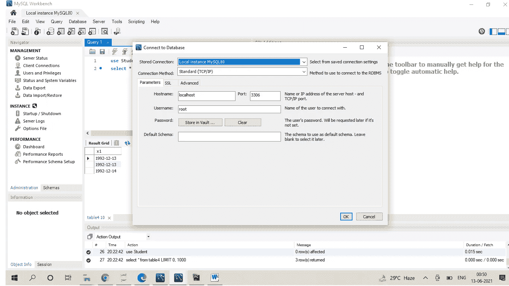
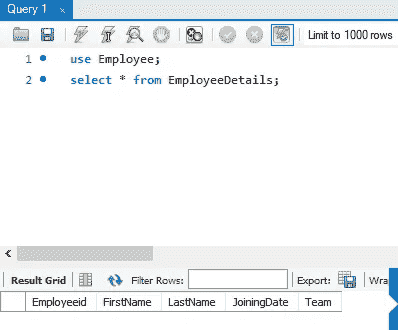
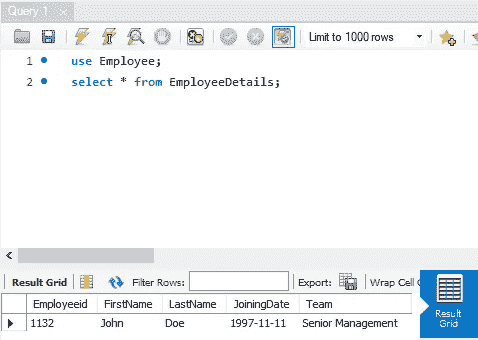
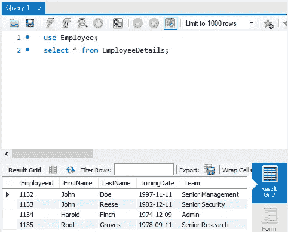
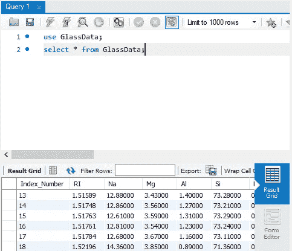

# Python 数据持久性简介

> 原文：<https://medium.com/geekculture/an-introduction-to-data-persistance-with-python-6c9b0364c4c9?source=collection_archive---------26----------------------->

数据库管理中的 Python

Image Reference : [https://wallpaperaccess.com/database](https://wallpaperaccess.com/database)

# Python 和数据库简介

从基于 web 的应用程序到简单的桌面应用程序，几乎每一个其他的计算机应用程序都从一些永久存储器中存储和检索信息。该存储可以是本地硬盘驱动器或远程存储库或任何东西。大多数最新的计算机应用程序之所以尽其所能，是因为它们有能力访问和修改来自这些存储位置的数据。这种存储位置可以简单地称为“数据库”。

现在，存储在应用程序中的数据类型可以是结构化的形式，如表，其中每一列中的信息与另一列中的信息有某种关系。

一些类型的结构化数据库(SQL)是 MySQL、Oracle、SQLite 等。类似地，我们也可以用半结构化的形式存储数据。这种类型的数据库被称为 NoSQL(不仅仅是 SQL)。一些类型的 NoSQL 是 MongoDB，Cassandra 等。

# 数据库管理中的 Python

好吧，我们确实有明确的方法来摆弄数据库。我们可以学习 SQL(结构化查询语言)或者 NoSQL(不仅仅是 SQL)来管理数据库。好吧，好吧，好吧，我们也需要不同的 GUIs 应用程序来访问这样的数据库。像往常一样，“巨蟒”来救援了。我们可以使用 Python 直接访问数据库并使用它们。我们所需要的就是在数据库服务器和 Python 之间建立一个连接。然后在 Python 中执行数据库查询就像吃蛋糕一样简单。

在这篇介绍性文章中，我们试图理解如何在数据库服务器和 Python 之间建立连接。我们选择 MySQL，一种结构化数据库的形式。我们继续进行的唯一要求是在我们的系统中安装 MySQL workbench。通过 Python 使用 MySQL 时，MySQL workbench 需要保持打开。这是必不可少的，因为当 Python 试图建立连接时，MySQL 服务器需要是活动的。

本文中的所有代码及其输出都可以在我的 [Github](https://github.com/arvindhhp/PyDB/blob/main/Part_001_MySQL_Python_Connection.ipynb) repo 中找到，同时还有所使用的[支持文件](https://github.com/arvindhhp/PyDB/tree/main/Ancillary_Files)。

# 在 Python 和 MySQL 之间建立连接

Python 使用“mysql”模块中的“连接器”方法来建立连接。

此外，我们需要 MySQL 主机名、MySQL 用户名和 MySQL 密码才能继续。

这在数据库-连接数据库下可用。Password 是安装过程中设置的 MySQL 密码。

MySQL Connection Options

MySQL Python Connection Establishment

# 代码是怎么说的…

第 1 行导入必要的模块。

第 6 行建立了 MySQL 和 Python 之间的联系。如果连接建立成功，is_connection()方法返回 True。

就像文件操作一样，使用 close()关闭数据库连接总是好的

简单吧？

# 创建数据库

让我们试着创建一个 MySQL 数据库

MySQL Database Creation (Using Python)

# 代码是怎么说的…

像往常一样，我们从建立与 MySQL 的连接开始。

现在我们向前迈一步，创建一个光标。创建 Cursor 主要是为了在执行新查询时捕获游标在数据库中的位置。换句话说，游标是指向查询的指针。

Query 是用于实现 MySQL 中的操作的实际 SQL 查询

cursor.execute()执行查询。永远记住，查询应该是字符串格式的

接下来，我们只需要知道不同的查询是什么。

简单吧？

# 获取现有数据库的列表

既然我们已经创建了一个新的数据库，我们应该能够在可用数据库列表中看到它。

Obtaining MySQL Database List

# 在数据库中创建表

我们目前正在处理结构化数据库。这种数据库中的信息以表格的形式存储。一个数据库可以有多个表。

Creating a Table in MySQL Database using Python

# 使用 MySQL 交叉检查更新的表

Cross Checking with MySQL

正如我们所看到的，Employee 数据库中已经创建了一个空表

# 向现有表格中插入值

Inserting Values into Tables

# 再次使用 MySQL 交叉检查更新后的表

Cross Checking Update with MySQL

# 在表格中输入多行信息

Entering Multiple Values into a Table

# 再次使用 MySQL 交叉检查更新后的表

Cross Checking Update with MySQL

# 一次输入多行数据…

使用 Pandas 可以很容易地实现这一点，但是通过传统方法，如果所有信息都存储在一个. csv 文件中，我们可以一次输入大量信息。

如果外部文件中的数据不在。csv 格式，我们可以把它转换成。逗号分隔值（csv）文件格式

感谢 ineuron.ai 的这段代码。请确保在执行代码之前有一个数据库“GlassData”存在。

# 再次使用 MySQL 交叉检查更新后的表

Cross Checking wiy MySQL

> 所以，欢迎来到 Python 结构化数据库的世界。恭喜你！！！

本文中的所有代码都可以在 [Github](https://github.com/arvindhhp/PyDB/blob/main/Part_001_MySQL_Python_Connection.ipynb) 中找到。