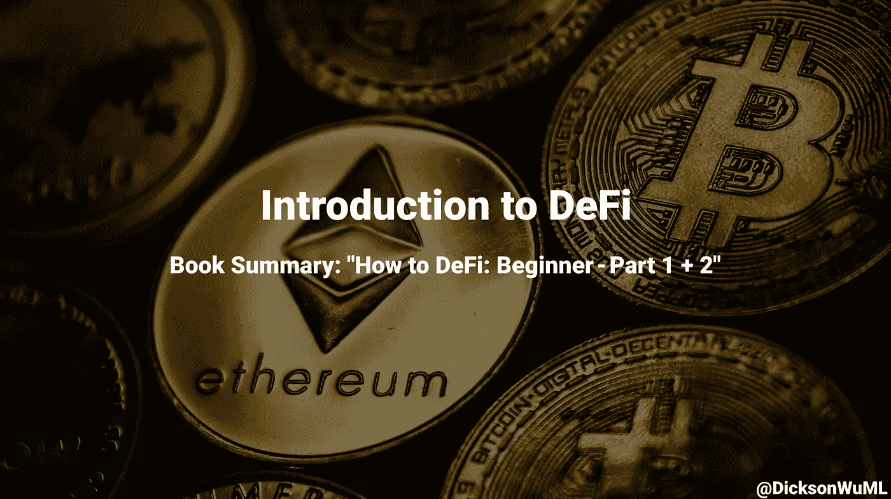

# DeFi 简介

> 原文：<https://medium.com/geekculture/an-introduction-to-defi-1ce2787bb29c?source=collection_archive---------6----------------------->

## 书籍摘要:“如何定义:初学者—第 1 + 2 部分”

> 作者:达伦·刘，达里尔·刘，丁时珍，克里斯蒂安·高，Erina Azmi，本杰明·霍，卢修斯·方，霍尔·温温

# 第一章:传统金融机构

先从正规银行说起。他们是金融行业的核心——便利支付(存款、取款、转账)、发放 T2 贷款等等！它们是如此之大，以至于前十大公司的市值达到了**、2 万亿美元**。

但是这些银行是由人类经营的。人类会犯错，会腐败，会管理不善。2008 年就是经典的例子。

那就是 **CeFi** (集中财政)。 **DeFi** (分散融资)将通过以下方式**革新** CeFi:

1.  **支付&清算系统**
2.  **无障碍**
3.  **集中化&透明度**

## 支付和清算系统:

转账是一件痛苦的事——尤其是如果他们在另一个国家。这需要几天时间，而且到处都有**费用**(汇率、国际出境费、国际入境费)。

**DeFi 绕过中间人**所以你保留所有费用(但你只需支付一点费用)+完成交易需要 15 秒到 5 分钟！

## 可访问性:

不是每个人都能接触到金融工具——17 亿人没有银行账户！主要是因为贫穷、地理和信任问题。但是他们中 66%的人有可以上网的手机，这意味着他们可以上网。

DeFi 是推动无国界、无审查、向每个人开放金融工具的时刻的一部分，不管你是谁。不存在歧视。

## 集中化和透明度:

银行可能会搞砸——非常糟糕。2008 年，出于贪婪，信用评级机构给了高风险证券最高评级，导致华盛顿互惠银行和雷曼兄弟(存款总额超过 8000 亿美元)等大银行倒闭。美国有 500 家银行倒闭。

另一方面，DeFi 的一切都是开源的，所以每个人都可以看到发生了什么。**去中心化** **治理**防止 1 个坏演员把一切都搞砸。

DeFi 协议是用代码行写的，所以你不能欺骗规则而不被抓住。不是每个人都可以阅读代码，但是我们可以衡量声誉、口碑和其他开发人员的评论，看看发生了什么。一切都是透明和分散的。

## 分散金融与传统金融:

当前的银行体系存在许多问题。不是每个人都能获得对他们的访问权，也不是每个人都能和 T2 公平竞争。

当散户投资者将 GME 带上月球时，罗宾汉介入并限制交易——原来 Citadel 是罗宾汉最大的客户之一，他们因为做空 GME 而损失了数十亿美元。

DeFi 旨在让所有人都能不受任何歧视、不受审查地获得金融服务。CeFi 和 DeFi 都有很多优点和缺点。这本书将向您展示 DeFi 的闪光点，以及如何使用它来解决现实世界的问题！

# 第二章:

我们知道什么是集中财政，但是我们一直在谈论的分散财政是什么？字面上就是**金融工具** — **减去集权**。因此，我们在分散式应用程序(Dapps)上构建这些应用程序。

DeFi 不是一个产品或公司——它是一系列协议和公司的集合。我们甚至可以将几个 DeFi Dapps 组合在一起，因此我们称之为**金钱乐高**！

DeFi Dapps 致力于在智能合约中锁定抵押品。**总值锁定= DeFi**的增长指标。这里有一些关于这一领域发展的惊人数据:

*   开始 2019 =**【2.75 亿美元**
*   2020 年 2 月=**12 亿美元**
*   **2021 年 4 月= 860 亿美元**

## **DeFi 生态系统:**

**DeFi 正在疯狂发展——因此出现了许多类别——因此我们无法涵盖本书的所有内容。但是这个生态系统是高度实验性的，所以 DeFi 可能会变得跟今天不一样！**

## **DeFi 的分散程度如何:**

**有 3 种不同类型的 DeFi:**

1.  ****集中**:托管、集中版本:价格馈送、确定利率、保证金通知的流动性。例如:盐、块状、Nexo、摄氏**
2.  ****半分散**:其具有**以下一项或多项**:非托管、分散:价格馈送、利率确定、平台开发+更新+无权限:保证金追缴、保证金流动性。Ex:复合，马克道，dYdX，bZx**
3.  ****完全分散**:一切都是分散的。目前**还没有完全分散的 DeFi 协议**。**

**大多数 DeFi Dapps 是半分散的。**

## **定义关键类别:**

**本书涵盖 9 个主要类别:**

1.  ****稳定货币** : **加密货币**超级**波动** (\pm 10%)。如果我们不想要波动性，我们可以建立一个基于稳定资产的稳定货币。USDT (Tether)是第一个稳定的硬币，每个 USDT 都有银行账户中的 1 美元支持(尽管我们必须信任 Tether 来完成他们的工作)。分散式 stablecoins 以分散方式运行，以克服信任问题。**
2.  ****贷款&借款**:任何抵押了数字资产的人都可以**获得贷款**。你甚至可以**将钱**贷出到借贷池中并赚取利息！不需要银行账户或信誉**
3.  ****交易所**:我们需要交易所**将**一种加密货币换成另一种。我们可以通过集中的方法(比特币基地、币安)来实现，但他们都是中间人+保管人→这意味着我们不能完全控制我们的资产(这意味着如果他们遭到黑客攻击，我们就完蛋了)。分散交换让交换发生而不被放弃**监护权**。**
4.  ****衍生品**:其价值专用于其他资产的合约。我们可以在分散市场中与他人进行衍生品交易。**
5.  **基金管理:监督你的资产，管理你的钱，让你得到更多的钱！DeFi 允许被动的资金管理，你可以看到你的钱是如何被管理的+成本**
6.  **彩票:你让很多人把他们的钱集中在一起。你拿着钱，把它拿到**里积累利息**。在时间间隔结束时，1 人获得所有利息，其余人获得退还给他们的彩票(**无损失彩票**无任何集中数字)**
7.  ****支付**:我们可以用 DeFi 做普通的**交易**，还可以做一些更有创意的版本！像**流支付** →“按使用付费”，但更好**
8.  **保险:由于所有的代币和合同都在区块链上，它们有被黑客攻击的可能性，因此保险来保护你自己**
9.  ****治理**:商业**管理**，但**隐密风格**。您向人们分发治理令牌，让他们在如何推进项目方面拥有投票权**

# **第三章:分散层:以太坊**

****以太坊是 Dapps 的全球开源平台**！它一直在运行，没有人能关闭它——因此许多开发者在以太坊上部署他们的 Dapps(用于 DeFi)。**

## **什么是智能合同？**

**这是两方之间的**可编程合同**，将**在不信任第三方**的情况下执行。这些智能合约实际上只是“**if this then than**”但在区块链上。我们甚至可以**将多个智能合同**连接在一起，构建更复杂的操作**

## **什么是以太(ETH)？**

**以太是以太坊的**货币。我们可以像使用比特币一样使用它，让它物有所值。但也用于**支付网络运行智能合约** ( **气**运行智能合约)。乙醚也用作储备货币。****

## **什么是气体？**

**以太坊上运行的一切都需要支付费用——这个**费用就是气**。更准确地说，Gas 是执行智能合同的计算工作量的计量单位。**

**天然气价格将会波动。这就像一条**供求曲线**。如果需求大量涌入(更多的交易，更智能的合同执行)，那么天然气费用就会上涨。但如果需求减少，天然气价格就会下跌。**

**我们也可以自己设定油价！网络优先处理天然气费用最高的交易。如果你有一个较低的汽油费，那么你将被添加到队列中，从而需要更长的时间来执行。**

**记住还有**汽油费**和**汽油本身**。气费是你定的东西，但气本身是由你要求的复杂程度决定的。总乙醚消耗量= #气体×气体进料**

## **什么是分散式应用程序(Dapps)？**

****dapp 是与智能合约交互的接口**。它们就像普通的应用程序，除了一些额外的功能**比如需要气体或者集成在区块链中。****

**Dapps 的优势:**

*   ****不变性**:信息一旦上了区块链，你就不能更改了**
*   **防篡改:你不能在不通知网络上所有人的情况下篡改合同**
*   **透明:任何人都可以看到并审计它**
*   **只要以太坊还活着，我们的契约就仍然有效**

**Dapps 的缺点:**

*   ****不变性**:如果他们有错误，他们可能会导致大问题**
*   ****透明**:任何人都可以看到它们，因此黑客可以发现漏洞**
*   ****可扩展性**:Dapp 的带宽受到区块链本身的限制**

## **以太坊还能用来做什么？**

**以太坊可以创造 **DAOs** (去中心化自治组织)或者**创造其他加密货币**。**

****道**通过**民主**和**治理，使用代码**强制执行。这使得它透明地操作并避免被篡改。**

**我们还可以**创建其他令牌**！常见的两种是 **ERC-20** 和 **ERC-721** 。ERC-20 是创造其他类型的货币(可替代的)，而 ERC-721 是创造收藏品(不可替代的)。**

## **以太坊的未来:**

**以太坊的人气疯狂增长，是 DeFi 的中心支柱。先发优势让它比其他竞争对手增长更多。但是这种成功给网络本身带来了很大的压力→ **汽油费**！由于汽油费如此之高，更有效率的竞争者如雨后春笋般涌现。**

**但是以太坊正计划升级到 ETH 2.0，那里将会有“碎片化”并解决高昂的汽油费。**

# **第四章:以太坊钱包**

**钱包是**管理**你的私钥+让你接收、存储和发送加密货币的接口。**

## **保管与非保管钱包:**

****保管钱包**是第三方保管你的加密货币+保持控制权的地方。**非保管钱包**则相反——你控制并拥有你的加密货币。**

**你可以使用保管钱包——这样你就不用担心安全问题了！但是你必须相信这个第三方，他们可能真的会输掉你的钱！Mt. Gox 是一个保管钱包，2014 年丢失了 85 万个比特币。**

**使用非保管钱包意味着你必须承担保护你的私人钥匙+不要忘记他们的负担。这本书包括了两个用于 ETH 网络的 DeFi 友好钱包的演示。 **Mobile = Argent** (非保管钱包)。 **Desktop = Metamask** (也是非保管钱包)。**

**如果你想了解更多:阅读这里的书！**

**感谢阅读！我是迪克森，一个 18 岁的加密爱好者，很高兴用它来影响数十亿人🌎**

**如果你想跟随我的旅程，你可以加入[我的每月简讯](https://bit.ly/DicksonNewsletter)，查看[我的网站](https://bit.ly/DicksonWebsite)，连接 [LinkedIn](https://bit.ly/DicksonLinkedin) 或 [Twitter](https://bit.ly/DicksonTwitter) 😃**