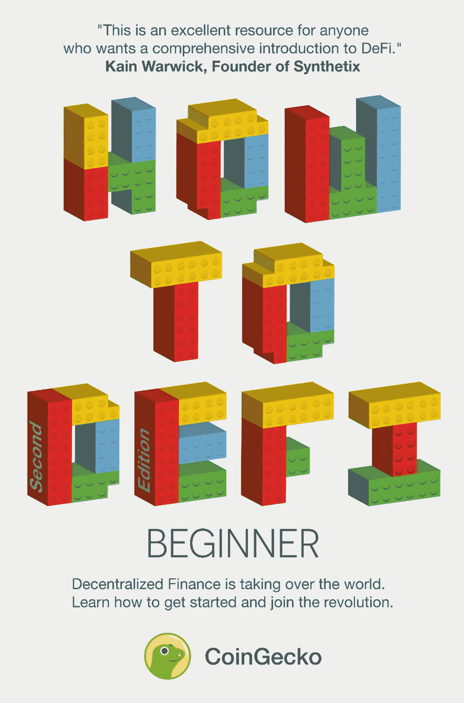
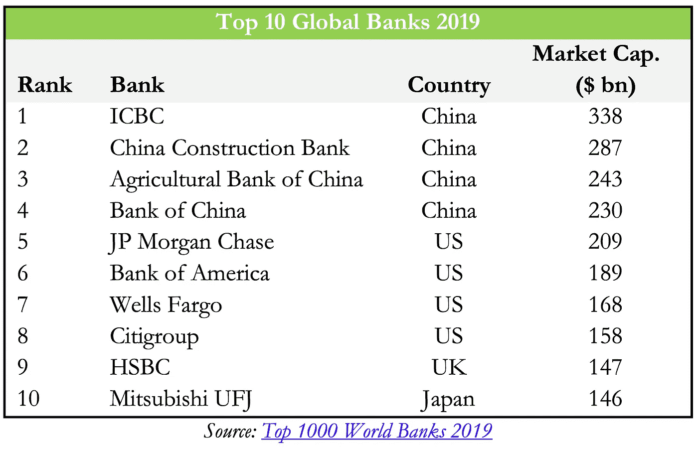
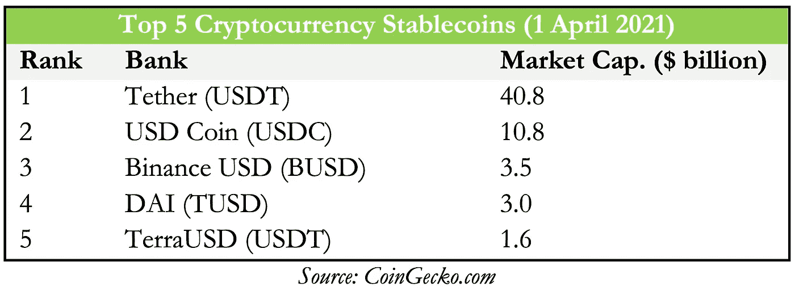
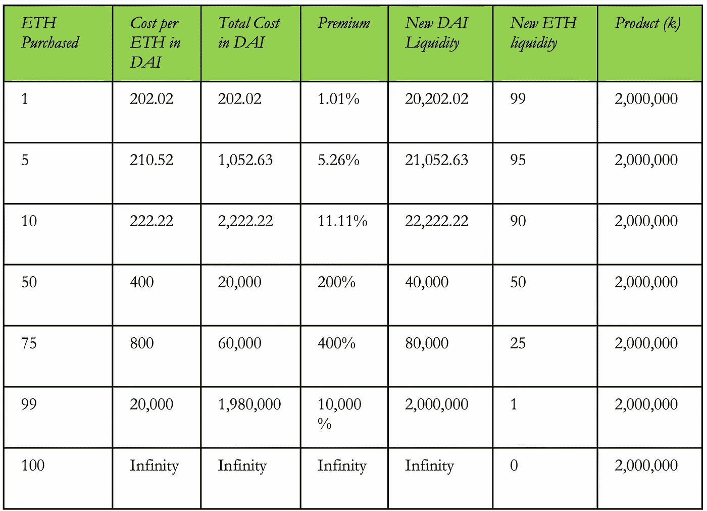
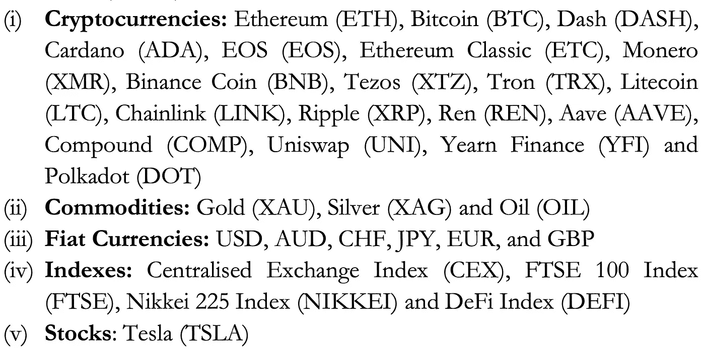
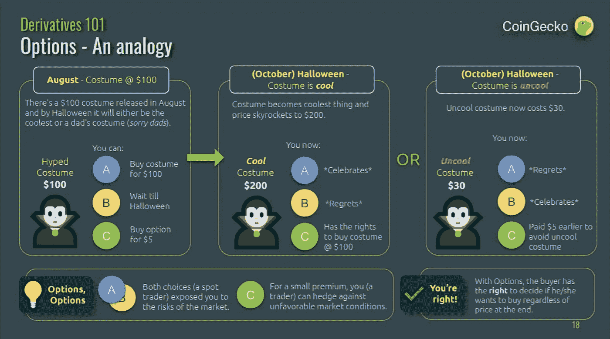

# DeFi 简介

> 原文：<https://medium.com/geekculture/an-introduction-to-defi-ba20dc924307?source=collection_archive---------19----------------------->

## 书籍摘要:“如何定义:初学者”

> 作者:达伦·刘，达里尔·刘，丁时珍，克里斯蒂安·高，Erina Azmi，本杰明·霍，卢修斯·方，霍尔·温温

# 第一章:传统金融机构

先从正规银行说起。他们是金融行业的核心——便利支付(存款、取款、转账)、发放 T2 贷款等等！它们是如此之大，以至于前十大公司的市值达到了**、2 万亿美元**。

但是这些银行是由人类经营的。人类会犯错，会腐败，会管理不善。2008 年就是经典的例子。

那就是 **CeFi** (集中财政)。 **DeFi** (分散融资)将通过以下方式**革新** CeFi:

1.  **支付&清算系统**
2.  **无障碍**
3.  **集中化&透明度**

## 支付和清算系统:

转账是一件痛苦的事——尤其是如果他们在另一个国家。这需要几天时间，而且到处都有**费用**(汇率、国际出境费、国际入境费)。

**DeFi 绕过中间人**所以你保留所有费用(但你只需支付一点费用)+完成交易需要 15 秒到 5 分钟！

## 可访问性:

不是每个人都能接触到金融工具——17 亿人没有银行账户！主要是因为贫穷、地理和信任问题。但是他们中 66%的人有可以上网的手机，这意味着他们可以上网。

DeFi 是推动无国界、无审查、向每个人开放金融工具的时刻的一部分，不管你是谁。不存在歧视。

## 集中化和透明度:

银行可能会搞砸——非常糟糕。2008 年，出于贪婪，信用评级机构给了高风险证券最高评级，导致华盛顿互惠银行和雷曼兄弟(存款总额超过 8000 亿美元)等大银行倒闭。美国有 500 家银行倒闭。

另一方面，DeFi 的一切都是开源的，所以每个人都可以看到发生了什么。**去中心化** **治理**防止 1 个坏演员把一切都搞砸。

DeFi 协议是用代码行写的，所以你不能欺骗规则而不被抓住。不是每个人都可以阅读代码，但是我们可以衡量声誉、口碑和其他开发人员的评论，看看发生了什么。一切都是透明和分散的。

## 分散金融与传统金融:

当前的银行体系存在许多问题。不是每个人都能获得对他们的访问权，也不是每个人都能和 T2 公平竞争。

当散户投资者将 GME 带上月球时，罗宾汉介入并限制交易——原来 Citadel 是罗宾汉最大的客户之一，他们因为做空 GME 而损失了数十亿美元。

DeFi 旨在让所有人都能不受任何歧视、不受审查地获得金融服务。CeFi 和 DeFi 都有很多优点和缺点。这本书将向您展示 DeFi 的闪光点，以及如何使用它来解决现实世界的问题！

# 第二章:

我们知道什么是集中财政，但是我们一直在谈论的分散财政是什么？字面上就是**金融工具** — **减去集权**。因此，我们在分散式应用程序(Dapps)上构建这些应用程序。

DeFi 不是一个产品或公司——它是一系列协议和公司的集合。我们甚至可以将几个 DeFi Dapps 组合在一起，因此我们称之为**金钱乐高**！

DeFi Dapps 致力于在智能合约中锁定抵押品。**总值锁定= DeFi**的增长指标。这里有一些关于这一领域发展的惊人数据:

*   开始 2019 =**【2.75 亿美元**
*   2020 年 2 月=**12 亿美元**
*   **2021 年 4 月= 860 亿美元**

## **DeFi 生态系统:**

**DeFi 正在疯狂发展——因此出现了许多类别——因此我们无法涵盖本书的所有内容。但是这个生态系统是高度实验性的，所以 DeFi 可能会变得跟今天不一样！**

## **DeFi 的分散程度如何:**

**有 3 种不同类型的 DeFi:**

1.  ****集中**:托管、集中版本:价格馈送、确定利率、保证金通知的流动性。例如:盐、块状、Nexo、摄氏**
2.  ****半分散**:其具有**以下一项或多项**:非托管、分散:价格馈送、利率确定、平台开发+更新+无权限:保证金追缴、保证金流动性。Ex:复合，马克道，dYdX，bZx**
3.  ****完全分散**:一切都是分散的。目前**还没有完全分散的 DeFi 协议**。**

**大多数 DeFi Dapps 是半分散的。**

## **定义关键类别:**

**本书涵盖 9 个主要类别:**

1.  ****稳定货币** : **加密货币**超级**波动** (\pm 10%)。如果我们不想要波动性，我们可以建立一个基于稳定资产的稳定货币。USDT (Tether)是第一个稳定的硬币，每个 USDT 都有银行账户中的 1 美元支持(尽管我们必须信任 Tether 来完成他们的工作)。分散式 stablecoins 以分散方式运行，以克服信任问题。**
2.  ****贷款&借款**:任何抵押了数字资产的人都可以**获得贷款**。你甚至可以**将钱**贷出到借贷池中并赚取利息！不需要银行账户或信誉**
3.  ****交易所**:我们需要交易所**将**一种加密货币换成另一种。我们可以通过集中的方法(比特币基地、币安)来实现，但他们都是中间人+保管人→这意味着我们不能完全控制我们的资产(这意味着如果他们遭到黑客攻击，我们就完蛋了)。分散交换让交换发生而不被放弃**监护权**。**
4.  ****衍生品**:其价值专用于其他资产的合约。我们可以在分散市场中与他人进行衍生品交易。**
5.  **基金管理:监督你的资产，管理你的钱，让你得到更多的钱！DeFi 允许被动的资金管理，你可以看到你的钱是如何被管理的+成本**
6.  **彩票:你让很多人把他们的钱集中在一起。你拿着钱，把它拿到**里积累利息**。在时间间隔结束时，1 人获得所有利息，其余人获得退还给他们的彩票(**无损失彩票**无任何集中数字)**
7.  ****支付**:我们可以用 DeFi 做普通的**交易**，还可以做一些更有创意的版本！像**流支付** →“按使用付费”，但更好**
8.  **保险:由于所有的代币和合同都在区块链上，它们有被黑客攻击的可能性，因此保险来保护你自己**
9.  ****治理**:商业**管理**，但**隐密风格**。您向人们分发治理令牌，让他们在如何推进项目方面拥有投票权**

# **第三章:分散层:以太坊**

****以太坊是 Dapps 的全球开源平台**！它一直在运行，没有人能关闭它——因此许多开发者在以太坊上部署他们的 Dapps(用于 DeFi)。**

## **什么是智能合同？**

**这是两方之间的**可编程合同**，将**在不信任第三方**的情况下执行。这些智能合约实际上只是“**if this then than**”但在区块链上。我们甚至可以**将多个智能合同**连接在一起，构建更复杂的操作**

## **什么是以太(ETH)？**

**以太是以太坊的**货币。我们可以像使用比特币一样使用它，让它物有所值。但也用于**支付网络运行智能合约** ( **气**运行智能合约)。乙醚也用作储备货币。****

## **什么是气体？**

**以太坊上运行的一切都需要支付费用——这个**费用就是气**。更准确地说，Gas 是执行智能合同的计算工作量的计量单位。**

**天然气价格将会波动。这就像一条**供求曲线**。如果需求大量涌入(更多的交易，更智能的合同执行)，那么天然气费用就会上涨。但如果需求减少，天然气价格就会下跌。**

**我们也可以自己设定油价！网络优先处理天然气费用最高的交易。如果你有一个较低的汽油费，那么你将被添加到队列中，从而需要更长的时间来执行。**

**记住还有**汽油费**和**汽油本身**。气费是你定的东西，但气本身是由你要求的复杂程度决定的。总乙醚消耗量= #气体×气体进料**

## **什么是分散式应用程序(Dapps)？**

****dapp 是与智能合约交互的接口**。它们就像普通的应用程序，除了一些额外的功能**比如需要气体或者集成在区块链中。****

**Dapps 的优势:**

*   ****不变性**:信息一旦上了区块链，你就不能更改了**
*   **防篡改:你不能在不通知网络上所有人的情况下篡改合同**
*   **透明:任何人都可以看到并审计它**
*   **只要以太坊还活着，我们的契约就仍然有效**

**Dapps 的缺点:**

*   ****不变性**:如果他们有错误，他们可能会导致大问题**
*   ****透明**:任何人都可以看到它们，因此黑客可以发现漏洞**
*   ****可扩展性**:Dapp 的带宽受到区块链本身的限制**

## **以太坊还能用来做什么？**

**以太坊可以创造 **DAOs** (去中心化自治组织)或者**创造其他加密货币**。**

****道**通过**民主**和**治理，使用代码**强制执行。这使得它透明地操作并避免被篡改。**

**我们还可以**创建其他令牌**！常见的两种是 **ERC-20** 和 **ERC-721** 。ERC-20 是创造其他类型的货币(可替代的)，而 ERC-721 是创造收藏品(不可替代的)。**

## **以太坊的未来:**

**以太坊的人气疯狂增长，是 DeFi 的中心支柱。先发优势让它比其他竞争对手增长更多。但是这种成功给网络本身带来了很大的压力→ **汽油费**！由于汽油费如此之高，更有效率的竞争者如雨后春笋般涌现。**

**但是以太坊正计划升级到 ETH 2.0，那里将会有“碎片化”并解决高昂的汽油费。**

# **第四章:以太坊钱包**

**钱包是**管理**你的私钥+让你接收、存储和发送加密货币的接口。**

## **保管与非保管钱包:**

****保管钱包**是第三方保管你的加密货币+保持控制权的地方。**非保管钱包**则相反——你控制并拥有你的加密货币。**

**你可以使用保管钱包——这样你就不用担心安全问题了！但是你必须相信这个第三方，他们可能真的会输掉你的钱！Mt. Gox 是一个保管钱包，2014 年丢失了 85 万个比特币。**

**使用非保管钱包意味着你必须承担保护你的私人钥匙+不要忘记他们的负担。这本书包括了两个用于 ETH 网络的 DeFi 友好钱包的演示。 **Mobile = Argent** (非保管钱包)。 **Desktop = Metamask** (也是非保管钱包)。**

# **第 5 章:分散的稳定资本**

**由于加密货币是不稳定的，稳定货币被创造出来是为了对冲价格波动，并作为交换媒介。它们是 DeFi 的重要组成部分，前 5 大稳定硬币占据了 598 亿美元。**

****

**有 3 种稳定的硬币:**

1.  ****法定抵押**(系绳)**
2.  ****(戴)****
3.  ******算法稳定积分**——不在本书中(它会在高级书中)****

****系绳，或 USDT，保留每铸造一个系绳 1 美元。系绳是最受欢迎的稳定硬币，但所有这些储备都没有开放——我们必须相信他们在做自己的工作。因此 **Tether 是一个集中的、法定抵押的稳定硬币**。****

****戴就不同了。它通过其他加密货币进行抵押，并通过 DAO 创建的协议来完成→ **戴是一种分散的、加密抵押的稳定货币**。****

****戴通过**马克尔道**来管理，马克尔道有 2 个代币！**戴**(**货币**一种，由一篮子其他加密货币(ETH、wBTC、USDC 等)支持)和**MKR**(**治理**一种，在这里你可以投票并对组织本身做出改变)。****

****赛曾经是制造者使用的令牌——它是一个单独的抵押品戴。但制造商增加了更多形式的抵押品，这就成了戴。黑色星期四的崩溃导致制造商增加了 USDC，以解决其流动性问题。****

****以下是 DAI 的三个组成部分:****

1.  ******抵押品比率**:我们得到的 DAI 与我们投入的抵押品的比率。例:150%意味着我们必须投入 150 美元的另一种加密货币来获得 100 美元的戴****
2.  ******稳定费**:是你要支付的利率，还有原来的金额。稳定性费用由制造商确定，并基于内部风险团队的绩效风险。****
3.  ******戴储蓄**:是持有戴一段时间后的利率。****

****好吧，但是我为什么要用价值 150 美元的 ETH 或者别的什么东西去换 100 美元的戴呢？这里有三个动机:****

1.  ****你现在需要现金，但是你**相信** **ETH** **或者其他什么** **将来会涨**。制造者就像是拿着你的物品的当铺****
2.  ****你现在需要现金，但是当你把钱兑换成现金时，你不想被征税****
3.  ****投资杠杆因为你认为你的资产将来会升值。****

****那么我们该怎么做呢？在创客平台上，通过将 ETH(或任何其他硬币)放入金库来借戴。你可以取出的 DAI 有一个最大数量(考虑到抵押比率)，但你不想取出所有东西。****

****这是因为如果 ETH 的价格下跌，你的抵押品比率**下降，你的抵押品被清算**，你被收取清算罚款。或者你可以交易戴，这样我们就可以得到戴。****

******黑天鹅事件**是一个不可预测的极端事件。如果发生这种情况，Maker 会紧急关闭系统，确保 DAI 持有者仍能获得他们的资产。2020 年 3 月差点触发(ETH 24 小时下跌 50%)。但制造商通过自动债务拍卖缓解了这一问题，他们引入了 USDC 作为抵押品。****

# ****第 6 章:分散借贷:****

****借贷是金融业最大的服务之一。截至 2021 年 4 月 1 日，借款额为 97 亿(**比之前**大 102 倍)。****

****在 CeFi，你可以拿出抵押品，比如公司、房子或其他东西。但是我们需要**信任中介**(银行)，以及最终成为许多人获得低风险高回报贷款的障碍的信贷系统。****

****DeFi 不一样。**任何人都可以贷款**(如果你有抵押的话)**或者贷款出去拿利息**！让我们研究两个最大的 DeFi 借贷协议:Compound 和 Aave！****

## ****化合物:****

****这是一个基于 ETH 的开源协议！它有许多不同的令牌(目前为止有 9 个)。这是一个建立在以太坊基础上的流动性池。贷款人只是把他们的钱集中到流动性池中，而借款人从流动性池中取钱。贷方获得利息，借方必须支付利息。****

****利率是 **APY** (年百分比收益率)，它是**通过算法**为每项资产**确定的**，算法考虑了资产的供给和需求。这减少了摩擦，因为贷款人和借款人可以直接互动，而不需要谈判贷款条款。****

****很酷的是，你**连账号都不用建**！连接到您的钱包，您就可以开始借贷了！****

****Compound 还有一个**治理令牌** (COMP)，在这里他们可以对 Compound 本身进行修改！您必须拥有超过 1%的报酬才能启动提案。3 天后，它必须有 4 的供应，投票给它，然后它排队，然后执行！****

****你可以通过从其他人那里购买来赚取红利，或者通过自己生产来赚取红利代币。****

****当你从复利中获得利息时，你得到 cTokens(如果你提供 DAI，你得到 cDAI，或者如果你提供 ETH，你得到 cETH)。cTokens 代表你放了多少，放了多久。让我们看一个例子:****

*   ****假设你放下 1000 戴，有 10%的 APY****
*   ****当你借钱给复利时，你就做对了。因此你得到 1000 加元****
*   ****现在戴和 cDAI 的汇率是 1:1，但是如果你等一年，**的汇率就变成 1:1.1** →这样你就可以用 1000cDAI 换 1100 戴****

******兑换比例随着时间**的函数 **增加(因为那代表利息)，但是你甚至可以把现金转让给其他人！******

****当你借款时，你只需向系统提供抵押品，然后你就可以借款了！一部分利息将进入储备金，作为保险。但是当抵押品的价格**变动**时会发生什么呢？****

1.  ******价值上升:**耶！什么也没发生，但是如果你想的话，你可以取出更多的钱****
2.  ******价值下降:**嘘！如果价值低于抵押品比率，那么一部分将被出售，并收取 8%的清算费。这保护了贷方****

## ****AAVE:****

****Aave 的资产类型比复合资产更多——截至 2021 年 4 月，它拥有 24 种资产类型。Aave 的工作方式与 Compound 类似，但是它更复杂+更灵活。以下是 Aave 的 8 个关键特性:****

1.  ******支持更多资产** —截至 2021 年 4 月共 24 项****
2.  ******稳定和可变贷款利率**——您可以在两种利率之间进行选择****
3.  ******利率切换**——您可以在两种利率之间切换****
4.  ******抵押品互换******
5.  ******抵押还款******
6.  ******闪贷** —在同一笔交易中还款+利息，就可以取出 0 抵押物的贷款。对套利交易者有利****
7.  ****快速清算——清算人可以使用快速贷款来获得清算奖金****
8.  ****本地信贷委托——你可以在没有抵押的情况下借款，但要支付更高的利率****

****APR 是用算法确定的，比如复合。你得到的是 **aTokens** 而不是 cTokens，你也必须兑换。当使用 Aave 借款时，Aave 决定了您可以借款的金额，该金额由贷款价值比决定。如果 LTV 达到**清算**阈值，您抵押品的 50%将被清算+15%的清算罚款。****

****对于治理，任何人都可以在社区论坛上提交想法。社区给出反馈，然后作为提案提交，然后进行投票。****

# ****第 7 章:分散交易所(DEX):****

****在加密中，有两种类型的交换:**集中式和分散式交换**。集中式意味着你必须信任一个中介(这个中介过去可能被黑客攻击过)。dex 使用智能合约，因此资产将由用户的钱包而不是中介的钱包持有。****

****有两种类型的 dex:****

*   ******基于订单簿的 dex**(dYdX，Deversifi)。用户可以用限价或市价买卖订单。****
*   ******基于流动性池的 dex**(uni swap，Balancer)。用户成为做市商，为交易所提供流动性。他们从掉期交易中获得费用。但是这里有缺陷(流动性提供者可能遭受非永久性损失)****

****DEX 的局限性:****

1.  ******流动性降低**:由于许多交易发生在 CEXs 上，dex 得不到好的价格，有更高的滑点和最差的价格执行。但是 dex 越来越受欢迎，因此也越来越好****
2.  ******限制功能**:它们只是没有和 CEXs 一样的功能(比如限价单、止损单、跟踪止损单等)。但是德克斯正在实施****
3.  ******区块链互操作性**:目前你不能在 dex 上进行跨链交易。基于以太坊的代币只能交易 ERC-20 代币。尽管人们正在构建那些跨链索引****
4.  ******费用**:由于 DeFi 越来越受欢迎，你最终拥有一个超负荷的以太网，因此燃气费增加****

****尽管 dex 仍处于起步阶段，而且越来越受欢迎！让我们通过 Uni-Swap 来了解它们是如何工作的！****

## ****Uniswap:****

****如果我们要通过 CEX，你必须在交易所里投入代币，下订单，然后取出代币。但是使用 **Uniswap 只需 1 步**！****

****你**将你的代币发送到智能合约**，Uniswap 通过算法**确定汇率**，然后**想要的代币被发送回**你的钱包。这是通过流动性池和自动做市商机制实现的。****

****所以 Uniswap 有流动资金池。流动性池实际上是巨大的代币金库。这些流动性调查由流动性提供商提供，并通过交易费进行激励。****

****让我们来看一个**例子**。ETH 流动性池有 100 个 ETH，有 46 万个 DAI (1 个 ETH = 4600 美元)。这么说吧，你想用 4646 戴换 1 ETH。流动性池的最终结果将是 99 ETH 和 104，646 DAI。****

****资金池中的金额决定了自动做市商(AMM)机制设定的价格。****

****AMM 的工作原理是始终在两个流动性池之间保持恒定的乘积。因此，如果他们从 460，000 DAI 和 100 ETH 开始→ 100，000 x 100 = 46，000，000 ←就是不变乘积！****

****因此，当取出 ETH 时，我们必须提供一定量的 DAI 以保持恒定的产品质量。但是我们可以看到，随着你取出越来越多的 ETH T1，保费会发生变化。溢价是你购买 ETH 必须使用的额外 DAI。我们可以在下表中看到这种渐近性质:****

********

****您可以在 Uniswap 上添加任何令牌！只要两种代币之间存在流动性池，你就可以自由交换它！****

## ****DEX 聚合器:****

****现在，如果我们在**交换一吨代币**，滑点可能会杀了我们。但是现在有很多指数，每个指数都有自己的流动性池。因此，我们可以进行交易，T4 将交易分散在不同的指数中，以最小化滑点。但是手动做这个很麻烦。****

****这就是为什么 **DEX 聚合器**存在！他们考虑所有的指数，给你最好的价格+他们把大的交易分成小的交易。例如 1inch、Paraswap 和 Matcha。让我们深入了解 1 英寸。****

****1inch 拥有来自多种指数的 40 多种流动性来源。交易者只需一次交易就可以通过多个指数进行大宗交易(节省汽油)。1inch 有自己的路由算法(Pathfinder ),在找到最佳路径之前，它会遍历所有 dex+1 inch 自己的流动性池。****

****您支付底层 dex+1inch 的费用，它有一个治理令牌:1 inch。****

# ****第 8 章:分散衍生产品:****

****衍生品是其**价值来自其他资产**的合约。有许多种类，如期货、期权或掉期。每个都有自己的目的。但是它们是有风险的，在使用它们之前你需要知道你在做什么。****

****DeFi 衍生产品的市值为 58.2 亿美元，与贷款相比相对较小。这是因为以太坊的燃气费很高。主要有两种:合成酶和视蛋白。****

## ****合成:****

****Synthetix 是用于**合成资产** ( **合成**)的协议。Synthetix 有它的资产(Synths)和它的交易所(Synethix。交换)来交换那些资产。****

****合成器是与其他资产价格相关的资产。因此，你可以在不实际持有这些资产的情况下拥有这些资产。合成分为两种:**正合成**(与标的资产正相关)和**逆合成**(与标的资产负相关)。****

****合成金(sXAU)就是一个例子。我们可以用一个甲骨文(或多个)来得到黄金的真实价格。****

****另一个 Synth 是反向比特币(iBTC)，它有 3 个关键值:(**进场价格，下限，上限**)。假设衍生品是在比特币 64000 美元的时候创建的——这是入门价格。如果价格下跌 1000 美元，那么 iBTC 就获利 1000 美元。****

****反向合成器有 50%的上限和下限。因此，它限制了你的盈亏。当达到极限时，它被冻结，你的头寸被清算。然后我们可以把它交易回 Synetix.Exchange。****

****为什么要用 synth 呢？嗯，这是因为我们**不需要持有实际资产**(不需要旅行到某个地方，与中间人交易，注册，然后获得黄金)。少了很多麻烦。但是用其他资产交易 Synth Gold 也是无摩擦的+世界上任何人都可以购买真实世界的资产！****

****好吧！那么我们如何创建自己的合成器呢？我们创造他们，就像我们创造戴一样！你需要持有 SNX 代币(500%的抵押率，因为 SNX 比瑞士联邦理工学院更不稳定)。****

****然后**通过借债**制造 synth(但是债务随着资产价格的波动而波动)。或者我们可以直接从交易所购买。****

****合成器有 5 个主要资产类别:****

********

****指数合成器(Index synth s):这允许人们**投资一篮子代币**，而不需要购买所有代币。这允许暴露许多部分+分散风险。sCEX = CEX 代币。sDEFI = DEFI 实用程序令牌。富时 100 指数。日经 255 =日经 255 指数。(最后两个来自甲骨文)****

******合成交易所**:是交易 SNX +合成的的**指数。不过，这里没有订单簿或流动性池。你只是在用一个保持流动性的智能合约进行交易。好处是没有滑点，因为都是合成资产。******

## ****Opyn:****

****它们防范资产价格波动，并为智能合约提供保险。他们用金融衍生品来做这件事。但是有什么选择呢？****

****有两种类型的选项:****

1.  ******买入**——拥有在特定时期内以特定价格购买资产 **的**权利********
2.  ****卖出** —有权在特定时间内以特定 **价格**出售资产**

****还有:为了购买期权，别人必须把期权卖给你****

****这里有一个超级棒的**类比**来理解通话:****

********

****有两种期权风格:****

1.  ****美国的——你可以在期权到期前的任何时候执行期权****
2.  ******欧式**——你只能在行权日执行期权****

****因此，你可以把这种策略作为对冲价格波动风险或保险的一种方式。假设你以 2400 美元的执行价格买入一份看跌期权。如果价格跌到 2000 美元，我们可以执行期权，然后拿回 400 美元。有溢价，但这是在价格下跌的情况下保护自己的一种方式。****

****你可以**通过 oTokens** 购买期权！在版本 1 中，你可以在任何地方买到它们，但在版本 2 中，你可以通过订单模式购买它们(尽管 oTokens 的价格会随着供求而波动)。****

******价格通常反映了期权**的性质。如果有一个执行价格为 3000 美元的看跌期权，但当前价格为 1000 美元，那么它至少值 2000 美元。但其他因素可能会使期权溢价打折扣。此外，由于 oTokens 是由供求关系决定的，这是一个很好的信号机制，可以检查期权是否被低估或高估。****

******如果** **有人买期权，就必须有人卖**。你会卖掉它，因为你持有的股票有收益。你首先要向 Opyn 提供一些抵押品(140%到 100%)。那你就制造 oTokens。****

****然后，你可以成为 Uniswap 上的**流动性提供者，或者你**可以在 Uniswap** 上出售代币。你可以从中赚取一些不错的溢价——但你有不利事件不会发生的风险(黑客攻击或金融风险)+你必须保持抵押率，否则就会被清算。******

****Opyn 已经过审计，非托管不信任**。**

**第 2 版有一些**附加功能**，如:**

*   **欧式风格选项**
*   **利润改善(卖出信贷+借记利差)**
*   **到期时自动行使的期权**
*   **如果资产被列入白名单，任何人都可以创建选项**
*   **有收益的资产可以作为抵押品**

# **第 9 章:分散的资金管理:**

**基金管理就是监督你的资金并进行投资，这样它就能为你赚更多的钱！但是，我们可以拥有分散的、自动化的智能合约，为你投资，而不是乏味的中央基金经理！这样就减少了支付的费用！**

## **令牌集:**

**这是一个平台，你可以在这里购买**战略启用令牌**(套)。这些代币是管理你的钱的自动化策略。每套= ERC 20，其中**持有一篮子加密货币** +自动重新平衡其持有量。**

**有两种类型的器械包:**

1.  **指数集:你可以接触到大量不同的代币，并减少油费(因为你只需购买 1 个代币，而不是多个代币)**
2.  **产量农业设备:你节省了汽油，因为你不必经常调用智能合同来进行 LP 农业。该集将为你做这一切(要求奖励，出售他们，再次赌注)**

**尽管你必须对每一项进行研究，但是以前的表现并不代表将来的表现。DeFi Pulse 指数集合了 14 种不同的资产，采用市值加权策略。**

**整体策略不会像某些个别策略那样好，但它**仍然** **胜过其中 11 个**！因此，除非你有竞争优势，否则你最好的选择就是使用这个策略。**

# **第 10 章:分散彩票:**

**一张**不亏彩票**！基本上，你可以投入 10 美元，有 69，738 分之一的机会赢得 1，648 美元。但最棒的是，每个放钱的人都能拿回钱。这是不赔钱的彩票？**

**那么**的钱从哪里来**？是从彩票累积的**利息**(复利赚来的)！你只需购买门票(你可以想买多少就买多少，每张门票都增加了中奖概率)**

****PoolTogether** 就是这个的协议！你可以用 4 种不同的货币(戴、、元和元)来买。此外，赞助商可以提供一些额外的代币，称为战利品箱。**

**不过这并不新鲜——CeFi 有一种叫做奖金挂钩储蓄账户(PSLA)的东西，你账户里的钱会被存入一个乐透秒。但是**分权**的主要好处是**没有中间商，没有锁定期**，我们可以看到**的奖金分配**是**公平**和**正确**。**

**但是 CeFi 不能把 PSLA 给任何人，赌博法只限制某些地理区域的人参与。**

**但是我们能不能把我们的钱扔进化合物里？是的，我们可以！机会成本是我们为获得潜在回报而支付的“费用”。中奖概率与售出的门票数量成正比(门票越多，奖金也越多！).**

**PoolTogether 有治理令牌( **POOL** )，这些令牌根据他们的钱在 PoolTogether 中的数量和持续时间分发给那些使用该平台的人( **airdrop** )。只有 5%的供给被空投下来。57.54%放入国库，将被政府转移。**

**池治理可以投票表决:创建推荐计划，设置流动性挖掘计划，赠款计划，调整获奖者的数量，奖金频率，新的奖金策略和新的奖金池。**

# **第十一章:分散支付:**

**所以密码的很大一部分都是关于交易的。但那只是以分散的方式把钱从一个人送到另一个人手中。但是如果我们想要**更便宜、更快、定时转账、有条件转账、发票格式等**呢！有几个项目，但让我们谈谈 Sablier。**

****更安全**允许**支付流**。因此，我们可以实时从账户中提取**资金，而不是等待一定的时间(每周、每两周)然后付款(租金、合同工作)。****

**怎么回事？对于那些靠薪水生活的人来说，这是一件大事。因为如果他们的收入出现延迟，他们最终会以高额利息贷款来获得食物。这也在合同工和雇主之间建立了信任，因为他们的工资是实时支付的。此外，你可以**使用你目前已经赚到的钱**，而不需要等待每月或每两周的付款。**

**在目前的系统中，你要么先付费(必须信任提供商)，后付费(必须信任客户)，要么把它放在第三方托管中(必须信任第三方托管)。但是**与** **更好的是你不必相信任何人**。一切都是实时支付的，由不变的代码管理，而不是由人来管理。**

# **第 12 章:分散保险:**

**在 DeFi 中，你必须锁定**金钱作为抵押品**，这是**攻击**的潜在载体。尽管代码已经被审计，数百万美元还是被黑客窃取了。DeFi 存在一些固有的风险:**

1.  ****技术风险**:智能合约被黑，漏洞被利用**
2.  ****流动性风险**:借贷协议耗尽流动性**
3.  ****管理密钥风险**:协议的主私钥泄露**

**为了减轻这些风险，我们有**保险**！我们会通过 Nexus Mutual 和 Armor。**

****Nexus Mutual** 是一种分散式保险协议，涵盖 64 份智能合同和集中分类账+交易所的托管保险。他们**保护智能合同免受黑客攻击，但不保护疏忽**(私钥丢失)。**

**对于**托管盖**，就是集中交易所控制你的资产。如果您的资金损失超过 10%，或者取款中断超过 90 天，您就可以获得资金。**

**那么我如何获得保险呢？你首先成为 Nexus Mutual 的会员，然后选择保险金额(在智能合约失败的情况下你支付的金额)+保险期限(持续多长时间)。如果发生黑客攻击，那么**索赔评估员将评估情况，并把钱发出**。**

**这当然是要花钱的。定价取决于保险金额、保险期限和风险评估员的评估。**

**Nexus 也有令牌！它叫 NXM。 **NXM** 用于购买保险，对治理进行投票，用于参与风险和索赔评估，并代表 Mutual 的资本(随着资本的上升，硬币的价格也会上升)。**

**价格由一条**债券曲线**决定，该曲线与 Nexus Mutual 拥有的资本数量有关，也与 Nexus 需要多少资本来满足索赔要求(按其概率加权)有关。**

**你**买不到 NXM** ，它是通过成为 Nexus Mutual 的成员获得的内部令牌(你必须通过 KYC 和 AML)。但是你**可以穿过装甲，不做 KYC** 。**

**还有 **wNXM** ，这是一个**包裹的 NXM** 。这个**可以在公开市场上买**转让。然后你可以打开它，它就变成了 NXM。**

**还有，这些**风险评估员**是谁？他们是反对智能合同的人。他们已经完成了分析/相信其他人的分析，并认为相信智能合约是安全的。通过这样做，他们获得了 NXM 奖。**

**DeFi 越来越复杂，但也能够像“**金钱乐高**”一样相互融合。金钱乐高允许人们建造复杂的管道，而不需要从头开始创造一切！但是这个**产生了一个风险，其中一个故障可以影响多个协议**。**

**另外，**铠甲是 DeFi** 的保险聚合器。您可以购买没有 KYC 的保险，或者受 Nexus Mutual 的地理限制。**

**另一个保险项目是保险网络，在这里你可以交易保险风险，一切都由自由市场决定。它有一个治理令牌，受自由市场支配，但令牌是网络中的股份！**

****承保的是一个点对点的保险市场**。你付了钱(例如:100 戴)作为保险，保险是有有效期的。这个铸币厂(100)索赔和(100)不索赔。人们不得不向你购买索赔权(那是保险费)。如果事件发生(100)索赔可以获得担保品(100 戴)。否则(100)无债权取回抵押品(100 DAI)。**

**保险是一个没有多少人使用的利基市场，但随着越来越多的人进入这个市场，它有望增长。**

# **第十三章:治理:**

**想象一下在 DeFi 中构建下一个大东西，但是当你受限于社交媒体，并且涉及大量资金时，你必须管理一群处于不同时区、不同目标的人。幸运的是，我们可以利用区块链来帮助我们！**

****分散的自治组织** (DAOs)正在涌现！他们是由智能合同管理的**组织，将人们组织起来为一个共同的目标而努力！****

****治理令牌** **作为投票权还不完善**。它有很多问题(选民冷漠，投票要交煤气费，投票结果没有约束力)。但是加密还处于初级阶段，我们将会得到更好的工具。但是在那之前，治理令牌是我们所拥有的！**

**让我们来讨论两个治理工具项目:Aragon 和 Snapshot！**

**阿拉贡的成立是为了确保 web3 对每个人都是自由、公平和开放的！因此他们创造了许多工具来帮助 DAOs。一个工具是阿尔贡**法院**。**

**这就像一个法庭，一群陪审员在两方之间投票决定正确的结果。陪审员投多数票时会得到补偿，投少数票时会受到惩罚(赌注被拿走)。当事人可以支付费用，与更多的陪审员一起对争议进行上诉。**

**陪审员是从陪审员池中选出的，如果他们拥有超过 10，000 个阿拉贡法庭代币(ANJ) +你可以购买它们！**

**到目前为止，像 Aave 和 Curve 这样的大型 DeFi 项目使用 Aragon + 1600 其他 Dao！**

****快照**正在攻关**超高燃气费投票**。快照对链外的所有投票进行**快照。**这使得投票过程基本上是自由的。**

**但问题是投票结果并不具有链上约束力，你需要有人在链上推动投票。因此**仍然有点集中**，但是实用且划算。**

# **第 14 章:DeFi 仪表板:**

**这只是**将你所有的 DeFi 活动**集中在一个地方，然后跟踪+可视化你所有的资产+将你的投资分类。您可以输入您的 ETH 地址或 ENS 域。2 个仪表板是 **Zapper** 和 **Zerion** 。**

# **第 15 章:DeFi 行动:**

**我们来谈谈这个世界上的人们实际上是如何用 DeFi 来改变生活的！**

**例如，**阿根延**的年通胀率达到了历史最高水平**的 53.8%**——你的钱每年都要减半。所以一些**人希望用美元支付。****

**但是阿根廷政府让这一切变得非常困难。每月 200 美元的资本控制(美元黑市价格比汇率高 30%)，惩罚那些泄露个人信息的人，并强制为外国公司工作的人进行美元清算。**

****有的转向比特币**，也就是**波动**，于是**转向戴**！你尽可能少的提取来支付你所有的费用。其余的都保存在戴的身上。使用这个 DAI，我们可以投资它，并获得其他金融工具。**

**此外，**世界各地的人们都被禁止进入金融机构**。DeFi 允许他们访问它们。例如，Uniswap 被迫对人们访问其网站进行交流进行地理屏蔽。**

**但这并没有阻止其他网站的出现，并将人们连接到 Uniswap(因为 Uniswap 在以太坊上)。**任何人都可以从任何地方访问 DeFi 金融工具**。**

# **第 16 章:DeFi 是未来，未来就是现在:**

****DeFi** 还处于萌芽状态，但它**正以凶猛的力量和潜力**成长！CeFi 正开始进入 DeFi，DeFi 正成为另一个金融生态系统。DeFi 是金融的未来。**

**这种增长是疯狂的，看看 TVL 的数据就知道了:**

*   ****2018**:**5 倍**从 5000 万美元增加到 2.75 亿美元**
*   ****2019**:**2.4 倍**至 6.67 亿美元**
*   ****2020 年**:**23.5 倍**至 157 亿美元**
*   ****2021**:**5.5 倍**至 860.6 亿美元(截至 2021 年 4 月)。 **11x** 至 1720 亿美元(截至 2021 年 11 月)**

**最后，总结一下 DeFi 的优势:**

*   ****透明度**:你可以看到和审计一切**
*   ****可访问性**:你可以在任何地方访问 DeFi，不用担心受到歧视**
*   **效率:取消集中的中间人，建立更有效的金融市场**
*   ****方便**:你可以随时随地给任何人汇款。小额费用，等待时间短**

**还有 DeFi 用户体验！Argent 正在创造最先进的钱包体验。Zapper 结合了许多 DeFi 产品。意式冰淇淋金融公司创造了“如果这个，那么那个”的密码。Nexus Mutual 有保险。1inch 正在聚合 dex，并且存在产量优化器！**

**如此多的乐高积木，如此多改变世界的潜力！**

**如果你想了解更多:阅读[这里的书](https://www.amazon.com/How-DeFi-Beginner-Coin-Gecko/dp/B098GT2PSG)！**

**感谢阅读！我是迪克森，一个 18 岁的加密爱好者，很高兴用它来影响数十亿人🌎**

**如果你想跟随我的旅程，你可以加入[我的每月简讯](https://bit.ly/DicksonNewsletter)，查看[我的网站](https://bit.ly/DicksonWebsite)，连接 [LinkedIn](https://bit.ly/DicksonLinkedin) 或 [Twitter](https://twitter.com/DicksonWuML) 😃**