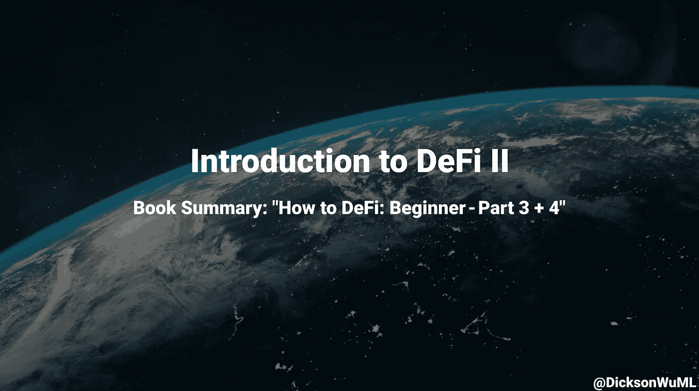

# DeFi II 简介

> 原文：<https://medium.com/geekculture/an-introduction-to-defi-ii-fdafe8acf125?source=collection_archive---------19----------------------->

## 书籍摘要:“如何定义:初学者——第 3 + 4 部分”

> 作者:达伦·刘，达里尔·刘，丁时珍，克里斯蒂安·高，Erina Azmi，本杰明·霍，卢修斯·方，霍尔·温温

***如果你还没看过我第 1 部分的文章，可以在这里*** ***看完*** [***！***](/geekculture/an-introduction-to-defi-1ce2787bb29c)

# 第 5 章:分散的稳定资本

由于加密货币是不稳定的，所以**稳定货币**被创造出来以**对冲价格波动**，并允许作为交换媒介。它们是 DeFi 的重要组成部分，前 5 大稳定硬币占据了 598 亿美元。

有 3 种稳定的硬币:

1.  **法定抵押**(系绳)
2.  **加密抵押**(戴)
3.  **算法稳定问题**——不在本书中讨论(将在高级书中讨论)

系绳，或 USDT，保留每铸造一个系绳 1 美元。系绳是最受欢迎的稳定硬币，但所有这些储备都没有开放——我们必须相信他们在做自己的工作。因此**系绳是一种集中的、法定抵押的稳定硬币**。

戴就不同了。它通过其他加密货币进行抵押，并通过 DAO 创建的协议来完成→ **DAI 是一种分散的加密抵押稳定货币**。

戴是通过**马克尔道**来管理的——马克尔道有 2 个代币！**戴**(**货币**一种，由一篮子其他加密货币(ETH、wBTC、等)支持)**MKR**(**治理**一种，在这里你可以投票并对组织本身做出改变)。

赛曾经是制造者使用的令牌——它是一个单独的抵押品戴。但制造商增加了更多形式的抵押品，这就成了戴。黑色星期四的崩溃导致制造商增加了 USDC，以解决其流动性问题。

以下是 DAI 的三个组成部分:

1.  **抵押品比率**:我们得到的 DAI 与我们投入的抵押品的比率。例:150%意味着我们必须投入 150 美元的另一种加密货币来获得 100 美元的戴
2.  **稳定费**:是你要支付的利率，还有原来的金额。稳定性费用由制造商确定，并基于内部风险团队的绩效风险。
3.  【戴储蓄】:持有戴一段时间后的利率。

好吧，但是我为什么要用价值 150 美元的 ETH 或者别的什么东西去换 100 美元的戴呢？这里有三个动机:

1.  你现在需要现金，但是你**相信******或者其他什么** **将来会涨**。制造者就像是拿着你的物品的当铺**
2.  **你现在需要现金，但是当你把钱兑换成现金时，你不想被征税**
3.  ****投资杠杆**因为你认为你的资产未来会升值。**

**那么我们该怎么做呢？在创客平台上，通过将 ETH(或任何其他硬币)放入金库来借戴。你可以取出的 DAI 有一个最大数量(考虑到抵押比率)，但你不想取出所有东西。**

**这是因为如果 ETH 的价格下跌，你的抵押品比率下降，你的抵押品将被清算，你将被收取清算罚款。或者你可以交易戴，这样我们就可以得到戴。**

****黑天鹅事件**是一个不可预测的极端事件。如果发生这种情况，Maker 会紧急关闭系统，确保 DAI 持有者仍能获得他们的资产。2020 年 3 月差点触发(ETH 24 小时下跌 50%)。但制造商通过自动债务拍卖缓解了这一问题，他们引入了 USDC 作为抵押品。**

# **分散借贷:**

**借贷是金融业最大的服务之一。截至 2021 年 4 月 1 日，借款额为 97 亿(**比之前**大 102 倍)。**

**在 CeFi，你可以拿出抵押品，比如公司、房子或其他东西。但是我们需要信任一个中介(银行)，一个最终成为许多人获得低风险高回报贷款的障碍的信用体系。**

**DeFi 不一样。**任何人都可以贷款**(如果你有抵押的话)**或者把钱借出去获得利息**！让我们研究两个最大的 DeFi 借贷协议:Compound 和 Aave！**

## **化合物:**

**这是一个基于 ETH 的开源协议！它有许多不同的令牌(目前为止有 9 个)。这是一个建立在以太坊基础上的流动性池。贷款人只是把他们的钱集中到流动性池中，而借款人从流动性池中取钱。贷方获得利息，借方必须支付利息。**

**利率是 **APY** (年百分比收益率)，它是**通过算法**为每项资产**确定的**，算法考虑了资产的供给和需求。这减少了摩擦，因为贷款人和借款人可以直接互动，而不需要谈判贷款条款。**

**酷的是你**连账号**都不用建！连接到您的钱包，您就可以开始借贷了！**

**Compound 还有一个**治理令牌** (COMP)，在这里他们可以对 Compound 本身进行修改！您必须拥有超过 1%的报酬才能启动提案。3 天后，它必须有 4 的供应，投票给它，然后它排队，然后执行！**

**你可以**通过从其他人**那里**购买来赚取红利，或者通过产出农业**本身来赚取红利代币。**

**当你从复利中获得利息时，你得到 cTokens(如果你提供 DAI，你得到 cDAI，或者如果你提供 ETH，你得到 cETH)。cTokens 代表你放了多少，放了多久。让我们看一个例子:**

*   **假设你放下 1000 戴，有 10%的 APY**
*   **当你借钱给复利时，你就做对了。因此你得到 1000 加元**
*   **现在戴和 cDAI 的汇率是 1:1，但是如果你等一年，**的汇率就变成 1:1.1** →这样你就可以用 1000cDAI 换 1100 戴**

****交换比例随着时间**的函数 **增加(因为那代表利息)，但是你甚至可以将 cTokens 转让给其他人！****

**当你借款时，你只需向系统提供抵押品，然后你就可以借款了！一部分利息将进入储备金，作为保险。但是当担保品的**价格移动**时会发生什么？**

1.  ****价值上升:**耶！什么也没发生，但是如果你想的话，你可以取出更多的钱**
2.  ****价值下降:**嘘！如果价值低于抵押品比率，那么一部分将被出售，并收取 8%的清算费。这保护了贷方**

## **AAVE:**

**Aave 的资产类型比复合资产更多——截至 2021 年 4 月，它拥有 24 种资产类型。Aave 的工作方式与 Compound 类似，但是它更复杂+更灵活。以下是 Aave 的 8 个关键特性:**

1.  ****支持更多资产** —截至 2021 年 4 月共有 24 项**
2.  ****稳定和可变贷款利率**——您可以在两种利率之间选择**
3.  ****利率切换**——您可以在两种利率之间切换**
4.  ****抵押品互换****
5.  ****抵押还款****
6.  ****闪贷** —在同一笔交易中还款+利息，可以零抵押取出贷款。对套利交易者有利**
7.  ****快速清算** —清算人可以使用快速贷款来获得清算奖金**
8.  ****本地信贷委托** —你可以在没有抵押的情况下借款，但要支付更高的利率**

**APR 是用算法确定的，比如复合。你得到的是 **aTokens** 而不是 cTokens，你也必须兑换。当使用 Aave 借款时，Aave 决定了您可以借款的金额，该金额由贷款价值比决定。如果 LTV 达到了**清算**门槛，你的抵押品的 50%将被清算+15%的清算罚款。**

**对于治理，任何人都可以在社区论坛上提交想法。社区给出反馈，然后作为提案提交，然后进行投票。**

# **分散交易所(DEX):**

**在加密中，有两种类型的交换:**集中式和分散式交换**。集中式意味着你必须信任一个中介(这个中介过去可能被黑客攻击过)。dex 使用智能合约，因此资产将由用户的钱包而不是中介的钱包持有。**

**有两种类型的 dex:**

*   ****基于订单簿的 dex**(dYdX，Deversifi)。用户可以用限价或市价买卖订单。**
*   ****基于流动性池的指数** (Uniswap，Balancer)。用户成为做市商，为交易所提供流动性。他们从掉期交易中获得费用。但是这里有缺陷(流动性提供者可能遭受非永久性损失)**

**DEX 的局限性:**

1.  ****较低的流动性**:由于许多交易发生在 CEXs 上，dex 没有得到好的价格，具有更高的滑点和最差的价格执行。但是 dex 越来越受欢迎，因此也越来越好**
2.  ****限制功能**:它们只是没有和 CEXs 一样的功能(比如限价单、止损单、跟踪止损等)。但是德克斯正在实施**
3.  ****区块链互操作性**:目前你不能在 dex 上进行跨链交易。基于以太坊的代币只能交易 ERC-20 代币。尽管人们正在构建那些跨链索引**
4.  ****费用**:由于 DeFi 越来越受欢迎，你最终拥有一个超负荷的以太网，因此燃气费增加**

**尽管 dex 仍处于起步阶段，而且越来越受欢迎！让我们通过 Uni-Swap 来了解它们是如何工作的！**

## **Uniswap:**

**如果我们要通过 CEX，你必须在交易所里投入代币，下订单，然后取出代币。但是使用 **Uniswap 只需 1 步**！**

**你**将你的代币发送到智能合约**，Uniswap 通过算法**确定汇率**，然后**想要的代币被发送回**你的钱包。这是通过流动性池和自动做市商机制实现的。**

**所以 Uniswap 有流动资金池。流动性池实际上是巨大的代币金库。这些流动性调查由流动性提供商提供，并通过交易费进行激励。**

**让我们来看一个**的例子**。ETH 流动性池有 100 个 ETH，有 46 万个 DAI (1 个 ETH = 4600 美元)。这么说吧，你想用 4646 戴换 1 ETH。流动性池的最终结果将是 99 ETH 和 104，646 DAI。**

**资金池中的金额决定了由**自动做市商** (AMM)机制设定的价格。**

**AMM 的工作原理是始终保持两个流动性池之间的恒定乘积**。因此，如果他们从 460，000 DAI 和 100 ETH 开始→ 100，000 x 100 = 46，000，000 ←就是不变乘积！****

**因此，当取出 ETH 时，我们必须提供一定量的 DAI 以保持恒定的产品质量。但我们可以看到，随着你取出越来越多的 ETH ，保费会发生变化。溢价是你购买 ETH 必须使用的额外 DAI。我们可以在下表中看到这种渐近性质:**

****

**您可以在 Uniswap 上添加任何令牌！只要两种代币之间存在流动性池，你就可以自由交换它！**

## **DEX 聚合器:**

**现在，如果我们正在**交换一吨代币**，滑点可能会杀死我们。但是现在有很多指数，每个指数都有自己的流动性池。因此，我们可以把交易分成不同的指数来最小化滑点。但是手动做这个很麻烦。**

**这就是为什么 **DEX 聚合器**存在！他们把所有的指数都考虑进去，给你最好的价格+他们把大交易分成小交易。例如 1inch、Paraswap 和 Matcha。让我们深入了解 1 英寸。**

**1inch 拥有来自多种指数的 40 多种流动性来源。交易者只需一次交易就可以通过多个指数进行大宗交易(节省汽油)。1inch 有自己的路由算法(Pathfinder ),在找到最佳路径之前，它会遍历所有 dex+1 inch 自己的流动性池。**

**您支付底层 dex+1inch 的费用，它有一个治理令牌:1 inch。**

# **分散衍生品:**

**衍生品是其价值来自其他资产的合同。有许多种类，如期货、期权或掉期。每个都有自己的目的。但是它们是有风险的，在使用它们之前你需要知道你在做什么。**

**DeFi 衍生产品的市值为 58.2 亿美元，与贷款相比相对较小。这是因为以太坊的燃气费很高。主要有两种:合成酶和视蛋白。**

## **合成:**

**Synthetix 是用于**合成资产** ( **合成**)的协议。Synthetix 有它的资产(Synths)和它的交易所(Synethix。交换)来交换那些资产。**

**合成器是与其他资产价格相关的资产。因此，你可以在不实际持有这些资产的情况下拥有这些资产的**敞口。合成分为两种:**正常合成**(与标的资产正相关)和**逆合成**(与标的资产负相关)。****

**合成金(sXAU)就是一个例子。我们可以用一个甲骨文(或多个)来得到黄金的真实价格。**

**另一个 Synth 是反向比特币(iBTC)，它有 3 个关键值:(**进场价格，下限，上限**)。假设衍生品是在比特币 64000 美元的时候创建的——这是入门价格。如果价格下跌 1000 美元，那么 iBTC 就获利 1000 美元。**

**反向合成器有 50%的上限和下限。因此，它限制了你的盈亏。当达到极限时，它被冻结，你的头寸被清算。然后我们可以把它交易回 Synetix.Exchange。**

****为什么要麻烦 synth**？好吧，这是因为我们**不必持有实际资产**(不需要旅行到某个地方，与中间人交易，签约，然后获得黄金)。少了很多麻烦。但是用其他资产交易 Synth Gold 也是无摩擦的+世界上任何人都可以购买真实世界的资产！**

**好吧！那么我们如何创建自己的合成器呢？我们创造他们，就像我们创造戴一样！你需要持有 SNX 代币(500%的抵押率，因为 SNX 比瑞士联邦理工学院更不稳定)。**

**然后**你通过承担债务**来创造 synth(但是债务随着资产价格的波动而波动)。或者我们可以直接从交易所购买。**

**合成器有 5 个主要资产类别:**

****

**指数合成器:这允许人们投资一篮子代币，而不需要购买所有的代币。这允许暴露许多部分+分散风险。sCEX = CEX 代币。sDEFI = DEFI 实用程序令牌。富时 100 指数。日经 255 =日经 255 指数。(最后两个来自甲骨文)**

****合成交易所**:是交易 SNX +合成的的**指数。不过，这里没有订单簿或流动性池。你只是在用一个保持流动性的智能合约进行交易。好处是没有滑点，因为都是合成资产。****

## **Opyn:**

**它们防范资产价格波动，并为智能合约提供保险。他们用金融衍生品来做这件事。但是有什么选择呢？**

**有两种类型的选项:**

1.  ****买入**——拥有在特定时期内以特定价格购买资产 **的**权利******
2.  ****卖出** —拥有在特定时间内以特定 **价格**出售资产 **的**权利******

**还有:为了购买期权，别人必须把期权卖给你**

**这里有一个超级棒的**类比**来理解呼叫:**

****

**有两种期权风格:**

1.  ****美国**——你可以在期权到期前的任何时候执行期权**
2.  ****欧式**——你只能在行权日执行期权**

**所以你可以把这个策略作为对冲价格波动风险或保险 T21 的一种方式。假设你以 2400 美元的执行价格买入一份看跌期权。如果价格跌到 2000 美元，我们可以执行期权，然后拿回 400 美元。有溢价，但这是在价格下跌的情况下保护自己的一种方式。**

**你可以通过 oTokens 购买期权！在版本 1 中，你可以在任何地方买到它们，但在版本 2 中，你可以通过订单模式购买它们(尽管 oTokens 的价格会随着供求而波动)。**

**价格通常反映了期权的性质。如果有一个执行价格为 3000 美元的看跌期权，但当前价格为 1000 美元，那么它至少值 2000 美元。但其他因素可能会使期权溢价打折扣。此外，由于 oTokens 是由供求关系决定的，这是一个很好的信号机制，可以检查期权是否被低估或高估。**

****如果** **有人买期权，就必须有人卖**。你会卖掉它，因为你持有的股票有收益。你首先要向 Opyn 提供一些抵押品(140%到 100%)。那你就制造 oTokens。**

**然后你可以在 Uniswap 上成为**流动性提供者，或者你**可以在 Uniswap** 上出售代币。你可以从中赚取一些不错的溢价——但你有不利事件不会发生的风险(黑客攻击或金融风险)+你必须保持抵押率，否则就会被清算。****

****Opyn 已经过审计，非托管不可信**。**

**版本 2 有一些**附加功能**，如:**

*   **欧式风格选项**
*   **利润改善(卖出信贷+借记利差)**
*   **到期时自动行使的期权**
*   **如果资产被列入白名单，任何人都可以创建选项**
*   **有收益的资产可以作为抵押品**

# **分散的资金管理:**

**基金管理就是监督你的资金并进行投资，这样它就能为你赚更多的钱！但是，我们可以拥有分散的、自动化的智能合约，为你投资，而不是乏味的中央基金经理。这样就减少了支付的费用！**

## **令牌集:**

**这是一个平台，你可以在这里购买**战略启用令牌**(套)。这些代币是管理你的钱的**自动化策略**。每套= ERC 20，其中**持有一篮子加密货币** +自动重新平衡其持有量。**

**有两种类型的器械包:**

1.  ****指数集**:你可以接触到大量不同的代币，并减少油费(因为你只需购买 1 个代币，而不是多个代币)最受欢迎= DeFi 脉冲指数(DPI)**
2.  ****高产农业设备**:你节省了汽油，因为你不必经常调用智能合同来进行 LP 农业。该集将为你做这一切(要求奖励，出售他们，再次赌注)**

**尽管你必须对每一项进行研究，但是以前的表现并不代表将来的表现。DeFi Pulse 指数集合了 14 种不同的资产，采用市值加权策略。**

**整体策略不会像某些个别策略那样好，但它**仍然** **胜过其中的 11 个**！因此，除非你有竞争优势，否则你最好的选择就是使用这个策略。**

# **分散彩票:**

**一张**不赔钱的彩票**！基本上，你可以投入 10 美元，有 69，738 分之一的机会赢得 1，648 美元。但最棒的是，每个放钱的人都能拿回钱。这是不赔钱的彩票？**

**那么**的钱从哪里来**？是从彩票累积的**利息**(复利赚来的)！你只需购买门票(你可以想买多少就买多少，每张门票都增加了中奖概率)**

**PoolTogether 是这方面的协议！你可以用 4 种不同的货币(戴、、元和元)来买。此外，赞助商可以提供一些额外的代币，称为战利品箱。**

**不过这并不新鲜——CeFi 有一种叫做奖金挂钩储蓄账户(PSLA)的东西，你账户里的钱会被存入一个乐透秒。但是**去中心化**的主要好处是**没有中间人，没有锁定期**，我们可以看到**的奖金分配**是**公平的**和**正确的**。**

**但是 CeFi 不能把 PSLA 给任何人，**赌博法只限制某些地理区域的人参与。****

**但是我们能不能把我们的钱扔进化合物里？是的，我们可以！**机会成本是我们为获得潜在回报而支付的“费用”**。中奖概率与售出的门票数量成正比(门票越多，奖金也越多！).**

**PoolTogether 拥有治理代币( **POOL** )，这些代币根据他们的钱在 PoolTogether 中的数量和持续时间分发给那些使用该平台的人( **airdrop** )。只有 5%的供给被空投下来。57.54%放入国库，将被政府转移。**

**池治理可以投票表决:创建推荐计划，设置流动性挖掘计划，赠款计划，调整获奖者的数量，奖金频率，新的奖金策略和新的奖金池。**

# **分散支付:**

**所以密码的很大一部分都是关于交易的。但那只是以分散的方式把钱从一个人送到另一个人手中。但是如果我们想要**更便宜、更快、定时转账、有条件转账、发票格式等**呢！有几个项目，但让我们谈谈 Sablier。**

****更灵活的**允许**支付流**。因此，我们可以实时从账户中提取**资金，而不是等待一定的时间(每周、每两周)然后付款(租金、合同工作)。****

**怎么回事？对于那些靠薪水生活的人来说，这是一件大事。因为如果他们的收入出现延迟，他们最终会以高额利息贷款来获得食物。这也在合同工和雇主之间建立了信任，因为他们的工资是实时支付的。此外，你可以**使用你目前已经赚到的钱**而不需要等待每月或每两周的付款。**

**在目前的系统中，你要么先付费(必须信任提供商)，后付费(必须信任客户)，要么把它放在第三方托管中(必须信任第三方托管)。但是有了 T21，你就不必相信任何人。一切都是实时支付的，由不变的代码管理，而不是由人来管理。**

# **分散保险:**

**在 DeFi 中，你必须锁定**金钱作为抵押品**，这是一个**潜在的攻击载体**。尽管代码已经被审计，数百万美元还是被黑客窃取了。DeFi 存在一些固有的风险:**

1.  ****技术风险**:智能合约被黑，漏洞被利用**
2.  ****流动性风险**:借贷协议耗尽流动性**
3.  ****管理密钥风险**:协议的主私钥被泄露**

**为了减轻这些风险，我们有**保险**！我们会通过 Nexus Mutual 和 Armor。**

****Nexus Mutual** 是一个分散的保险协议，涵盖 64 个智能合同和集中分类账+交易所的托管保险。他们**保护智能合同免受黑客攻击，但不保护疏忽**(丢失私钥)。**

**对于**托管覆盖**，就是集中交易所控制你的资产。如果您的资金损失超过 10%，或者取款中断超过 90 天，您就可以获得资金。**

**那么我如何获得保险呢？你首先成为 Nexus Mutual 的会员，然后选择保险金额(在智能合约失败的情况下你支付的金额)+保险期限(持续多长时间)。如果发生黑客攻击，那么**索赔评估员将评估情况，并把钱发出**。**

**这当然是要花钱的。定价取决于保险金额、保险期限和风险评估员的评估。**

**Nexus 也有令牌！它叫 NXM。 **NXM** 用于购买保险，对治理进行投票，用于参与风险和索赔评估，并代表 Mutual 的资本(随着资本的上升，硬币的价格也会上升)。**

**价格由一条**债券曲线**决定，该曲线与 Nexus Mutual 拥有的资本总额以及 Nexus 需要多少资本来满足索赔要求(按其概率加权)。**

**你**买不到 NXM** ，它是通过成为 Nexus Mutual 的会员获得的内部代币(你必须通过 KYC 和 AML)。但是你可以穿过盔甲，但不能做 KYC。**

**还有 **wNXM** ，这是一个**包裹的 NXM** 。这个**可以在公开市场上买**转让。然后你可以打开它，它就变成了 NXM！**

**还有，这些**风险评估员**是谁？他们是反对智能合同的人。他们已经完成了分析/相信其他人的分析，并认为相信智能合约是安全的。通过这样做，他们**获得 NXM 奖励**。**

**DeFi 越来越复杂，但也能够像“**金钱乐高**”一样相互融合。金钱乐高允许人们建造复杂的管道，而不需要从头开始创造一切！但是这个**产生了一个风险，其中一个故障可以影响多个协议**。**

**另外， **Armor 是 DeFi** 的保险聚合器。您可以购买没有 KYC 的保险，或者受 Nexus Mutual 的地理限制。**

**另一个保险项目是**保险网络**，在那里你可以**交易保险风险**，一切都由自由市场决定。它有一个治理令牌，受自由市场支配，但令牌是网络中的股份！**

****覆盖的是一个点对点的保险市场**。你付了钱(例如:100 戴)作为保险，保险是有有效期的。这个铸币厂(100)索赔和(100)不索赔。人们不得不向你购买索赔权(那是保险费)。如果事件发生(100)索赔可以获得担保品(100 戴)。否则(100)无债权取回抵押品(100 DAI)。**

**保险是一个没有多少人使用的利基市场，但随着越来越多的人进入这个市场，它有望增长。**

# **治理:**

**想象一下在 DeFi 中构建下一个大东西，但是当你受限于社交媒体，并且涉及大量资金时，你必须管理一群处于不同时区、不同目标的人。幸运的是，我们可以利用区块链来帮助我们！**

**出现了分散的自治组织。他们是由智能合同管理的组织，他们将人们组织起来为一个共同的目标而努力！**

****治理令牌** **作为投票权还不完善**。它有很多问题(选民冷漠，投票要交煤气费，投票结果没有约束力)。但是加密还处于初级阶段，我们将会得到更好的工具。但是在那之前，治理令牌是我们所拥有的！**

**让我们来讨论两个治理工具项目:Aragon 和 Snapshot！**

**阿拉贡的成立是为了确保 web3 对每个人都是自由、公平和开放的！因此他们创造了许多工具来帮助 DAOs。一个工具是阿尔贡法院。**

**这就像一个法庭，一群陪审员在两方之间投票决定正确的结果。陪审员投多数票时会得到补偿，投少数票时会受到惩罚(赌注被拿走)。当事人可以支付费用，与更多的陪审员一起对争议进行上诉。**

**陪审员是从陪审员池中选出的，如果他们拥有超过 10，000 个阿拉贡法庭代币(ANJ) +你可以购买它们！**

**到目前为止，像 Aave 和 Curve 这样的大型 DeFi 项目使用 Aragon + 1600 其他 Dao！**

****快照**正在攻关**超高气费投**。快照对链外的所有投票进行**快照。这使得投票过程基本上是自由的。****

**但问题是投票结果不具有链上约束力，你需要人们在链上推动投票。因此，它的**仍然有点集中**，但它的实用性和成本效益。**

# **DeFi 仪表板:**

**这只是**将你所有的 DeFi 活动**集中在一个地方，然后跟踪+可视化你所有的资产+将你的投资分类。您可以输入您的 ETH 地址或 ENS 域。2 个仪表盘分别是 **Zapper** 和 **Zerion** 。**

# **DeFi 在行动:**

**我们来谈谈这个世界上的人们实际上是如何用 DeFi 来改变生活的！**

**例如，**阿根廷**的年通胀率达到了历史最高水平**53.8%**——你的钱每年都会减半。所以有些人希望用美元支付。**

**但是阿根廷政府让这一切变得非常困难。每月 200 美元的资本控制(美元黑市价格比汇率高 30%)，惩罚那些泄露个人信息的人，并强制为外国公司工作的人进行美元清算。**

****有的转向比特币**，也就是**波动**，于是**转向戴**！你尽可能少的提取来支付你所有的费用。其余的都保存在戴的身上。使用这个 DAI，我们可以投资它，并获得其他金融工具。**

**此外，世界各地的人们都被禁止进入金融机构。DeFi 允许他们访问它们。例如，Uniswap 被迫对人们访问其网站进行交流进行地理屏蔽。**

**但这并没有阻止其他网站的出现，并将人们连接到 Uniswap(因为 Uniswap 在以太坊上)。任何人都可以从任何地方使用 DeFi 金融工具。**

# **DeFi 是未来，而未来就是现在:**

****DeFi** 还处于萌芽状态，但它的**正在以凶猛的力量和潜力**成长！CeFi 正开始进入 DeFi，DeFi 正成为另一个金融生态系统。DeFi 是金融的未来。**

**这种增长是疯狂的，看看 TVL 的数据就知道了:**

*   ****2018** : **5x** 从 5000 万美元增加到 2.75 亿美元**
*   ****2019**:**2.4 倍**至 6.67 亿美元**
*   ****2020 年**:**23.5 倍**到 157 亿美元**
*   ****2021**:**5.5 倍**至 860.6 亿美元(截至 2021 年 4 月)。 **11x** 至 1720 亿美元(截至 2021 年 11 月)**

**最后，总结一下 DeFi 的优势:**

*   **透明度:你可以看到和审计一切**
*   ****可访问性**:你可以在任何地方访问 DeFi，不用担心受到歧视**
*   ****效率**:去除集中的中间人，打造更高效的金融市场**
*   ****方便**:你可以随时随地给任何人汇款。小额费用，等待时间短**

**还有 DeFi 用户体验！Argent 正在创造最先进的钱包体验。Zapper 结合了许多 DeFi 产品。意式冰淇淋金融公司创造了“如果这个，那么那个”的密码。Nexus Mutual 有保险。1inch 正在聚合 dex，并且存在产量优化器！**

****如此多的乐高积木，如此多改变世界的潜力！****

**如果你想了解更多:阅读这里的书！**

**感谢阅读！我是迪克森，一个 18 岁的加密爱好者，很高兴用它来影响数十亿人🌎**

**如果你想跟随我的旅程，你可以加入[我的每月简讯](https://bit.ly/DicksonNewsletter)，查看[我的网站](https://bit.ly/DicksonWebsite)，并连接 [LinkedIn](https://bit.ly/DicksonLinkedin) 或 [Twitter](https://twitter.com/DicksonWuML) 😃**