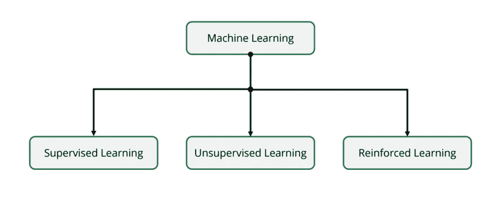
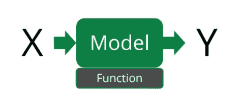
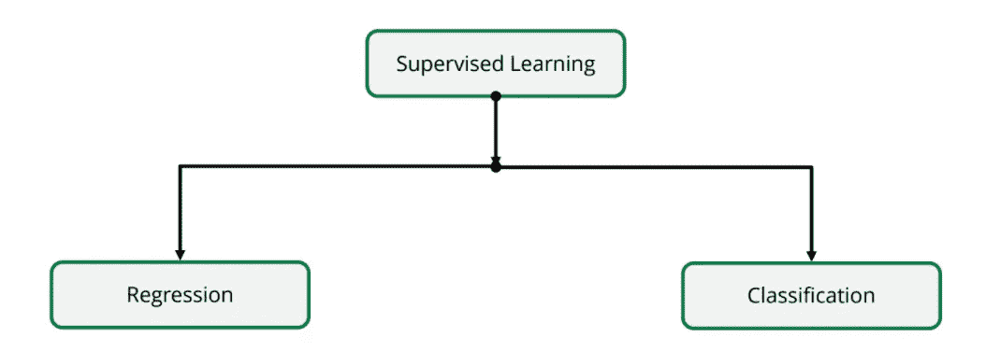
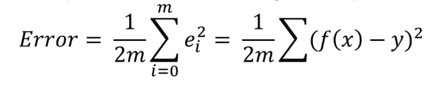
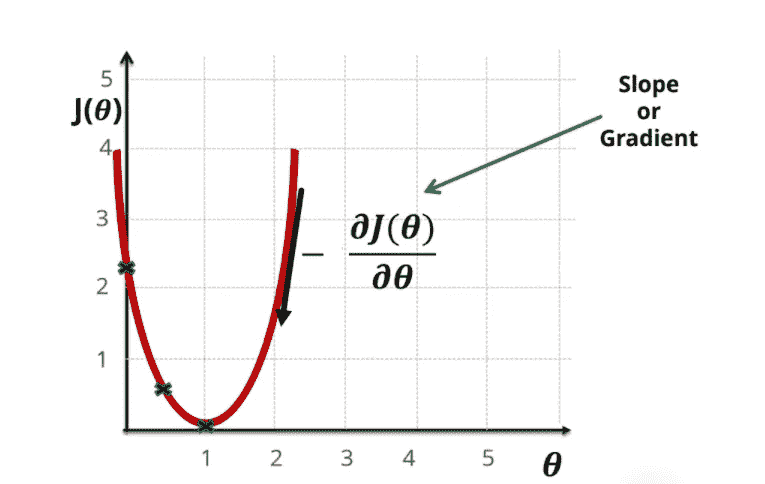
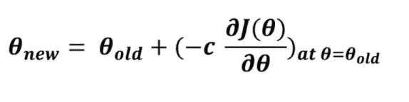

# 机器学习导论

> 原文：<https://medium.com/geekculture/an-introduction-to-machine-learning-fe4877e720fb?source=collection_archive---------0----------------------->

## 新手的收获

如果你的领域接近计算机，那么你至少应该听说过机器学习这个术语。直到几周前，我自己对机器学习一无所知。这是我在这几周学到的东西。

## 那么，什么是机器学习呢？

要了解什么是机器学习，首先要了解人工智能(AI)。

> 任何应用逻辑、评估不同选项并自行决策的系统都被称为人工智能系统。

机器学习只是人工智能的一个分支，基于历史/数据进行预测和决策。每个机器学习算法都有三个主要参数:

*   *表演*
*   *任务*
*   *体验*

该算法集中于随着时间的推移，利用 ***经验，在执行某个 ***任务*** 时，提高 ***性能*** 。***

机器学习有哪些类型:

Types of Machine Learning

## 监督学习:

监督学习是指机器学习算法拥有数据，并且知道在该数据集中寻找什么，即输入和输出都明确定义给算法。

## 无监督学习:

在无监督学习中，算法有一个输入数据集，但对它一无所知。这些通常用于根据相似性对数据进行分组的分组问题。

## 强化学习:

强化学习有点像反复试验。它基于一个奖励系统，在这个系统中，每当算法做对某件事时都会得到奖励，这样它就知道自己什么时候做对了什么时候做错了。

现在我们已经熟悉了机器学习的类型，让我们更深入地研究一下监督学习:

在监督学习中，*输入和输出都被清晰地定义为算法的*。当数据被标记时，分配给算法的任务是创建一个将输入(假设为 x)映射到输出(y)的函数。这个将输入映射到输出的映射函数被称为 ***模型。***

对于每个监督学习算法，有六个主要步骤:

1.  数据加载
2.  数据预处理
3.  模型定义
4.  误差计算
5.  误差最小化
6.  预言；预测；预告

## 监督学习有哪些类型？

## 回归:

在回归模型中，输出呈现一系列值。例如，让我们考虑一个用来预测已知汽车规格的最高速度的模型。在这里，速度可以取多个值，因此模型的图形如下所示:

Linear Regression Model

这里，蓝点表示送入算法的数据集，红线表示我们的最终模型。

现在让我们看看创建模型的步骤:

## 数据加载:

这一步很容易理解。在这里，我们将输入数据集上传到模型。

## 数据预处理:

现在我们已经将数据上传到模型中，我们必须以一种对模型有意义的方式操作数据(计算机是如此的愚蠢)。

在预处理步骤中，我们删除了不必要的特征(如颜色或油箱容量，这与汽车的最高速度完全无关)并缩放相关数据以使计算更容易。

## 模型定义:

> 模型是我们选择用来表示数据的形状或形式

模型是将输入映射到输出的函数。在线性回归的情况下，模型将是一条直线。回归模型将取决于数据集中的要素。要素是数据集的特征，将对输出产生影响(如发动机排量、汽车马力，直接影响汽车的最高速度)

对于单变量回归，模型为:

> y =θ0+θ1 * x = f(x)

其中 y 是输出，x 是特征，θ0、θ1 是被优化以获得最终模型的参数。为了启动代码，这些参数被初始化为 1 或某个随机值。

## 误差计算:

误差是预测值和实际值之间的差异。

> 误差=f(x)-y

为了说明正值和误差负值，我们使用平方误差。为了减少计算量，我们使用平均误差。模型的平均误差由下式给出:

其中 m 是数据样本的总数。

## 误差最小化:

通过优化参数(θ)值来减小模型的平均误差。这是通过 ***梯度下降算法实现的。***

Gradient Descent Algorithm

该算法用于修改参数以减小误差值。

θ的新值由下式给出:

其中 c 是模型的学习速率，J(θ)是误差函数。

多次进行相同的操作，直到误差最小化到期望值。

## 预测:

既然我们的模型中的误差已经最小化，它最终可以被部署来进行预测。

在预测函数中，要素被接受为输入，模型函数值被生成为输出。