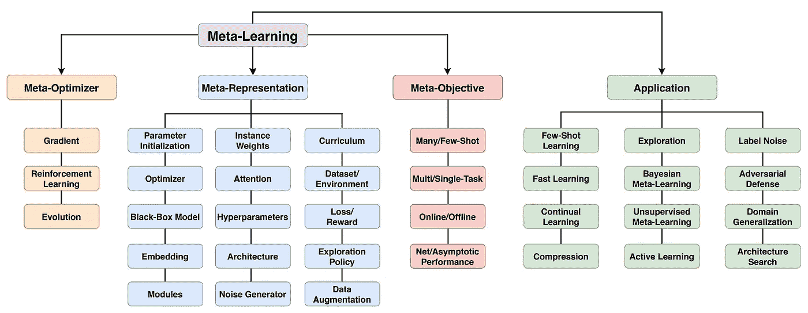

# 元学习导论

> 原文：<https://medium.com/geekculture/an-introduction-to-meta-learning-b328ada3b27f?source=collection_archive---------9----------------------->

## 论文摘要:“神经网络中的元学习:综述”

# 摘要:

元学习不是使用固定的学习算法，而是学习学习算法本身！这有助于解决数据+计算瓶颈+提高泛化能力！

# 简介: