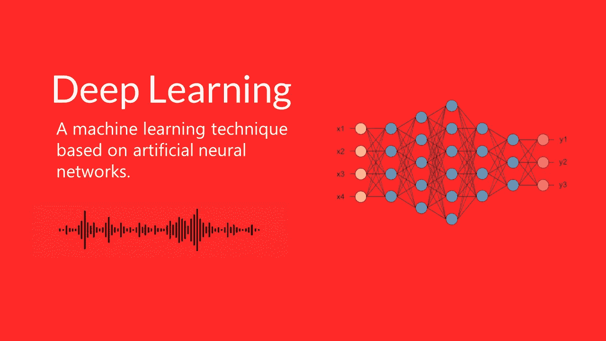

# 用简单的术语解释概率深度学习的介绍

> 原文：<https://medium.com/geekculture/an-introduction-to-probabilistic-deep-learning-explained-in-simple-terms-7c9d7005237b?source=collection_archive---------12----------------------->

深度学习不是别的，就是概率。这里面涉及到两个原则，一个是最大似然，一个是贝叶斯。这一切都是为了最大化一个*可能性*函数，以便找到能够最好地解释我们正在处理的数据的*概率*分布和参数。贝叶斯方法在我们的网络需要说…