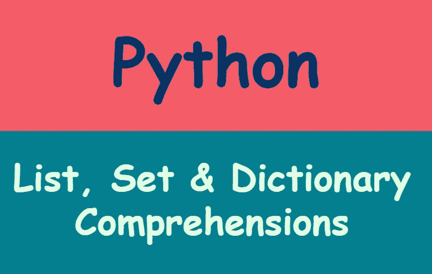

# Python 理解入门

> 原文：<https://medium.com/geekculture/an-introduction-to-python-comprehension-dc936f0607ff?source=collection_archive---------50----------------------->

## 了解理解如何在 Python 列表、集合和字典中工作

Image by author

理解是 Python 独有的特性。理解给了我们一种简洁的方法来构建序列，如列表、集合和字典。使用理解，我们可以只用一行代码创建具有复杂功能的 Python 序列。理解是最常见的…